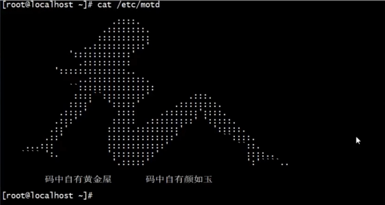

# Linux常用命令(Cent OS7)

- [Linux常用命令(Cent OS7)](#linux常用命令cent-os7)
  - [1 文件操作](#1-文件操作)
    - [1.1 创建](#11-创建)
    - [1.2 删除](#12-删除)
    - [1.3 搜索](#13-搜索)
    - [1.4 编辑](#14-编辑)
    - [1.5 查看](#15-查看)
  - [2 查看系统信息](#2-查看系统信息)
  - [3 进程](#3-进程)
  - [4 添加环境变量](#4-添加环境变量)
  - [5 防火墙配置](#5-防火墙配置)
  - [6 权限](#6-权限)
  - [7 添加快捷操作](#7-添加快捷操作)
  - [8 合并home到根目录](#8-合并home到根目录)
- [附·骚操作](#附骚操作)


## 1 文件操作

### 1.1 创建

**1. 创建文件夹**

````shell
# 创建单级文件夹
mkdir [文件夹名字]
# 实例
mkdir logs

# 创建多级文件夹
mkdir [文件夹路径]
# 实例
mkdir -p /usr/local/my-server/logs/info/
````
**2. 创建文件**

```shell
# 创建文件
touch [文件名字]
# 实例
touch start.sh

# 创建并编辑文件，以下两种都可以
vim [文件名字]
vi [文件名字]
# 实例
vim start.sh
vi start.sh
```

### 1.2 删除

**1.删除文件夹**

- -r 就是向下递归，不管有多少级目录，一并删除

- -f 就是直接强行删除，不作任何提示

````shell
rm -rf [目录名字]
# 实例
rm -rf logs/
````

**2.删除文件**

````shell
rm -f [文件名字]
# 实例
rm -rf 2020.log
````
### 1.3 搜索

**1. 搜索文件**

````shell
find [目标文件]
# 格式：  find [目录] [选项] [选项值]
# 目录：去哪找，可以不写，默认代表当前目录
# 选项：怎么找
    >> -name   按照名字找
        可以使用通配符
    -size   按照大小找
        单位为  kmg   10k（等于10k）   +10k（大于10k）   -10k（小于10k）
    -user   按照用户名找
    -group  按照组名找
    -maxdepth  -mindepth   限制查找的目录层级，默认递归查找所有
    -ctime  按照创建时间查找  单位是天
# 实例：
# 选项值：找什么
    find / -name demo.txt
    find / -name \*.txt
    find / -size +10k
    find / -user demo.txt
    find / -group demo.txt
    find / -mindepth 4 -name \*.txt
    find / -mindepth 3 -maxdepth 5 -name \*.txt
````

**2. 搜索文件内容**

````shell
grep [查找的内容] [文件路径]
# 实例：
grep movie demo.txt
grep movie ~/*.txt

# 选项
    --color=auto   将颜色高亮显示
        给 grep 指令起一个别名   vi ~/.bashrc
        添加一行     alias grep='grep --color=auto'
        让配置文件立即生效       source ~/.bashrc
    -c         得到内容的个数
    -i         不区分大小写的查找
    -n         显示在文档中的行号
    -r         递归查找，但是不能限制后缀，只能遍历所有
        grep -r that ~/*
    -l         只显示文件名，不显示内容
# 实例：（显示当前目录下所有txt文件中含有xxx字段的文件）
grep -l xxx ~/test/*.txt

# 正则表达式进行查找
    \w(数字字母下划线)
    \W(除了上面)
    \d(数字)
    \D(非数字)
    .(除了换行符)
    *(任意多个)
    +(至少1个)
    ?(0个或者1个)
    te-st@163.com   abc_def@qq.com   lala@sina.cn   benben@meme.net 
# 实例：（-E   使用正则表达式来进行匹配）
grep -E .*? demo.txt 

grep --color=auto [要查找的关键字] [要查找的文件]
# 实例：
grep --color=auto 56684444sva server.log
grep --color=auto 56684444sva *.log
````
### 1.4 编辑

**1. 编辑文件内容**

````shell
vi [文件名字]
# 或
vim [文件名字]
# 实例
vi nginx.conf
vim nginx.conf
````

**2. 编辑文件名/文件夹名**

```shell
move [原文件夹名字/文件名字] [新文件夹名字/文件名字]
# 实例
move nginx.conf 1.conf
move nginx nginx666
```

### 1.5 查看

**1. 查看文件全部内容**

```shell
cat [文件名字]
# 实例
cat nginx.conf
```

**2.  查看文件头部内容**

```shell
head -[查看的行数] [文件名字]
# 实例
head -200 sys-info.log
```

**3.  查看文件尾部内容**

```shell
tail -[查看的行数] [文件名字]
# 实例
head -200 sys-info.log

# 实时刷新文件内容
tail -[查看的行数]f [文件名字]
# 实例
head -200f sys-info.log
```

**4. 查看指定文件夹大小**

````shell
du -h --max-depth=1 [文件夹路径]
# 实例
du -h --max-depth=1 /usr/
````


## 2 查看系统信息

**1.查看本机网络信息（IP地址、网关、DNS等）**

````
ifconfig
````

**2.查看当前系统ip**

```
ip addr
```

**3.查看当前目录完整路径**

````
pwd
````
**4. 查看系统局部（用户进程）文件句柄限制数量**

````shell
ulimit -n
````

> centos7 默认限制为1024

**5. 查看系统全局（系统进程）文件句柄限制数量**

```shell
cat /proc/sys/fs/file-max
```

> centos7 默认限制为几十万

## 3 进程

**1.检查占用8080端口的进程。**

````
netstat -lnp|grep 8080
````

**2.查看PID编号为12345进程的详细信息。**

````
ps 12345
````

**3.关闭PID编号为12345的进程**

````
kill -9 12345
````

**4.清除过大的buff/cache（缓存）**

```
echo 3 > /proc/sys/vm/drop_caches
```
## 4 添加环境变量

**1.编辑系统环境文件**

````
vim /etc/profile
````
## 5 防火墙配置

**1.查看防火墙状态**（running表示正在运行，not running表示已停止）

````
firewall-cmd --state
systemctl status firewalld
````

**2.开启/关闭/重启防火墙**

```shell
systemctl stop firewalld		（关闭）
systemctl start firewalld		（开启）
firewall-cmd --reload			（重启）
service firewalld restart		（重启）
```

**3.开启/关闭防火墙的开机自启**（进行关闭操作前需要提前关闭防火墙）

```shell
systemctl disable firewalld		（关闭）
systemctl enable firewalld		（开启）
```

**4.查看防火墙已开放端口列表**

```shell
firewall-cmd --permanent --list-port
```

**5.开放/关闭指定端口，使其生效需要重启防火墙**（如3306，临时开放只需去掉`--perament`，重启虚拟机则自动失效）

````shell
firewall-cmd --zone=public --add-port=3306/tcp --permanent		(开放)
firewall-cmd --zone=public --remove-port=3306/tcp --permanent	(关闭)

# 常用端口开放命令：
firewall-cmd --zone=public --add-port=3306-8080/tcp --permanent
firewall-cmd --zone=public --add-port=80/http --permanent
firewall-cmd --zone=public --add-port=443/https --permanent
````

**6.批量开放指定端口，使其生效需要重启防火墙**（如3306和8080，临时开放只需去掉`--perament`，重启虚拟机则自动失效）

```
firewall-cmd --zone=public --add-port=3306-8080/tcp --permanent
```
## 6 权限

**1. 给shell脚本可执行权限**

````shell
chmod +x [脚本文件名].sh

# 实例：
chmod +x deploy-network.sh
````

**2. 执行shell脚本命令**

````shell
./[脚本文件名].sh

# 实例：
./deploy-network.sh
````
## 7 添加快捷操作

**1. 添加快捷操作**（如任意位置启动nginx）

````shell
# 第一步：执行命令编辑.bashrc文件
vim ~/.bashrc
# 或
vi ~/.bashrc

# 第二步：按a进入编辑状态，新起一行输入（路径根据自己实际情况设定）：
alias nginx="bash /usr/local/nginx/sbin/nginx"

# 第三步：按下ESC，然后输入:wq保存更改并退出
# 第四步：执行命令使更改生效
source ~/.bashrc
````

## 8 合并home到根目录

````shell
# 1.查看home目录大小（记住 /home 目录大小）
df -lh

# 2.取消挂载 /home 目录
umount /home

# 3.移除 /home 目录所在 lv
lvremove /dev/centos/home

# 4.扩展根目录所在 lv（扩展大小是原来 /home 目录大小）
lvextend -L +893G /dev/centos/root

# 5.保存扩展（xfs系统）
xfs_growfs /dev/centos/root
````

# 附·骚操作



​	打开linux想要显示一个招牌图案可以复制相应的文字图案，然后执行下面命令

​	`cat /etc/motd`

​	将复制好的文字图案粘贴进这个文件即可。