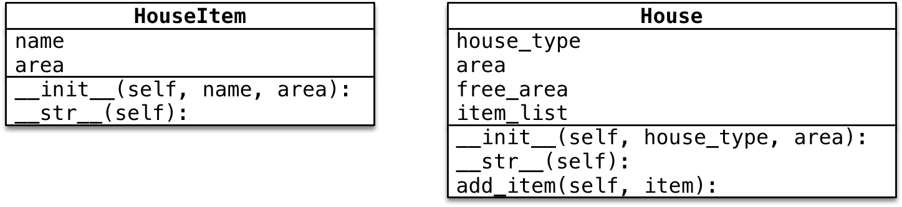

- [1 Python 基础](#1-python-基础)
  - [1.1 小技巧](#11-小技巧)
  - [1.2 命名规则](#12-命名规则)
  - [1.3 python2.0 和 python3.0](#13-python20-和-python30)
  - [1.4 注释规范](#14-注释规范)
  - [1.5 算数运算符](#15-算数运算符)
  - [1.6 数值类型](#16-数值类型)
  - [1.7 变量的输入](#17-变量的输入)
  - [1.8 变量的格式化输出](#18-变量的格式化输出)
  - [1.9 关键字](#19-关键字)
  - [1.10 not逻辑运算符](#110-not逻辑运算符)
  - [1.11 range()方法的使用](#111-range方法的使用)
  - [1.12 python 3.x版本输出不换行](#112-python-3x版本输出不换行)
  - [1.13 列表](#113-列表)
  - [1.14 元组](#114-元组)
  - [1.15 字典](#115-字典)
  - [1.16 字符串](#116-字符串)
    - [1.16.1 字符串的定义](#1161-字符串的定义)
    - [1.16.2 字符串的常用操作](#1162-字符串的常用操作)
      - [1.16.2.1 判断类型](#11621-判断类型)
      - [1.16.2.2 查找和替换](#11622-查找和替换)
      - [1.16.2.3 大小写转换](#11623-大小写转换)
      - [1.16.2.4 文本对齐](#11624-文本对齐)
      - [1.16.2.5 去除空白字符](#11625-去除空白字符)
      - [1.16.2.6 拆分和连接](#11626-拆分和连接)
    - [1.16.3 字符串的切片](#1163-字符串的切片)
    - [1.16.4 索引的顺序和倒序](#1164-索引的顺序和倒序)
  - [1.17 函数注释](#117-函数注释)
  - [1.18 pass 和 TODO](#118-pass-和-todo)
  - [1.19 Pyc文件](#119-pyc文件)
  - [1.20 完整的 for 循环语法](#120-完整的-for-循环语法)
    - [1.20.1 应用场景](#1201-应用场景)
  - [1.21 变量进阶（理解）](#121-变量进阶理解)
    - [1.21.1 目标](#1211-目标)
    - [1.21.2 变量的引用](#1212-变量的引用)
      - [1.21.2.1 引用的概念](#12121-引用的概念)
      - [1.22.2.2 变量引用的示例](#12222-变量引用的示例)
      - [1.22.2.3 函数的参数和返回值的传递](#12223-函数的参数和返回值的传递)
    - [1.21.3 可变和不可变类型](#1213-可变和不可变类型)
      - [1.21.3.1 (hash)](#12131-hash)
    - [1.22.4 局部变量和全局变量](#1224-局部变量和全局变量)
      - [1.22.4.1 局部变量](#12241-局部变量)
        - [1.22.4.1.1 局部变量的作用](#122411-局部变量的作用)
        - [1.22.4.1.2 局部变量的生命周期](#122412-局部变量的生命周期)
      - [1.22.4.2 全局变量](#12242-全局变量)
        - [1.22.4.2.1 函数不能直接修改全局变量的引用](#122421-函数不能直接修改全局变量的引用)
        - [1.22.4.2.2 在函数内部修改全局变量的值](#122422-在函数内部修改全局变量的值)
        - [1.22.4.2.3 全局变量定义的位置](#122423-全局变量定义的位置)
        - [1.22.4.2.4 全局变量命名的建议](#122424-全局变量命名的建议)
- [2 函数进阶](#2-函数进阶)
  - [2.1 函数参数和返回值](#21-函数参数和返回值)
  - [2.2 函数的返回值](#22-函数的返回值)
    - [2.2.1 面试题 —— 交换两个数字](#221-面试题--交换两个数字)
      - [2.2.1.1 解法 1 —— 使用其他变量](#2211-解法-1--使用其他变量)
      - [2.2.1.2 解法 2 —— 不使用临时变量](#2212-解法-2--不使用临时变量)
      - [2.2.1.3 解法 3 —— Python 专有，利用元组](#2213-解法-3--python-专有利用元组)
  - [2.3 函数的参数](#23-函数的参数)
    - [2.3.1 不可变和可变的参数](#231-不可变和可变的参数)
      - [2.3.1.1 面试题 —— `+=`](#2311-面试题--)
    - [2.3.2 缺省参数](#232-缺省参数)
      - [2.3.2.1 指定函数的缺省参数](#2321-指定函数的缺省参数)
      - [2.3.2.2 缺省参数的注意事项](#2322-缺省参数的注意事项)
        - [2.3.2.2.1 缺省参数的定义位置](#23221-缺省参数的定义位置)
        - [2.3.2.2.2 调用带有多个缺省参数的函数](#23222-调用带有多个缺省参数的函数)
    - [2.3.3 多值参数（知道）](#233-多值参数知道)
      - [2.3.3.1 定义支持多值参数的函数](#2331-定义支持多值参数的函数)
      - [2.3.3.2 多值参数案例 —— 计算任意多个数字的和](#2332-多值参数案例--计算任意多个数字的和)
      - [元组和字典的拆包（知道）](#元组和字典的拆包知道)
  - [2.4 函数的递归](#24-函数的递归)
- [3 面向对象(OOP)基本概念](#3-面向对象oop基本概念)
  - [3.1 面向对象基本概念](#31-面向对象基本概念)
    - [3.1.1 面相过程和面相对象基本概念](#311-面相过程和面相对象基本概念)
      - [3.1.1.1 面相过程 —— 怎么做？](#3111-面相过程--怎么做)
      - [3.1.1.2 面向对象 —— 谁来做？](#3112-面向对象--谁来做)
- [4 类和对象](#4-类和对象)
  - [4.1 类和对象的概念](#41-类和对象的概念)
    - [4.1.1 类](#411-类)
    - [4.1.2 对象](#412-对象)
  - [4.2 类和对象的关系](#42-类和对象的关系)
  - [4.3 类的设计](#43-类的设计)
    - [4.3.1 大驼峰命名法](#431-大驼峰命名法)
    - [4.3.2 类名的确定](#432-类名的确定)
    - [4.3.3 属性和方法的确定](#433-属性和方法的确定)
    - [4.3.4 练习 1](#434-练习-1)
    - [4.3.5 练习 2](#435-练习-2)
- [5 面相对象基础语法](#5-面相对象基础语法)
  - [5.1 目标](#51-目标)
  - [5.2 `dir` 内置函数（知道）](#52-dir-内置函数知道)
  - [5.3 定义简单的类（只包含方法）](#53-定义简单的类只包含方法)
    - [5.3.1 定义只包含方法的类](#531-定义只包含方法的类)
    - [5.3.2 创建对象](#532-创建对象)
    - [5.3.3 第一个面向对象程序](#533-第一个面向对象程序)
      - [5.3.3.1 引用概念的强调](#5331-引用概念的强调)
  - [5.4 方法中的 `self` 参数](#54-方法中的-self-参数)
    - [5.4.1 案例改造 —— 给对象增加属性](#541-案例改造--给对象增加属性)
    - [5.4.2 使用 `self` 在方法内部输出每一只猫的名字](#542-使用-self-在方法内部输出每一只猫的名字)
  - [5.5 初始化方法](#55-初始化方法)
    - [5.5.1 之前代码存在的问题 —— 在类的外部给对象增加属性](#551-之前代码存在的问题--在类的外部给对象增加属性)
    - [5.5.2 初始化方法](#552-初始化方法)
    - [5.5.3 在初始化方法内部定义属性](#553-在初始化方法内部定义属性)
    - [5.5.4 改造初始化方法 —— 初始化的同时设置初始值](#554-改造初始化方法--初始化的同时设置初始值)
  - [5.6 内置方法和属性](#56-内置方法和属性)
    - [5.6.1 `__del__` 方法（知道）](#561-__del__-方法知道)
    - [5.6.2 `__str__` 方法](#562-__str__-方法)
- [6 面向对象封装案例](#6-面向对象封装案例)
  - [6.1 封装](#61-封装)
    - [6.1.1 小明爱跑步](#611-小明爱跑步)
    - [6.1.2 小明爱跑步扩展 —— 小美也爱跑步](#612-小明爱跑步扩展--小美也爱跑步)
    - [6.1.3 摆放家具](#613-摆放家具)
      - [6.1.3.1 创建家具](#6131-创建家具)
      - [6.1.3.2 创建房间](#6132-创建房间)
      - [6.1.3.3 添加家具](#6133-添加家具)
    - [3.4 小结](#34-小结)
- [7 面向对象封装案例 II](#7-面向对象封装案例-ii)
  - [7.1 士兵突击](#71-士兵突击)
    - [7.1.1 开发枪类](#711-开发枪类)
    - [7.1.2 开发士兵类](#712-开发士兵类)
  - [7.2 身份运算符](#72-身份运算符)
    - [is 与 == 区别：](#is-与--区别)
- [8 私有属性和私有方法](#8-私有属性和私有方法)
  - [8.1 应用场景及定义方式](#81-应用场景及定义方式)
  - [8.2 伪私有属性和私有方法（科普）](#82-伪私有属性和私有方法科普)
- [9 单例](#9-单例)
  - [目标](#目标)
  - [9.1 单例设计模式](#91-单例设计模式)
    - [9.1.1 单例设计模式的应用场景](#911-单例设计模式的应用场景)
  - [9.2 `__new__` 方法](#92-__new__-方法)
  - [9.3 Python 中的单例](#93-python-中的单例)
    - [只执行一次初始化工作](#只执行一次初始化工作)
- [多态](#多态)
  - [目标](#目标-1)
  - [多态案例演练](#多态案例演练)
- [继承](#继承)
  - [目标](#目标-2)
  - [01. 单继承](#01-单继承)
    - [1.1 继承的概念、语法和特点](#11-继承的概念语法和特点)
      - [1) 继承的语法](#1-继承的语法)
      - [2) 专业术语](#2-专业术语)
      - [3) 继承的传递性](#3-继承的传递性)
    - [1.2 方法的重写](#12-方法的重写)
      - [1) 覆盖父类的方法](#1-覆盖父类的方法)
      - [2) 对父类方法进行 **扩展**](#2-对父类方法进行-扩展)
        - [关于 `super`](#关于-super)
        - [调用父类方法的另外一种方式（知道）](#调用父类方法的另外一种方式知道)
    - [1.3 父类的 私有属性 和 私有方法](#13-父类的-私有属性-和-私有方法)
  - [02. 多继承](#02-多继承)
    - [2.1 多继承的使用注意事项](#21-多继承的使用注意事项)
      - [Python 中的 MRO —— 方法搜索顺序（知道）](#python-中的-mro--方法搜索顺序知道)
    - [2.2 新式类与旧式（经典）类](#22-新式类与旧式经典类)
- [类属性和类方法](#类属性和类方法)
  - [目标](#目标-3)
  - [01. 类的结构](#01-类的结构)
    - [1.1 术语 —— 实例](#11-术语--实例)
    - [1.2 类是一个特殊的对象](#12-类是一个特殊的对象)
  - [02. 类属性和实例属性](#02-类属性和实例属性)
    - [2.1 概念和使用](#21-概念和使用)
    - [2.2 属性的获取机制（科普）](#22-属性的获取机制科普)
  - [03. 类方法和静态方法](#03-类方法和静态方法)
    - [3.1 类方法](#31-类方法)
    - [3.2 静态方法](#32-静态方法)
    - [3.3 方法综合案例](#33-方法综合案例)
      - [案例小结](#案例小结)
- [模块和包](#模块和包)
  - [目标](#目标-4)
  - [01. 模块](#01-模块)
    - [1.1 模块的概念](#11-模块的概念)
    - [1.2 模块的两种导入方式](#12-模块的两种导入方式)
      - [1）import 导入](#1import-导入)
        - [使用 `as` 指定模块的别名](#使用-as-指定模块的别名)
      - [2）from...import 导入](#2fromimport-导入)
        - [from...import \*（知道）](#fromimport-知道)
    - [1.3 模块的搜索顺序\[扩展\]](#13-模块的搜索顺序扩展)
    - [1.4 原则 —— 每一个文件都应该是可以被导入的](#14-原则--每一个文件都应该是可以被导入的)
      - [`__name__` 属性](#__name__-属性)
  - [02. 包（Package）](#02-包package)
    - [概念](#概念)
    - [案例演练](#案例演练)
    - [`__init__.py`](#__init__py)
  - [03. 发布模块（知道）](#03-发布模块知道)
    - [3.1 制作发布压缩包步骤](#31-制作发布压缩包步骤)
      - [1) 创建 setup.py](#1-创建-setuppy)
      - [2) 构建模块](#2-构建模块)
      - [3) 生成发布压缩包](#3-生成发布压缩包)
    - [3.2 安装模块](#32-安装模块)
    - [3.3 `pip` 安装第三方模块](#33-pip-安装第三方模块)
      - [在 `Mac` 下安装 `iPython`](#在-mac-下安装-ipython)
      - [在 `Linux` 下安装 `iPython`](#在-linux-下安装-ipython)
- [文件](#文件)
  - [目标](#目标-5)
  - [01. 文件的概念](#01-文件的概念)
    - [1.1 文件的概念和作用](#11-文件的概念和作用)
    - [1.2 文件的存储方式](#12-文件的存储方式)
      - [文本文件和二进制文件](#文本文件和二进制文件)
  - [02. 文件的基本操作](#02-文件的基本操作)
    - [2.1 操作文件的套路](#21-操作文件的套路)
    - [2.2 操作文件的函数/方法](#22-操作文件的函数方法)
    - [2.3 read 方法 —— 读取文件](#23-read-方法--读取文件)
      - [文件指针（知道）](#文件指针知道)
    - [2.4 打开文件的方式](#24-打开文件的方式)
    - [2.5 按行读取文件内容](#25-按行读取文件内容)
      - [`readline` 方法](#readline-方法)
    - [2.6 文件读写案例 —— 复制文件](#26-文件读写案例--复制文件)
      - [小文件复制](#小文件复制)
      - [大文件复制](#大文件复制)
  - [03. 文件/目录的常用管理操作](#03-文件目录的常用管理操作)
    - [文件操作](#文件操作)
    - [目录操作](#目录操作)
  - [04. 文本文件的编码格式（科普）](#04-文本文件的编码格式科普)
    - [4.1 ASCII 编码和 UNICODE 编码](#41-ascii-编码和-unicode-编码)
      - [`ASCII` 编码](#ascii-编码)
      - [`UTF-8` 编码格式](#utf-8-编码格式)
    - [4.2 Ptyhon 2.x 中如何使用中文](#42-ptyhon-2x-中如何使用中文)
      - [unicode 字符串](#unicode-字符串)
- [异常](#异常)
  - [目标](#目标-6)
  - [01. 异常的概念](#01-异常的概念)
  - [02. 捕获异常](#02-捕获异常)
    - [2.1 简单的捕获异常语法](#21-简单的捕获异常语法)
      - [简单异常捕获演练 —— 要求用户输入整数](#简单异常捕获演练--要求用户输入整数)
    - [2.2 错误类型捕获](#22-错误类型捕获)
      - [异常类型捕获演练 —— 要求用户输入整数](#异常类型捕获演练--要求用户输入整数)
      - [捕获未知错误](#捕获未知错误)
    - [2.3 异常捕获完整语法](#23-异常捕获完整语法)
  - [03. 异常的传递](#03-异常的传递)
  - [04. 抛出 `raise` 异常](#04-抛出-raise-异常)
    - [4.1 应用场景](#41-应用场景)
    - [4.2 抛出异常](#42-抛出异常)
- [`eval` 函数](#eval-函数)
  - [案例 - 计算器](#案例---计算器)
  - [不要滥用 `eval`](#不要滥用-eval)


[PEP 8 – Style Guide for Python Code](https://peps.python.org/pep-0008/) 
[Google对应的Python风格规范](https://zh-google-styleguide.readthedocs.io/en/latest/google-python-styleguide/python_style_rules/)
[Unicode](https://zh.wikipedia.org/wiki/Unicode)，联盟官方中文名称为统一码，是计算机科学领域的业界标准。

`cls` 为windows下清屏命令

# 1 Python 基础
## 1.1 小技巧
- 在 `PyCharm` 中，可以使用 `SHIFT + F6` 统一修改变量名
- 在 `VSCODE` 中，可以使用 `F2` 统一修改变量名
- 给形参指定默认值时，等号两边不要有空格。
- 所有 `import` 语句都应放在文件开头。唯一例外的情形是，在文件开头使用了注释来描述整个程序。
- 多行同时缩进：同时选中多行，点击`table`键即可，如要减少缩进，点击`table+shift`即可

## 1.2 命名规则
项目名和文件名是两回事，对于文件名
- 命名文件名时建议只使用**小写字母**、**数字**和**下划线**
- **文件名不能以数字开始**

## 1.3 python2.0 和 python3.0
- `python2.0` 的`print()`是不支持输出中文汉字的
- `python3.0` 并没有考虑向下兼容的问题
- `python2.0` 和`python3.0`之间有`python2.6`和`python2.7`作为过渡
- 如果接收到了`python2.0`的项目，建议用`python3.0`的方式写，之后采用`python2.6`或`python2.7`进行运行，再修改兼容性问题。

## 1.4 注释规范
- 为了保证代码的可读性，`#` 后面建议**先添加一个空格**，然后再编写相应的说明文字
- **如果是在代码后面增加的单行注释**，为了保证代码的可读性，注释和代码之间至少要有**两个空格**
- 要在`Python`程序中使用多行注释，可以用**一对连续的三个引号**（单引号和双引号都可以）

## 1.5 算数运算符
`/` 代表除，`//`代表取整除
`*` 可以用在字符串中，例如：`'*' * 50`，输出50个`*`

## 1.6 数值类型
可用`type()`查看

## 1.7 变量的输入
- 在`Python`中，如果想要获取用户在键盘上的输入信息，需要用到`input`函数

```python
password = input('请输入密码:')
```

- `input` 函数获取的都是字符串，如果需要处理其他类型，可以使用强制类型转换

## 1.8 变量的格式化输出
```python
print('a + b =', 3 + 4)  # 逗号相当于空格
print("格式化字符串" % 变量1)
print("格式化字符串" % (变量1,变量2...))
```
- `%06d`表示输出的整数显示位数，不足的地方使用0补全，超出的话照常显示
- `%%` 表示输出`%`

## 1.9 关键字
可通过如下方式查看Python中的关键字
```python
import keyword
print(keyword.kwlist)

# 输出如下:
# ['False', 'None', 'True', 'and', 'as', 'assert', 'async', 'await', 'break', 'class', 'continue', 'def', 'del', 'elif', 'else', 'except', 'finally', 'for', 'from', 'global', 'if', 'import', 'in', 'is', 'lambda', 'nonlocal', 'not', 'or', 'pass', 'raise', 'return', 'try', 'while', 'with', 'yield']
```

`del` 关键字本质上是用来将一个变量从内存中删除的

## 1.10 not逻辑运算符
`not` 除可与 `in` 连用之外，还可: `if not true:`

## 1.11 range()方法的使用
```python
x = range(1,5)  # 这种用法是错误的，原因在于range并不是返回一个列表

# 正确用法如下，要想返回一个列表，需要用到方法list()
x = list(range(1,5))
```

## 1.12 python 3.x版本输出不换行
```python
print(x, end=" ") 
#  end="" 可使输出不换行。双引号之间的内容就是结束的内容，
# 可以是空格，也可以是其他字符。默认为换行
```

## 1.13 列表
列表常用操作

* 在 `ipython3` 中定义一个 **列表**，例如：`name_list = []`
* 输入 `name_list.` 按下 `TAB` 键，`ipython` 会提示 **列表** 能够使用的 **方法** 如下：

```python
In [1]: name_list.
name_list.append   name_list.count    name_list.insert   name_list.reverse
name_list.clear    name_list.extend   name_list.pop      name_list.sort
name_list.copy     name_list.index    name_list.remove 
```

| 序号 | 分类 | 关键字 / 函数 / 方法 | 说明 |
| --- | --- | :--- | :--- |
| 1 | **增加** | `列表.insert(索引, 数据)` | 在指定位置插入数据 |
|   |          | `列表.append(数据)`      | 在末尾追加数据
|   |          | `列表.extend(列表2)`     | 将列表2 的数据追加到列表 | 
| 2 | **修改** | `列表[索引] = 数据`       | 修改指定索引的数据 |
| 3 | **删除** | `del 列表[索引]`         | 删除指定索引的数据 |
|   |          | `列表.remove[数据]`      | 删除第一个出现的指定数据 |
|   |          | `列表.pop`               | 删除末尾数据 |
|   |          | `列表.pop(索引)`         | 删除指定索引数据 |
|   |          | `列表.clear`             | 清空列表 |
| 4 | **统计** | `len(列表)`              | 列表长度 |
|   |          | `列表.count(数据)`       | 数据在列表中出现的次数 |
| 5 | **排序** | `列表.sort()`            | 升序排序 |
|   |          | `列表.sort(reverse=True)` | 降序排序 |
|   |          | `列表.reverse()`          | 逆序、反转 |

- 列表解析
```python
squares = [value**2 for value in range(1, 11)]
print(squares)
# 输出为[1, 4, 9, 16, 25, 36, 49, 64, 81, 100]
```

## 1.14 元组
虽然不能修改元组的元素，但可以给存储元组的变量赋值

**如果只定义含有一个元素的元组，需要在元素后面添加逗号**

```python
single_tuple = (5)  # 这是错误的，如果用type()查看类型，会发现这是一个int型
single_tuple = (5,)  # 这样才是正确的
empty_tuple = ()  # 创建一个空元组
```

- 应用场景
    - 可以使用`for in`遍历**元组**（不常用，因为大部分情况下元组内的数据类型不同）
    - **函数的参数和返回值**，一个函数可以接收**任意多个参数**，或者**一次返回多个数据**
    - **格式化字符串**，格式化字符串后面的`()`本质上就是一个元组
    - **让列表不可以被修改**，以保护数据安全

```python
info = ("zhangsan", 18)
print("%s 的年龄是 %d" % info)
info_str = "%s 的年龄是 %d" % info  # 使用格式字符串来拼接生成新的字符串
print(info_str)
```
> 注意第三四行代码，可使用格式字符串来拼接生成新的字符串

- 元组和列表之间的转换

```python
list(元组)  # 把元组转换成列表
tuple(列表)  # 把列表转换成元组
```

## 1.15 字典
字典是一个**无序**的数据集合，通常用来描述一个`物体`的相关信息

`len(字典)`获取字典的**键值对数量**

**键必须是唯一的**

```python
dic.keys()  # 所有key列表
dic.values()  # 所有value列表
dic.items()  # 所有(key, value)元组列表
```

> 使用`update()` 进行合并字典时，如果被合并的字典中包含已经存在的键值对，会覆盖原有的键值对


## 1.16 字符串

### 1.16.1 字符串的定义

* **字符串** 就是 **一串字符**，是编程语言中表示文本的数据类型

* 在 Python 中可以使用 **一对双引号** `"` 或者 **一对单引号** `'` 定义一个字符串
    * 虽然可以使用 `\"` 或者 `\'` 做字符串的转义，但是在实际开发中：
        * 如果字符串内部需要使用 `"`，可以使用 `'` 定义字符串
        * 如果字符串内部需要使用 `'`，可以使用 `"` 定义字符串

* 可以使用 **索引** 获取一个字符串中 **指定位置的字符**，索引计数从 **0** 开始

* 也可以使用 `for` **循环遍历** 字符串中每一个字符

> 大多数编程语言都是用 `"` 来定义字符串

```python
string = "Hello Python"

for c in string:
    print(c)
```

### 1.16.2 字符串的常用操作

* 在 `ipython3` 中定义一个 **字符串**，例如：`hello_str = ""`
* 输入 `hello_str.` 按下 `TAB` 键，`ipython` 会提示 **字符串** 能够使用的 **方法** 如下：

```python
In [1]: hello_str.
hello_str.capitalize    hello_str.isidentifier  hello_str.rindex
hello_str.casefold      hello_str.islower       hello_str.rjust
hello_str.center        hello_str.isnumeric     hello_str.rpartition
hello_str.count         hello_str.isprintable   hello_str.rsplit
hello_str.encode        hello_str.isspace       hello_str.rstrip
hello_str.endswith      hello_str.istitle       hello_str.split
hello_str.expandtabs    hello_str.isupper       hello_str.splitlines
hello_str.find          hello_str.join          hello_str.startswith
hello_str.format        hello_str.ljust         hello_str.strip
hello_str.format_map    hello_str.lower         hello_str.swapcase
hello_str.index         hello_str.lstrip        hello_str.title
hello_str.isalnum       hello_str.maketrans     hello_str.translate
hello_str.isalpha       hello_str.partition     hello_str.upper
hello_str.isdecimal     hello_str.replace       hello_str.zfill
hello_str.isdigit       hello_str.rfind
```

> 提示：正是因为 python 内置提供的方法足够多，才使得在开发时，能够针对字符串进行更加灵活的操作！应对更多的开发需求！

#### 1.16.2.1 判断类型

| 方法 | 说明 |
| :--- | :--- |
| `string.isspace()` | 如果 `string` 中只包含空格，则返回 `True` | 
| `string.isalnum()` | 如果 `string` 至少有一个字符并且所有字符都是字母或数字则返回 `True` |
| `string.isalpha()` | 如果 `string` 至少有一个字符并且所有字符都是字母则返回 `True` |
| `string.isdecimal()` | 如果 `string` 只包含数字则返回 `True`，`全角数字` | 
| `string.isdigit()` | 如果 `string` 只包含数字则返回 `True`，`全角数字`、`⑴`、`\u00b2` |
| `string.isnumeric()` | 如果 `string` 只包含数字则返回 `True`，`全角数字`，`汉字数字` |  
| `string.istitle()` | 如果 `string` 是标题化的(每个单词的首字母大写)则返回 `True` | 
| `string.islower()` | 如果 `string` 中包含至少一个区分大小写的字符，并且所有这些(区分大小写的)字符都是小写，则返回 `True` | 
| `string.isupper()` | 如果 `string` 中包含至少一个区分大小写的字符，并且所有这些(区分大小写的)字符都是大写，则返回 `True` | 

#### 1.16.2.2 查找和替换

| 方法 | 说明 |
| :--- | :--- |
| `string.startswith(str)` | 检查字符串是否是以 `str` 开头，是则返回 `True` |
| `string.endswith(str)` | 检查字符串是否是以 `str` 结束，是则返回 `True` |
| `string.find(str, start=0, end=len(string))` | 检测 `str` 是否包含在 `string` 中，如果 `start` 和 `end` 指定范围，则检查是否包含在指定范围内，如果是返回开始的索引值，否则返回 `-1` |
| `string.rfind(str, start=0, end=len(string))` | 类似于 `find()`，不过是从右边开始查找 | 
| `string.index(str, start=0, end=len(string))` | 跟 `find()` 方法类似，不过如果 `str` 不在 `string` 会报错 |
| `string.rindex(str, start=0, end=len(string))` | 类似于 `index()`，不过是从右边开始 |
| `string.replace(old_str, new_str, num=string.count(old))` | 把 `string` 中的 `old_str` 替换成 `new_str`，如果 `num` 指定，则替换不超过 `num` 次 |

#### 1.16.2.3 大小写转换

| 方法 | 说明 |
| :--- | :--- |
| `string.capitalize()` | 把字符串的第一个字符大写 |
| `string.title()` | 把字符串的每个单词首字母大写 |
| `string.lower()` | 转换 `string` 中所有大写字符为小写 |
| `string.upper()` | 转换 `string` 中的小写字母为大写 |
| `string.swapcase()` | 翻转 `string` 中的大小写 |

#### 1.16.2.4 文本对齐

| 方法 | 说明 |
| :--- | :--- |
| `string.ljust(width)` | 返回一个原字符串左对齐，并使用空格填充至长度 `width` 的新字符串 |
| `string.rjust(width)` | 返回一个原字符串右对齐，并使用空格填充至长度 `width` 的新字符串 |
| `string.center(width)` | 返回一个原字符串居中，并使用空格填充至长度 `width` 的新字符串 |

#### 1.16.2.5 去除空白字符

| 方法 | 说明 |
| :--- | :--- |
| `string.lstrip()` | 截掉 `string` 左边（开始）的空白字符 |
| `string.rstrip()` | 截掉 `string` 右边（末尾）的空白字符 |
| `string.strip()` | 截掉 `string` 左右两边的空白字符 |

#### 1.16.2.6 拆分和连接

| 方法 | 说明 |
| :--- | :--- |
| `string.partition(str)` | 把字符串 `string` 分成一个 3 元素的元组 (str前面, str, str后面) |
| `string.rpartition(str)` | 类似于 `partition()` 方法，不过是从右边开始查找 |
| `string.split(str="", num)` | 以 `str` 为分隔符拆分 `string`，如果 `num` 有指定值，则仅分隔 num + 1 个子字符串，str 默认包含 `'\r', '\t', '\n'` 和空格 |
| `string.splitlines()` | 按照行(`'\r', '\n', '\r\n'`)分隔，返回一个包含各行作为元素的列表 |
| `string.join(seq)` | 以 `string` 作为分隔符，将 `seq` 中所有的元素（的字符串表示）合并为一个新的字符串 |

### 1.16.3 字符串的切片

* 切片 方法适用于 字符串、列表、元组
    * 切片使用索引值来限定范围，从一个大的字符串中切出小的字符串
    * 列表和元组都是有序的集合，都能够通过索引值获取到对应的数据
    * 字典是一个无序的集合，是使用键值对保存数据

```python
字符串[开始索引:结束索引:步长]
```

1. 指定的区间属于**左闭右开**
2. 从头开始，开始索引数字可以省略，冒号不能省略
3. 到末尾结束，结束索引数字可以省略，冒号不能省略
4. 步长默认为 `1`，如果连续切片，数字和冒号都可以省略

### 1.16.4 索引的顺序和倒序

* 在 Python 中不仅支持 **顺序索引**，同时还支持 **倒序索引**
* 所谓倒序索引就是 **从右向左** 计算索引
    * 最右边的索引值是 **-1**，依次递减

```python
num_str = "0123456789"

# 截取从 2 ~ 5 位置 的字符串
print(num_str[2:6])

# 截取从 2 ~ `末尾` 的字符串
print(num_str[2:])

# 截取从 `开始` ~ 5 位置 的字符串
print(num_str[:6])

# 截取完整的字符串
print(num_str[:])

# 从开始位置，每隔一个字符截取字符串
print(num_str[::2])

# 从索引 1 开始，每隔一个取一个
print(num_str[1::2])

# 倒序切片
# -1 表示倒数第一个字符
print(num_str[-1])

# 截取从 2 ~ `末尾 - 1` 的字符串
print(num_str[2:-1])

# 截取字符串末尾两个字符
print(num_str[-2:])

# 字符串的逆序（面试题）
print(num_str[::-1])
```


## 1.17 函数注释
利用一下插件 *autoDocstring*

## 1.18 pass 和 TODO
- `pass` 就是一个空语句，不做任何事情，一般用做占位语句。是为了保持程序结构的完整性

- 在 `#` 后跟上 `TODO`，用于标记需要去做的工作

```python
# TODO(作者/邮件) 显示系统菜单
```

## 1.19 Pyc文件
> `C` 是 `compiled` **编译过** 的意思

**操作步骤**

1. 浏览程序目录会发现一个 `__pycache__` 的目录
2. 目录下会有一个 `main.cpython-35.pyc` 文件，`cpython-35` 表示 `Python` 解释器的版本
3. 这个 `pyc` 文件是由 `Python` 解释器将模块的源码转换为字节码
    * `Python` 这样保存字节码是作为一种启动速度的优化

**字节码**

* `Python` 在解释源程序时是分成两个步骤的
    1. 首先处理源代码，**编译** 生成一个二进制 **字节码**
    2. 再对 **字节码** 进行处理，才会生成 CPU 能够识别的 **机器码**

* 有了模块的字节码文件之后，下一次运行程序时，如果在 **上次保存字节码之后** 没有修改过源代码，Python 将会加载 .pyc 文件并跳过编译这个步骤

* 当 `Python` 重编译时，它会自动检查源文件和字节码文件的时间戳

* 如果你又修改了源代码，下次程序运行时，字节码将自动重新创建

## 1.20 完整的 for 循环语法

* 在 `Python` 中完整的 `for 循环` 的语法如下：

```python
for 变量 in 集合:
    循环体代码
else:
    没有通过 break 退出循环，循环结束后，会执行的代码
```

### 1.20.1 应用场景

* 在 **迭代遍历** 嵌套的数据类型时，例如**一个列表包含了多个字典**

* 需求：要判断某一个字典中是否存在指定的值 
    * 如果 **存在**，提示并且退出循环
    * 如果 **不存在**，在 **循环整体结束** 后，希望 **得到一个统一的提示**

```python
students = [
    {"name": "阿土",
     "age": 20,
     "gender": True,
     "height": 1.7,
     "weight": 75.0},
    {"name": "小美",
     "age": 19,
     "gender": False,
     "height": 1.6,
     "weight": 45.0},
]

find_name = "阿土"

for stu_dict in students:

    print(stu_dict)

    # 判断当前遍历的字典中姓名是否为find_name
    if stu_dict["name"] == find_name:
        print("找到了")

        # 如果已经找到，直接退出循环，就不需要再对后续的数据进行比较
        break

else:
    print("没有找到")

print("循环结束")
```

## 1.21 变量进阶（理解）

### 1.21.1 目标

* 变量的引用
* 可变和不可变类型
* 局部变量和全局变量

### 1.21.2 变量的引用

* 变量和数据都是保存在内存中的
* 在 `Python` 中**函数的参数传递以及返回值都是靠引用传递的**

#### 1.21.2.1 引用的概念

在 `Python` 中

* 变量和数据是分开存储的
* 数据保存在内存中的一个位置
* 变量中保存着数据在内存中的地址
* 变量中记录数据的地址，就叫做引用
* 使用 `id()` 函数可以查看变量中保存数据所在的内存地址

* **注意**：如果变量已经被定义，当给一个变量赋值的时候，本质上是 **修改了数据的引用**
  * 变量不再对之前的数据引用
  * 变量改为对新赋值的数据引用

#### 1.22.2.2 变量引用的示例

在 `Python` 中，变量的名字类似于 **便签纸** 贴在 **数据** 上

* 定义一个整数变量 `a`，并且赋值为 `1`

| 代码 | 图示 |
| :---: | :---: |
| a = 1 | |

* 将变量 `a` 赋值为 `2`

| 代码 | 图示 |
| :---: | :---: |
| a = 2 | |

* 定义一个整数变量 `b`，并且将变量 `a` 的值赋值给 `b`

| 代码 | 图示 |
| :---: | :---: |
| b = a | |

> 变量 `b` 是第 2 个贴在数字 `2` 上的标签

#### 1.22.2.3 函数的参数和返回值的传递

在 `Python` 中，**函数的实参/返回值都是靠引用来传递来的**

```python
def test(num):
    print("-" * 50)
    print("%d 在函数内的内存地址是 %x" % (num, id(num)))

    result = 100

    print("返回值 %d 在内存中的地址是 %x" % (result, id(result)))
    print("-" * 50)

    return  result

a = 10
print("调用函数前 内存地址是 %x" % id(a))

r = test(a)

print("调用函数后 实参内存地址是 %x" % id(a))
print("调用函数后 返回值内存地址是 %x" % id(r))
```

### 1.21.3 可变和不可变类型

* **不可变类型**，内存中的数据不允许被修改：
  * 数字类型 `int`, `bool`, `float`, `complex`, `long(2.x)`
  * 字符串 `str`
  * 元组 `tuple`
    
* **可变类型**，内存中的数据可以被修改：
  * 列表 `list`
  * 字典 `dict`

```python
a = 1
print(id(a))

a = "hello"
print(id(a))

a = [1, 2, 3]
print(id(a))

a = [3, 2, 1]
print(id(a))
```

```python
demo_list = [1, 2, 3]

print("定义列表后的内存地址 %d" % id(demo_list))

demo_list.append(999)
demo_list.pop(0)
demo_list.remove(2)
demo_list[0] = 10

print("修改数据后的内存地址 %d" % id(demo_list))

demo_dict = {"name": "小明"}

print("定义字典后的内存地址 %d" % id(demo_dict))

demo_dict["age"] = 18
demo_dict.pop("name")
demo_dict["name"] = "老王"

print("修改数据后的内存地址 %d" % id(demo_dict))
```

> 字典的 `key` **只能使用不可变类型的数据**

**注意**

1. 可变类型的数据变化，是通过方法来实现的
2. 如果给一个可变类型的变量，赋值了一个新的数据，**引用会修改**
    * 变量不再对之前的数据引用
    * 变量改为对新赋值的数据引用

#### 1.21.3.1 (hash)

* `Python` 中内置有一个名字叫做 `hash(o)` 的函数
    * 接收一个不可变类型的数据作为参数
    * 返回结果是一个整数

* 哈希是一种算法，其作用就是提取数据的特征码（指纹）
    * 相同的内容得到相同的结果
    * 不同的内容得到不同的结果

* 在 `Python` 中，设置字典的键值对时，会首先对 `key` 进行 `hash` 决定如何在内存中保存字典的数据，以方便后续对字典的操作：**增、删、改、查**
    * 键值对的 `key` 必须是不可变类型数据
    * 键值对的 `value` 可以是任意类型的数据

### 1.22.4 局部变量和全局变量

* 局部变量是在函数内部定义的变量，只能在函数内部使用
* 全局变量是在函数外部定义的变量（没有定义在某一个函数内），所有函数内部都可以使用这个变量

**提示：**在其他的开发语言中，大多 **不推荐使用全局变量** —— 可变范围太大，导致程序不好维护！

#### 1.22.4.1 局部变量

* 局部变量是在函数内部定义的变量，只能在函数内部使用
* 函数执行结束后，函数内部的局部变量，会被系统回收
* 不同的函数，可以定义相同的名字的局部变量，但是彼此之间不会产生影响

##### 1.22.4.1.1 局部变量的作用

* 在函数内部使用，临时保存函数内部需要使用的数据

```python
def demo1():
    num = 10

    print(num)

    num = 20

    print("修改后 %d" % num)

def demo2():
    num = 100

    print(num)

demo1()
demo2()

print("over")
```

##### 1.22.4.1.2 局部变量的生命周期

* 所谓生命周期就是变量从被创建到被系统回收的过程
* 局部变量在函数执行时才会被创建
* 函数执行结束后局部变量被系统回收
* 局部变量在生命周期内，可以用来存储函数内部临时使用到的数据

#### 1.22.4.2 全局变量

* 全局变量是在函数外部定义的变量，所有函数内部都可以使用这个变量

```python
# 定义一个全局变量
num = 10

def demo1():
    print(num)


def demo2():
    print(num)

demo1()
demo2()

print("over")
```

**注意**：函数执行时，需要处理变量时会：

1. 首先查找函数内部是否存在指定名称的局部变量，如果有，直接使用
2. 如果没有，查找函数外部是否存在指定名称的全局变量，如果有，直接使用
3. 如果还没有，程序报错！

##### 1.22.4.2.1 函数不能直接修改全局变量的引用

* 全局变量是在函数外部定义的变量（没有定义在某一个函数内），所有函数内部都可以使用这个变量

* 在函数内部，可以通过全局变量的引用获取对应的数据

* **但是，不允许直接修改全局变量的引用 —— 使用赋值语句修改全局变量的值**

```python
num = 10

def demo1():
    print("demo1" + "-" * 50)

    # 只是定义了一个局部变量，不会修改到全局变量，只是变量名相同而已
    num = 100
    print(num)

def demo2():
    print("demo2" + "-" * 50)
    print(num)

demo1()
demo2()

print("over")
```

> 注意：只是在函数内部定义了一个局部变量而已，只是变量名相同 —— **在函数内部不能直接修改全局变量的值**

##### 1.22.4.2.2 在函数内部修改全局变量的值

* 如果在函数中需要修改全局变量，需要使用 `global` 进行声明

```python
num = 10

def demo1():
    print("demo1" + "-" * 50)

    # global 关键字，告诉 Python 解释器 num 是一个全局变量
    global num
    # 只是定义了一个局部变量，不会修改到全局变量，只是变量名相同而已
    num = 100
    print(num)

def demo2():

    print("demo2" + "-" * 50)
    print(num)

demo1()
demo2()

print("over")
```

##### 1.22.4.2.3 全局变量定义的位置

* 为了保证所有的函数都能够正确使用到全局变量，**应该将全局变量定义在其他函数的上方**

```python
a = 10

def demo():
    print("%d" % a)
    print("%d" % b)
    print("%d" % c)

b = 20
demo()  # 报错，因为 c 还没有定义
c = 30
```

**代码结构示意图如下**


##### 1.22.4.2.4 全局变量命名的建议

* 为了避免局部变量和全局变量出现混淆，在定义全局变量时，有些公司会有一些开发要求，例如：
* 全局变量名前应该增加 `g_` 或者 `gl_` 的前缀

> 提示：具体的要求格式，各公司要求可能会有些差异

# 2 函数进阶

## 2.1 函数参数和返回值

函数根据有没有参数以及有没有返回值，可以相互组合，一共有4种组合形式

1. 无参数，无返回值
2. 无参数，有返回值
3. 有参数，无返回值
4. 有参数，有返回值


## 2.2 函数的返回值

在函数中使用 `return` 关键字可以返回结果

如果一个函数返回的是元组，括号可以省略

在 `Python` 中，**可以将一个元组使用赋值语句同时赋值给多个变量，变量的数量需要和元组中的元素数量保持一致**

```python
result = temp, wetness = measure()
```

### 2.2.1 面试题 —— 交换两个数字

**题目要求**

1. 有两个整数变量 `a = 6`, `b = 100`
2. 不使用其他变量，**交换两个变量的值**

#### 2.2.1.1 解法 1 —— 使用其他变量

```python
# 解法 1 - 使用临时变量
c = b
b = a
a = c
```

#### 2.2.1.2 解法 2 —— 不使用临时变量

```python
# 解法 2 - 不使用临时变量
a = a + b
b = a - b
a = a - b
```

#### 2.2.1.3 解法 3 —— Python 专有，利用元组

```python
a, b = b, a
```

## 2.3 函数的参数

### 2.3.1 不可变和可变的参数

在函数内部，针对参数使用**赋值语句，不会影响**调用函数时传递的实参变量！

* 无论传递的参数是可变还是不可变，只要针对参数使用**赋值语句**，会在函数内部修改**局部变量的引用，不会影响到外部变量的引用**

```python
def demo(num, num_list):
    print("函数内部")

    # 赋值语句
    num = 200
    num_list = [1, 2, 3]

    print(num)
    print(num_list)

    print("函数代码完成")

gl_num = 99
gl_list = [4, 5, 6]
demo(gl_num, gl_list)
print(gl_num)
print(gl_list)
```

**如果传递的参数是可变类型，在函数内部，使用方法修改了数据的内容，同样会影响到外部的数据**

```python
def mutable(num_list):
    # num_list = [1, 2, 3]
    num_list.extend([1, 2, 3])
    
    print(num_list)

gl_list = [6, 7, 8]
mutable(gl_list)
print(gl_list)
```

#### 2.3.1.1 面试题 —— `+=`

* 在 `python` 中，列表变量调用 `+=` 本质上是在执行列表变量的 `extend` 方法，不会修改变量的引用

```python
def demo(num, num_list):
    print("函数内部代码")

    # num = num + num
    num += num
    # num_list.extend(num_list) 由于是调用方法，所以不会修改变量的引用
    # 函数执行结束后，外部数据同样会发生变化
    num_list += num_list

    print(num)
    print(num_list)
    print("函数代码完成")

gl_num = 9
gl_list = [1, 2, 3]
demo(gl_num, gl_list)
print(gl_num)
print(gl_list)
```

### 2.3.2 缺省参数

* 定义函数时，可以给某个参数指定一个默认值，具有默认值的参数就叫做缺省参数

* 调用函数时，如果没有传入缺省参数的值，则在函数内部使用定义函数时指定的参数默认值

* 例如：对列表排序的方法

```python
gl_num_list = [6, 3, 9]

# 默认就是升序排序，因为这种应用需求更多
gl_num_list.sort()
print(gl_num_list)

# 只有当需要降序排序时，才需要传递 `reverse` 参数
gl_num_list.sort(reverse=True)
print(gl_num_list)
```

#### 2.3.2.1 指定函数的缺省参数

* 在参数后使用赋值语句，可以指定参数的缺省值

```python
def print_info(name, gender=True):
    gender_text = "男生"
    if not gender:
        gender_text = "女生"

    print("%s 是 %s" % (name, gender_text))
```

**提示**

#### 2.3.2.2 缺省参数的注意事项

##### 2.3.2.2.1 缺省参数的定义位置

必须保证带有默认值的缺省参数在参数列表末尾

```python
def print_info(name, gender=True, title):   # 错误
```

##### 2.3.2.2.2 调用带有多个缺省参数的函数

* 在调用函数时，如果有多个缺省参数，需要指定参数名，这样解释器才能够知道参数的对应关系！

```python
def print_info(name, title="", gender=True):
    """
    name: 班上同学的姓名
    title: 职位
    gender: True 男生 False 女生
    """

    gender_text = "男生"

    if not gender:
        gender_text = "女生"

    print("%s%s 是 %s" % (title, name, gender_text))


# 提示：在指定缺省参数的默认值时，应该使用最常见的值作为默认值！
print_info("小明")
print_info("老王", title="班长")
print_info("小美", gender=False)
```

### 2.3.3 多值参数（知道）

#### 2.3.3.1 定义支持多值参数的函数

* 有时可能需要一个函数能够处理的参数个数是不确定的，这个时候，就可以使用多值参数

* `python` 中有两种多值参数：
    * 参数名前增加一个 `*` 可以接收元组
    * 参数名前增加两个 `*` 可以接收字典

* 一般在给多值参数命名时，习惯使用以下两个名字
    * `*args` —— 存放元组参数
    * `**kwargs` —— 存放字典参数

* `args` 是 `arguments` 的缩写，有变量的含义

* `kw` 是 `keyword` 的缩写，`kwargs` 可以记忆键值对参数

```python
def demo(num, *args, **kwargs):
    print(num)
    print(args)
    print(kwargs)


demo(1, 2, 3, 4, 5, name="小明", age=18, gender=True)
```

#### 2.3.3.2 多值参数案例 —— 计算任意多个数字的和

**需求**

1. 定义一个函数 `sum_numbers`，可以接收的任意多个整数
2. 功能要求：将传递的所有数字累加并且返回累加结果

```python
def sum_numbers(*args):
    num = 0
    # 遍历 args 元组顺序求和
    for n in args:
        num += n

    return num

print(sum_numbers(1, 2, 3))
```

#### 元组和字典的拆包（知道）

* 在调用带有多值参数的函数时，如果希望：
    * 将一个元组变量，直接传递给 `args`
    * 将一个字典变量，直接传递给 `kwargs`

* 就可以使用**拆包**，简化参数的传递，**拆包**的方式是：
    * 在元组变量前，增加一个 `*`
    * 在字典变量前，增加两个 `*`

```python
def demo(*args, **kwargs):
    print(args)
    print(kwargs)


# 需要将一个元组变量/字典变量传递给函数对应的参数
gl_nums = (1, 2, 3)
gl_xiaoming = {"name": "小明", "age": 18}

# 会把 num_tuple 和 xiaoming 作为元组传递个 args
# demo(gl_nums, gl_xiaoming)
demo(*gl_nums, **gl_xiaoming)
```

## 2.4 函数的递归


# 3 面向对象(OOP)基本概念

面向对象编程 —— *Object Oriented Programming* 简写 *OOP*

## 3.1 面向对象基本概念

### 3.1.1 面相过程和面相对象基本概念

#### 3.1.1.1 面相过程 —— 怎么做？

1. 把完成某一个需求的 `所有步骤` `从头到尾` 逐步实现
2. 根据开发需求，将某些功能独立的代码封装成一个又一个函数
3. 最后完成的代码，就是顺序地调用不同的函数

**特点**

1. 注重步骤与过程，不注重职责分工
2. 如果需求复杂，代码会变得很复杂
3. 开发复杂项目，没有固定的套路，开发难度很大！


#### 3.1.1.2 面向对象 —— 谁来做？

> 相比较函数，面向对象是更大的封装，根据职责在一个对象中 封装多个方法

1. 在完成某一个需求前，首先确定职责 —— 要做的事情（方法）
2. 根据职责确定不同的对象，在对象内部封装不同的方法（多个）
3. 最后完成的代码，就是顺序地让不同的对象调用不同的方法

**特点**

1. 注重对象和职责，不同的对象承担不同的职责
2. 更加适合应对复杂的需求变化，是专门应对复杂项目开发，提供的固定套路
3. 需要在面向过程基础上，再学习一些面向对象的语法


# 4 类和对象

## 4.1 类和对象的概念

类和对象是面向对象编程的 两个核心概念

### 4.1.1 类

* 类是对一群具有相同特征或者行为的事物的一个统称，是抽象的，不能直接使用
    * 特征被称为**属性**
    * 行为被称为 **方法**
* 类就相当于制造飞机时的图纸，是一个模板，是负责创建对象的


### 4.1.2 对象

* 对象是由类创建出来的一个具体存在，可以直接使用

* 由哪一个类创建出来的对象，就拥有在哪一个类中定义的：**属性和方法**

* 对象就相当于用图纸制造的飞机


## 4.2 类和对象的关系

* 类是模板，对象是根据类这个模板创建出来的，应该先有类，再有对象

* 类只有一个，而对象可以有很多个
    * 不同的对象之间属性可能会各不相同

* 类中定义了什么属性和方法，对象中就有什么属性和方法

## 4.3 类的设计

在使用面相对象开发前，应该首先分析需求，确定一下，程序中需要包含哪些类！


在程序开发中，要设计一个类，通常需要满足一下三个要素：

1. **类名** 这类事物的名字，**满足大驼峰命名法**
2. **属性** 这类事物具有什么样的特征
3. **方法** 这类事物具有什么样的行为

### 4.3.1 大驼峰命名法

`CapWords`

1. 每一个单词的首字母大写
2. 单词与单词之间没有下划线

### 4.3.2 类名的确定

名词提炼法：分析整个业务流程，出现的名词，通常就是找到的类

### 4.3.3 属性和方法的确定

* 对对象的特征描述，通常可以定义成属性
* 对象具有的行为（动词），通常可以定义成方法

### 4.3.4 练习 1

**需求**

* **小明** 今年 **18 岁**，**身高 1.75**，每天早上 **跑** 完步，会去 **吃** 东西
* **小美** 今年 **17 岁**，**身高 1.65**，小美不跑步，小美喜欢 **吃** 东西 


### 4.3.5 练习 2

**需求**

* 一只 **黄颜色** 的 **狗狗** 叫 **大黄**
* 看见生人 **汪汪叫**
* 看见家人 **摇尾巴**


# 5 面相对象基础语法

## 5.1 目标

* `dir` 内置函数
* 定义简单的类（只包含方法）
* 方法中的 `self` 参数
* 初始化方法
* 内置方法和属性

## 5.2 `dir` 内置函数（知道）

* 在 `Python` 中对象几乎是无所不在的，**之前学习的变量、数据、函数都是对象**

在 `Python` 中可以使用以下两个方法验证：

1. 在 **标识符** / **数据** 后输入一个 `.`，然后按下 `TAB` 键，`iPython` 会提示该对象能够调用的 **方法列表**
2. 使用内置函数 `dir` 传入 **标识符** / **数据**，可以查看对象内的 **所有属性及方法**

**提示：**`__方法名__` 格式的方法是 `Python` 提供的 **内置方法 / 属性**

| 序号 | 方法名 | 类型 | 作用 |
| :---: | :---: | :---: | --- | 
| 01 | `__new__` | 方法 | **创建对象**时，会被 **自动** 调用 |
| 02 | `__init__` | 方法 | **对象被初始化**时，会被 **自动** 调用 |
| 03 | `__del__` | 方法 | **对象被从内存中销毁**前，会被 **自动** 调用 |
| 04 | `__str__` | 方法 | 返回**对象的描述信息**，`print` 函数输出使用 |

**提示：** 利用好 `dir()` 函数，在学习时很多内容就不需要死记硬背了

## 5.3 定义简单的类（只包含方法）

> 面向对象是更大的封装，在一个类中封装多个方法，这样通过这个类创建出来的对象，就可以直接调用这些方法了！

### 5.3.1 定义只包含方法的类

* 在 `Python` 中要定义一个只包含方法的类，语法格式如下：

```python
class 类名:

    def 方法1(self, 参数列表):
        pass
    
    def 方法2(self, 参数列表):
        pass
```

* **方法** 的定义格式和之前学习过的**函数** 几乎一样
* 区别在于第一个参数必须是 `self`

> 注意：**类名** 的命名规则要符合 **大驼峰命名法**

### 5.3.2 创建对象

* 当一个类定义完成之后，要使用这个类来创建对象，语法格式如下：

```python
对象变量 = 类名()
```

### 5.3.3 第一个面向对象程序

**需求**

* **小猫** 爱 **吃** 鱼，**小猫** 要 **喝** 水

**分析**

1. 定义一个猫类 `Cat`
2. 定义两个方法 `eat` 和 `drink`
3. 按照需求 —— 不需要定义属性


```python
class Cat:
    """这是一个猫类"""

    def eat(self):
        print("小猫爱吃鱼")

    def drink(self):
        print("小猫在喝水")

tom = Cat()
tom.drink()
tom.eat()
```

#### 5.3.3.1 引用概念的强调

> 在面向对象开发中，**引用**的概念是同样适用的！

* 在 `Python` 中使用类创建对象之后，`tom` 变量中仍然记录的是对象在内存中的地址

* 也就是 `tom` 变量 **引用** 了新建的猫对象

* 使用 `print` 输出对象变量，默认情况下，是能够输出这个变量引用的对象是由哪一个类创建的对象，以及在内存中的地址（十六进制表示）

* `%d` 可以以 **10 进制** 输出数字
* `%x` 可以以 **16 进制** 输出数字

## 5.4 方法中的 `self` 参数

### 5.4.1 案例改造 —— 给对象增加属性

* 在 `Python` 中，要 **给对象设置属性**，非常的容易，**但是不推荐使用。因为对象属性的封装应该封装在类的内部**

* 只需要在 **类的外部的代码** 中直接通过 `.` 设置一个属性即可

> 注意：这种方式虽然简单，但是不推荐使用！

```python
tom.name = "Tom"
...

lazy_cat.name = "大懒猫"
```

### 5.4.2 使用 `self` 在方法内部输出每一只猫的名字

* 由 **哪一个对象** 调用的方法，方法内的 `self` 就是 **哪一个对象的引用**

* 在类封装的方法内部，`self` 就表示当前调用方法的对象自己

* 调用方法时，程序员不需要传递 `self` 参数

* 在方法内部
    * 可以通过 `self.` 访问对象的属性
    * 也可以通过 `self.` 调用其他的对象方法

* 改造代码如下：

```python
class Cat:

    def eat(self):
        print("%s 爱吃鱼" % self.name)

tom = Cat()
tom.name = "Tom"
tom.eat()

lazy_cat = Cat()
lazy_cat.name = "大懒猫"
lazy_cat.eat()
```


* 在 **类的外部**，通过 `变量名.` 访问对象的属性和方法

* 在 **类封装的方法中**，通过 `self.` 访问对象的属性和方法

## 5.5 初始化方法

### 5.5.1 之前代码存在的问题 —— 在类的外部给对象增加属性

* 将案例代码进行调整，**先调用方法 再设置属性**，观察一下执行效果

```python
tom = Cat()
tom.drink()
tom.eat()
tom.name = "Tom"
print(tom)
```

* 程序执行报错如下：**（并没有报错）**

```
AttributeError: 'Cat' object has no attribute 'name'
属性错误：'Cat' 对象没有 'name' 属性
```

**提示**

* 在日常开发中，不推荐在类的外部给对象增加属性
    * 如果在运行时，没有找到属性，程序会报错

* 对象应该包含有哪些属性，应该封装在类的内部

### 5.5.2 初始化方法

* 当使用 `类名()` 创建对象时，会自动执行以下操作：
    1. 为对象在内存中 **分配空间** —— 创建对象
    2. 为对象的属性 **设置初始值** —— 初始化方法(`init`)
* 这个 **初始化方法** 就是 `__init__` 方法，`__init__` 是对象的**内置方法**

在 `Cat` 中增加 `__init__` 方法，验证该方法在创建对象时会被自动调用

```python
class Cat:
    """这是一个猫类"""

    def __init__(self):
        print("初始化方法")
```

### 5.5.3 在初始化方法内部定义属性

* 在 `__init__` 方法内部使用 `self.属性名 = 属性的初始值` 就可以 **定义属性**

* 定义属性之后，再使用 `Cat` 类创建的对象，都会拥有该属性

```python
class Cat:

    def __init__(self):

        print("这是一个初始化方法")
        
        # 定义用 Cat 类创建的猫对象都有一个 name 的属性
        self.name = "Tom"

    def eat(self):
        print("%s 爱吃鱼" % self.name)

# 使用类名()创建对象的时候，会自动调用初始化方法 __init__
tom = Cat()

tom.eat()
```

### 5.5.4 改造初始化方法 —— 初始化的同时设置初始值

* 在开发中，如果希望在创建对象的同时，就设置对象的属性，可以对 `__init__` 方法进行改造
    1. **把希望设置的属性值，定义成 `__init__` 方法的参数**
    2. 在方法内部使用 `self.属性 = 形参` 接收外部传递的参数
    3. 在创建对象时，使用 `类名(属性1, 属性2...)` 调用

```python
class Cat:

    def __init__(self, name):
        print("初始化方法 %s" % name)
        self.name = name
    ...
    
tom = Cat("Tom")
...

lazy_cat = Cat("大懒猫")
...
```

## 5.6 内置方法和属性

| 序号 | 方法名 | 类型 | 作用 |
| :---: | :---: | :---: | --- | 
| 01 | `__del__` | 方法 | **对象被从内存中销毁**前，会被 **自动** 调用 |
| 02 | `__str__` | 方法 | 返回**对象的描述信息**，`print` 函数输出使用 |

### 5.6.1 `__del__` 方法（知道）

* 在 `Python` 中
    * 当使用 `类名()` 创建对象时，为对象 **分配完空间**后，**自动** 调用 `__init__` 方法
    * 当一个 **对象被从内存中销毁** 前，会 **自动** 调用 `__del__` 方法

* **应用场景**
    * `__init__` 改造初始化方法，可以让创建对象更加灵活
    * `__del__` 如果希望在对象被销毁前，再做一些事情，可以考虑一下 `__del__` 方法
    
* **生命周期**
    * 一个对象从调用 `类名()` 创建，生命周期开始
    * 一个对象的 `__del__` 方法一旦被调用，生命周期结束
    * 在对象的生命周期内，可以访问对象属性，或者让对象调用方法

```python
class Cat:

    def __init__(self, new_name):

        self.name = new_name

        print("%s 来了" % self.name)

    def __del__(self):

        print("%s 去了" % self.name)

# tom 是一个全局变量
tom = Cat("Tom")
print(tom.name)

# del 关键字可以删除一个对象
del tom

print("-" * 50)
```

### 5.6.2 `__str__` 方法

* 在 `Python` 中，使用 `print` 输出 **对象变量**，默认情况下，会输出这个变量 **引用的对象** 是 **由哪一个类创建的对象**，以及 **在内存中的地址**（**十六进制表示**）

* 如果在开发中，希望使用 `print` 输出 **对象变量** 时，能够打印 **自定义的内容**，就可以利用 `__str__` 这个内置方法了

> 注意：`__str__` 方法必须返回一个字符串

```python
class Cat:

    def __init__(self, new_name):

        self.name = new_name

        print("%s 来了" % self.name)

    def __del__(self):

        print("%s 去了" % self.name)

    def __str__(self):
        return "我是小猫：%s" % self.name

tom = Cat("Tom")
print(tom)
```

# 6 面向对象封装案例

## 6.1 封装

1. **封装** 是面向对象编程的一大特点
2. 面向对象编程的第一步 —— 将属性和方法封装到一个抽象的类中
3. 外界使用类创建对象，然后让对象调用方法
4. 对象方法的细节都被封装在类的内部

### 6.1.1 小明爱跑步

**需求**

1. **小明** **体重** `75.0` 公斤
2. 小明每次 **跑步** 会减肥 `0.5` 公斤
3. 小明每次 **吃东西** 体重增加 `1` 公斤


> 提示：在 **对象的方法内部**，是可以 **直接访问对象的属性** 的！

* 代码实现：

```python
class Person:
    """人类"""

    def __init__(self, name, weight):

        self.name = name
        self.weight = weight

    def __str__(self):

        return "我的名字叫 %s 体重 %.2f 公斤" % (self.name, self.weight)

    def run(self):
        """跑步"""

        print("%s 爱跑步，跑步锻炼身体" % self.name)
        self.weight -= 0.5

    def eat(self):
        """吃东西"""

        print("%s 是吃货，吃完这顿再减肥" % self.name)
        self.weight += 1


xiaoming = Person("小明", 75)

xiaoming.run()
xiaoming.eat()
xiaoming.eat()

print(xiaoming)
```

### 6.1.2 小明爱跑步扩展 —— 小美也爱跑步

**需求**

1. **小明** 和 **小美** 都爱跑步
2. **小明** **体重** `75.0` 公斤
3. **小美** **体重** `45.0` 公斤
4. 每次 **跑步** 都会减少 `0.5` 公斤
5. 每次 **吃东西** 都会增加 `1` 公斤


**提示**

1. 在 **对象的方法内部**，是可以 **直接访问对象的属性** 的
2. **同一个类** 创建的 **多个对象** 之间，**属性** 互不干扰！


### 6.1.3 摆放家具

**需求**

1. **房子(House)** 有 **户型**、**总面积** 和 **家具名称列表**
    * 新房子没有任何的家具
2. **家具(HouseItem)** 有 **名字** 和 **占地面积**，其中
    *  **席梦思(bed)** 占地 `4` 平米
    *  **衣柜(chest)** 占地 `2` 平米
    *  **餐桌(table)** 占地 `1.5` 平米
3. 将以上三件 **家具** **添加** 到 **房子** 中
4. 打印房子时，要求输出：**户型**、**总面积**、**剩余面积**、**家具名称列表**



**剩余面积**

1. 在创建房子对象时，定义一个 **剩余面积的属性**，**初始值和总面积相等**
2. 当调用 `add_item` 方法，向房间 **添加家具** 时，让 **剩余面积** -= **家具面积**

**应该先开发家具类**

1. 家具简单
2. 房子要使用到家具，**被使用的类**，通常应该先开发

#### 6.1.3.1 创建家具

```python
class HouseItem:

    def __init__(self, name, area):
        """

        :param name: 家具名称
        :param area: 占地面积
        """
        self.name = name
        self.area = area

    def __str__(self):
        return "[%s] 占地面积 %.2f" % (self.name, self.area)


# 1. 创建家具
bed = HouseItem("席梦思", 4)
chest = HouseItem("衣柜", 2)
table = HouseItem("餐桌", 1.5)

print(bed)
print(chest)
print(table)
```

**小结**

1. 创建了一个 **家具类**，使用到 `__init__` 和 `__str__` 两个内置方法
2. 使用 **家具类** 创建了 **三个家具对象**，并且 **输出家具信息**

#### 6.1.3.2 创建房间

```python
class House:

    def __init__(self, house_type, area):
        """

        :param house_type: 户型
        :param area: 总面积
        """
        self.house_type = house_type
        self.area = area
        
        # 剩余面积默认和总面积一致
        self.free_area = area
        # 默认没有任何的家具
        self.item_list = []

    def __str__(self):

        # Python 能够自动的将一对括号内部的代码连接在一起
        return ("户型：%s\n总面积：%.2f[剩余：%.2f]\n家具：%s"
                % (self.house_type, self.area,
                   self.free_area, self.item_list))

    def add_item(self, item):

        print("要添加 %s" % item)

...

# 2. 创建房子对象
my_home = House("两室一厅", 60)

my_home.add_item(bed)
my_home.add_item(chest)
my_home.add_item(table)

print(my_home)
```

**小结**

1. 创建了一个 **房子类**，使用到 `__init__` 和 `__str__` 两个内置方法
2. 准备了一个 `add_item` 方法 **准备添加家具**
3. 使用 **房子类** 创建了 **一个房子对象**
4. 让 **房子对象** 调用了三次 `add_item` 方法，将 **三件家具** 以实参传递到 `add_item` 内部

#### 6.1.3.3 添加家具

**需求**

1. **判断** **家具的面积** 是否 **超过剩余面积**，**如果超过**，提示不能添加这件家具
2. 将 **家具的名称** 追加到 **家具名称列表** 中
3. 用 **房子的剩余面积** - **家具面积**

```python
    def add_item(self, item):

        print("要添加 %s" % item)
        # 1. 判断家具面积是否大于剩余面积
        if item.area > self.free_area:
            print("%s 的面积太大，不能添加到房子中" % item.name)

            return

        # 2. 将家具的名称追加到名称列表中
        self.item_list.append(item.name)

        # 3. 计算剩余面积
        self.free_area -= item.area
```

### 3.4 小结

* 主程序只负责创建 **房子** 对象和 **家具** 对象
* 让 **房子** 对象调用 `add_item` 方法 **将家具添加到房子**中
* **面积计算**、**剩余面积**、**家具列表** 等处理都被 **封装** 到 **房子类的内部**

# 7 面向对象封装案例 II

**封装**

1. 封装 是面向对象编程的一大特点
2. 面向对象编程的第一步 —— 将属性和方法封装到一个抽象的类中
3. 外界使用类创建对象，然后让对象调用方法
4. 对象方法的细节都被封装在类的内部

> 一个对象的属性可以是另外一个类创建的对象

## 7.1 士兵突击

**需求**

1. **士兵** **许三多** 有一把 **AK47**
2. **士兵** 可以 **开火**
3. **枪** 能够 **发射** 子弹
4. **枪** 装填 **装填子弹** —— **增加子弹数量**


### 7.1.1 开发枪类

**`shoot` 方法需求**

1. 判断是否有子弹，没有子弹无法射击
2. 使用 `print` 提示射击，并且输出子弹数量

```python
class Gun:

    def __init__(self, model):

        # 枪的型号
        self.model = model
        # 子弹数量
        self.bullet_count = 0

    def add_bullet(self, count):

        self.bullet_count += count

    def shoot(self):

        # 判断是否还有子弹
        if self.bullet_count <= 0:
            print("没有子弹了...")

            return

        # 发射一颗子弹
        self.bullet_count -= 1
        
        print("%s 发射子弹[%d]..." % (self.model, self.bullet_count))

# 创建枪对象
ak47 = Gun("ak47")
ak47.add_bullet(50)
ak47.shoot()
```

### 7.1.2 开发士兵类

> 假设：每一个新兵 都 **没有枪**

**定义没有初始值的属性**

在定义属性时，如果 **不知道设置什么初始值，可以设置为 `None`**

* `None` 关键字表示什么都没有
* 表示一个空对象，没有方法和属性，是一个特殊的常量
* **可以将 `None` 赋值给任何一个变量**

**`fire` 方法需求**

1. 判断是否有枪，没有枪没法冲锋
2. 喊一声口号
3. 装填子弹
4. 射击

```python
class Soldier:

    def __init__(self, name):

        # 姓名
        self.name = name
        # 枪，士兵初始没有枪 None 关键字表示什么都没有
        self.gun = None

    def fire(self):

        # 1. 判断士兵是否有枪
        if self.gun is None:
            print("[%s] 还没有枪..." % self.name)

            return

        # 2. 高喊口号
        print("冲啊...[%s]" % self.name)

        # 3. 让枪装填子弹
        self.gun.add_bullet(50)

        # 4. 让枪发射子弹
        self.gun.shoot()
```

**小结**

1. 创建了一个 **士兵类**，使用到 `__init__` 内置方法
2. 在定义属性时，如果 **不知道设置什么初始值**，可以设置为 `None`
3. 在 **封装的** 方法内部，还可以让 **自己的** **使用其他类创建的对象属性** 调用已经 **封装好的方法** 

## 7.2 身份运算符

身份运算符用于 **比较** 两个对象的 **内存地址** 是否一致 —— **是否是对同一个对象的引用**

* 在 `Python` 中针对 `None` 比较时，建议使用 `is` 判断

| 运算符 | 描述 | 实例 |
| --- | :--- | :--- |
| `is` | `is` 是判断两个标识符是不是引用同一个对象 | `x is y`，类似 `id(x) == id(y)` |
| `is not` | `is not` 是判断两个标识符是不是引用不同对象 | `x is not y`，类似 `id(a) != id(b)` |

### is 与 == 区别：

`is` 用于判断 **两个变量 引用对象是否为同一个**

`==` 用于判断 **引用变量的值** 是否相等

```python
>>> a = [1, 2, 3]
>>> b = [1, 2, 3]
>>> b is a 
False
>>> b == a
True
```

# 8 私有属性和私有方法

## 8.1 应用场景及定义方式

**应用场景**

* 在实际开发中，对象的某些属性或方法可能只希望在对象的内部被使用，而不希望在外部被访问到

* 私有属性就是对象不希望公开的属性

* 私有方法就是对象不希望公开的方法

**定义方式**

* 在定义属性或方法时，**在属性名或者方法名前增加两个下划线**，定义的就是 **私有** 属性或方法


```python
class Women:

    def __init__(self, name):

        self.name = name
        # 不要问女生的年龄
        self.__age = 18

    def __secret(self):
        print("我的年龄是 %d" % self.__age)


xiaofang = Women("小芳")
# 私有属性，外部不能直接访问
# print(xiaofang.__age)

# 私有方法，外部不能直接调用
# xiaofang.__secret()
```

## 8.2 伪私有属性和私有方法（科普）

> 提示：在日常开发中，不要使用这种方式，访问对象的私有属性或私有方法

**`Python` 中，并没有真正意义的私有**

* 在给 **属性**、**方法** 命名时，实际是对 **名称** 做了一些特殊处理，使得外界无法访问到

* **处理方式**：在 **名称** 前面加上 `_类名` => `_类名__名称`

```python
# 私有属性，外部不能直接访问到
print(xiaofang._Women__age)

# 私有方法，外部不能直接调用
xiaofang._Women__secret()
```

# 9 单例

## 目标

* 单例设计模式
* `__new__` 方法
* Python 中的单例

## 9.1 单例设计模式

* 设计模式
    * **设计模式** 是 **前人工作的总结和提炼**，通常，被人们广泛流传的设计模式都是针对 **某一特定问题** 的成熟的解决方案
    * 使用 **设计模式** 是为了可重用代码、让代码更容易被他人理解、保证代码可靠性

* 单例设计模式
    * **目的** —— 让 **类** 创建的对象，在系统中 **只有** **唯一的一个实例**
    * 每一次执行 `类名()` 返回的对象，**内存地址是相同的**

### 9.1.1 单例设计模式的应用场景

* **音乐播放** 对象
* **回收站** 对象
* **打印机** 对象
* ……

## 9.2 `__new__` 方法

* 使用 **类名()** 创建对象时，`Python` 的解释器 **首先**会调用 `__new__` 方法为对象**分配空间**
* `__new__` 是一个 由 `object` 基类提供的 **内置的静态方法**，主要作用有两个：
    * 在内存中为对象 **分配空间**
    * **返回** 对象的引用
* `Python` 的解释器获得对象的 **引用** 后，将引用作为 **第一个参数**，传递给 `__init__` 方法

> 重写 `__new__` 方法 的代码非常固定！

* 重写 `__new__` 方法 **一定要** `return super().__new__(cls)` 
* 否则 Python 的解释器 **得不到** 分配了空间的 **对象引用**，**就不会调用对象的初始化方法**
* 注意：`__new__` 是一个静态方法，在调用时需要 **主动传递** `cls` 参数


**示例代码**

```python
class MusicPlayer(object):

    def __new__(cls, *args, **kwargs):
        # 如果不返回任何结果，
        return super().__new__(cls)

    def __init__(self):
        print("初始化音乐播放对象")

player = MusicPlayer()

print(player)
```

## 9.3 Python 中的单例

* **单例** —— 让 **类** 创建的对象，在系统中 **只有** **唯一的一个实例**
    1. 定义一个 **类属性**，初始值是 `None`，用于记录 **单例对象的引用**
    2. 重写 `__new__` 方法
    3. 如果 **类属性** `is None`，调用父类方法分配空间，并在类属性中记录结果
    4. 返回 **类属性** 中记录的 **对象引用**


```python
class MusicPlayer(object):

    # 定义类属性记录单例对象引用
    instance = None

    def __new__(cls, *args, **kwargs):

        # 1. 判断类属性是否已经被赋值
        if cls.instance is None:
            cls.instance = super().__new__(cls)

        # 2. 返回类属性的单例引用
        return cls.instance

```

### 只执行一次初始化工作

* 在每次使用 `类名()` 创建对象时，`Python` 的解释器都会自动调用两个方法：
    * `__new__` 分配空间
    * `__init__` 对象初始化
* 在上一小节对 `__new__` 方法改造之后，每次都会得到 **第一次被创建对象的引用**
* 但是：**初始化方法还会被再次调用**

**需求**

* 让 **初始化动作** 只被 **执行一次**

**解决办法**

1. 定义一个类属性 `init_flag` 标记是否 **执行过初始化动作**，初始值为 `False`
2. 在 `__init__` 方法中，判断 `init_flag`，如果为 `False` 就执行初始化动作
3. 然后将 `init_flag` 设置为 `True`
4. 这样，再次 **自动** 调用 `__init__` 方法时，**初始化动作就不会被再次执行** 了

```python
class MusicPlayer(object):

    # 记录第一个被创建对象的引用
    instance = None
    # 记录是否执行过初始化动作
    init_flag = False

    def __new__(cls, *args, **kwargs):

        # 1. 判断类属性是否是空对象
        if cls.instance is None:
            # 2. 调用父类的方法，为第一个对象分配空间
            cls.instance = super().__new__(cls)

        # 3. 返回类属性保存的对象引用
        return cls.instance

    def __init__(self):

        if not MusicPlayer.init_flag:
            print("初始化音乐播放器")

            MusicPlayer.init_flag = True


# 创建多个对象
player1 = MusicPlayer()
print(player1)

player2 = MusicPlayer()
print(player2)

```

---
---
# 多态

## 目标

* 多态

**面向对象三大特性**

1. **封装** 根据 **职责** 将 **属性** 和 **方法** **封装** 到一个抽象的 **类** 中
    * 定义类的准则 
2. **继承** **实现代码的重用**，相同的代码不需要重复的编写
    * 设计类的技巧 
    * 子类针对自己特有的需求，编写特定的代码
3. **多态** 不同的 **子类对象** 调用相同的 **父类方法**，产生不同的执行结果
    * **多态** 可以 **增加代码的灵活度**
    * 以 **继承** 和 **重写父类方法** 为前提
    * 是调用方法的技巧，**不会影响到类的内部设计**

    

## 多态案例演练

**需求**

1. 在 `Dog` 类中封装方法 `game`
    * 普通狗只是简单的玩耍
2. 定义 `XiaoTianDog` 继承自 `Dog`，并且重写 `game` 方法
    * 哮天犬需要在天上玩耍
3. 定义 `Person` 类，并且封装一个 **和狗玩** 的方法
    * 在方法内部，直接让 **狗对象** 调用 `game` 方法


**案例小结**

* `Person` 类中只需要让 **狗对象** 调用 `game` 方法，而不关心具体是 **什么狗**
    * `game` 方法是在 `Dog` 父类中定义的
* 在程序执行时，传入不同的 **狗对象** 实参，就会产生不同的执行效果

> **多态** 更容易编写出出通用的代码，做出通用的编程，以适应需求的不断变化！

```python
class Dog(object):

    def __init__(self, name):
        self.name = name

    def game(self):
        print("%s 蹦蹦跳跳的玩耍..." % self.name)


class XiaoTianDog(Dog):

    def game(self):
        print("%s 飞到天上去玩耍..." % self.name)


class Person(object):

    def __init__(self, name):
        self.name = name

    def game_with_dog(self, dog):

        print("%s 和 %s 快乐的玩耍..." % (self.name, dog.name))

        # 让狗玩耍
        dog.game()


# 1. 创建一个狗对象
# wangcai = Dog("旺财")
wangcai = XiaoTianDog("飞天旺财")

# 2. 创建一个小明对象
xiaoming = Person("小明")

# 3. 让小明调用和狗玩的方法
xiaoming.game_with_dog(wangcai)
        
```

---
---
# 继承

## 目标

* 单继承
* 多继承

**面向对象三大特性**

1. **封装** 根据 **职责** 将 **属性** 和 **方法** **封装** 到一个抽象的 **类** 中
2. **继承** **实现代码的重用**，相同的代码不需要重复的编写
3. **多态** 不同的对象调用相同的方法，产生不同的执行结果，**增加代码的灵活度**

## 01. 单继承

### 1.1 继承的概念、语法和特点

**继承的概念**：**子类** 拥有 **父类** 的所有 **方法** 和 **属性**


#### 1) 继承的语法

```python
class 类名(父类名):

    pass
```

* **子类** 继承自 **父类**，可以直接 **享受** 父类中已经封装好的方法，不需要再次开发
* **子类** 中应该根据 **职责**，封装 **子类特有的** **属性和方法**

#### 2) 专业术语

* `Dog` 类是 `Animal` 类的**子类**，`Animal` 类是 `Dog` 类的**父类**，`Dog` 类从 `Animal` 类**继承**
* `Dog` 类是 `Animal` 类的**派生类**，`Animal` 类是 `Dog` 类的**基类**，`Dog` 类从 `Animal` 类**派生**

#### 3) 继承的传递性

* `C` 类从 `B` 类继承，`B` 类又从 `A` 类继承
* 那么 `C` 类就具有 `B` 类和 `A` 类的所有属性和方法

**子类** 拥有 **父类** 以及 **父类的父类** 中封装的所有 **属性** 和 **方法**

**提问**

**哮天犬** 能够调用 `Cat` 类中定义的 `catch` 方法吗？

**答案**

**不能**，因为 **哮天犬** 和 `Cat` 之间没有 **继承** 关系

### 1.2 方法的重写

* **子类** 拥有 **父类** 的所有 **方法** 和 **属性**
* **子类** 继承自 **父类**，可以直接 **享受** 父类中已经封装好的方法，不需要再次开发

**应用场景**

* 当 **父类** 的方法实现不能满足子类需求时，可以对方法进行 **重写(override)**


**重写** 父类方法有两种情况：

1. **覆盖** 父类的方法
2. 对父类方法进行 **扩展**

#### 1) 覆盖父类的方法

* 如果在开发中，**父类的方法实现** 和 **子类的方法实现**，**完全不同**
* 就可以使用 **覆盖** 的方式，**在子类中** **重新编写** 父类的方法实现

> 具体的实现方式，就相当于在 **子类中** 定义了一个 **和父类同名的方法并且实现**

重写之后，在运行时，**只会调用** 子类中重写的方法，而不再会调用 **父类封装的方法**

#### 2) 对父类方法进行 **扩展**

* 如果在开发中，**子类的方法实现** 中 **包含** **父类的方法实现**
    * **父类原本封装的方法实现** 是 **子类方法的一部分**
* 就可以使用 **扩展** 的方式
    1. **在子类中** **重写** 父类的方法
    2. 在需要的位置使用 `super().父类方法` 来调用父类方法的执行
    3. 代码其他的位置针对子类的需求，编写 **子类特有的代码实现**

##### 关于 `super`

* 在 `Python` 中 `super` 是一个 **特殊的类**
* `super()` 就是使用 `super` 类创建出来的对象
* **最常** 使用的场景就是在 **重写父类方法时**，调用 **在父类中封装的方法实现**

##### 调用父类方法的另外一种方式（知道）

> 在 `Python 2.x` 时，如果需要调用父类的方法，还可以使用以下方式：

```python
父类名.方法(self)
```

* 这种方式，目前在 `Python 3.x` 还支持这种方式
* 这种方法 **不推荐使用**，因为一旦 **父类发生变化**，方法调用位置的 **类名** 同样需要修改

**提示**
 
* 在开发时，`父类名` 和 `super()` 两种方式不要混用
* 如果使用 **当前子类名** 调用方法，会形成递归调用，**出现死循环**

### 1.3 父类的 私有属性 和 私有方法

1. **子类对象** **不能** 在自己的方法内部，**直接** 访问 父类的 **私有属性** 或 **私有方法**
2. **子类对象** 可以通过 **父类** 的 **公有方法** **间接** 访问到 **私有属性** 或 **私有方法**

> * **私有属性、方法** 是对象的隐私，不对外公开，**外界** 以及 **子类** 都不能直接访问
> * **私有属性、方法** 通常用于做一些内部的事情

**示例**


* `B` 的对象不能直接访问 `__num2` 属性
* `B` 的对象不能在 `demo` 方法内访问 `__num2` 属性
* `B` 的对象可以在 `demo` 方法内，调用父类的 `test` 方法
* 父类的 `test` 方法内部，能够访问 `__num2` 属性和 `__test` 方法

## 02. 多继承

**概念**

* **子类** 可以拥有 **多个父类**，并且具有 **所有父类** 的 **属性** 和 **方法**
* 例如：**孩子** 会继承自己 **父亲** 和 **母亲** 的 **特性**


**语法**

```python
class 子类名(父类名1, 父类名2...)
    pass
```

### 2.1 多继承的使用注意事项

**问题的提出**

* 如果 **不同的父类** 中存在 **同名的方法**，**子类对象** 在调用方法时，会调用 **哪一个父类中**的方法呢？

> 提示：**开发时，应该尽量避免这种容易产生混淆的情况！** —— 如果 **父类之间** 存在 **同名的属性或者方法**，应该 **尽量避免** 使用多继承


#### Python 中的 MRO —— 方法搜索顺序（知道）

* `Python` 中针对 **类** 提供了一个 **内置属性** `__mro__` 可以查看 **方法** 搜索顺序
* MRO 是 `method resolution order`，主要用于 **在多继承时判断 方法、属性 的调用 路径**

```python
print(C.__mro__)
```

**输出结果**

```
(<class '__main__.C'>, <class '__main__.A'>, <class '__main__.B'>, <class 'object'>)
```

* 在搜索方法时，是按照 `__mro__` 的输出结果 **从左至右** 的顺序查找的
* 如果在当前类中 **找到方法，就直接执行，不再搜索**
* 如果 **没有找到，就查找下一个类** 中是否有对应的方法，**如果找到，就直接执行，不再搜索**
* 如果找到最后一个类，还没有找到方法，程序报错

### 2.2 新式类与旧式（经典）类

> `object` 是 `Python` 为所有对象提供的 **基类**，提供有一些内置的属性和方法，可以使用 `dir` 函数查看

* **新式类**：以 `object` 为基类的类，**推荐使用**
* **经典类**：不以 `object` 为基类的类，**不推荐使用**

* 在 `Python 3.x` 中定义类时，如果没有指定父类，会 **默认使用** `object` 作为该类的 **基类** —— `Python 3.x` 中定义的类都是 **新式类**
* 在 `Python 2.x` 中定义类时，如果没有指定父类，则不会以 `object` 作为 **基类**

> **新式类** 和 **经典类** 在多继承时 —— **会影响到方法的搜索顺序**

为了保证编写的代码能够同时在 `Python 2.x` 和 `Python 3.x` 运行！
今后在定义类时，**如果没有父类，建议统一继承自 `object`**

```python
class 类名(object):
    pass
```

---
---
# 类属性和类方法

## 目标

* 类的结构
* 类属性和实例属性
* 类方法和静态方法

## 01. 类的结构

### 1.1 术语 —— 实例

1. 使用面相对象开发，**第 1 步** 是设计 **类**
2. 使用 **类名()** 创建对象，**创建对象** 的动作有两步：
    * 1) 在内存中为对象 **分配空间**
    * 2) 调用初始化方法 `__init__` 为 **对象初始化**
3. 对象创建后，**内存** 中就有了一个对象的 **实实在在** 的存在 —— **实例**


因此，通常也会把：

1. 创建出来的 **对象** 叫做 **类** 的 **实例**
2. 创建对象的 **动作** 叫做 **实例化**
3. **对象的属性** 叫做 **实例属性**
4. **对象调用的方法** 叫做 **实例方法**

在程序执行时：

1. 对象各自拥有自己的 **实例属性**
2. 调用对象方法，可以通过 `self.` 
    * 访问自己的属性
    * 调用自己的方法

**结论**

* **每一个对象** 都有自己 **独立的内存空间**，**保存各自不同的属性**
* **多个对象的方法**，**在内存中只有一份**，在调用方法时，**需要把对象的引用** 传递到方法内部

### 1.2 类是一个特殊的对象

> `Python` 中 **一切皆对象**：
> 
> * `class AAA:` 定义的类属于 **类对象**
> * `obj1 = AAA()` 属于 **实例对象**

* 在程序运行时，**类** 同样 **会被加载到内存**
* 在 `Python` 中，**类** 是一个特殊的对象 —— **类对象**
* 在程序运行时，**类对象** 在内存中 **只有一份**，使用 **一个类** 可以创建出 **很多个对象实例**
* 除了封装 **实例** 的 **属性** 和 **方法**外，**类对象** 还可以拥有自己的 **属性** 和 **方法**
    1. **类属性**
    2. **类方法**
* 通过 **类名.** 的方式可以 **访问类的属性** 或者 **调用类的方法**


## 02. 类属性和实例属性

### 2.1 概念和使用

* **类属性** 就是给 **类对象** 中定义的 **属性**
* 通常用来记录 **与这个类相关** 的特征
* **类属性** **不会用于**记录 **具体对象的特征**

**示例需求**

* 定义一个 **工具类**
* 每件工具都有自己的 `name`
* **需求** —— 知道使用这个类，创建了多少个工具对象？


```python
class Tool(object):

    # 使用赋值语句，定义类属性，记录创建工具对象的总数
    count = 0

    def __init__(self, name):
        self.name = name

        # 针对类属性做一个计数+1
        Tool.count += 1


# 创建工具对象
tool1 = Tool("斧头")
tool2 = Tool("榔头")
tool3 = Tool("铁锹")

# 知道使用 Tool 类到底创建了多少个对象?
print("现在创建了 %d 个工具" % Tool.count)

```

### 2.2 属性的获取机制（科普）

* 在 `Python` 中 **属性的获取** 存在一个 **向上查找机制**


* 因此，要访问类属性有两种方式：
    1. **类名.类属性**
    2. **对象.类属性** （不推荐）

**注意**

* 如果使用 `对象.类属性 = 值` 赋值语句，只会 **给对象添加一个属性**，而不会影响到 **类属性的值**

## 03. 类方法和静态方法

### 3.1 类方法

* **类属性** 就是针对 **类对象** 定义的属性
    * 使用 **赋值语句** 在 `class` 关键字下方可以定义 **类属性**
    * **类属性** 用于记录 **与这个类相关** 的特征
* **类方法** 就是针对 **类对象** 定义的方法
    * 在 **类方法** 内部可以直接访问 **类属性** 或者调用其他的 **类方法**

**语法如下**

```python
@classmethod
def 类方法名(cls):
    pass
```

* 类方法需要用 **修饰器** `@classmethod` 来标识，**告诉解释器这是一个类方法**
* 类方法的 **第一个参数** 应该是 `cls`
    * 由 **哪一个类** 调用的方法，方法内的 `cls` 就是 **哪一个类的引用**
    * 这个参数和 **实例方法** 的第一个参数是 `self` 类似
    * **提示** 使用其他名称也可以，不过习惯使用 `cls`
3. 通过 **类名.** 调用 **类方法**，**调用方法时**，不需要传递 `cls` 参数
4. **在方法内部**
    * 可以通过 `cls.` **访问类的属性**
    * 也可以通过 `cls.` **调用其他的类方法**

**示例需求**

* 定义一个 **工具类**
* 每件工具都有自己的 `name`
* **需求** —— 在 **类** 封装一个 `show_tool_count` 的类方法，输出使用当前这个类，创建的对象个数


```python
@classmethod
def show_tool_count(cls):
    """显示工具对象的总数"""
    print("工具对象的总数 %d" % cls.count)
```

> 在类方法内部，可以直接使用 `cls` 访问 **类属性** 或者 **调用类方法**

### 3.2 静态方法

* 在开发时，如果需要在 **类** 中封装一个方法，这个方法：
    * 既 **不需要** 访问 **实例属性** 或者调用 **实例方法**
    * 也 **不需要** 访问 **类属性** 或者调用 **类方法**
    
* 这个时候，可以把这个方法封装成一个 **静态方法**

**语法如下**

```python
@staticmethod
def 静态方法名():
    pass
```

* **静态方法** 需要用 **修饰器** `@staticmethod` 来标识，**告诉解释器这是一个静态方法**
* 通过 **类名.** 调用 **静态方法**

```python
class Dog(object):
    
    # 狗对象计数
    dog_count = 0
    
    @staticmethod
    def run():
        
        # 不需要访问实例属性也不需要访问类属性的方法
        print("狗在跑...")

    def __init__(self, name):
        self.name = name
        
```

### 3.3 方法综合案例

**需求**

1. 设计一个 `Game` 类
2. 属性：
    * 定义一个 **类属性** `top_score` 记录游戏的 **历史最高分**
    * 定义一个 **实例属性** `player_name` 记录 **当前游戏的玩家姓名**
3. 方法：
    * **静态方法** `show_help` 显示游戏帮助信息
    * **类方法** `show_top_score` 显示历史最高分
    * **实例方法** `start_game` 开始当前玩家的游戏
4. 主程序步骤
    * 1) 查看帮助信息
    * 2) 查看历史最高分
    * 3) 创建游戏对象，开始游戏


#### 案例小结

1. **实例方法** —— 方法内部需要访问 **实例属性**
    * **实例方法** 内部可以使用 **类名.** 访问类属性
2. **类方法** —— 方法内部 **只** 需要访问 **类属性**
3. **静态方法** —— 方法内部，不需要访问 **实例属性** 和 **类属性**

**提问**

如果方法内部 即需要访问 **实例属性**，又需要访问 **类属性**，应该定义成什么方法？

**答案**

* 应该定义 **实例方法**
* 因为，**类只有一个**，在 **实例方法** 内部可以使用 **类名.** 访问类属性

```python
class Game(object):

    # 游戏最高分，类属性
    top_score = 0

    @staticmethod
    def show_help():
        print("帮助信息：让僵尸走进房间")
        
    @classmethod
    def show_top_score(cls):
        print("游戏最高分是 %d" % cls.top_score)

    def __init__(self, player_name):
        self.player_name = player_name

    def start_game(self):
        print("[%s] 开始游戏..." % self.player_name)
        
        # 使用类名.修改历史最高分
        Game.top_score = 999

# 1. 查看游戏帮助
Game.show_help()

# 2. 查看游戏最高分
Game.show_top_score()

# 3. 创建游戏对象，开始游戏
game = Game("小明")

game.start_game()

# 4. 游戏结束，查看游戏最高分
Game.show_top_score()

```

---
---

# 模块和包

## 目标

* 模块
* 包
* 发布模块

## 01. 模块

### 1.1 模块的概念

> **模块是 Python 程序架构的一个核心概念**

* 每一个以扩展名 `py` 结尾的 `Python` 源代码文件都是一个 **模块**
* **模块名** 同样也是一个 **标识符**，需要符合标识符的命名规则
* 在模块中定义的 **全局变量** 、**函数**、**类** 都是提供给外界直接使用的 **工具**
* **模块** 就好比是 **工具包**，要想使用这个工具包中的工具，就需要先 **导入** 这个模块

### 1.2 模块的两种导入方式

#### 1）import 导入

```python
import 模块名1, 模块名2 
```

> 提示：在导入模块时，每个导入应该独占一行

```python
import 模块名1
import 模块名2 
```

* **导入之后**
    * 通过 `模块名.` 使用 **模块提供的工具** —— **全局变量**、**函数**、**类**

##### 使用 `as` 指定模块的别名

> **如果模块的名字太长**，可以使用 `as` 指定模块的名称，以方便在代码中的使用

```python
import 模块名1 as 模块别名
```

> 注意：**模块别名** 应该符合 **大驼峰命名法**

#### 2）from...import 导入

* 如果希望 **从某一个模块** 中，导入 **部分** 工具，就可以使用 `from ... import` 的方式
* `import 模块名` 是 **一次性** 把模块中 **所有工具全部导入**，并且通过 **模块名/别名** 访问

```python
# 从 模块 导入 某一个工具
from 模块名1 import 工具名
```

* 导入之后
    * **不需要** 通过 `模块名.`
    * 可以直接使用 **模块提供的工具** —— **全局变量**、**函数**、**类**

**注意**

> 如果 **两个模块**，存在 **同名的函数**，那么 **后导入模块的函数**，会 **覆盖掉先导入的函数**

* 开发时 `import` 代码应该统一写在 **代码的顶部**，更容易及时发现冲突
* 一旦发现冲突，可以使用 `as` 关键字 **给其中一个工具起一个别名**

##### from...import *（知道）

```python
# 从 模块 导入 所有工具
from 模块名1 import *
```

**注意**

> 这种方式不推荐使用，因为函数重名并没有任何的提示，出现问题不好排查

### 1.3 模块的搜索顺序[扩展]

`Python` 的解释器在 **导入模块** 时，会：

1. 搜索 **当前目录** 指定模块名的文件，**如果有就直接导入**
2. 如果没有，再搜索 **系统目录** 

> 在开发时，给文件起名，不要和 **系统的模块文件** **重名**

`Python` 中每一个模块都有一个内置属性 `__file__` 可以 **查看模块** 的 **完整路径**

**示例**

```python
import random

# 生成一个 0～10 的数字
rand = random.randint(0, 10)

print(rand)

```

> 注意：如果当前目录下，存在一个 `random.py` 的文件，程序就无法正常执行了！

* 这个时候，`Python` 的解释器会 **加载当前目录** 下的 `random.py` 而不会加载 **系统的** `random` 模块

### 1.4 原则 —— 每一个文件都应该是可以被导入的

* 一个 **独立的 `Python` 文件** 就是一个 **模块**
* 在导入文件时，文件中 **所有没有任何缩进的代码** 都会被执行一遍！

**实际开发场景**

* 在实际开发中，每一个模块都是独立开发的，大多都有专人负责
* **开发人员** 通常会在 **模块下方** **增加一些测试代码**
    * 仅在模块内使用，而被导入到其他文件中不需要执行

#### `__name__` 属性

> * `__name__` 属性可以做到，测试模块的代码 **只在测试情况下被运行**，而在 **被导入时不会被执行**！

* `__name__` 是 `Python` 的一个内置属性，记录着一个 **字符串**
* 如果 **是被其他文件导入的**，`__name__` 就是 **模块名**
* 如果 **是当前执行的程序** `__name__` 是 **`__main__`**

**在很多 `Python` 文件中都会看到以下格式的代码**：

```python
# 导入模块
# 定义全局变量
# 定义类
# 定义函数

# 在代码的最下方
def main():
    # ...
    pass

# 根据 __name__ 判断是否执行下方代码
if __name__ == "__main__":
    main()

```

## 02. 包（Package）

### 概念

* **包** 是一个 **包含多个模块** 的 **特殊目录**
* 目录下有一个 **特殊的文件** `__init__.py`
* 包名的 **命名方式** 和变量名一致，**小写字母** + `_`

**好处**

* 使用 `import 包名` 可以一次性导入 **包** 中 **所有的模块**

### 案例演练

1. 新建一个 `hm_message` 的 **包**
2. 在目录下，新建两个文件 `send_message` 和 `receive_message`
3. 在 `send_message` 文件中定义一个 `send` 函数
4. 在 `receive_message` 文件中定义一个 `receive` 函数
5. 在外部直接导入 `hm_message` 的包

### `__init__.py`

* 要在外界使用 **包** 中的模块，需要在 `__init__.py` 中指定 **对外界提供的模块列表**

```python
# 从 当前目录 导入 模块列表
from . import send_message
from . import receive_message
```

## 03. 发布模块（知道）

* 如果希望自己开发的模块，**分享** 给其他人，可以按照以下步骤操作

### 3.1 制作发布压缩包步骤

#### 1) 创建 setup.py

* `setup.py` 的文件

```python
from distutils.core import setup

setup(name="hm_message",  # 包名
      version="1.0",  # 版本
      description="itheima's 发送和接收消息模块",  # 描述信息
      long_description="完整的发送和接收消息模块",  # 完整描述信息
      author="itheima",  # 作者
      author_email="itheima@itheima.com",  # 作者邮箱
      url="www.itheima.com",  # 主页
      py_modules=["hm_message.send_message",
                  "hm_message.receive_message"])

```

有关字典参数的详细信息，可以参阅官方网站：

https://docs.python.org/2/distutils/apiref.html

#### 2) 构建模块

```bash
$ python3 setup.py build
```

#### 3) 生成发布压缩包

```bash
$ python3 setup.py sdist
```

> 注意：要制作哪个版本的模块，就使用哪个版本的解释器执行！

### 3.2 安装模块

```bash
$ tar -zxvf hm_message-1.0.tar.gz 

$ sudo python3 setup.py install
```

**卸载模块**

直接从安装目录下，把安装模块的 **目录** 删除就可以

```python
$ cd /usr/local/lib/python3.5/dist-packages/
$ sudo rm -r hm_message*
```

### 3.3 `pip` 安装第三方模块

* **第三方模块** 通常是指由 **知名的第三方团队** **开发的** 并且被 **程序员广泛使用** 的 `Python` 包 / 模块
    * 例如 `pygame` 就是一套非常成熟的 **游戏开发模块**
* `pip` 是一个现代的，通用的 `Python` 包管理工具
* 提供了对 `Python` 包的查找、下载、安装、卸载等功能

安装和卸载命令如下：

```bash
# 将模块安装到 Python 2.x 环境
$ sudo pip install pygame
$ sudo pip uninstall pygame

# 将模块安装到 Python 3.x 环境
$ sudo pip3 install pygame
$ sudo pip3 uninstall pygame
```

#### 在 `Mac` 下安装 `iPython`

```bash
$ sudo pip install ipython
```

#### 在 `Linux` 下安装 `iPython`

```bash
$ sudo apt install ipython
$ sudo apt install ipython3
```

---
---
# 文件

## 目标

* 文件的概念
* 文件的基本操作
* 文件/文件夹的常用操作
* 文本文件的编码方式

## 01. 文件的概念

### 1.1 文件的概念和作用

* 计算机的 **文件**，就是存储在某种 **长期储存设备** 上的一段 **数据**
* 长期存储设备包括：硬盘、U 盘、移动硬盘、光盘...

**文件的作用**

将数据长期保存下来，在需要的时候使用

| CPU | 内存 | 硬盘 |
| :---: | :---: | :---: |
| | | |

### 1.2 文件的存储方式

* 在计算机中，文件是以 **二进制** 的方式保存在磁盘上的

#### 文本文件和二进制文件

* 文本文件
    * 可以使用 **文本编辑软件** 查看
    * 本质上还是二进制文件
    * 例如：python 的源程序
    
* 二进制文件
    * 保存的内容 不是给人直接阅读的，而是 **提供给其他软件使用的**
    * 例如：图片文件、音频文件、视频文件等等
    * 二进制文件不能使用 **文本编辑软件** 查看

## 02. 文件的基本操作

### 2.1 操作文件的套路

在 **计算机** 中要操作文件的套路非常固定，一共包含**三个步骤**：

1. 打开文件
2. 读、写文件
    * **读** 将文件内容读入内存
    * **写** 将内存内容写入文件
3. 关闭文件

### 2.2 操作文件的函数/方法

* 在 `Python` 中要操作文件需要记住 1 个函数和 3 个方法

| 序号 | 函数/方法 | 说明 |
| --- | --- | --- |
| 01 | open | 打开文件，并且返回文件操作对象 |
| 02 | read | 将文件内容读取到内存 |
| 03 | write | 将指定内容写入文件 |
| 04 | close | 关闭文件 |

* `open` 函数负责打开文件，并且返回文件对象
* `read`/`write`/`close` 三个方法都需要通过 **文件对象** 来调用

### 2.3 read 方法 —— 读取文件

* `open` 函数的第一个参数是要打开的文件名（文件名区分大小写）
    * 如果文件 **存在**，返回 **文件操作对象**
    * 如果文件 **不存在**，会 **抛出异常**
* `read` 方法可以一次性 **读入** 并 **返回** 文件的 **所有内容**
* `close` 方法负责 **关闭文件**
    * 如果 **忘记关闭文件**，**会造成系统资源消耗，而且会影响到后续对文件的访问**
* **注意**：`read` 方法执行后，会把 **文件指针** 移动到 **文件的末尾**

```python
# 1. 打开 - 文件名需要注意大小写
file = open("README")

# 2. 读取
text = file.read()
print(text)

# 3. 关闭
file.close()
```

**提示**

* 在开发中，通常会先编写 **打开** 和 **关闭** 的代码，再编写中间针对文件的 **读/写** 操作！

#### 文件指针（知道）

* **文件指针** 标记 **从哪个位置开始读取数据**
* **第一次打开** 文件时，通常 **文件指针会指向文件的开始位置**
* 当执行了 `read` 方法后，**文件指针** 会移动到 **读取内容的末尾**
    * 默认情况下会移动到 **文件末尾**

**思考**

* 如果执行了一次 `read` 方法，读取了所有内容，那么再次调用 `read` 方法，还能够获得到内容吗？

**答案**

* 不能
* 第一次读取之后，文件指针移动到了文件末尾，再次调用不会读取到任何的内容

### 2.4 打开文件的方式

* `open` 函数默认以 **只读方式** 打开文件，并且返回文件对象

语法如下：

```python
f = open("文件名", "访问方式")
```

| 访问方式 | 说明 |
| :---: | --- |
| r | 以**只读**方式打开文件。文件的指针将会放在文件的开头，这是**默认模式**。如果文件不存在，抛出异常 |
| w | 以**只写**方式打开文件。如果文件存在会被覆盖。如果文件不存在，创建新文件 |
| a | 以**追加**方式打开文件。如果该文件已存在，文件指针将会放在文件的结尾。如果文件不存在，创建新文件进行写入 |
| r+ | 以**读写**方式打开文件。文件的指针将会放在文件的开头。如果文件不存在，抛出异常 |
| w+ | 以**读写**方式打开文件。如果文件存在会被覆盖。如果文件不存在，创建新文件 |
| a+ | 以**读写**方式打开文件。如果该文件已存在，文件指针将会放在文件的结尾。如果文件不存在，创建新文件进行写入 |

**提示**

* 频繁的移动文件指针，**会影响文件的读写效率**，开发中更多的时候会以 **只读**、**只写** 的方式来操作文件

**写入文件示例**

```python
# 打开文件
f = open("README", "w")

f.write("hello python！\n")
f.write("今天天气真好")

# 关闭文件
f.close()

```

### 2.5 按行读取文件内容

* `read` 方法默认会把文件的 **所有内容** **一次性读取到内存**
* 如果文件太大，对内存的占用会非常严重

#### `readline` 方法

* `readline` 方法可以一次读取一行内容
* 方法执行后，会把 **文件指针** 移动到下一行，准备再次读取

**读取大文件的正确姿势**

```python
# 打开文件
file = open("README")

while True:
    # 读取一行内容
    text = file.readline()

    # 判断是否读到内容
    if not text:
        break

    # 每读取一行的末尾已经有了一个 `\n`
    print(text, end="")

# 关闭文件
file.close()

```

### 2.6 文件读写案例 —— 复制文件

**目标**

用代码的方式，来实现文件复制过程


#### 小文件复制

* 打开一个已有文件，读取完整内容，并写入到另外一个文件

```python
# 1. 打开文件
file_read = open("README")
file_write = open("README[复件]", "w")

# 2. 读取并写入文件
text = file_read.read()
file_write.write(text)

# 3. 关闭文件
file_read.close()
file_write.close()

```

#### 大文件复制

* 打开一个已有文件，逐行读取内容，并顺序写入到另外一个文件

```python
# 1. 打开文件
file_read = open("README")
file_write = open("README[复件]", "w")

# 2. 读取并写入文件
while True:
    # 每次读取一行
    text = file_read.readline()

    # 判断是否读取到内容
    if not text:
        break

    file_write.write(text)

# 3. 关闭文件
file_read.close()
file_write.close()

```

## 03. 文件/目录的常用管理操作

* 在 **终端** / **文件浏览器**、 中可以执行常规的 **文件** / **目录** 管理操作，例如：
    * 创建、重命名、删除、改变路径、查看目录内容、……
* 在 `Python` 中，如果希望通过程序实现上述功能，需要导入 `os` 模块

### 文件操作

| 序号 | 方法名 | 说明 | 示例 |
| --- | --- | --- | --- |
| 01 | rename | 重命名文件 | `os.rename(源文件名, 目标文件名)` |
| 02 | remove | 删除文件 | `os.remove(文件名)` |

### 目录操作

| 序号 | 方法名 | 说明 | 示例 |
| --- | --- | --- | --- |
| 01 | listdir | 目录列表 | `os.listdir(目录名)` |
| 02 | mkdir | 创建目录 | `os.mkdir(目录名)` |
| 03 | rmdir | 删除目录 | `os.rmdir(目录名)` |
| 04 | getcwd | 获取当前目录 | `os.getcwd()` |
| 05 | chdir | 修改工作目录 | `os.chdir(目标目录)` |
| 06 | path.isdir | 判断是否是文件 | `os.path.isdir(文件路径)` |

> 提示：文件或者目录操作都支持 **相对路径** 和 **绝对路径**

## 04. 文本文件的编码格式（科普）

* 文本文件存储的内容是基于 **字符编码** 的文件，常见的编码有 `ASCII` 编码，`UNICODE` 编码等

> Python 2.x 默认使用 `ASCII` 编码格式
> Python 3.x 默认使用 `UTF-8` 编码格式

### 4.1 ASCII 编码和 UNICODE 编码

#### `ASCII` 编码

* 计算机中只有 `256` 个 `ASCII` 字符
* 一个 `ASCII` 在内存中占用 **1 个字节** 的空间
    * `8` 个 `0/1` 的排列组合方式一共有 `256` 种，也就是 `2 ** 8`


#### `UTF-8` 编码格式

* 计算机中使用 **1~6 个字节** 来表示一个 `UTF-8` 字符，涵盖了 **地球上几乎所有地区的文字**
* 大多数汉字会使用 **3 个字节** 表示
* `UTF-8` 是 `UNICODE` 编码的一种编码格式

### 4.2 Ptyhon 2.x 中如何使用中文

> Python 2.x 默认使用 `ASCII` 编码格式
> Python 3.x 默认使用 `UTF-8` 编码格式

* 在 Python 2.x 文件的 **第一行** 增加以下代码，解释器会以 `utf-8` 编码来处理 python 文件

```python
# *-* coding:utf8 *-*
```

> 这方式是官方推荐使用的！

* 也可以使用 

```python
# coding=utf8
```

#### unicode 字符串

* 在 `Python 2.x` 中，即使指定了文件使用 `UTF-8` 的编码格式，但是在遍历字符串时，仍然会 **以字节为单位遍历** 字符串
* 要能够 **正确的遍历字符串**，在定义字符串时，需要 **在字符串的引号前**，增加一个小写字母 `u`，告诉解释器这是一个 `unicode` 字符串（使用 `UTF-8` 编码格式的字符串）

```python
# *-* coding:utf8 *-*

# 在字符串前，增加一个 `u` 表示这个字符串是一个 utf8 字符串
hello_str = u"你好世界"

print(hello_str)

for c in hello_str:
    print(c)

```

---
---
# 异常

## 目标

* 异常的概念
* 捕获异常
* 异常的传递
* 抛出异常

## 01. 异常的概念

* 程序在运行时，如果 `Python 解释器` **遇到** 到一个错误，**会停止程序的执行，并且提示一些错误信息**，这就是 **异常**
* **程序停止执行并且提示错误信息** 这个动作，我们通常称之为：**抛出(raise)异常**


> 程序开发时，很难将 **所有的特殊情况** 都处理的面面俱到，通过 **异常捕获** 可以针对突发事件做集中的处理，从而保证程序的 **稳定性和健壮性**

## 02. 捕获异常

### 2.1 简单的捕获异常语法

* 在程序开发中，如果 **对某些代码的执行不能确定是否正确**，可以增加 `try(尝试)` 来 **捕获异常**
* 捕获异常最简单的语法格式：

```python
try:
    尝试执行的代码
except:
    出现错误的处理
```

* `try` **尝试**，下方编写要尝试代码，不确定是否能够正常执行的代码
* `except` **如果不是**，下方编写尝试失败的代码


#### 简单异常捕获演练 —— 要求用户输入整数

```python
try:
    # 提示用户输入一个数字
    num = int(input("请输入数字："))
except:
    print("请输入正确的数字")
```

### 2.2 错误类型捕获

* 在程序执行时，可能会遇到 **不同类型的异常**，并且需要 **针对不同类型的异常，做出不同的响应**，这个时候，就需要捕获错误类型了

* 语法如下：

```python
try:
    # 尝试执行的代码
    pass
except 错误类型1:
    # 针对错误类型1，对应的代码处理
    pass
except (错误类型2, 错误类型3):
    # 针对错误类型2 和 3，对应的代码处理
    pass
except Exception as result:
    print("未知错误 %s" % result)
```

* 当 `Python` 解释器 **抛出异常** 时，**最后一行错误信息的第一个单词，就是错误类型**

#### 异常类型捕获演练 —— 要求用户输入整数

**需求**

1. 提示用户输入一个整数
2. 使用 `8` 除以用户输入的整数并且输出

```python
try:
    num = int(input("请输入整数："))
    result = 8 / num
    print(result)
except ValueError:
    print("请输入正确的整数")
except ZeroDivisionError:
    print("除 0 错误")

```

#### 捕获未知错误

* 在开发时，**要预判到所有可能出现的错误**，还是有一定难度的
* 如果希望程序 **无论出现任何错误**，都不会因为 `Python` 解释器 **抛出异常而被终止**，可以再增加一个 `except`

语法如下：

```python
except Exception as result:
    print("未知错误 %s" % result)
```

### 2.3 异常捕获完整语法

* 在实际开发中，为了能够处理复杂的异常情况，完整的异常语法如下：

> 提示：
> 
> * 有关完整语法的应用场景，在后续学习中，**结合实际的案例**会更好理解
> * 现在先对这个语法结构有个印象即可

```python
try:
    # 尝试执行的代码
    pass
except 错误类型1:
    # 针对错误类型1，对应的代码处理
    pass
except 错误类型2:
    # 针对错误类型2，对应的代码处理
    pass
except (错误类型3, 错误类型4):
    # 针对错误类型3 和 4，对应的代码处理
    pass
except Exception as result:
    # 打印错误信息
    print(result)
else:
    # 没有异常才会执行的代码
    pass
finally:
    # 无论是否有异常，都会执行的代码
    print("无论是否有异常，都会执行的代码")
```

* `else` 只有在没有异常时才会执行的代码
* `finally` 无论是否有异常，都会执行的代码

* 之前一个演练的 **完整捕获异常** 的代码如下：

```python
try:
    num = int(input("请输入整数："))
    result = 8 / num
    print(result)
except ValueError:
    print("请输入正确的整数")
except ZeroDivisionError:
    print("除 0 错误")
except Exception as result:
    print("未知错误 %s" % result)
else:
    print("正常执行")
finally:
    print("执行完成，但是不保证正确")

```

## 03. 异常的传递

* **异常的传递** —— 当 **函数/方法** 执行 **出现异常**，会 **将异常传递** 给 函数/方法 的 **调用一方**
* 如果 **传递到主程序**，仍然 **没有异常处理**，程序才会被终止

> 提示

* 在开发中，可以在主函数中增加 **异常捕获**
* 而在主函数中调用的其他函数，只要出现异常，都会传递到主函数的 **异常捕获** 中
* 这样就不需要在代码中，增加大量的 **异常捕获**，能够保证代码的整洁

**需求**

1. 定义函数 `demo1()` **提示用户输入一个整数并且返回**
2. 定义函数 `demo2()` 调用 `demo1()`
3. 在主程序中调用 `demo2()`

```python
def demo1():
    return int(input("请输入一个整数："))


def demo2():
    return demo1()

try:
    print(demo2())
except ValueError:
    print("请输入正确的整数")
except Exception as result:
    print("未知错误 %s" % result)

```

## 04. 抛出 `raise` 异常

### 4.1 应用场景

* 在开发中，除了 **代码执行出错** `Python` 解释器会 **抛出** 异常之外
* 还可以根据 **应用程序** **特有的业务需求** **主动抛出异常**

**示例**

* 提示用户 **输入密码**，如果 **长度少于 8**，抛出 **异常**


**注意**

* 当前函数 **只负责** 提示用户输入密码，如果 **密码长度不正确，需要其他的函数进行额外处理**
* 因此可以 **抛出异常**，由其他需要处理的函数 **捕获异常**

### 4.2 抛出异常

* `Python` 中提供了一个 `Exception` **异常类**
* 在开发时，如果满足 **特定业务需求时**，希望 **抛出异常**，可以：
    1. **创建** 一个 `Exception` 的 **对象**
    2. 使用 `raise` **关键字** 抛出 **异常对象**

**需求**

* 定义 `input_password` 函数，提示用户输入密码
* 如果用户输入长度 < 8，抛出异常
* 如果用户输入长度 >=8，返回输入的密码

```python
def input_password():

    # 1. 提示用户输入密码
    pwd = input("请输入密码：")

    # 2. 判断密码长度，如果长度 >= 8，返回用户输入的密码
    if len(pwd) >= 8:
        return pwd

    # 3. 密码长度不够，需要抛出异常
    # 1> 创建异常对象 - 使用异常的错误信息字符串作为参数
    ex = Exception("密码长度不够")

    # 2> 抛出异常对象
    raise ex


try:
    user_pwd = input_password()
    print(user_pwd)
except Exception as result:
    print("发现错误：%s" % result)

```

---
---
# `eval` 函数

`eval()` 函数十分强大 —— **将字符串** 当成 **有效的表达式** 来求值 并 **返回计算结果**

```python
# 基本的数学计算
In [1]: eval("1 + 1")
Out[1]: 2

# 字符串重复
In [2]: eval("'*' * 10")
Out[2]: '**********'

# 将字符串转换成列表
In [3]: type(eval("[1, 2, 3, 4, 5]"))
Out[3]: list

# 将字符串转换成字典
In [4]: type(eval("{'name': 'xiaoming', 'age': 18}"))
Out[4]: dict
```

## 案例 - 计算器

**需求**

1. 提示用户输入一个 **加减乘除混合运算**
2. 返回计算结果

```python
input_str = input("请输入一个算术题：")

print(eval(input_str))

```

## 不要滥用 `eval`

> 在开发时千万不要使用 `eval` 直接转换 `input` 的结果

```python
__import__('os').system('ls')
```

* 等价代码

```python
import os

os.system("终端命令")
``` 

* 执行成功，返回 0
* 执行失败，返回错误信息
