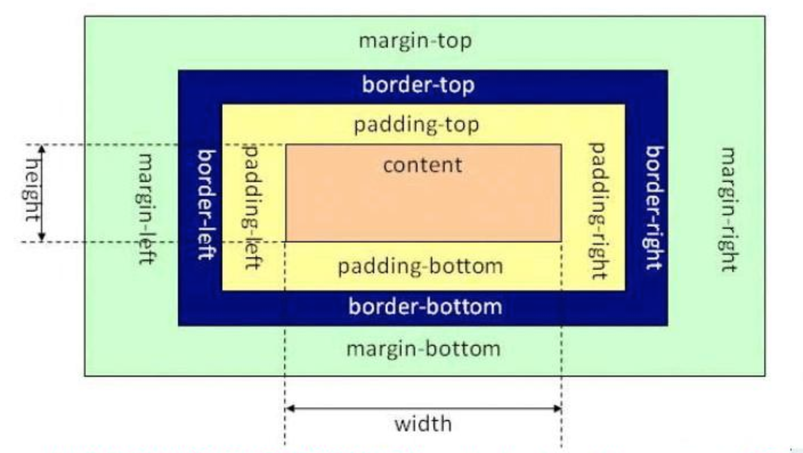

# CSS 学习笔记

- [CSS 学习笔记](#css-学习笔记)
  - [1 CSS 的介绍](#1-css-的介绍)
  - [2 css 的引入方式](#2-css-的引入方式)
  - [3 css 选择器](#3-css-选择器)
  - [4 css 属性](#4-css-属性)
    - [4.1 布局常用样式属性](#41-布局常用样式属性)
    - [4.2 文本常用样式属性](#42-文本常用样式属性)
  - [5 css 元素溢出](#5-css-元素溢出)
  - [6 css 显示特性](#6-css-显示特性)
  - [7 盒子模型](#7-盒子模型)

## 1 CSS 的介绍

1. css 的定义

> css(Cascading Style Sheet)层叠样式表，它是用来美化页面的一种语言。

没有使用css的效果图


使用css的效果图


2. css 的作用
    1. 美化界面, 比如: 设置标签文字大小、颜色、字体加粗等样式。
    2. 控制页面布局, 比如: 设置浮动、定位等样式。

3. css 的基本语法

选择器{

样式规则

}

样式规则：

属性名1：属性值1;

属性名2：属性值2;

属性名3：属性值3;

...

选择器: **是用来选择标签的，选出来以后给标签加样式。**

代码示例:

```html
div{ 
    width:100px; 
    height:100px; 
    background:gold; 
}
```

说明

css 是由两个主要的部分构成：**选择器和一条或多条样式规则**，注意: **样式规则需要放到大括号里面。**

## 2 css 的引入方式

**css的三种引入方式**

- 行内式
- 内嵌式（内部样式）
- 外链式

1. 行内式

直接在标签的 `style` 属性中添加 `css` 样式

示例代码:

```html
<div style="width: 100px; height: 100px; background: red">hello</div>
```

- 优点：方便、直观。
- 缺点：缺乏可重用性。

2. 内嵌式（内部样式）

在 `<head>` 标签内加入 `<style>` 标签，在 `<style>` 标签中编写 css 代码。

示例代码:

```html
<head>
    <style type="text/css">
    h3 {
        color: red;
    }
</head>
```

- 优点：在同一个页面内部便于复用和维护。
- 缺点：在多个页面之间的可重用性不够高。

3. 外链式

将`css`代码写在一个单独的`.css`文件中，在`<head>`标签中使用`<link>`标签直接引入该文件到页面中。

示例代码:

```html
<link rel="stylesheet" type="text/css" href="css/main.css">
```

- 优点：使得 css 样式与 html 页面分离，便于整个页面系统的规划和维护，可重用性高。
- 缺点：css 代码由于分离到单独的 css 文件，容易出现 css 代码过于集中，若维护不当则极容易造成混乱。

4. css 引入方式选择

- 行内式几乎不用
- 内嵌式在学习 css 样式的阶段使用
- 外链式在公司开发的阶段使用，可以对 css 样式和 html 页面分别进行开发。

**示例代码**

```html
<!DOCTYPE html>
<html lang="en">
  <head>
    <meta charset="UTF-8" />
    <meta name="viewport" content="width=device-width, initial-scale=1.0" />
    <title>Document</title>
    <!-- 内嵌式 -->
    <style>
      /* 选择器, css 样式表可以由很多选择器组成, 选择器就是用来选择标签, 给标签添加样式 */
      a {
        color: green;
      }
      div {
        width: 100px;
        height: 100px;
        background: blue;
      }
    </style>

    <!-- 外链式 -->
    <link rel="stylesheet" href="css/main.css" />
  </head>
  <body>
    <!-- 行内式 -->
    <p style="color: red">我是一个段落标签</p>

    <a href="https://www.baidu.com">百度</a>

    <div>我是一个段落标签</div>

    <h1>一级标题</h1>
  </body>
</html>
```

其中 `main.css` 文件内容如下:

```css
h1 {
  color: skyblue;
}
```

## 3 css 选择器

1. css 选择器的定义

css 选择器是用来选择标签的，选出来以后给标签加样式。

2. css 选择器的种类

- 标签选择器
- 类选择器
- 层级选择器(后代选择器)
- id选择器
- 组选择器
- 伪类选择器

3. 标签选择器

根据标签来选择标签，**以标签开头**，此种选择器影响范围大，一般用来做一些通用设置。

示例代码

```html
<style type="text/css">
    p {
        color: red;
    }
</style>

<div>hello</div>
<p>hello</p>
```

4. 类选择器

根据类名来选择标签，**以 `.` 开头**, 一个类选择器可应用于多个标签上，一个标签上也可以使用多个类选择器，多个类选择器需要使用空格分割，应用灵活，可复用，**是 css 中应用最多的一种选择器。**

示例代码

```html
<!DOCTYPE html>
<html lang="en">
  <head>
    <meta charset="UTF-8" />
    <meta name="viewport" content="width=device-width, initial-scale=1.0" />
    <title>Document</title>
    <style type="text/css">
      .blue {
        color: blue;
      }
      .big {
        font-size: 20px;
      }
      .box {
        width: 100px;
        height: 100px;
        background-color: red;
      }
    </style>
  </head>
  <body>
    <div class="blue">这是一个div</div>
    <h3 class="blue big box">这是一个h3</h3>
    <p class="blue box">这是一个段落</p>
  </body>
</html>
```

5. 层级选择器(后代选择器)

根据层级关系选择后代标签，以**选择器1 选择器2**开头，主要应用在标签嵌套的结构中，减少命名。

示例代码

```html
<!DOCTYPE html>
<html lang="en">
  <head>
    <meta charset="UTF-8" />
    <meta name="viewport" content="width=device-width, initial-scale=1.0" />
    <title>Document</title>
    <style type="text/css">
      div p {
        color: red;
      }
      .con {
        width: 300px;
        height: 80px;
        background: green;
      }
      .con span {
        color: red;
      }
      .con .pink {
        color: pink;
      }
      .con .gold {
        color: gold;
      }
    </style>
  </head>

  <body>
    <div>
    <!-- 必须要完美匹配才能生效 -->
      <p>hello world 受到影响</p>
      <h1>一级标题不被影响</h1>
    </div>

    <div class="con">
        <span>我是span标签</span>
        <a href="#">百度</a>
        <a href="#" class="pink">百度</a>
        <a href="#" class="gold">谷歌</a>
    </div>
    <span>你好</span>
    <a href="#" class="pink">新浪不会受到影响</a>
  </body>
</html>
```

> 注意: 这个层级关系不一定是父子关系，也有可能是祖孙关系，只要有后代关系都适用于这个层级选择器

6. `id` 选择器

根据 `id` 选择标签，以 `#` 开头, 元素的 `id` 名称不能重复，所以 `id` 选择器只能对应于页面上一个元素，不能复用，`id` 名一般给程序使用，所以**不推荐使用 `id` 作为选择器。**

示例代码

```html
<style type="text/css">
    #box {
    color: red;
    }
</style>

<p id="box">对应以上的样式, 其他元素不允许应用此样式</p>
<p id="box">无法应用以上样式, 每个标签只能有唯一的 id 名</p>
```

> 注意: 虽然给其它标签设置 `id="box"` 也可以设置样式，但是不推荐这样做，因为 `id` 是唯一的，以后 `js` 通过 `id` 只能获取一个唯一的标签对象。

7. 组选择器

根据组合的选择器选择不同的标签，以 `,` 分割开, 如果有公共的样式设置，可以使用组选择器。

示例代码

```html
    <style type="text/css">
      .box1,
      .box2,
      .box3 {
        width: 100px;
        height: 100px;
      }
      .box1 {
        background-color: red;
      }
      .box2 {
        background-color: pink;
      }
      .box3 {
        background-color: gold;
      }
    </style>

<div class="box1">这是第一个div</div>
<div class="box2">这是第二个div</div>
<div class="box3">这是第三个div</div>
```

8. 伪类选择器

用于向选择器添加特殊的效果, 以 `:` 分割开, 当用户和网站交互的时候改变显示效果可以使用伪类选择器

示例代码

```html
<style type="text/css">
    .box1 {
    width: 100px;
    height: 100px;
    background: gold;
    }
    .box1:hover {
    width: 300px;
    }
</style>

<div class="box1">第一个div</div>
<div class="box2">第二个div</div>
```

## 4 css 属性

### 4.1 布局常用样式属性

```css
/* 设置元素宽度为100像素 */
width: 100px;

/* 设置元素高度为200像素 */
height: 200px;

/* 设置元素背景色为金色 */
background: gold;

/* 设置元素背景图片为logo.png */
background: url(images/logo.png);

/* 设置元素四周边框为1像素宽的黑色实线 */
border: 1px solid black;

/* 拆分成四个边的边框设置 */
border-top: 10px solid red; /* 顶部边框为10像素宽的红色实线 */
border-left: 10px solid blue; /* 左侧边框为10像素宽的蓝色实线 */
border-right: 10px solid green; /* 右侧边框为10像素宽的绿色实线 */
border-bottom: 10px solid pink; /* 底部边框为10像素宽的粉色实线 */

/* 设置元素内边距为20像素 */
padding: 20px;

/* 拆分成四个边的内边距设置 */
padding-top: 30px; /* 顶部内边距为30像素 */
padding-left: 40px; /* 左侧内边距为40像素 */
padding-right: 50px; /* 右侧内边距为50像素 */
padding-bottom: 60px; /* 底部内边距为60像素 */

/* 设置元素外边距为20像素 */
margin: 20px;

/* 拆分成四个边的外边距设置 */
margin-top: 30px; /* 顶部外边距为30像素 */
margin-left: 40px; /* 左侧外边距为40像素 */
margin-right: 50px; /* 右侧外边距为50像素 */
margin-bottom: 60px; /* 底部外边距为60像素 */

/* 设置元素左浮动 */
float: left; /* 或者使用 float: right; 设置元素右浮动 */
```

**代码示例**

```html
<style>
    .box1{
        width: 200px; 
        height: 200px; 
        background:yellow; 
        border: 1px solid black;
    }

    .box2{
        /* 设置宽度 */
        width: 100px;
        /* 设置高度 */
        height: 100px;
        /* 设置背景色 */
        background: red;
        /* 设置四边边框 */
        /* border: 10px solid black; */
        border-top: 10px solid black;
        border-left: 10px solid black;
        border-right: 10px solid black;
        border-bottom: 10px solid black;
        /* 设置内边距， 内容到边框的距离，如果设置四边是上右下左 */
        /* padding: 10px;   */
        padding-left: 10px;
        padding-top: 10px;
        /* 设置外边距，设置元素边框到外界元素边框的距离 */
        margin: 10px;
        /* margin-top: 10px;
        margin-left: 10px; */
        float: left;
    }

    .box3{
        width: 48px; 
        height: 48px; 
        background:pink; 
        border: 1px solid black;
        float: left;
    }

</style>

<div class="box1">
    <div class="box2">
        padding 设置元素包含的内容和元素边框的距离
    </div>
    <div class="box3">
    </div>
</div>
```

### 4.2 文本常用样式属性

```css
/* 设置文字颜色为红色 */
color: red;

/* 设置文字大小为12像素 */
font-size: 12px;

/* 设置文字字体为微软雅黑，避免中文字不兼容 */
font-family: 'Microsoft Yahei', '微软雅黑', sans-serif;

/* 设置文字加粗 */
font-weight: bold;

/* 设置文字行高为24像素 */
line-height: 24px;

/* 去掉文字下划线 */
text-decoration: none;

/* 设置文字水平居中对齐 */
text-align: center;

/* 设置文字首行缩进为24像素 */
text-indent: 24px;

/* 设置文字斜体风格 */
font-style: italic;
```

**代码示例**

```html
<style>
    p{
       /* 设置字体大小  浏览器默认是 16px */
       font-size:20px;
       /* 设置字体 */
       font-family: "Microsoft YaHei"; 
       /* 设置字体加粗 */
       font-weight: bold;
       /* 设置字体颜色 */
       color: red;
       /* 增加掉下划线 */
       text-decoration: underline;
       /* 设置行高  */
       line-height: 100px;
       /* 设置背景色 */
       background: green;
       /* 设置文字居中 */
       /* text-align: center; */
       text-indent: 40px;
    }

    a{
        /* 去掉下划线 */
        text-decoration: none;
    }
</style>

<a href="#">连接标签</a>
<p>
    你好，世界!
</p>
```

## 5 css 元素溢出

**当子元素(标签)的尺寸超过父元素(标签)的尺寸时**，此时需要设置父元素显示溢出的子元素的方式，设置的方法是通过 `overflow` 属性来完成。

`overflow` 的设置项：

1. `visible` 默认值, 显示子标签溢出部分。
2. `hidden` 隐藏子标签溢出部分。
3. `auto` 如果子标签溢出，则可以滚动查看其余的内容。

2. 示例代码

```html
<style>
    .box1{
        width: 100px;
        height: 200px;
        background: red;
        /* 在父级上设置子元素溢出的部分如何显示 */
        /* overflow: hidden; */
        overflow: auto;
    }
    .box2{
        width: 50px;
        height: 300px;
        background: yellow;
    }
</style>

<div class="box1">
    <div class="box2">hello</div>
</div>
```

## 6 css 显示特性

1. `display` 属性的使用

`display` 属性是用来设置元素的类型及隐藏的，常用的属性有：

- `none` 元素隐藏且不占位置
- `inline` 元素以行内元素显示
- `block` 元素以块元素显示

2. 示例代码

```html
<style>
    .box{
        /* 将块元素转化为行内元素 */
        display:inline;
    } 

    .link01{
        /* 将行内元素转化为块元素 */
        display:block;
        background: red;

    }

    .con{
        width:200px;
        height:200px;
        background:gold;

        /* 将元素隐藏 */
        display:none;
    }

</style>

<div class="con"></div>
<div class="box">这是第一个div</div>
<div class="box">这是第二个div</div>
<a href="#" class="link01">这是第一个链接</a>
<a href="#" class="link01">这是第二个链接</a>
```

> 行内元素不能设置宽高，块元素或者行内块元素可以设置宽高。

## 7 盒子模型

1. 盒子模型的介绍

所谓的盒子模型就是把 HTML 页面的元素看作一个矩形盒子，矩形盒子是由内容(`content`)、内边距(`padding`)、边框(`border`)、外边距(`margin`)四部分组成。

盒子模型示意图如下：



2. 盒子模型相关样式属性

- 盒子的内容宽度(`width`)，注意：不是盒子的宽度
- 盒子的内容高度(`height`)，注意：不是盒子的高度
- 盒子的边框(`border`)
- 盒子内的内容和边框之间的间距(`padding`)
- 盒子与盒子之间的间距(`margin`)

**设置宽高：**

设置盒子的宽高，此宽高是指盒子内容的宽高，不是盒子整体宽高

```css
width: 200px;  /* 设置盒子的宽度，此宽度是指盒子内容的宽度，不是盒子整体宽度(难点) */ 
height: 200px; /* 设置盒子的高度，此高度是指盒子内容的高度，不是盒子整体高度(难点) */
```

**设置边框:**

设置一边的边框，比如顶部边框，可以按如下设置：

```css
border-top: 10px solid red;
```

- `10px` 表示线框的粗细
- `solid`表示线性
- `red`表示边框的颜色

设置其它三个边的方法和上面一样，把上面的 `top` 换成 `left` 就是设置左边，换成 `right` 就是设置右边，换成 `bottom` 就是设置底边。

四个边如果设置一样，可以将四个边的设置合并成一句：

```css
border: 10px solid red;
```

**设置内间距 `padding`**

设置盒子四边的内间距，可设置如下：

```css
padding-top：20px;     /* 设置顶部内间距20px */ 
padding-left: 30px;     /* 设置左边内间距30px */ 
padding-right: 40px;    /* 设置右边内间距40px */ 
padding-bottom: 50px;   /* 设置底部内间距50px */
```

上面的设置可以简写如下：

```css
padding：20px 40px 50px 30px; /* 四个值按照顺时针方向，分别设置的是 上 右 下 左  
四个方向的内边距值。 */
```

`padding` 后面还可以跟 3 个值，2 个值和 1 个值，它们分别设置的项目如下：

```css
padding: 20px 40px 50px; /* 设置顶部内边距为20px，左右内边距为40px，底部内边距为50px */ 
padding: 20px 40px; /* 设置上下内边距为20px，左右内边距为40px*/ 
padding: 20px; /* 设置四边内边距为20px */
```

**设置外间距 `margin`**

外边距的设置方法和 `padding` 的设置方法相同，将上面设置项中的 `padding` 换成 `margin` 就是外边距设置方法。

盒子的真实尺寸

盒子的 `width` 和 `height` 值固定时，如果盒子增加 `border` 和 `padding`，盒子整体的尺寸会变大，所以盒子的真实尺寸为：

- 盒子宽度 = `width` + `padding`左右 + `border`左右
- 盒子高度 = `height `+ `padding`上下 + `border`上下