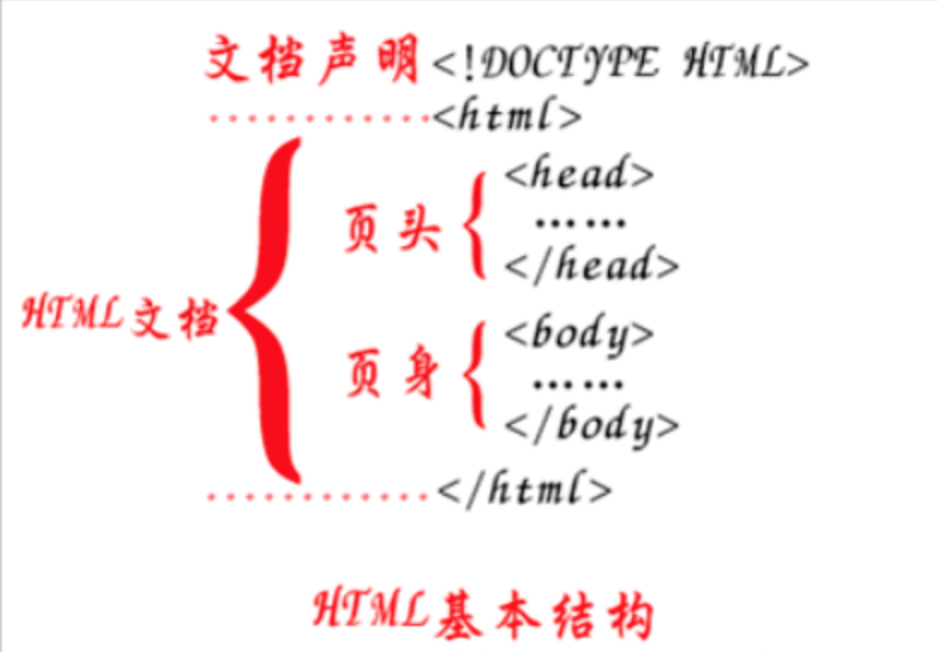

# HTML 笔记

- [HTML 笔记](#html-笔记)
  - [1 HTML 的介绍](#1-html-的介绍)
  - [2 html 的基本结构](#2-html-的基本结构)
    - [2.1 结构代码](#21-结构代码)
    - [2.2 浏览网页文件](#22-浏览网页文件)
  - [3 初始常用的 html 标签](#3-初始常用的-html-标签)
  - [4 列表标签](#4-列表标签)
  - [5 表格标签](#5-表格标签)
  - [6 表单标签](#6-表单标签)
  - [7 表单提交](#7-表单提交)

## 1 HTML 的介绍

HTML 的全称为：HyperText Mark-up Language, 指的是超文本标记语言。 标记：就是**标签**, `<标签名称> </标签名称>`, 比如: `<html></html>、<h1></h1>` 等，**标签大多数都是成对出现的。**

所谓超文本，有两层含义:

因为网页中还可以图片、视频、音频等内容(超越文本限制)
它还可以在网页中跳转到另一个网页，与世界各地主机的网页链接(超链接文本)

**html是用来开发网页的，它是开发网页的语言。**

## 2 html 的基本结构

> vscode 安装 open in browser 插件，可以在浏览器中打开 html 文件。

> `!` + `tab` 快捷键可以生成 html 基本结构

> `div.box1*3` + `enter` 可以生成三个 div 标签并指定类名为 `box1`

> `div>div*2` + `enter` 可以生成一个父 div, 并嵌套两个子 div 标签

### 2.1 结构代码

```html
<!-- 文档声明 :  html5的文档 -->
<!DOCTYPE html>
<!-- 当前网页的语言是英文, 谷歌翻译会翻译, 默认不指定是中文 => lang="zh" -->
<html lang="en">
<head>
    <!-- 设置当前网页的字符集为utf-8 -->
    <meta charset="UTF-8">
    <!-- 在移动设备浏览网页时，网页不缩放 -->
    <meta name="viewport" content="width=device-width, initial-scale=1.0">
    <!-- 设置网页的标题 -->
    <title>Document</title>
</head>
<body>
    网页内容
</body>
</html>
```

1. 第一行 `<!DOCTYPE html>` 是文档声明，用来指定页面所使用的 HTML 版本，这里声明的是一个 HTML5 文档。
2. `<html>...</html>` 标签是开发人员在告诉浏览器，整个网页是从 `<html>`这里开始的，到 `</html>` 结束，也就是 html 文档的开始和结束标签。
3. `<head>...</head>` 标签用于定义文档的头部，**是负责对网页进行设置标题、编码格式以及引入 css、js 等文件的。**
4. `<body>...</body>` 标签是编写网页上显示的内容



### 2.2 浏览网页文件

网页文件的后缀是 `.html` 或者 `.htm`, 一个 html 文件就是一个网页，html 文件用编辑器打开显示的是文本，可以用文本的方式编辑它，如果用浏览器打开，浏览器会按照标签描述内容将文件渲染成网页。


## 3 初始常用的 html 标签

```html
<!-- 1、成对出现的标签：-->

<h1>h1标题</h1>
<div>容器标签, 用于组织和布局内容, 通常用于将一组相关的元素放在一起</div>
<p>段落标签</p>

<!-- 2、单个出现的标签： -->
<!--这是换行-->
<br>

<!--这是一个水平分割线-->
<hr>

<!-- 3、带属性的标签，如src、alt 和 href等都是属性 -->

<a href="http://www.baidu.com">百度网的超链接</a>

<!-- 4、标签的嵌套 -->
<div>
    <!-- 绝对路径 -->
    
    <a href="http://www.baidu.com">百度网的超链接</a>
</div>
```

1. 标签不区分大小写，但是**推荐使用小写。**
2. 根据标签的书写形式，标签分为双标签(闭合标签)和单标签(空标签)
    1. 双标签是指由开始标签和结束标签组成的一对标签，这种标签允许嵌套和承载内容，比如: `div`标签
    2. 单标签是一个标签组成，**没有标签内容**，比如: `img`标签

**注意：**

- **Windows 的根目录是指定的盘符**
- **一般都会使用相对路径**，绝对路径的操作在其它电脑上打开会有可能出现资源文件找不到的问题

## 4 列表标签

1. 列表标签的种类
    - 无序列表标签(`ul`标签)
    - 有序列表标签(`ol`标签)

2. 无序列表

```html
<!-- ul标签定义无序列表 -->
<ul>
    <!-- li标签定义列表项目 -->
    <li>列表标题一</li>
    <li>列表标题二</li>
    <li>列表标题三</li>
</ul>
```

3. 有序列表

```html
<!-- ol标签定义有序列表 -->
<ol>
    <!-- li标签定义列表项目 -->
    <li><a href="#">列表标题一</a></li>
    <li><a href="#">列表标题二</a></li>
    <li><a href="#">列表标题三</a></li>
</ol>
```

## 5 表格标签

1. 表格的结构

表格是由行和列组成，好比一个excel文件

2. 表格标签

- `<table>`标签：表示一个表格
    - `<tr>`标签：表示表格中的一行
        - `<td>`标签：表示表格中的列
        - `<th>`标签：表示表格中的表头

示例代码:

```html
<!-- style 是可选的，用于设置表格的样式 -->

<!-- border-collapse 属性设置表格的边框是否被合并为一个单一的边框。 -->
<table style="border: 1px solid black; border-collapse: collapse;">
    <tr>
        <!-- 通过 <style> 属性可以设置表格的样式，例如设置边框的颜色、宽度等。 -->
        <th style="border: 1px solid rgb(255, 0, 43);">Id</th>
        <th style="border: 1px solid black;">Name</th>
    </tr>

    <tr>
        <td style="border: 1px solid black;">1</td>
        <td style="border: 1px solid black;">John</td>
    </tr>

    <tr>
        <td>2</td>
        <td>corner</td>
    </tr>
</table>
```

## 6 表单标签

1. 表单的介绍

表单用于搜集不同类型的用户输入(用户输入的数据)，然后可以把用户数据提交到web服务器 。

2. 表单相关标签的使用
    1. `<form>`标签 表示表单标签，定义整体的表单区域
    2. `<label>`标签 表示表单元素的文字标注标签，定义文字标注

3. `<input>`标签 表示表单元素的用户输入标签，定义不同类型的用户输入数据方式
    - `type`属性
        - `type="text"` 定义单行文本输入框
        - `type="password"` 定义密码输入框
        - `type="radio"` 定义单选框
        - `type="checkbox"` 定义复选框
        - `type="file"` 定义上传文件
        - `type="submit"` 定义提交按钮
        - `type="reset"` 定义重置按钮
        - `type="button"` 定义一个普通按钮

4. `<textarea>`标签 表示表单元素的多行文本输入框标签

5. `<select>`标签 表示表单元素的下拉列表标签
    - `<option>`标签与`<select>`标签配合

示例代码:

```html
<form>
    <!-- for 根据 id 名给指定 id 的标签设置光标 -->
    <p><label for="name"> 姓名： </label><input type="text" id="name" /></p>

    <p>
    <label> 性别： </label>
    <input type="radio" /> 男 <input type="radio" /> 女
    </p>

    <p>
    <label> 爱好： </label>
    <input type="checkbox" /> 唱歌 <input type="checkbox" /> 跳舞
    <input type="checkbox" /> 画画
    </p>

    <p>
    <label> 照片： </label>
    <input type="file" />
    </p>

    <p>
    <label> 个人描述： </label>
    <textarea></textarea>
    </p>

    <p>
    <label> 籍贯： </label>
    <select>
        <option>北京</option>
        <option>上海</option>
        <option>广州</option>
        <option>深圳</option>
    </select>
    </p>

    <p>
    <input type="submit" value="提交" />
    <input type="reset" value="重置" />
    <input type="button" value="按钮" />
    </p>
</form>
```

效果如下：


## 7 表单提交

1. 表单属性设置

`<form>`标签 表示表单标签，定义整体的表单区域

- `action`属性 设置表单数据提交地址
- `method`属性 设置表单提交的方式，一般有“`GET`”方式和“`POST`”方式, **不区分大小写**

2. 表单元素属性设置

- `name`属性 设置表单元素的名称，该名称是提交数据时的参数名
- `value`属性 设置表单元素的值，该值是提交数据时参数名所对应的值

3. 示例代码

```html
<form action="https://www.baidu.com" method="get">
      <p>
        <label>姓名：</label>
        <input type="text" name="username" value="请输入用户名" />
      </p>

      <p>
        <label>密码：</label>
        <input type="password" name="password" />
      </p>

      <p>
        <label>性别：</label>
        <input type="radio" name="gender" value="0" /> 男
        <input type="radio" name="gender" value="1" /> 女
      </p>

      <p>
        <label>爱好：</label>
        <input type="checkbox" name="hobby" value="sing" /> 唱歌
        <input type="checkbox" name="hobby" value="dance" /> 跳舞
        <input type="checkbox" name="hobby" value="swim" /> 游泳
      </p>

      <p>
        <label>照片：</label>
        <input type="file" name="photo" />
      </p>

      <p>
        <label>个人描述：</label>
        <textarea name="desc" cols="30" rows="10"></textarea>
      </p>

      <p>
        <label>籍贯：</label>
        <select name="province">
          <option value="0">北京</option>
          <option value="1">上海</option>
          <option value="2">广州</option>
          <option value="3">深圳</option>
        </select>
      </p>

      <p>
        <input type="submit" value="提交" />
        <input type="reset" value="重置" />
        <input type="button" value="按钮" />
      </p>
    </form>
```


点击提交到达的网站：***https://www.baidu.com/?username=corner&password=11&gender=0&hobby=dance&photo=&desc=me&province=2***


