# git笔记

- [git笔记](#git笔记)
  - [1 基础概念](#1-基础概念)
    - [1.1 git的区域](#11-git的区域)
  - [2 常用命令](#2-常用命令)
    - [2.1 配置本地ssh](#21-配置本地ssh)
    - [2.2 git的基本操作流程](#22-git的基本操作流程)
      - [2.2.1 克隆远程仓库的代码](#221-克隆远程仓库的代码)
      - [2.2.2 本地代码提交流程](#222-本地代码提交流程)
    - [2.3 tag的使用](#23-tag的使用)
  - [3 各阶段代码回退撤销操作](#3-各阶段代码回退撤销操作)
    - [3.1 丢弃工作区的修改](#31-丢弃工作区的修改)
    - [3.2 撤销暂存区的修改](#32-撤销暂存区的修改)
    - [3.3 撤销本地仓库的修改](#33-撤销本地仓库的修改)
    - [3.4 撤销远程仓库的修改](#34-撤销远程仓库的修改)
  - [4 推送冲突解决](#4-推送冲突解决)
  - [5 分支管理](#5-分支管理)
    - [5.1 本地分支管理](#51-本地分支管理)
      - [5.1.1 创建本地分支并切换到该分支](#511-创建本地分支并切换到该分支)
      - [5.1.2 推送到远程仓库分支](#512-推送到远程仓库分支)
      - [5.1.3 删除本地分支](#513-删除本地分支)
      - [5.1.4 本地分支合并冲突解决](#514-本地分支合并冲突解决)
    - [5.2 远程分支管理](#52-远程分支管理)
  - [6 高级操作](#6-高级操作)
    - [6.1 电脑同时配置gitlab、github和gitee](#61-电脑同时配置gitlabgithub和gitee)
      - [6.1.1 生成密钥](#611-生成密钥)
      - [6.1.2 添加config配置](#612-添加config配置)
      - [6.1.3 配置git仓库](#613-配置git仓库)
    - [6.2 配置项目同时提交到github和gitee](#62-配置项目同时提交到github和gitee)
      - [6.2.1 本地只有一个ssh-key的情况](#621-本地只有一个ssh-key的情况)
      - [6.2.2 本地有多个ssh-key的情况](#622-本地有多个ssh-key的情况)
  - [7 常见问题](#7-常见问题)
    - [7.1 本地已配置ssh但push时仍需输账号密码](#71-本地已配置ssh但push时仍需输账号密码)
    - [7.2 ssh -T git@github.com 报错](#72-ssh--t-gitgithubcom-报错)
    - [7.3 提交时报未合并代码错误](#73-提交时报未合并代码错误)
    - [7.4 误操作reset后恢复本地代码](#74-误操作reset后恢复本地代码)


## 1 基础概念

### 1.1 git的区域

- 工作区：代码的编写及修改
- 暂存区：`git add` 将本地修改添加至此
- 本地仓库：`git commit` 将暂存区的代码提交至此
- 远程仓库：`git push` 将本地仓库的代码提交至此

## 2 常用命令

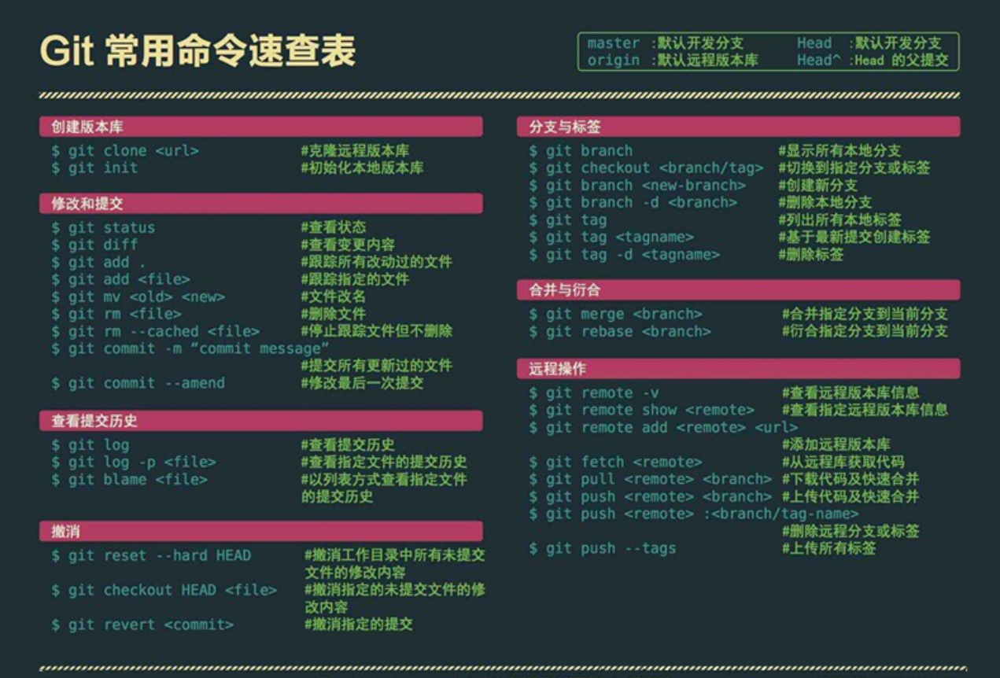

- 存储 git 凭据到本地：`git config --global credential.helper store`
- 设置 git 凭据缓存时间：`git config --global credential.helper 'cache --timeout=3600'`
- 查看仓库名称：`git remote`，可在 `.git/config` 文件中查看和更改，默认为 `origin`
- 查看指定文件变更内容：`git diff HEAD -- <filename>`
- 查看本地和远程分支：`git branch -a`
- 查看远程分支：`git branch -r`
- 查看本地分支追踪的远程分支：`git branch -vv`

### 2.1 配置本地ssh

（1）设置git的用户名和邮箱（第一次安装git的情况下）

````shell
git config --global user.name "xxx"
git config --global user.email "xxxxx@xxx"
````

（2）生成密钥

````shell
ssh-keygen -t rsa -C "xxxxx@xx"
````

（3）验证 ssh 连接

```shell
ssh -T git@github.com
```

### 2.2 git的基本操作流程

#### 2.2.1 克隆远程仓库的代码

（1）克隆到本地

````shell
git clone https://xxx.github.com/xxx/xxx.git 
````

（2）克隆到本地指定文件夹 `project`

```shell
git clone https://xxx.github.com/xxx/xxx.git project
```

#### 2.2.2 本地代码提交流程

（1）拉取远程仓库最新代码

````shell
git pull
````

（2）将本地新建的文件添加到远程仓库

```shell
git add .
```

（3）将本地修改后的文件提交到远程仓库

```shell
git commit -m "这里是注释"
```

（4）将本地修改后的文件推送到远程仓库

```shell
git push
```

### 2.3 tag的使用

（1）查看tag

```shell
git tag
```

（2）查看指定版本的tag（如查看v1.0开头的所有tag）

```shell
git tag -l 'v1.0*'
```

（3）显示tag信息

```shell
git show v1.0.0
```

（4）指定commit创建tag（如创建名为v1.0.1的tag）

```shell
git tag v1.0.1
```

（5）创建tag（如指定`54642b6204fa5714fa81dbe744f0ae6353977cd0`的commit创建名为`v1.0.1`的tag）

```shell
git tag -a v1.0.1 54642b6204fa5714fa81dbe744f0ae6353977cd0
```

- 查看commit使用命令 `git log`

（6）删除tag（如删除名为v1.0.1的tag）

```shell
git tag -d v1.0.1
```

（7）删除远程仓库的指定tag（如删除名为v1.0.1的tag）

```shell
git tag -d v1.0.1
git push origin :refs/tags/v1.0.1
```

（8）推送指定tag到远程仓库（如名为v1.0.1的tag）

```shell
git push origin v1.0.1
```

（9）推送本地所有tag到远程仓库

```shell
git push origin --tags
```

## 3 各阶段代码回退撤销操作

### 3.1 丢弃工作区的修改

还未执行 `git add`

```shell
git checkout -- .
git checkout -- <filename>
```

相当于用本地仓库相应分支的版本替换工作区的版本

### 3.2 撤销暂存区的修改

已执行 `git add`，但未执行 `git commit`

```shell
git reset HEAD
git reset HEAD <filename>
```

此时工作区的代码不变，暂存区的代码回退到上一次提交的版本

### 3.3 撤销本地仓库的修改

已执行 `git commit`，但未执行 `git push`

```shell
git reset --hard <commit_id>
```

此时工作区、暂存区、本地仓库的代码都回退到指定的版本

并没有删除，只是移动了 HEAD 指针。可以通过 `git reflog` 查看历史操作，之后通过 `git reset --hard <commit_id>` 恢复

### 3.4 撤销远程仓库的修改

已执行 `git push`

```shell
git revert <commit_id>
```

会生成一个新的提交，撤销指定的提交

**注意**：不可以先回退到某个版本，再推送到远程仓库，**会遭到拒绝而失败**。只有本地仓库 ahead 于远程仓库时**或者 `-f` 强制推送**，才可以推送。

## 4 推送冲突解决

重新拉取远程仓库代码

```shell
git pull
```

这会自动进行 `merge` 操作，如果 `merge` 有冲突，会提示冲突文件，手动解决冲突后再次提交。

## 5 分支管理

### 5.1 本地分支管理

#### 5.1.1 创建本地分支并切换到该分支

```shell
git checkout -b <branch_name>

# 等价于
git branch <branch_name>
git checkout <branch_name>
```

这并不会改变工作区的代码，只是切换到了新的分支

此时无法执行 `git pull`，因为不知道当前分支追踪的远程分支，这一点可以通过 `git branch -vv` 查看。

#### 5.1.2 推送到远程仓库分支

**方案一，直接推送**：

此时直接执行 `git push` 会显示 everything up-to-date，需要指定推送的分支

```shell
git push origin <local_branch_name>:<remote_branch_name>
```

**方案二，切换分支后推送**：

（1）切换回要推送的分支

```shell
git checkout <branch_name>
```

（2）拉取，合并

```shell
git pull
git merge <new_branch_name> # 这会将新创建的分支中的内容合并到当前分支，直接合并到了本地仓库
git push origin <branch_name>
```

#### 5.1.3 删除本地分支

```shell
git branch -d <branch_name> # 合并后删除本地分支
git branch -D <branch_name> # 强制删除本地分支，此时可能还没合并
```

#### 5.1.4 本地分支合并冲突解决

- 在 [5.1.2 推送到远程仓库分支](#512-推送到远程仓库分支) 的方案中，在 `merge` 前进行了一次 `pull` 操作，所以此时的 `merge` 可能会发生冲突，需要手动解决，和 [4 推送冲突解决](#4-推送冲突解决) 中的操作一样

- 如果先 `merge` 后 `pull`，就转化成了 [4 推送冲突解决](#4-推送冲突解决) 中的问题了

### 5.2 远程分支管理


## 6 高级操作

### 6.1 电脑同时配置gitlab、github和gitee

#### 6.1.1 生成密钥

（1）生成gitee密钥（指定文件名后缀防止覆盖）

````shell
ssh-keygen -t rsa -C "xxx@xx.com" -f ~/.ssh/id_rsa_gitee
````

（2）生成github密钥（指定文件名后缀防止覆盖）

````
ssh-keygen -t rsa -C "xxx@xx.com" -f ~/.ssh/id_rsa_github
````

（3）生成gitlab密钥（指定文件名后缀防止覆盖）

```
ssh-keygen -t rsa -C "xxx@xx.com" -f ~/.ssh/id_rsa_gitlab
```

（4）在`~/.ssh/`目录（.ssh在用户文件夹下）会分别生成`id_rsa_gitee`和`id_rsa_gitee.pub`私钥和公钥（还有github与gitlab对应私钥和公钥）。将`id_rsa_gitee.pub`中的全部内容复制粘帖到公司gitlab服务器的SSH-key的配置中。

#### 6.1.2 添加config配置

（1）在`~/.ssh/`下添加config配置文件

````
cd ~/.ssh
touch config
````

（2）添加如下内容：

````
# gitlab                                                                       
Host gitlab.com
Port 22
User git
HostName gitlab.com
PreferredAuthentications publickey
IdentityFile ~/.ssh/id_rsa_gitlab

# github                                                                           
Host github.com
Port 22
User git
HostName github.com
PreferredAuthentications publickey
IdentityFile ~/.ssh/id_rsa_github

# gitee                                                                           
Host gitee.com
Port 22
User git
HostName gitee.com
PreferredAuthentications publickey
IdentityFile ~/.ssh/id_rsa_gitee
````

配置文件字段对应解释：

````
Host 
它涵盖了下面一个段的配置，我们可以通过他来替代将要连接的服务器地址。这里可以使用任意字段或通配符。 
当ssh的时候如果服务器地址能匹配上这里Host指定的值，则Host下面指定的HostName将被作为最终的服务器地址使用，并且将使用该Host字段下面配置的所有自定义配置来覆盖默认的/etc/ssh/ssh_config配置信息。 
Port 
自定义的端口。默认为22，可不配置 
User 
自定义的用户名，默认为git，可不配置 
HostName 
真正连接的服务器地址 
PreferredAuthentications 
指定优先使用哪种方式验证，支持密码和秘钥验证方式 
IdentityFile 
指定本次连接使用的密钥文件
````

#### 6.1.3 配置git仓库

由于公司使用gitlab进行代码管理，所以将gitlab设置为`global`全局配置（可根据自身情况选择设置）。

示例：

gitlab本地仓库文件夹为`~/gitlab`，github本地仓库文件夹为`~/github`，gitee本地仓库文件夹为`~/gitee`。

则配置如下：

（1）先配置gitlab（防止把gitee和github本地仓库覆盖）

````
cd ~/gitlab
git init
git config --global user.name 'xxx'
git config --global user.email 'xxx@xx.com'
````

（2）配置github

```
cd ~/github
git init
git config --local user.name 'xxx'
git config --local user.email 'xxx@xx.com'
```

（3）配置gitee

```
cd ~/gitee
git init
git config --local user.name 'xxx'
git config --local user.email 'xxx@xx.com'
```

### 6.2 配置项目同时提交到github和gitee

**前提：已经在gitee上导入github项目。**


#### 6.2.1 本地只有一个ssh-key的情况

**方法一：多次推送**

| 优点                           | 缺点                           |
| ------------------------------ | ------------------------------ |
| 可推送到指定的一个或多个仓库   | 推送仓库数量较多时，时间成本高 |
| 可不推送到指定的一个或多个仓库 |                                |

（1）通过执行过命令将本地项目和gitee项目关联**（步骤一和步骤二选一个执行即可）**

````
git remote add [name] [码云/github项目地址]

实例：
git remote add github https://github.com/DragonV96/order-system-seller.git
````

（2）通过修改本地项目的配置文件将本地项目和gitee项目关联**（步骤一和步骤二选一个执行即可）**

- 进入本地git项目文件夹

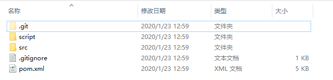

- 进入 `.git` 隐藏文件夹

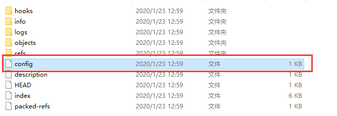

- 编辑 `.git` 目录下的 `config` 文件（可以看到git给远程库起的默认名称是 `origin` ，但如果有多个远程库，则需要不同的名称来标识不同的远程库）

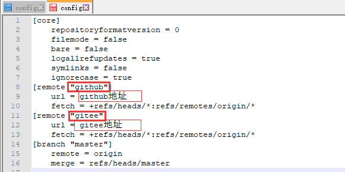

(3）执行命令查看配置的两个仓库

````shell
git remote
````

（4）推送代码时，需要**对两个仓库分别执行一次push命令**

````
git push github master
git push gitee master
````

**方法二：一次推送**

（1）通过命令将码云项目地址添加到本地已有的remote下**（步骤一和步骤二选一个执行即可）**

````
git remote set-url --add origin [码云项目地址]

实例：
git remote set-url --add origin https://gitee.com/glwsource/order-system-seller.git
````

（2）通过修改本地项目的配置文件**（步骤一和步骤二选一个执行即可）**

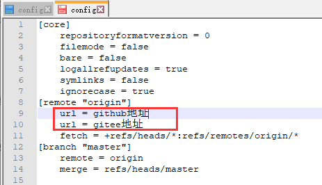

（3）推送只需一条命令

````
git push
````

（4）推送的时候可能会出现错误 `[rejected] master -> master (fetch first)`，此时执行强制推送命令

````
git push -f
````

（5）若步骤4仍然无法解决错误，则输入命令

````
git pull --rebase origin master
git push
````

#### 6.2.2 本地有多个ssh-key的情况

## 7 常见问题

### 7.1 本地已配置ssh但push时仍需输账号密码

1）查看本地项目远程地址 url 版本

````shell
git remote -v
````

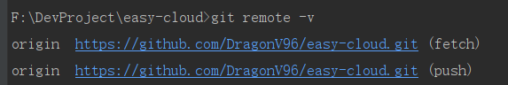

2）设置为新的 ssh 地址

````shell
git remote set-url origin [你的项目 ssh 地址]

# 实例
git remote set-url origin git@github.com:DragonV96/easy-cloud.git
````

3）再次查看本地项目远程地址 url 版本，已经更改正确，即可无账号密码推送

````shell
git remote -v
````

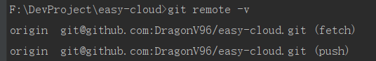

### 7.2 ssh -T git@github.com 报错

报错原因：kex_exchange_identification: Connection closed by remote host Connection closed by 20.205.243.166 port 22

原因是 代理冲突，22 端口冲突

（1）方案一：修改 ssh 配置文件，使用 443 端口

```shell
vim ~/.ssh/config
# 添加如下内容
HostName ssh.github.com
Port 443

# 或者添加如下内容，更好用
Host github.com
HostName ssh.github.com
User git
Port 443
```

（2）方案二：关闭代理

（3）方案三：使用 https 访问

### 7.3 提交时报未合并代码错误

报错原因：Committing is not possible because you have unmerged files.（因为你没有合并代码，所以不允许提交）

1）查看未提交代码文件

````shell
git diff
````

2）查看git状态

```shell
git status
```

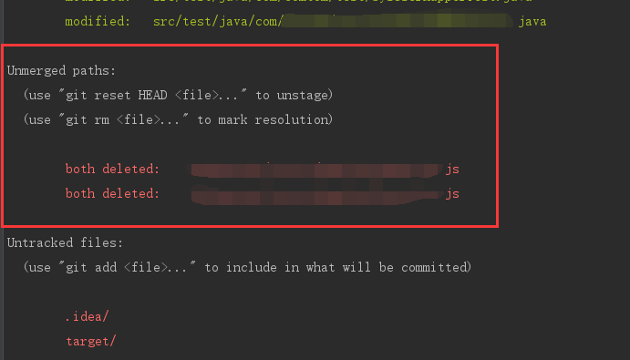

3）如果不需要的话，移除未合并代码（xxx表示上图整个路径+文件名）即可

```shell
git rm xxx.js
git rm xxx.js
```

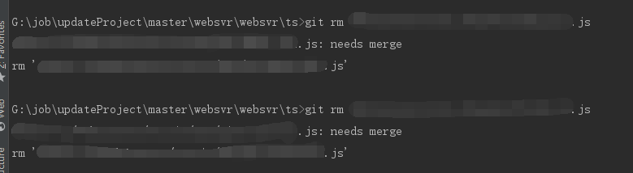

### 7.4 误操作reset后恢复本地代码

将本地git版本用 hard 模式回退到历史某一版本时，想要恢复原来的版本。

分三种情况：

1）没有 commit ，也没有 add

- IEAD 中挨个右键文件，在 local history 中查看并恢复
- 不行则直接找磁盘数据恢复工具或者大佬
- 再不行就加班重新写一遍

2）没有 commit ，但是 add 了

①执行命令，找回文件

````shell
git fsck --lost-found
````

②进入项目git目录下的 /.git/lost-found/other ，这里有你 add 过的文件，挨个文件恢复。

③找回本地仓库里边最近add的60个文件

````shell
find .git/objects -type f | xargs ls -lt | sed 60q
````

3）有过 commit

①执行命令，查看历史 commit 过的记录

````
git reflog
````

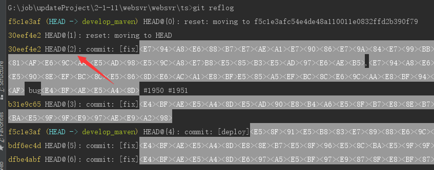

②选择需要恢复的节点，执行即可恢复，如 HEAD@{2} 

````shell
git reset --hard HEAD@{2} 
````

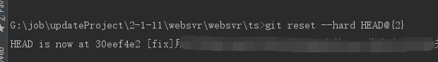