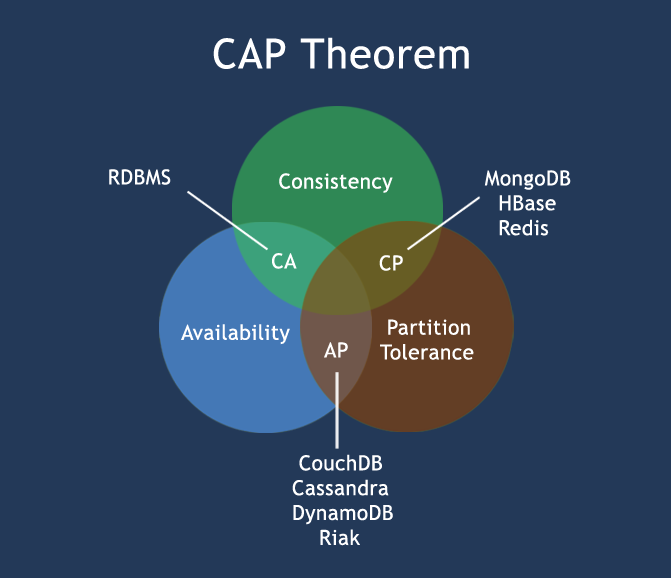

- [1 NoSQL 简介](#1-nosql-简介)
  - [1.1 关系型数据库遵循 ACID 规则](#11-关系型数据库遵循-acid-规则)
  - [1.2 RDBMS vs NoSQL](#12-rdbms-vs-nosql)
  - [1.3 CAP 定理（CAP Theorem）](#13-cap-定理cap-theorem)
  - [1.4 BASE 理论](#14-base-理论)
  - [1.5 ACID vs BASE](#15-acid-vs-base)
  - [1.6 NoSQL 数据库分类](#16-nosql-数据库分类)

## 1 NoSQL 简介

NoSQL 是 Not Only SQL 的缩写，意为不仅仅是 SQL。NoSQL 是一种非关系型数据库，它不需要固定的表结构，不需要 SQL 语言，也不需要遵循 ACID 规则。

### 1.1 关系型数据库遵循 ACID 规则

事务在英文中是 transaction，ACID 是事务的四个特性的首字母缩写：

1. **Atomicity（原子性）**：事务是一个不可分割的工作单位，要么全部成功，要么全部失败。
2. **Consistency（一致性）**：事务开始前和结束后，数据库的完整性约束没有被破坏。
   - 例如现有完整性约束 `A + B = 10`，如果一个事物改变了 A 的值，那么 B 的值也要相应改变，以保证约束不被破坏。
3. **Isolation（隔离性）**：所谓的**独立/隔离性**是指并发的事务之间不会互相影响，如果一个事务要访问的数据正在被另外一个事务修改，只要另外一个事务未提交，它所访问的数据就不受未提交事务的影响。
   - 比如现在有个交易是从 A 账户转 100 元至 B 账户，在这个交易还未完成的情况下，如果此时 B 查询自己的账户，是看不到新增加的 100 元的。
4. **Durability（持久性）**：事务一旦提交，对数据的改变是永久性的。

### 1.2 RDBMS vs NoSQL

**RDBMS**

- 高度组织化结构化数据
- 结构化查询语言（SQL）
- 数据和关系都存储在单独的表中。
- 数据操纵语言，数据定义语言
- 严格的一致性
- 基础事务

**NoSQL**

- 代表着不仅仅是 SQL
- 没有声明性查询语言
- 没有预定义的模式
- 键-值对存储，列存储，文档存储，图形数据库
- 最终一致性，而非 ACID 属性
- 非结构化和不可预知的数据
- CAP 定理
- 高性能，高可用性和可伸缩性

### 1.3 CAP 定理（CAP Theorem）

在计算机科学中，CAP 定理（CAP theorem），又被称作**布鲁尔定理**（Brewer's theorem），它指出对于一个分布式计算系统来说，不可能同时满足以下三点:

- **一致性(Consistency)** (所有节点在同一时间具有相同的数据)
- **可用性(Availability)** (保证每个请求不管成功或者失败都有响应)
- **分区容错性(Partition tolerance)** (系统中任意信息的丢失或失败不会影响系统的继续运作)

**CAP 理论的核心是：一个分布式系统不可能同时很好的满足一致性，可用性和分区容错性这三个需求，最多只能同时较好的满足两个**。因此，根据 CAP 原理将 NoSQL 数据库分成了满足 CA 原则、满足 CP 原则和满足 AP 原则三大类：

- CA - 单点集群，满足一致性，可用性的系统，通常在可扩展性上不太强大。
- CP - 满足一致性，分区容忍性的系统，通常性能不是特别高。
- AP - 满足可用性，分区容忍性的系统，通常可能对一致性要求低一些

### 1.4 BASE 理论

BASE 是 Basically Available（基本可用）、Soft state（软状态）和 Eventually consistent（最终一致性）三个短语的缩写。

BASE 是 NoSQL 数据库通常对可用性及一致性的弱要求原则:

- Basically Available -- 基本可用
- Soft-state -- 软状态/柔性事务。"Soft state" 可以理解为"无连接"的, 而 "Hard state" 是"面向连接"的
- Eventually Consistency -- 最终一致性，也是 ACID 的最终目的。

### 1.5 ACID vs BASE

| ACID                | BASE                              |
| ------------------- | --------------------------------- |
| 原子性(Atomicity)   | 基本可用(Basically Available)     |
| 一致性(Consistency) | 软状态/柔性事务(Soft state)       |
| 隔离性(Isolation)   | 最终一致性 (Eventual consistency) |
| 持久性 (Durable)    |                                   |

### 1.6 NoSQL 数据库分类

| 类型           | 部分代表                                               | 特点                                           |
| -------------- | ------------------------------------------------------ | ---------------------------------------------- |
| 列存储         | Hbase, Cassandra, Hypertable                           | 针对某一列或者某几列的查询有非常大的 IO 优势   |
| 文档存储       | MongoDB, CouchDB                                       | 存储的内容是文档型的，方便对某些字段建立索引   |
| key-value 存储 | Tokyo Cabinet / Tyrant, Berkeley DB, MemcacheDB, Redis | 通过 key 快速查询到其 value                    |
| 图存储         | Neo4J, FlockDB                                         | 图形关系的最佳存储                             |
| 对象存储       | db4o, Versant                                          | 通过对象的方式存取数据                         |
| xml 数据库     | Berkeley DB XML, BaseX                                 | 高效的存储 XML 数据，并支持 XML 的内部查询语法 |
