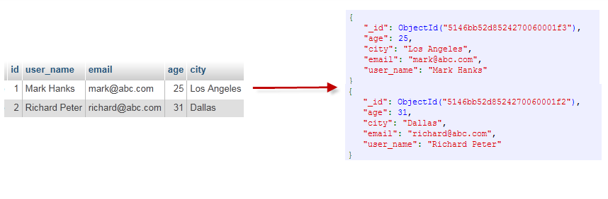

- [3 MongoDB 概念解析](#3-mongodb-概念解析)
  - [3.1 完整术语列表](#31-完整术语列表)

## 3 MongoDB 概念解析

| **SQL 术语/概念** | **MongoDB 术语/概念** | **解释/说明**                             |
| :---------------- | :-------------------- | :---------------------------------------- |
| database          | database              | 数据库                                    |
| table             | collection            | 数据库表/集合                             |
| row               | document              | 数据记录行/文档                           |
| column            | field                 | 数据字段/域                               |
| index             | index                 | 索引                                      |
| table joins       |                       | 表连接，MongoDB 不支持                    |
| primary key       | primary key           | 主键，MongoDB 自动将 `_id` 字段设置为主键 |

### 3.1 完整术语列表

- **文档（Document）**：MongoDB 的基本数据单元，通常是一个 JSON-like 的结构，可以包含多种数据类型。

- **集合（Collection）**：类似于关系型数据库中的表，集合是一组文档的容器。在 MongoDB 中，一个集合中的文档不需要有一个固定的模式。

- **数据库（Database）**：包含一个或多个集合的 MongoDB 实例。

- **BSON**：Binary JSON 的缩写，是 MongoDB 用来存储和传输文档的二进制形式的 JSON。

- **索引（Index）**：用于优化查询性能的数据结构，可以基于集合中的一个或多个字段创建索引。

- **分片（Sharding）**：一种分布数据到多个服务器（称为分片）的方法，用于处理大数据集和高吞吐量应用。

- **副本集（Replica Set）**：一组维护相同数据集的 MongoDB 服务器，提供数据的冗余备份和高可用性。

- **主节点（Primary）**：副本集中负责处理所有写入操作的服务器。

- **从节点（Secondary）**：副本集中的服务器，用于读取数据和在主节点故障时接管为主节点。

- **MongoDB Shell**：MongoDB 提供的命令行界面，用于与 MongoDB 实例交互。

- **聚合框架（Aggregation Framework）**：用于执行复杂的数据处理和聚合操作的一系列操作。

- **Map-Reduce**：一种编程模型，用于处理大量数据集的并行计算。

- **GridFS**：用于存储和检索大于 BSON 文档大小限制的文件的规范。

- **ObjectId**：MongoDB 为每个文档自动生成的唯一标识符。

- **CRUD 操作**：创建（Create）、读取（Read）、更新（Update）、删除（Delete）操作。

- **事务（Transactions）**：从 MongoDB 4.0 开始支持，允许一组操作作为一个原子单元执行。

- **操作符（Operators）**：用于查询和更新文档的特殊字段。

- **连接（Join）**：MongoDB 允许在查询中使用 `$lookup` 操作符来实现类似 SQL 的连接操作。

- **TTL（Time-To-Live）**：可以为集合中的某些字段设置 TTL，以自动删除旧数据。

- **存储引擎（Storage Engine）**：MongoDB 用于数据存储和管理的底层技术，如 WiredTiger 和 MongoDB 的旧存储引擎 MMAPv1。

- **MongoDB Compass**：MongoDB 的图形界面工具，用于可视化和管理 MongoDB 数据。

- **MongoDB Atlas**：MongoDB 提供的云服务，允许在云中托管 MongoDB 数据库。
