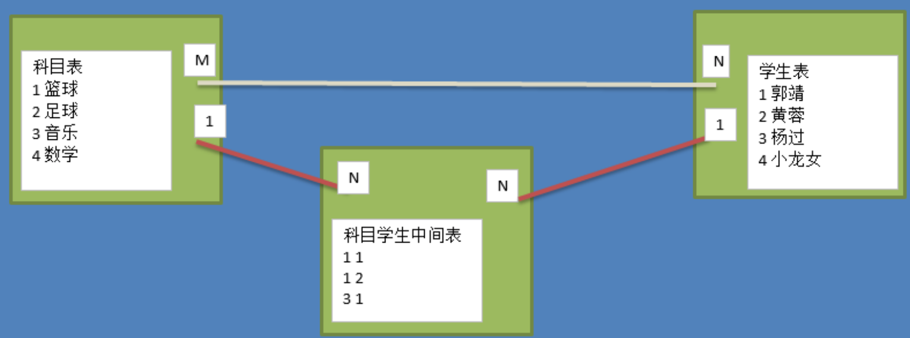

# MySQL学习笔记

- [MySQL学习笔记](#mysql学习笔记)
  - [1 MySQL 数据库的基本使用](#1-mysql-数据库的基本使用)
    - [1.1 SQL 的介绍](#11-sql-的介绍)
    - [1.2 安装 MySQL 数据库](#12-安装-mysql-数据库)
      - [1.2.1 服务端安装](#121-服务端安装)
      - [1.2.2 配置文件详解](#122-配置文件详解)
      - [1.2.3 客户端安装](#123-客户端安装)
    - [1.3 数据类型和约束](#13-数据类型和约束)
      - [1.3.1 数据类型](#131-数据类型)
      - [1.3.2 数据约束](#132-数据约束)
      - [1.3.3 数据类型附录表](#133-数据类型附录表)
    - [1.4 图形化客户端 Navicat](#14-图形化客户端-navicat)
    - [1.5 命令行客户端 MySQL 的使用](#15-命令行客户端-mysql-的使用)
      - [1.5.1 数据库操作 SQL 语句](#151-数据库操作-sql-语句)
      - [1.5.2 表结构操作 SQL 语句](#152-表结构操作-sql-语句)
      - [1.5.3 表数据操作 SQL 语句](#153-表数据操作-sql-语句)
      - [1.5.4 客户端 SQL 语句小结](#154-客户端-sql-语句小结)
      - [1.5.5 无法登录问题解决方案](#155-无法登录问题解决方案)
    - [1.6 as 和 distinct 关键字](#16-as-和-distinct-关键字)
      - [1.6.1 as 关键字](#161-as-关键字)
      - [1.6.2 distinct 关键字](#162-distinct-关键字)
    - [1.7 where 条件查询](#17-where-条件查询)
      - [1.7.1 where 条件查询的介绍](#171-where-条件查询的介绍)
      - [1.7.2 比较运算符查询](#172-比较运算符查询)
      - [1.7.3 逻辑运算符查询](#173-逻辑运算符查询)
      - [1.7.4 模糊查询](#174-模糊查询)
      - [1.7.5 范围查询](#175-范围查询)
      - [1.7.6 空判断查询](#176-空判断查询)
    - [1.8 排序](#18-排序)
    - [1.9 分页查询](#19-分页查询)
      - [1.9.1 分页查询的介绍](#191-分页查询的介绍)
      - [1.9.2 分页查询的语法](#192-分页查询的语法)
      - [1.9.3 分页查询案例](#193-分页查询案例)
  - [2 MySQL 数据库的条件查询](#2-mysql-数据库的条件查询)
    - [2.1 聚合函数](#21-聚合函数)
      - [2.1.1 聚合函数的介绍](#211-聚合函数的介绍)
      - [2.1.2 求总行数](#212-求总行数)
      - [2.1.3 求最大值](#213-求最大值)
      - [2.1.4 求最小值](#214-求最小值)
      - [2.1.5 求和](#215-求和)
      - [2.1.6 求平均值](#216-求平均值)
      - [2.1.7 聚合函数的特点](#217-聚合函数的特点)
    - [2.2 分组查询](#22-分组查询)
      - [2.2.1 分组查询介绍](#221-分组查询介绍)
      - [2.2.2 group by的使用](#222-group-by的使用)
      - [2.2.3 group by + group\_concat()的使用](#223-group-by--group_concat的使用)
      - [2.2.4 group by + 聚合函数的使用](#224-group-by--聚合函数的使用)
      - [2.2.5 group by + having的使用](#225-group-by--having的使用)
      - [2.2.6 group by + with rollup的使用](#226-group-by--with-rollup的使用)
    - [2.3 连接查询-内连接](#23-连接查询-内连接)
      - [2.3.1 连接查询的介绍](#231-连接查询的介绍)
      - [2.3.2 内连接查询](#232-内连接查询)
    - [2.4 连接查询-左连接](#24-连接查询-左连接)
    - [2.5 连接查询-右连接](#25-连接查询-右连接)
    - [2.6 连接查询-自连接](#26-连接查询-自连接)
    - [2.7 子查询](#27-子查询)
      - [2.7.1 子查询的介绍](#271-子查询的介绍)
      - [2.7.2 子查询的使用](#272-子查询的使用)
    - [2.8 数据库设计之三范式](#28-数据库设计之三范式)
      - [2.8.1 数据库设计之三范式的介绍](#281-数据库设计之三范式的介绍)
      - [2.8.2 第一范式的介绍](#282-第一范式的介绍)
      - [2.8.3 第二范式的介绍](#283-第二范式的介绍)
      - [2.8.4 第三范式的介绍](#284-第三范式的介绍)
      - [2.8.5 E-R模型的介绍](#285-e-r模型的介绍)
      - [2.8.6 小结](#286-小结)
    - [2.9 外键 SQL 语句的编写](#29-外键-sql-语句的编写)
      - [2.9.1 外键约束作用](#291-外键约束作用)
      - [2.9.2 对于已经存在的字段添加外键约束](#292-对于已经存在的字段添加外键约束)
      - [2.9.3 在创建数据表时设置外键约束](#293-在创建数据表时设置外键约束)
      - [2.9.4 删除外键约束](#294-删除外键约束)
      - [2.9.5 小结](#295-小结)
    - [2.10 演练-分组和聚合函数的组合使用](#210-演练-分组和聚合函数的组合使用)
      - [2.10.1 数据准备](#2101-数据准备)
      - [2.10.2. SQL语句演练](#2102-sql语句演练)
  - [3 MySQL 数据库的高级使用](#3-mysql-数据库的高级使用)
    - [3.1 将查询结果插入到其它表中](#31-将查询结果插入到其它表中)
    - [3.2 使用连接更新表中某个字段数据](#32-使用连接更新表中某个字段数据)
    - [3.3 创建表并给某个字段添加数据](#33-创建表并给某个字段添加数据)
    - [3.4 修改 goods 表结构](#34-修改-goods-表结构)
    - [3.5 PyMySQL 的使用](#35-pymysql-的使用)
      - [3.5.1 小结](#351-小结)
    - [3.6 事务](#36-事务)
      - [3.6.1 事务的介绍](#361-事务的介绍)
      - [3.6.2 事务的四大特性](#362-事务的四大特性)
      - [3.6.3 事务的使用](#363-事务的使用)
      - [3.6.4 小结](#364-小结)
    - [3.7 索引](#37-索引)
      - [3.7.1 索引的介绍](#371-索引的介绍)
      - [3.7.2 索引的使用](#372-索引的使用)
      - [3.7.3 案例-验证索引查询性能](#373-案例-验证索引查询性能)
      - [3.7.4 联合索引](#374-联合索引)
      - [3.7.5 联合索引的最左原则](#375-联合索引的最左原则)
      - [3.7.6 MySQL中索引的优点和缺点和使用原则](#376-mysql中索引的优点和缺点和使用原则)
      - [3.7.7 小结](#377-小结)

## 1 MySQL 数据库的基本使用

### 1.1 SQL 的介绍

*SQL(Structured Query Language)* 是结构化查询语言，是一种用来操作 *RDBMS(Relational Database Management System)* 的数据库的语言。也就是说通过 SQL 可以操作 *oracle, sql server, mysql, sqlite* 等关系型的数据库。

SQL的作用是实现数据库客户端和数据库服务端之间的通信，SQL就是通信的桥梁。

**SQL** 语言主要分为：

- **DQL**：数据查询语言，用于对数据进行查询，如`select`
- **DML**：数据操作语言，对数据进行增加、修改、删除，如`insert, update, delete`
- **TPL**：事务处理语言，对事务进行处理，包括`begin transaction, commit, rollback`
- **DCL**：数据控制语言，进行授权与权限回收，如`grant, revoke`
- **DDL**：数据定义语言，进行数据库、表的管理等，如`create, drop`

SQL语言不区分大小写

### 1.2 安装 MySQL 数据库

#### 1.2.1 服务端安装

***mysql.yml***
```yml
services:
  mysql:
    image: mysql:latest
    container_name: mysql
    ports:
      - "23306:3306"
    environment:
      MYSQL_ROOT_PASSWORD: 1
    volumes:
      - ~/mysql/data:/var/lib/mysql
      - ~/mysql/conf:/etc/mysql/conf.d
      - ~/mysql/logs:/var/log/mysql
```

执行 `docker-compose -f mysql.yml up -d` 启动 MySQL 服务。

#### 1.2.2 配置文件详解

配置文件路径：`/etc/mysql/mysql.conf.d/mysqld.cnf`

```shell
#
# MySQL数据库服务器配置文件。
#
# 您可以将此文件复制到以下位置之一：
# - "/etc/mysql/my.cnf" 以设置全局选项，
# - "~/.my.cnf" 以设置用户特定选项。
# 
# 您可以使用程序支持的所有长选项。
# 使用 --help 运行程序以获取可用选项列表，并使用 --print-defaults 查看它实际上会理解和使用哪些选项。
#
# 有关说明，请参阅：
# http://dev.mysql.com/doc/mysql/en/server-system-variables.html
 
# 这将传递给所有mysql客户端
# 据报道，密码应该用引号或单引号括起来，特别是如果它们包含 "#" 字符...
# 在更改socket位置时，请记得编辑 /etc/mysql/debian.cnf。
 
# 这里是一些特定程序的条目
# 以下值假定您至少有 32M RAM

# mysqld_safe配置
[mysqld_safe]
socket          = /var/run/mysqld/mysqld.sock  # MySQL安全启动器的通信socket路径
nice            = 0  # 优先级设置

# mysqld基本设置
[mysqld]
user            = mysql  # MySQL服务运行的用户
pid-file        = /var/run/mysqld/mysqld.pid  # MySQL进程标识文件位置
socket          = /var/run/mysqld/mysqld.sock  # MySQL通信socket路径
port            = 3306  # MySQL监听的端口号
basedir         = /usr  # MySQL的安装基础目录
datadir         = /var/lib/mysql  # MySQL的数据存储目录
tmpdir          = /tmp  # MySQL的临时文件存储目录
lc-messages-dir = /usr/share/mysql  # MySQL的语言文件目录
skip-external-locking  # 跳过外部锁定，改善性能
log_bin        =  mylnx12_bin  # MySQL二进制日志文件的名称
server_id      = 0  # MySQL服务器的ID
character-set-server=utf8mb4  # 设置字符集
collation-server=utf8mb4_general_ci  # 设置排序规则
 
#
# 默认情况下，不再使用skip-networking，而是仅在localhost上监听，这更兼容且不会降低安全性。
bind-address            = 127.0.0.1
#
# * Fine Tuning
#
key_buffer_size         = 16M
max_allowed_packet      = 100M
thread_stack            = 192K
thread_cache_size       = 8
# This replaces the startup script and checks MyISAM tables if needed
# the first time they are touched
myisam-recover-options  = BACKUP
#max_connections        = 100
#table_cache            = 64
#thread_concurrency     = 10
#
# * Query Cache Configuration
#
query_cache_limit       = 1M
query_cache_size        = 16M
#
# * 日志和复制
#
# 这两个位置由cronjob定期轮换。
# 请注意，这种日志类型对性能有很大影响。
# 从5.1版本开始，您可以在运行时启用日志！
#general_log_file        = /var/log/mysql/mysql.log
#general_log             = 1
#
# 错误日志 - 应该只有很少的条目。
#
log_error = /var/log/mysql/error.log
#
# 这里可以查看执行时间特别长的查询
#log_slow_queries       = /var/log/mysql/mysql-slow.log
#long_query_time = 2
#log-queries-not-using-indexes
#
# 以下内容可用于轻松重播备份日志或用于复制。
# 注意：如果您正在设置复制从服务器，请查看README.Debian以了解其他可能需要更改的设置。
#server-id              = 1
#log_bin                        = /var/log/mysql/mysql-bin.log
expire_logs_days        = 10
max_binlog_size   = 100M
#binlog_do_db           = include_database_name
#binlog_ignore_db       = include_database_name
#
# * InnoDB
#
# 默认情况下，InnoDB已启用，在/var/lib/mysql/中具有10MB的数据文件。
# 阅读手册了解更多InnoDB相关选项。有很多！
#
# * 安全功能
#
# 如果要使用chroot，请阅读手册！
# chroot = /var/lib/mysql/
#
# 生成SSL证书时，建议使用OpenSSL GUI "tinyca"。
#
# ssl-ca=/etc/mysql/cacert.pem
# ssl-cert=/etc/mysql/server-cert.pem
#: ssl-key=/etc/mysql/server-key.pem
```

#### 1.2.3 客户端安装

- 图形化工具（Navicat）

- 命令行工具：`sudo apt install mysql-client`

### 1.3 数据类型和约束

数据类型和约束保证了表中数据的准确性和完整性

#### 1.3.1 数据类型

**常用数据类型:**

- 整数：`int, bit`
- 小数：`decimal`
- 字符串：`varchar, char`
- 日期时间: `date, time, datetime`
- 枚举类型(enum)

**数据类型说明:**

- `decimal` 表示浮点数，如 `decimal(5, 2)` 表示共存 5 位数，小数占 2 位.
- `char` 表示固定长度的字符串，如`char(3)`，如果填充`'ab'`时会补一个空格为`'ab '`，3 表示字符数
- `varchar` 表示可变长度的字符串，如`varchar(3)`，填充`'ab'`时就会存储`'ab'`，3 表示字符数
- 对于图片、音频、视频等文件，不存储在数据库中，而是上传到某个服务器上，然后在表中存储这个文件的保存路径.
- 字符串 `text` 表示存储大文本，当字符大于 4000 时推荐使用, 比如技术博客.

#### 1.3.2 数据约束

约束是指数据在数据类型限定的基础上额外增加的要求

**常见的约束：**

- 主键 `primary key`: 物理上存储的顺序. MySQL 建议所有表的主键字段都叫 `id`, 类型为 `int unsigned`
- 非空 `not null`: 此字段不允许填写空值
- 唯一 `unique`: 此字段的值不允许重复
- 默认 `default`: 当不填写字段对应的值会使用默认值
- 外键 `foreign key`: 对关系字段进行约束, 当为关系字段填写值时, 会到关联的表中查询此值是否存在, 如果存在则填写成功, 如果不存在则填写失败并抛出异常

#### 1.3.3 数据类型附录表

1. 整数类型

| 类型 | 字节大小 | 有符号范围(Signed) | 无符号范围(Unsigned) |
| :---- | :-------- | :------------------- | :--------------------- |
| TINYINT | 1 | -128 ~ 127 | 0 ~ 255 |
| SMALLINT | 2 | -32768 ~ 32767 | 0 ~ 65535 |
| MEDIUMINT | 3 | -8388608 ~ 8388607 | 0 ~ 16777215 |
| INT/INTEGER | 4 | -2147483648 ~2147483647 | 0 ~ 4294967295 |
| BIGINT | 8 | -9223372036854775808 ~ 9223372036854775807 | 0 ~ 18446744073709551615 |

2. 字符串

| 类型 | 说明 | 使用场景 |
| :---- | :---- | :------- |
| CHAR | 固定长度，小型数据 | 身份证号、手机号、电话、密码 |
| VARCHAR | 可变长度，小型数据 | 姓名、地址、品牌、型号 |
| TEXT | 可变长度，字符个数大于 4000 | 存储小型文章或者新闻 |
| LONGTEXT | 可变长度， 极大型文本数据 | 存储极大型文本数据 |

3. 时间类型

| 类型 | 字节大小 | 示例 |
| :---- | :-------- | :--- |
| DATE | 4 | '2020-01-01' |
| TIME | 3 | '12:29:59' |
| DATETIME | 8 | '2020-01-01 12:29:59' |
| YEAR | 1 | '2017' |
| TIMESTAMP | 4 | '1970-01-01 00:00:01' UTC ~ '2038-01-01 00:00:01' UTC |


### 1.4 图形化客户端 Navicat

1. 创建数据库


- 字符集：就是编码格式，一般选择 `utf8mb4`，支持中文、表情等
- 排序规则：一般选择 `utf8mb4_general_ci`，不区分大小写，区分大小写的话选择 `utf8mb4_bin`

2. 创建数据表


3. 编辑数据表


### 1.5 命令行客户端 MySQL 的使用

1. 登录数据库

```shell
mysql -uroot -P 3309 -h192.168.0.1 -p123456

# -u: 用户名
# -P: 端口号
# -h: 主机地址
# -p: 密码, 如果不填写，回车之后会提示输入密码
```

2. 查看登录效果

```shell
select now(); # 查看当前时间
```

#### 1.5.1 数据库操作 SQL 语句

> `show` 不用加 `()`，`select` 需要加 `()`

1. 查看所有数据库

```shell
show databases;
```

2. 创建数据库

```shell
create database <database_name> charset=utf8mb4;
```

3. 使用数据库

```shell
use <database_name>;
```

4. 查看当前使用的数据库

```shell
select database();
```

5. 删除数据库

```shell
drop database <database_name>;
```

#### 1.5.2 表结构操作 SQL 语句

1. 查看当前数据库中所有表

```shell
show tables;
```

2. 创建表

```shell
create table students (
    id int unsigned primary key auto_increment not null,
    name varchar(20) not null,
    age tinyint unsigned default 0,
    height decimal(5, 2),
    gender enum('男', '女', '人妖', '保密')
);
```

**说明：**

```shell
create table <table_name> (
    字段名称 数据类型 (可选)约束条件,
    colum1 datatype contrai,
    ...
);
```

3. 查看表结构

```shell
desc 表名;
```

4. 修改表-添加字段

```shell
alter table 表名 add 列名 类型 约束;
# 例：
alter table students add birthday datetime;
```

5. 修改表-修改字段类型

```shell
alter table 表名 modify 列名 类型 约束;
# 例：
alter table students modify birthday date not null;
```

- `modify`: 只能修改字段类型或者约束，不能修改字段名

6. 修改表-修改字段名和字段类型

```shell
alter table 表明 change 原名 新名 类型 约束;
# 例：
alter table students change birthday birth datetime not null;
```

- `change`: 既能对字段重命名又能修改字段类型还能修改约束

7. 修改表-删除字段

```shell
alter table 表名 drop 列名;
# 例：
alter table students drop birth;
```

8. 查看创表SQL语句

```shell
show create table 表名;
# 例：
show create table students;
```

9. 查看创库SQL语句

```shell
show create database 数据库名;
# 例：
show create database test;
```

10. 删除表

```shell
drop table 表名;
# 例：
drop table students;
```

#### 1.5.3 表数据操作 SQL 语句

1. 查询数据

```shell
# 1. 查询所有列
select * from 表名;
例：
select * from students;
# 2. 查询指定列
select 列1, 列2, ... from 表名;
例：
select id, name from students;
```

2. 添加数据

```shell
# 1. 全列插入：值的顺序与表结构字段的顺序完全一一对应
insert into 表名 values (...)
例:
insert into students values(0, 'xx', default, default, '男');

# 2. 部分列插入：值的顺序与给出的列顺序对应
insert into 表名 (列1,...) values(值1,...)
例:
insert into students(name, age) values('王二小', 15);

# 3. 全列多行插入
insert into 表名 values(...),(...)...;
例:
insert into students values(0, '张飞', 55, 1.75, '男'),(0, '关羽', 58, 1.85, '男');

# 4. 部分列多行插入
insert into 表名(列1,...) values(值1,...),(值1,...)...;
例：
insert into students(name, height) values('刘备', 1.75),('曹操', 1.6);
```

说明：
- 主键列是自动增长，但是在全列插入时需要占位，通常使用空值(`0` 或者 `null` 或者 `default`)
- 在全列插入时，如果字段列有默认值可以使用 `default` 来占位，插入后的数据就是之前设置的默认值

3. 修改数据

```shell
update 表名 set 列1=值1, 列2=值2 ... where 条件
例：
update students set age = 18, gender = '女' where id = 6;
```

4. 删除数据

```shell
delete from 表名 where 条件
例：
delete from students where id=5;
```

问题：

上面的操作称之为物理删除，一旦删除就不容易恢复，我们可以使用逻辑删除的方式来解决这个问题。

```shell
# 添加删除表示字段，0 表示未删除 1 表示删除
alter table students add isdelete bit default 0;
# 逻辑删除数据
update students set isdelete = 1 where id = 8;
```

> 逻辑删除，本质就是修改操作

#### 1.5.4 客户端 SQL 语句小结

- 登录数据库: `mysql -uroot -p`

- 退出数据库: `quit` 或者 `exit` 或者 `ctr + d`

- 创建数据库: `create database 数据库名 charset=utf8;`;

- 使用数据库: `use 数据库名;`

- 删除数据库: `drop database 数据库名;`

- 创建表: `create table 表名(字段名 字段类型 约束, ...);`

- 修改表-添加字段: `alter table 表名 add 字段名 字段类型 约束`

- 修改表-修改字段类型: `alter table 表名 modify 字段名 字段类型 约束`

- 修改表-修改字段名和字段类型: `alter table 表名 change 原字段名 新字段名 字段类型 约束`

- 修改表-删除字段: `alter table 表名 drop 字段名;`

- 删除表: `drop table 表名;`

- 查询数据: `select * from 表名;` 或者 `select 列1, 列2, ... from 表名;`

- 插入数据: `insert into 表名 values (...)` 或者 `insert into 表名 (列1,...) values(值1,...)`

- 修改数据: `update 表名 set 列1=值1,列2=值2... where 条件`

- 删除数据: `delete from 表名 where 条件`

#### 1.5.5 无法登录问题解决方案

首先确保配置文件中的 `bind-address` 不是 `127.0.0.1`

用户都在 `mysql` 数据库中的表 `user` 中，以 `root` 用户为例

```shell
# 1. 查看 数据库mysq的 user表中的 host字段, 其中用户为'root'
SELECT host FROM mysql.user WHERE User = 'root';

# 也可以先选择数据库，之后通过表名查询
select * from user \G;
# \G 是将查询结果以纵向显示

# 2. 输出如下：
+-----------+
| host      |
+-----------+
| %         |
| localhost |
+-----------+

# 3. 如果没有 % 的话肯定登录不上，需要添加 % 的 host
update mysql.user set host = '%' where user = 'root';

# 4. 刷新权限
flush privileges;

# 5. 重新登录或者重启数据库
service mysql restart
```

### 1.6 as 和 distinct 关键字

#### 1.6.1 as 关键字

在使用SQL语句显示结果的时候，往往在屏幕显示的字段名并不具备良好的可读性，此时可以使用 `as` 给字段起一个别名。

**`as` 关键字可以省略**

1. 使用 `as` 给字段起别名

```shell
select id as 序号, name as 名字, gender as 性别 from students;
```

2. 可以通过 `as` 给表起别名

```shell
# 如果是单表查询，可以省略表名
select id, name, gender from students;

# 表名, 字段名
select students.id, students.name, students.gender from students;

# 可以通过 as 给表起别名
select s.id, s.name, s.gender students as s;
```

#### 1.6.2 distinct 关键字

`distinct` 可以去除重复数据行

```shell
select distinct 列1, ... from 表名;

例： 查询班级中学生的性别
select name, gender from students;

-- 看到了很多重复数据 想要对其中重复数据行进行去重操作可以使用 distinct
select distinct name, gender from students;
```

### 1.7 where 条件查询

#### 1.7.1 where 条件查询的介绍

使用 `where` 条件查询可以对表中的数据进行筛选，条件成立的记录会出现在结果集中。

`where`语句支持的运算符:

1. 比较运算符
2. 逻辑运算符
3. 模糊查询
4. 范围查询
5. 空判断

`where`条件查询语法格式如下:

```shell
select * from 表名 where 条件;
例：
select * from students where id = 1;
```

#### 1.7.2 比较运算符查询

1. 等于: `=`
2. 大于: `>`
3. 大于等于: `>=`
4. 小于: `<`
5. 小于等于: `<=`
6. 不等于: `!=` 或 `<>`

```shell
# 1. 查询编号大于3的学生
select * from students where id > 3;

# 2. 查询编号不大于4的学生
select * from students where id <= 4;

# 3. 查询姓名不是“黄蓉”的学生
select * from students where name != '黄蓉';

# 4. 查询没被删除的学生:
select * from students where is_delete=0;
```

#### 1.7.3 逻辑运算符查询

1. `and`
2. `or`
3. `not`

```shell
# 1. 查询编号大于 3 的女同学
select * from students where id > 3 and gender=0;

# 2. 查询编号小于 4 或没被删除的学生
select * from students where id < 4 or is_delete=0;

# 3. 查询年龄不在 10 岁到 15 岁之间的学生
select * from students where not (age >= 10 and age <= 15);
```

#### 1.7.4 模糊查询

1. `like` 是模糊查询关键字
2. `%` 表示任意多个任意字符
3. `_` 表示一个任意字符

```shell
# 1. 查询姓黄的学生
select * from students where name like '黄%';

# 2. 查询姓黄并且“名”是一个字的学生:
select * from students where name like '黄_';

# 3. 查询姓黄或叫靖的学生:
select * from students where name like '黄%' or name like '%靖';
```

#### 1.7.5 范围查询

1. `between .. and ..` 表示在一个连续的范围内查询
2. `in` 表示在一个非连续的范围内查询

```shell
# 1. 查询编号为 3 至 8 的学生
select * from students where id between 3 and 8;

# 2. 查询编号不是 3 至 8 的男生
select * from students where (not id between 3 and 8) and gender='男';

# 3. 查找编号是 3, 5, 7 的学生
select * from students where id in (3, 5, 7);

# 4. 查找编号不是 3, 5, 7 的学生
select * from students where id not in (3, 5, 7);
```

#### 1.7.6 空判断查询

1. 判断为空使用: `is null`
2. 判断非空使用: `is not null`

```shell
# 查询没有填写身高的学生:
select * from students where height is null;
```

**注意:**

1. 不能使用 `where height = null` 判断为空
2. 不能使用 `where height != null` 判断非空
3. `null` 不等于 `''` 空字符串

### 1.8 排序

排序查询语法：

```shell
# [] 内容表示可选
select * from 表名 order by 列1 asc|desc [, 列2 asc|desc, ...]
```

**语法说明:**

1. 先按照 列 1 进行排序，如果 列 1 的值相同时，则按照 列 2 排序，以此类推
2. `asc`从小到大排列，即升序
3. `desc`从大到小排序，即降序
4. 默认按照列值从小到大排列（即`asc`关键字）

```shell
# 1. 查询未删除男生信息，按学号降序:
select * from students where gender=1 and is_delete=0 order by id desc;

# 2. 显示所有的学生信息，先按照年龄从大-->小排序，当年龄相同时 按照身高从高-->矮排序:
select * from students order by age desc, height desc;
```

### 1.9 分页查询

#### 1.9.1 分页查询的介绍

当我们在京东购物，浏览商品列表的时候，由于数据特别多，一页显示不完，一页一页的进行显示，这就是分页查询

#### 1.9.2 分页查询的语法

```shell
select * from 表名 limit start, count
```

1. `limit`是分页查询关键字
2. `start`表示开始行索引，默认是 0
3. `count`表示查询条数

```shell
# 查询前3行男生信息:
select * from students where gender=1 limit 0, 3;

# 简写
select * from students where gender=1 limit 3;
```
#### 1.9.3 分页查询案例

已知每页显示 `m` 条数据，求第 `n` 页显示的数据

提示: 关键是求每页的开始行索引

查询学生表，获取第 n 页数据的 SQL 语句:

```shell
# 注意语句中不允许直接出现数学表达式
select * from students limit (n - 1) * m,m
```

## 2 MySQL 数据库的条件查询

### 2.1 聚合函数

#### 2.1.1 聚合函数的介绍

聚合函数又叫组函数，通常是对表中的数据进行统计和计算，一般结合分组(`group by`)来使用，用于统计和计算分组数据。

常用的聚合函数:

1. `count(col)`: 表示求指定列的总行数
2. `max(col)`: 表示求指定列的最大值
3. `min(col)`: 表示求指定列的最小值
4. `sum(col)`: 表示求指定列的和
5. `avg(col)`: 表示求指定列的平均值

#### 2.1.2 求总行数

```shell
# 返回非NULL数据的总行数.
select count(height) from students;

# 返回总行数，包含null值记录;
select count(*) from students;
```

#### 2.1.3 求最大值

```shell
# 查询女生的编号最大值
select max(id) from students where gender = 2;
```

#### 2.1.4 求最小值

```shell
# 查询未删除的学生最小编号
select min(id) from students where is_delete = 0;
```

#### 2.1.5 求和

```shell
# 查询男生的总身高
select sum(height) from students where gender = 1;

# 平均身高
select sum(height) / count(*) from students where gender = 1;
```

#### 2.1.6 求平均值

```shell
# 求男生的平均身高, 聚合函数不统计null值，平均身高有误
select avg(height) from students where gender = 1;

# 求男生的平均身高, 包含身高是null的
select avg(ifnull(height,0)) from students where gender = 1;
```

`ifnull` 函数: 表示判断指定字段的值是否为`null`，如果为空使用自己提供的值。

#### 2.1.7 聚合函数的特点

聚合函数默认忽略字段为 `null` 的记录 要想列值为 `null` 的记录也参与计算，必须使用 `ifnull` 函数对 `null` 值做替换。

### 2.2 分组查询

#### 2.2.1 分组查询介绍

分组查询就是将查询结果按照指定字段进行分组，字段中数据相等的分为一组。

分组查询基本的语法格式如下：

`GROUP BY 列名 [HAVING 条件表达式] [WITH ROLLUP]`

- 列名: 是指按照指定字段的值进行分组。
- `HAVING 条件表达式`: 用来过滤分组后的数据。
- `WITH ROLLUP`：在所有记录的最后加上一条记录，显示`select`查询时聚合函数的统计和计算结果

#### 2.2.2 group by的使用

`group by`可用于单个字段分组，也可用于多个字段分组

```shell
# 根据gender字段来分组
select gender from students group by gender;

# 根据name和gender字段进行分组
select name, gender from students group by name, gender;
```

#### 2.2.3 group by + group_concat()的使用

`group_concat(字段名)`: 统计每个分组指定字段的信息集合，每个信息之间使用逗号进行分割

```shell
# 根据gender字段进行分组， 查询gender字段和分组的name字段信息
select gender, group_concat(name) from students group by gender;

# 输出如下
+--------+----------------------------------------------------------------+
| gender | group_concat(name)                                             |
+--------+----------------------------------------------------------------+
| NULL   | lisi                                                           |
| nan    | zhangsan,caocao,guojing,huanglaoxie,yangguo,wangtiedan,liergou |
| nv     | ouyangfeng,huangrong                                           |
+--------+----------------------------------------------------------------+
3 rows in set (0.00 sec)
```

#### 2.2.4 group by + 聚合函数的使用

```shell
# 统计不同性别的人的平均年龄
select gender, avg(age) from students group by gender;

# 统计不同性别的人的个数
select gender, count(*) from students group by gender;
```

#### 2.2.5 group by + having的使用

`having`作用和`where`类似都是过滤数据的，但`having`是过滤分组数据的，只能用于`group by`

```shell
# 根据gender字段进行分组，统计分组条数大于2的
select gender, count(*) from students group by gender having count(*) > 2;
```

#### 2.2.6 group by + with rollup的使用

`with rollup`的作用是：在最后记录后面新增一行，显示`select`查询时聚合函数的统计和计算结果

```shell
# 根据gender字段进行分组，汇总总人数
select gender, count(*) from students group by gender with rollup;

# 根据gender字段进行分组，汇总所有人的年龄
select gender, group_concat(age) from students group by gender with rollup;
```

### 2.3 连接查询-内连接

#### 2.3.1 连接查询的介绍

连接查询可以实现多个表的查询，当查询的字段数据来自不同的表就可以使用连接查询来完成。

连接查询可以分为:

1. 内连接查询
2. 左连接查询
3. 右连接查询
4. 自连接查询

#### 2.3.2 内连接查询

查询两个表中符合条件的共有记录

内连接查询效果图:


内连接查询语法格式:

```shell
select 字段 from 表1 inner join 表2 on 表1.字段1 = 表2.字段2
```

- `inner join` 就是内连接查询关键字
- `on` 就是连接查询条件

```shell
# 使用内连接查询学生表与班级表:
select * from students as s inner join classes as c on s.cls_id = c.id;
```

### 2.4 连接查询-左连接

以左表为主根据条件查询右表数据，如果根据条件查询右表数据不存在使用`null`值填充

左连接查询效果图:


左连接查询语法格式:

```shell
select 字段 from 表1 left join 表2 on 表1.字段1 = 表2.字段2
```

- `left join` 就是左连接查询关键字
- `on` 就是连接查询条件
- 表1 是左表
- 表2 是右表

```shell
# 使用左连接查询学生表与班级表:
select * from students as s left join classes as c on s.cls_id = c.id;
```

### 2.5 连接查询-右连接

以右表为主根据条件查询左表数据，如果根据条件查询左表数据不存在使用`null`值填充

右连接查询效果图:


右连接查询语法格式:

```shell
select 字段 from 表1 right join 表2 on 表1.字段1 = 表2.字段2
```

- `right join` 就是右连接查询关键字
- `on` 就是连接查询条件
- 表1 是左表
- 表2 是右表

```shell
#使用右连接查询学生表与班级表:
select * from students as s right join classes as c on s.cls_id = c.id;
```

### 2.6 连接查询-自连接

左表和右表是同一个表，根据连接查询条件查询两个表中的数据。

区域表效果图


**查询省的名称为“山西省”的所有城市**


```shell
# 创建areas表:
create table areas(
    id varchar(30) not null primary key, 
    title varchar(30), 
    pid varchar(30)
);

# 执行sql文件给areas表导入数据:
source areas.sql;

# source 表示执行的sql文件

# 自连接查询的用法:
select c.id, c.title, c.pid, p.title from areas as c inner join areas as p on c.pid = p.id where p.title = '山西省';
```

> 自连接查询必须对表起别名

### 2.7 子查询

#### 2.7.1 子查询的介绍

在一个 `select` 语句中, 嵌入了另外一个 `select` 语句, 那么被嵌入的 `select` 语句称之为子查询语句, 外部那个 `select` 语句则称为主查询

主查询和子查询的关系:

1. 子查询是嵌入到主查询中
2. 子查询是辅助主查询的, 要么充当条件, 要么充当数据源
3. 子查询是可以独立存在的语句, 是一条完整的 `select` 语句

#### 2.7.2 子查询的使用

```shell
例1. 查询大于平均年龄的学生:
select * from students where age > (select avg(age) from students);

例2. 查询学生在班的所有班级名字:
select name from classes where id in (select c_id from students where c_id is not null);

例3. 查找年龄最大, 身高最高的学生:
select * from students where (age, height) =  (select max(age), max(height) from students);
```

### 2.8 数据库设计之三范式

#### 2.8.1 数据库设计之三范式的介绍

范式: 对设计数据库提出的一些规范，目前有迹可寻的共有8种范式，一般遵守3范式即可。

- 第一范式（1NF）: 强调的是列的原子性，即列不能够再分成其他几列。
- 第二范式（2NF）: 满足 1NF，另外包含两部分内容，一是表必须有一个主键；二是非主键字段 必须完全依赖于主键，而不能只依赖于主键的一部分。
- 第三范式（3NF）: 满足 2NF，另外非主键列必须直接依赖于主键，不能存在传递依赖。即不能存在：非主键列 A 依赖于非主键列 B，非主键列 B 依赖于主键的情况。

#### 2.8.2 第一范式的介绍


这种表结构设计就没有达到 `1NF`，要符合 `1NF` 我们只需把列拆分，即：把 `contact` 字段拆分成 `name, tel, addr` 等字段。

#### 2.8.3 第二范式的介绍


- 这种表结构设计就没有达到 `2NF`，因为 `Discount(折扣), Quantity(数量)`完全依赖于主键(`OrderID`)，而 `UnitPrice单价，ProductName`产品名称 只依赖于 `ProductID`, 所以 `OrderDetail` 表不符合 2NF。

- 我们可以把【`OrderDetail`】表拆分为【`OrderDetail`】`(OrderID，ProductID，Discount，Quantity)`和【`Product`】`(ProductID，UnitPrice，ProductName)`这样就符合第二范式了。

#### 2.8.4 第三范式的介绍


- 这种表结构设计就没有达到 `3NF`，因为 `OrderDate, CustomerID, CustomerName, CustomerAddr, CustomerCity` 等非主键列都完全依赖于主键（`OrderID`），所以符合 `2NF`。不过问题是 `CustomerName, CustomerAddr, CustomerCity` 直接依赖的是 `CustomerID(非主键列)`，而不是直接依赖于主键，它是通过传递才依赖于主键，所以不符合 `3NF`。

- 我们可以把【`Order`】表拆分为【`Order`】`(OrderID，OrderDate，CustomerID)`和【`Customer`】`(CustomerID，CustomerName，CustomerAddr，CustomerCity)`从而达到 `3NF`。

#### 2.8.5 E-R模型的介绍

E-R模型即实体-关系模型，E-R模型就是描述数据库存储数据的结构模型。

E-R模型的使用场景:

1. 对于大型公司开发项目，我们需要根据产品经理的设计，我们先使用建模工具, 如: ***power designer, db desinger*** 等这些软件来画出实体-关系模型(E-R模型)
2. 然后根据三范式设计数据库表结构

E-R模型的效果图:


说明:

- 实体: 用矩形表示，并标注实体名称
- 属性: 用椭圆表示，并标注属性名称，
- 关系: 用菱形表示，并标注关系名称
  - 一对一
  - 一对多
  - 多对多
- 一对一的关系:


- 关系也是一种数据，需要通过一个字段存储在表中
- 1对1关系，在表A或表B中创建一个字段，存储另一个表的主键值

一对多的关系:


- 1对多关系，在多的一方表(学生表)中创建一个字段，存储班级表的主键值

多对多的关系:



- 多对多关系，新建一张表 C，这个表只有两个字段，一个用于存储A的主键值，一个用于存储 B 的主键值

#### 2.8.6 小结

- 范式就是设计数据库的一些通用规范。
  - 1NF强调字段是最小单元，不可再分
  - 2NF强调在1NF基础上必须要有主键和非主键字段必须完全依赖于主键，也就是说 不能部分依赖
  - 3MF强调在2NF基础上 非主键字段必须直接依赖于主键，也就是说不能传递依赖(间接依赖)。
- E-R模型由 实体、属性、实体之间的关系构成，主要用来描述数据库中表结构。
- 开发流程是先画出E-R模型，然后根据三范式设计数据库中的表结构

### 2.9 外键 SQL 语句的编写

#### 2.9.1 外键约束作用

外键约束:对外键字段的值进行更新和插入时会和引用表中字段的数据进行验证，数据如果不合法则更新和插入会失败，保证数据的有效性

#### 2.9.2 对于已经存在的字段添加外键约束

```shell
# 为cls_id字段添加外键约束
alter table students add foreign key(cls_id) references classes(id);
```

#### 2.9.3 在创建数据表时设置外键约束

```shell
# 创建学校表
create table school(
    id int not null primary key auto_increment, 
    name varchar(10)
);

# 创建老师表
create table teacher(
    id int not null primary key auto_increment, 
    name varchar(10), 
    s_id int not null, 
    foreign key(s_id) references school(id)
);
```

#### 2.9.4 删除外键约束

```shell
# 需要先获取外键约束名称,该名称系统会自动生成,可以通过查看表创建语句来获取名称
show create table teacher;

# 获取名称之后就可以根据名称来删除外键约束
alter table teacher drop foreign key 外键名;
```

#### 2.9.5 小结

- 添加外键约束: `alter table 从表 add foreign key(外键字段) references 主表(主键字段);`
- 删除外键约束: `alter table 表名 drop foreign key 外键名;`

### 2.10 演练-分组和聚合函数的组合使用

#### 2.10.1 数据准备

```shell
# 创建 "京东" 数据库
create database jing_dong charset=utf8;

# 使用 "京东" 数据库
use jing_dong;

# 创建一个商品goods数据表
create table goods(
    id int unsigned primary key auto_increment not null,
    name varchar(150) not null,
    cate_name varchar(40) not null,
    brand_name varchar(40) not null,
    price decimal(10,3) not null default 0,
    is_show bit not null default 1,
    is_saleoff bit not null default 0
);

# 向goods表中插入数据
insert into goods values(0, 'r510vc 15.6英寸笔记本', '笔记本', '华硕', '3399', default, default); 
insert into goods values(0, 'y400n 14.0英寸笔记本电脑', '笔记本', '联想', '4999', default, default);
insert into goods values(0, 'g150th 15.6英寸游戏本', '游戏本', '雷神', '8499', default, default); 
insert into goods values(0, 'x550cc 15.6英寸笔记本', '笔记本', '华硕', '2799', default, default); 
insert into goods values(0, 'x240 超极本', '超级本', '联想', '4880', default, default); 
insert into goods values(0, 'u330p 13.3英寸超极本', '超级本', '联想', '4299', default, default); 
insert into goods values(0, 'svp13226scb 触控超极本', '超级本', '索尼', '7999', default, default); 
insert into goods values(0, 'ipad mini 7.9英寸平板电脑', '平板电脑', '苹果', '1998', default, default);
insert into goods values(0, 'ipad air 9.7英寸平板电脑', '平板电脑', '苹果', '3388', default, default); 
insert into goods values(0, 'ipad mini 配备 retina 显示屏', '平板电脑', '苹果', '2788', default, default); 
insert into goods values(0, 'ideacentre c340 20英寸一体电脑 ', '台式机', '联想', '3499', default, default); 
insert into goods values(0, 'vostro 3800-r1206 台式电脑', '台式机', '戴尔', '2899', default, default); 
insert into goods values(0, 'imac me086ch/a 21.5英寸一体电脑', '台式机', '苹果', '9188', default, default); 
insert into goods values(0, 'at7-7414lp 台式电脑 linux ）', '台式机', '宏碁', '3699', default, default); 
insert into goods values(0, 'z220sff f4f06pa工作站', '服务器/工作站', '惠普', '4288', default, default); 
insert into goods values(0, 'poweredge ii服务器', '服务器/工作站', '戴尔', '5388', default, default); 
insert into goods values(0, 'mac pro专业级台式电脑', '服务器/工作站', '苹果', '28888', default, default); 
insert into goods values(0, 'hmz-t3w 头戴显示设备', '笔记本配件', '索尼', '6999', default, default); 
insert into goods values(0, '商务双肩背包', '笔记本配件', '索尼', '99', default, default); 
insert into goods values(0, 'x3250 m4机架式服务器', '服务器/工作站', 'ibm', '6888', default, default); 
insert into goods values(0, '商务双肩背包', '笔记本配件', '索尼', '99', default, default);
```

表结构说明:

- `id` 表示主键 自增
- `name` 表示商品名称
- `cate_name` 表示分类名称
- `brand_name` 表示品牌名称
- `price` 表示价格
- `is_show` 表示是否显示
- `is_saleoff` 表示是否售完

#### 2.10.2. SQL语句演练

```shell
# 查询类型cate_name为 '超极本' 的商品名称、价格
select name, price from goods where cate_name = '超级本';

# 显示商品的分类
select cate_name from goods group by cate_name;

# 求所有电脑产品的平均价格, 并且保留两位小数
select round(avg(price), 2) as avg_price from goods;

# 显示每种商品的平均价格
select cate_name, avg(price) from goods group by cate_name;

# 查询每种类型的商品中 最贵、最便宜、平均价、数量
select cate_name, max(price), min(price), avg(price), count(*) 
from goods group by cate_name;

# 查询所有价格大于平均价格的商品，并且按价格降序排序
select id, name, price from goods 
where price > (select round(avg(price), 2) as avg_price from goods) 
order by price desc;
```

## 3 MySQL 数据库的高级使用

### 3.1 将查询结果插入到其它表中

目前只有一个goods表，如果增加一个商品分类信息，比如：移动设备这个分类信息，只通过 goods 表无法完成商品分类的添加，那么如何实现添加商品分类信息的操作?

答案:

1. 创建一个商品分类表，把 goods 表中的商品分类信息添加到该表中。
2. 将goods表中的分类名称更改成商品分类表中对应的分类id

```shell
# 创建商品分类表
create table good_cates(
    id int not null primary key auto_increment, 
    name varchar(50) not null
);

# 把goods表中的商品分类添加到商品分类表

## 查询goods表中商品的分类信息
select cate_name from goods group by cate_name;

## 将查询结果插入到good_cates表中
insert into good_cates(name) select cate_name from goods group by cate_name;

## 添加移动设备分类信息
insert into good_cates(name) values('移动设备');
```

`insert into .. select ..` 表示: 把查询结果插入到指定表中，也就是表复制。

### 3.2 使用连接更新表中某个字段数据

将goods表中的分类名称更改成商品分类表中对应的分类id

```shell
# 查看goods表中的商品分类名称对应的商品分类id
select * from goods inner join good_cates on goods.cate_name = good_cates.name;

# 把该语句中from 后的语句理解为一张虚表  
update goods g inner join good_cates gc on g.cate_name=gc.name set g.cate_name=gc.id;
```

### 3.3 创建表并给某个字段添加数据

如果想要添加一个品牌，比如：双飞燕这个品牌信息，只通过 goods 表无法完成品牌信息的添加，那么如何实现添加品牌信息的操作?

答案:

1. 创建一个品牌表，把goods表中的品牌信息添加到该表中。
2. 将goods表中的品牌名称更改成品牌表中对应的品牌id

```shell
# 查询品牌信息 
select brand_name from goods group by brand_name;

# 通过create table ...select来创建数据表并且同时插入数据
# 创建商品分类表，注意: 需要对brand_name 用as起别名，否则name字段就没有值
create table good_brands (
id int unsigned primary key auto_increment, 
name varchar(40) not null) select brand_name as name from goods group by brand_name;
```

`create table .. select 列名 ..` 表示创建表并插入数据

更新goods表中的品牌信息

```shell
# 将goods表中的品牌名称更改成品牌表中对应的品牌id
update goods as g inner join good_brands gb on g.brand_name = gb.name set g.brand_name = gb.id;
```

### 3.4 修改 goods 表结构

需要把 `cate_name` 和 `brand_name` 字段分别改成 `cate_id` 和 `brand_id` 字段，类型都改成 `int` 类型

```shell
# 查看表结构
desc goods;

# 通过alter table语句修改表结构
alter table goods change cate_name cate_id int not null, change brand_name brand_id int not null;
```

`alert table` 可以同时修改多个字段信息

### 3.5 PyMySQL 的使用

如何实现将100000条数据插入到MySQL数据库?

答案:

如果使用之前学习的MySQL客户端来完成这个操作，那么这个工作量无疑是巨大的，可以通过使用程序代码的方式去连接MySQL数据库，然后对MySQL数据库进行增删改查的方式，实现10000条数据的插入，像这样使用代码的方式操作数据库就称为**数据库编程。**

安装pymysql第三方包: `sudo pip3 install pymysql`

`pymysql`的使用:

1. 导入 pymysql 包

```py
import pymysql
```

2. 创建连接对象

调用`pymysql`模块中的`connect()`函数来创建连接对象, 代码如下:

```py
conn=connect(参数列表)

# 参数host：连接的mysql主机，如果本机是'localhost'
# 参数port：连接的mysql主机的端口，默认是3306
# 参数user：连接的用户名
# 参数password：连接的密码
# 参数database：数据库的名称
# 参数charset：通信采用的编码方式，推荐使用utf8
```

连接对象操作说明:

- 关闭连接 `conn.close()`
- 提交数据 `conn.commit()`
- 撤销数据 `conn.rollback()`

3. 获取游标对象

获取游标对象的目标就是要执行`sql`语句，完成对数据库的增、删、改、查操作。代码如下:

```py
# 调用连接对象的cursor()方法获取游标对象   
cur =conn.cursor()
```

游标操作说明:

- 使用游标执行SQL语句: `execute(operation [parameters ])` 执行SQL语句，返回受影响的行数，主要用于执行`insert、update、delete、select`等语句
- 获取查询结果集中的一条数据:`cur.fetchone()`返回一个元组, 如 `(1, '张三')`
- 获取查询结果集中的所有数据: `cur.fetchall()`返回一个元组,如`((1,'张三'),(2,'李四'))`
- 关闭游标: `cur.close()`, 表示和数据库操作完成

4. `pymysql`完成数据的查询操作

```py
import pymysql

# 创建连接对象
conn = pymysql.connect(host='localhost', port=3306, user='root', password='mysql',database='python', charset='utf8')

# 获取游标对象
cursor = conn.cursor()

# 查询 SQL 语句
sql = "select * from students;"
# 执行 SQL 语句 返回值就是 SQL 语句在执行过程中影响的行数
row_count = cursor.execute(sql)
print("SQL 语句执行影响的行数%d" % row_count)

# 取出结果集中一行数据,　例如:(1, '张三')
# print(cursor.fetchone())

# 取出结果集中的所有数据, 例如:((1, '张三'), (2, '李四'), (3, '王五'))
for line in cursor.fetchall():
    print(line)

# 关闭游标
cursor.close()

# 关闭连接
conn.close()
```

5. pymysql完成对数据的增删改

```py
import pymysql

# 创建连接对象
conn = pymysql.connect(host='localhost', port=3306, user='root', password='mysql',database='python', charset='utf8')

# 获取游标对象
cursor = conn.cursor()

try:
    # 添加 SQL 语句
    # sql = "insert into students(name) values('刘璐'), ('王美丽');"
    # 删除 SQ L语句
    # sql = "delete from students where id = 5;"
    # 修改 SQL 语句
    sql = "update students set name = '王铁蛋' where id = 6;"
    # 执行 SQL 语句
    row_count = cursor.execute(sql)
    print("SQL 语句执行影响的行数%d" % row_count)
    # 提交数据到数据库
    conn.commit()
except Exception as e:
    # 回滚数据， 即撤销刚刚的SQL语句操作
    conn.rollback()

# 关闭游标
cursor.close()

# 关闭连接
conn.close()
```

说明:

- `conn.commit()` 表示将修改操作提交到数据库
- `conn.rollback()` 表示回滚数据

6. 防止SQL注入

**什么是SQL注入?**

用户提交带有恶意的数据与SQL语句进行字符串方式的拼接，从而影响了SQL语句的语义，最终产生数据泄露的现象。

**如何防止SQL注入?**

SQL语句参数化

- SQL语言中的参数使用`%s`来占位，此处不是python中的字符串格式化操作
- 将SQL语句中`%s`占位所需要的参数存在一个列表中，把参数列表传递给`execute`方法中第二个参数

**防止SQL注入的示例代码:**

```py
from pymysql import connect

def main():

    find_name = input("请输入物品名称：")

    # 创建Connection连接
    conn = connect(host='localhost',port=3306,user='root',password='mysql',database='jing_dong',charset='utf8')
    # 获得Cursor对象
    cs1 = conn.cursor()

    # 非安全的方式
    # 输入 ' or 1 = 1 or '   (单引号也要输入)
    # sql = "select * from goods where name='%s'" % find_name
    # print("""sql===>%s<====""" % sql)
    # # 执行select语句，并返回受影响的行数：查询所有数据
    # count = cs1.execute(sql)

    # 安全的方式
    # 构造参数列表
    params = [find_name]
    # 执行select语句，并返回受影响的行数：查询所有数据
    count = cs1.execute("select * from goods where name=%s", params)
    # 注意：
    # 如果要是有多个参数，需要进行参数化
    # 那么params = [数值1, 数值2....]，此时sql语句中有多个%s即可
    # %s 不需要带引号

    # 打印受影响的行数
    print(count)
    # 获取查询的结果
    # result = cs1.fetchone()
    result = cs1.fetchall()
    # 打印查询的结果
    print(result)
    # 关闭Cursor对象
    cs1.close()
    # 关闭Connection对象
    conn.close()

if __name__ == '__main__':
    main()
```

`execute`方法中的 `%s` 占位不需要带引号

#### 3.5.1 小结

1. 导包：`import pymysql`
2. 创建连接对象：`pymysql.connect(参数列表)`
3. 获取游标对象：`cursor =conn.cursor()`
4. 执行SQL语句：`row_count = cursor.execute(sql)`
5. 获取查询结果集：`result = cursor.fetchall()`
6. 将修改操作提交到数据库：`conn.commit()`
7. 回滚数据：`conn.rollback()`
8. 关闭游标：`cursor.close()`
9. 关闭连接：`conn.close()`

### 3.6 事务

#### 3.6.1 事务的介绍

事务就是用户定义的一系列执行SQL语句的操作, 这些操作要么完全地执行，要么完全地都不执行， 它是一个不可分割的工作执行单元。

事务的使用场景:

在日常生活中，有时我们需要进行银行转账，这个银行转账操作背后就是需要执行多个SQL语句，假如这些SQL执行到一半突然停电了，那么就会导致这个功能只完成了一半，这种情况是不允许出现，要想解决这个问题就需要通过事务来完成。

#### 3.6.2 事务的四大特性

- 原子性(Atomicity)
- 一致性(Consistency)
- 隔离性(Isolation)
- 持久性(Durability)

原子性:

一个事务必须被视为一个不可分割的最小工作单元，整个事务中的所有操作要么全部提交成功，要么全部失败回滚，对于一个事务来说，不可能只执行其中的一部分操作，这就是事务的原子性

一致性:

数据库总是从一个一致性的状态转换到另一个一致性的状态。（在前面的例子中，一致性确保了，即使在转账过程中系统崩溃，支票账户中也不会损失200美元，因为事务最终没有提交，所以事务中所做的修改也不会保存到数据库中。）

隔离性:

通常来说，一个事务所做的修改操作在提交事务之前，对于其他事务来说是不可见的。（在前面的例子中，当执行完第三条语句、第四条语句还未开始时，此时有另外的一个账户汇总程序开始运行，则其看到支票帐户的余额并没有被减去200美元。）

持久性:

一旦事务提交，则其所做的修改会永久保存到数据库。

说明:

事务能够保证数据的完整性和一致性，让用户的操作更加安全。

#### 3.6.3 事务的使用

在使用事务之前，先要确保表的存储引擎是 InnoDB 类型, 只有这个类型才可以使用事务，MySQL数据库中表的存储引擎默认是 InnoDB 类型。

**表的存储引擎说明:**

表的存储引擎就是提供存储数据一种机制，不同表的存储引擎提供不同的存储机制。

**查看MySQL数据库支持的表的存储引擎:**

```shell
show engines;
```


说明:

- 常用的表的存储引擎是 `InnoDB` 和 `MyISAM`
- `InnoDB` 是支持事务的
- `MyISAM` 不支持事务，优势是访问速度快，对事务没有要求或者以`select`、`insert`为主的都可以使用该存储引擎来创建表

查看`goods`表的创表语句:

```shell
# 选择数据库
use jing_dong;

# 查看goods表
show create table goods;

mysql root@(none):jing_dong> show create table goods;
+-------+--------------------------------------------------------+
| Table | Create Table                                           |
+-------+--------------------------------------------------------+
| goods | CREATE TABLE `goods` (                                 |
|       |   `id` int(10) unsigned NOT NULL AUTO_INCREMENT,       |
|       |   `name` varchar(150) NOT NULL,                        |
|       |   `cate_id` int(10) unsigned NOT NULL,                 |
|       |   `brand_id` int(10) unsigned NOT NULL,                |
|       |   `price` decimal(10,3) NOT NULL DEFAULT '0.000',      |
|       |   `is_show` bit(1) NOT NULL DEFAULT b'1',              |
|       |   `is_saleoff` bit(1) NOT NULL DEFAULT b'0',           |
|       |   PRIMARY KEY (`id`)                                   |
|       | ) ENGINE=InnoDB AUTO_INCREMENT=25 DEFAULT CHARSET=utf8 |
+-------+--------------------------------------------------------+
```

说明:

- 通过创表语句可以得知，`goods`表的存储引擎是`InnoDB`。
- 修改表的存储引擎使用: `alter table 表名 engine = 引擎类型;`
  - 比如: `alter table students engine = 'MyISAM';`

开启事务: `begin;` 或者 `start transaction;`

说明:

- **开启事务后执行修改命令，变更数据会保存到MySQL服务端的缓存文件中，而不维护到物理表中**
- **MySQL数据库默认采用自动提交(`autocommit`)模式，如果没有显示的开启一个事务, 那么每条`sql`语句都会被当作一个事务执行提交的操作**
- 当设置 `autocommit=0` 就是取消了自动提交事务模式，直到显示的执行 `commit` 和 `rollback` 表示该事务结束。
  - `set autocommit = 0` 表示取消自动提交事务模式，需要手动执行 `commit` 完成事务的提交

```shell
set autocommit = 0;
insert into students(name) values('刘三峰');
# 需要执行手动提交，数据才会真正添加到表中, 验证的话需要重新打开一个连接窗口查看表的数据信息，因为是临时关闭自动提交模式
commit

# 重新打开一个终端窗口，连接MySQL数据库服务端
mysql -uroot -p

# 然后查询数据,如果上个窗口执行了commit，这个窗口才能看到数据
select * from students;
```

提交事务:

将本地缓存文件中的数据提交到物理表中，完成数据的更新。

```shell
commit;
```

回滚事务:

放弃本地缓存文件中的缓存数据, 表示回到开始事务前的状态

```shell
rollback;
```

**事务演练的SQL语句:**

```shell
begin;
insert into students(name) values('李白');
# 查询数据，此时有新增的数据, 注意: 如果这里后续没有执行提交事务操作，那么数据是没有真正的更新到物理表中
select * from students;
# 只有这里提交事务，才把数据真正插入到物理表中
commit;

# 新打开一个终端，重新连接MySQL数据库，查询students表,这时没有显示新增的数据，说明之前的事务没有提交，这就是事务的隔离性
# 一个事务所做的修改操作在提交事务之前，对于其他事务来说是不可见的
select * from students;
```

#### 3.6.4 小结

1. 事务的特性:
  - 原子性: 强调事务中的多个操作时一个整体
  - 一致性: 强调数据库中不会保存不一致状态
  - 隔离性: 强调数据库中事务之间相互不可见
  - 持久性: 强调数据库能永久保存数据，一旦提交就不可撤销

2. **MySQL数据库默认采用自动提交(`autocommit`)模式**, 也就是说修改数据(`insert`、`update`、`delete`)的操作会自动的触发事务, 完成事务的提交或者回滚
3. 开启事务使用 `begin` 或者 `start transaction;`
4. 回滚事务使用 `rollback;`
5. `pymysql` 里面的 `conn.commit()` 操作就是提交事务
6. `pymysql` 里面的 `conn.rollback()` 操作就是回滚事务

### 3.7 索引

#### 3.7.1 索引的介绍

索引在MySQL中也叫做“键”，它是一个特殊的文件，它保存着数据表里所有记录的位置信息，更通俗的来说，数据库索引好比是一本书前面的目录，能加快数据库的查询速度。

应用场景:

当数据库中数据量很大时，查找数据会变得很慢，我们就可以通过索引来提高数据库的查询效率。

#### 3.7.2 索引的使用

查看表中已有索引:

```shell
show index from 表名;
```

- 主键列会自动创建索引

索引的创建:

```shell
# 创建索引的语法格式
# alter table 表名 add index 索引名[可选](列名, ..)
# 给name字段添加索引
alter table classes add index my_name (name);
```

- 索引名不指定，默认使用字段名

索引的删除:

```shell
# 删除索引的语法格式
# alter table 表名 drop index 索引名
# 如果不知道索引名，可以查看创表sql语句
show create table classes;
alter table classes drop index my_name;
```

#### 3.7.3 案例-验证索引查询性能

创建测试表`testindex`:

```shell
create table test_index(title varchar(10));
```

向表中插入十万条数据:

```py
from pymysql import connect

def main():
    # 创建Connection连接
    conn = connect(host='localhost',port=3306,database='python',user='root',password='mysql',charset='utf8')
    # 获得Cursor对象
    cursor = conn.cursor()
    # 插入10万次数据
    for i in range(100000):
        cursor.execute("insert into test_index values('ha-%d')" % i)
    # 提交数据
    conn.commit()

if __name__ == "__main__":
    main()
```

验证索引性能操作：

```shell
# 开启运行时间监测：
set profiling=1;
# 查找第1万条数据ha-99999
select * from test_index where title='ha-99999';
# 查看执行的时间：
show profiles;
# 给title字段创建索引：
alter table test_index add index (title);
# 再次执行查询语句
select * from test_index where title='ha-99999';
# 再次查看执行的时间
show profiles;
```

#### 3.7.4 联合索引

联合索引又叫复合索引，即一个索引覆盖表中两个或者多个字段，一般用在多个字段一起查询的时候。

```shell
# 创建teacher表
create table teacher
(
    id int not null primary key auto_increment,
    name varchar(10),
    age int
);

# 创建联合索引
alter table teacher add index (name,age);
```

**联合索引的好处:**

减少磁盘空间开销，因为每创建一个索引，其实就是创建了一个索引文件，那么会增加磁盘空间的开销。

#### 3.7.5 联合索引的最左原则

在使用联合索引的时候，要遵守一个最左原则, 即`index(name, age)`支持 `name` 、`name` 和 `age` 组合查询, 而不支持单独 `age` 查询，因为没有用到创建的联合索引。

**最左原则示例:**

```shell
# 下面的查询使用到了联合索引
select * from stu where name='张三' # 这里使用了联合索引的name部分
select * from stu where name='李四' and age=10 # 这里完整的使用联合索引，包括 name 和 age 部分 
# 下面的查询没有使用到联合索引
select * from stu where age=10 # 因为联合索引里面没有这个组合，只有 name | name age 这两种组合
```

- 在使用联合索引的查询数据时候一定要保证联合索引的最左侧字段出现在查询条件里面，否则联合索引失效

#### 3.7.6 MySQL中索引的优点和缺点和使用原则

- 优点：
  - 加快数据的查询速度
- 缺点：
  - 创建索引会耗费时间和占用磁盘空间，并且随着数据量的增加所耗费的时间也会增加
- 使用原则：
  - 通过优缺点对比，不是索引越多越好，而是需要自己合理的使用。
  - 对经常更新的表就避免对其进行过多索引的创建，对经常用于查询的字段应该创建索引，
  - 数据量小的表最好不要使用索引，因为由于数据较少，可能查询全部数据花费的时间比遍历索引的时间还要短，索引就可能不会产生优化效果。
  - 在一字段上相同值比较多不要建立索引，比如在学生表的"性别"字段上只有男，女两个不同值。相反的，在一个字段上不同值较多可是建立索引。

#### 3.7.7 小结

- 索引是加快数据库的查询速度的一种手段
- 创建索引使用: `alter table 表名 add index 索引名[可选] (字段名, xxx);`
- 删除索引使用: `alter table 表名 drop index 索引名;`