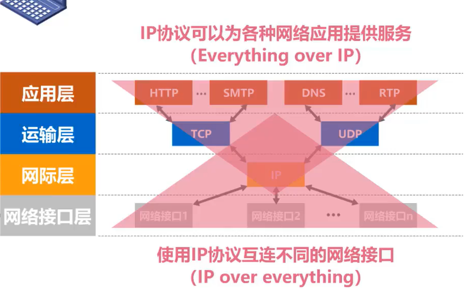
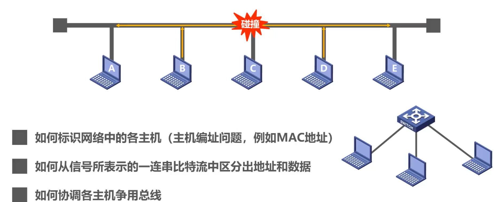
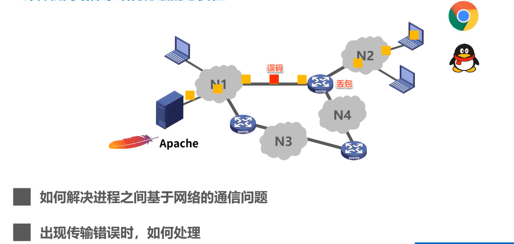
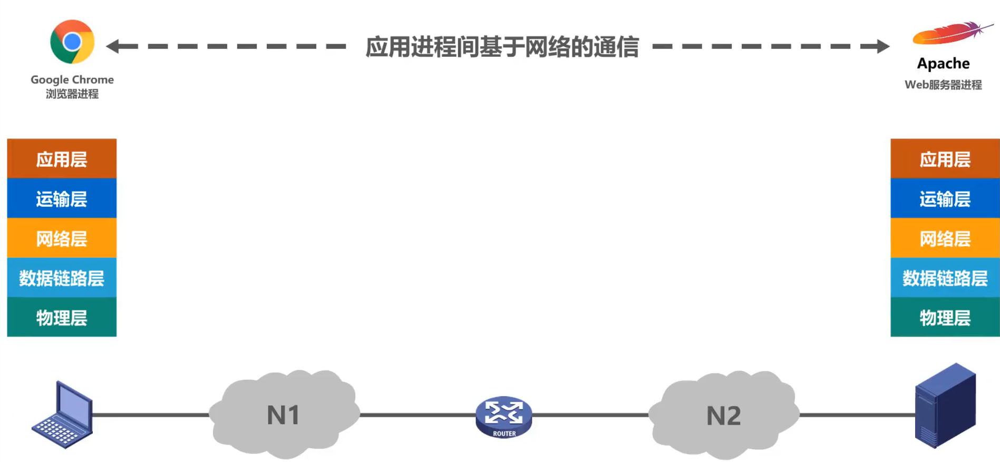
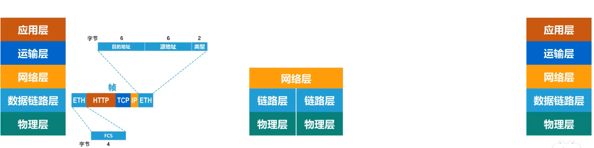
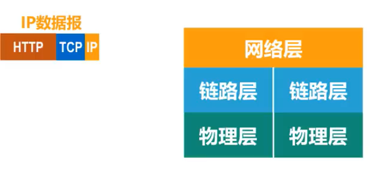
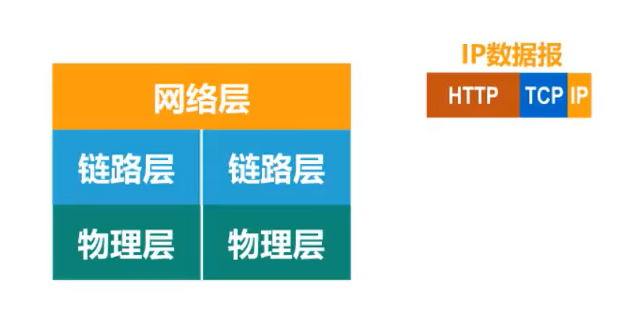
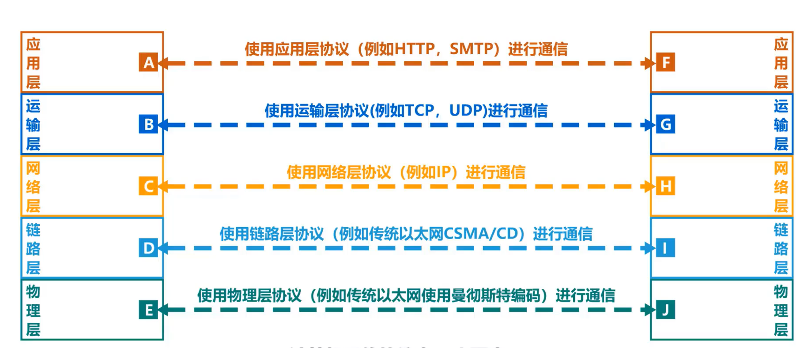

* 总线型网络

* 星型网络

* 环形网络

* 网状型网络

------

# 1.5 计算机网络的性能指标

## 速率

## 带宽

## 吞吐量

> 带宽1 Gb/s的以太网，代表其额定速率是1 Gb/s，这个数值也是该以太网的**吞吐量的绝对上限值**。因此，对于带宽1 Gb/s的以太网，可能实际吞吐量只有 700 Mb/s，甚至更低。
>
> 注意：吞吐量还可以用每秒传送的字节数或帧数表示

## 时延

时延时指数据（一个报文或分组，甚至比特）从网络（或链路）的一端传送到另一端所需的时间。

网络时延由几部分组成：

* 发送时延

主机或路由器发送数据帧所需要的时间，也就是从发送数据帧的第一个比特算起，到该帧的最后一个比特发送完毕所需的时间。

* 传播时延

电磁波在信道中传播一定的距离需要花费的时间。

* 处理时延

主机或路由器在收到分组时要花费一定时间进行处理

* 排队时延

分组在进过网络传输时，要经过许多路由器。但分组在进入路由器后要先在输入队列中排队等待处理。

> 有时会把排队时延看成**处理时延 一部分**
>
> 总时延 = 发送时延 + 传播时延 + 处理时延 （处理时延 + 排队时延）

> 当处理时延忽略不计时，发送时延 和 传播时延谁占主导，要具体情况具体分析

## 时延带宽积

时延带宽积 = 传播时延 * 带宽

## 往返时间

互联网上的信息不仅仅单方向传输而是双向交互的。因此，我们有时很需要知道**双向交互一次所需的时间**。

## 利用率

利用率有**信道利用率**和**网络利用率**两种。

  

## 丢包率

------

# 1.6 计算机网络体系结构

## 1、常见的计算机网络体系结构

> 如今用的最多的是TCP/IP体系结构，现今规模最大的、覆盖全球的、基于TCP/IP的互联网并未使用OSI标准。
>
> TCP/IP体系结构相当于将OSI体系结构的**物理层**和**数据链路层**合并为了**网络接口层**，并去掉了**会话层**和**表示层**。
>
> TCP/IP在网络层使用的协议是IP协议，IP协议的意思是网际协议，因此**TCP/IP体系结构的网络层称为网际层**

> 在用户主机的操作系统中，通常都带有符合TCP/IP体系结构标准的TCP/IP协议族。
>
> 而用于网络互连的路由器中，也带有符合TCP/IP体系结构标准的TCP/IP协议族。
>
> 只不过路由器一般只包含网络接口层和网际层。

> **网络接口层**：并没有规定具体内容，这样做的目的是可以互连全世界各种不同的网络接口，例如：有线的以太网接口，无线局域网的WIFI接口等。
>
> **网际层**：它的核心协议是IP协议。
>
> **运输层**：TCP和UDP是这层的两个重要协议。
>
> **应用层**：这层包含了大量的应用层协议，如 HTTP , DNS 等。

> **IP协议（网际层）**可以将不同的**网络接口（网络接口层）**进行互连，并向其上的**TCP协议和UDP协议（运输层）**提供网络互连服务
>
> 而**TCP协议**在享受IP协议提供的网络互连服务的基础上，可向**应用层的相应协议**提供**可靠**的传输服务。
>
> **UDP协议**在享受IP协议提供的网络互连服务的基础上，可向**应用层的相应协议**提供**不可靠**的传输服务。

> TCP/IP体系结构中最重要的是**IP协议**和**TCP协议**，因此用TCP和IP来表示整个协议大家族。

> 教学时把TCP/IP体系结构的**网络接口层**分成了**物理层**和**数据链路层**

## 2、计算机网络体系结构分层的必要性

**物理层问题**

> 这图说明
>
> * 第一，严格来说，传输媒体并不属于物理层
> * 计算机传输的信号，并不是图示的方波信号
>
> 这样举例只是让初学者容易理解

**数据链路层问题**

**网络层问题**

**运输层问题**

>如何标识与网络通信相关的应用进程：一个分组到来，我们应该交给哪个进程处理呢？浏览器进程还是QQ进程

**应用层问题**

> 应用层该用什么方法（应用层协议）去解析数据

**总结**

## 3、计算机网络体系结构分层思想举例

例子：主机的浏览器如何与Web服务器进行通信

**解析：**

主机和Web服务器之间基于网络的通信，实际上是主机中的**浏览器应用进程**与Web服务器中的**Web服务器应用进程**之间基于**网络的通信**

**体系结构的各层在整个过程中起到怎样的作用？**

**1、发送方发送**

> 第一步：
>
> * **应用层**按照HTTP协议的规定构建一个**HTTP请求报文**
> * 应用层将**HTTP请求报文**交付给**运输层**处理

> 第二步：
>
> * **运输层**给**HTTP请求报文**添加一个**TCP首部**，使之成为**TCP报文段**
> * **TCP报文段的首部格式**作用是区分应用进程以及实现可靠传输
> * **运输层**将T**CP报文段**交付给**网络层**处理

> 第三步：
>
> * **网络层**给**TCP报文段**添加一个**IP首部**，使之成为**IP数据报**
> * **IP数据报的首部格式**作用是使**IP数据报**可以在互联网传输，也就是被路由器转发
> * **网络层**将**IP数据报**交付给**数据链路层**处理

> 第四步：
>
> * **数据链路层**给**IP数据报**添加一个**首部**和一个**尾部**，使之成为**帧**     （图示右边为首部，左边为尾部） 
> * 该**首部**的作用主要是为了让**帧**能够在一段链路上或一个网络上传输，能够被相应的目的主机接收
> * 该**尾部**的作用是让目的主机检查所接收到的**帧**是否有误码
> * **数据链路层**将**帧**交付给**物理层**

> 第五步：
>
> * **物理层**先将**帧**看做是**比特流**，这里的网络N1假设是以太网，所以**物理层**还会给该**比特流**前面添加**前导码**
> * **前导码**的作用是为了让目的主机做好接收帧的准备
> * **物理层**将装有**前导码**的**比特流**变换成相应的**信号**发送给传输媒体

> 第六步：
>
> * **信号**通过**传输媒体**到达**路由器**

**2、路由器转发**

> 在路由器中
>
> * **物理层**将**信号**变为**比特流**，然后去掉**前导码**后，将其交付给**数据链路层**
> * **数据链路层**将**帧**的**首部**和**尾部**去掉后，将其交付给**网络层**，这实际交付的是**IP数据报**
> * **网络层**解析**IP数据报**的**首部**，从中提取**目的网络地址**

> 在路由器中
>
> * 提取**目的网络地址**后查找**自身路由表**。确定**转发端口**， 以便进行转发
> * **网络层**将**IP数据报**交付给**数据链路层**
> * **数据链路层**给**IP数据报**添加一个**首部**和一个**尾部**，使之成为**帧**
> * **数据链路层**将帧交付给**物理层**
> * **物理层**先将**帧**看成**比特流**，这里的网络N2假设是以太网，所以**物理层**还会给该**比特流**前面添加**前导码**
> * 物理层将装有**前导码**的**比特流**变换成相应的**信号**发送给传输媒体，信号通过传输媒体到达**Web服务器**

**3、接收方接收**

> 和发送方（主机）发送过程的封装正好是反着来
>
> 在Web 服务器上
>
> * **物理层**将**信号**变换为**比特流**，然后去掉**前导码**后成为**帧**，交付给**数据链路层**
> * **数据链路层**将**帧**的**首部**和**尾部**去掉后成为**IP数据报**，将其交付给**网络层**
> * **网络层**将**IP数据报**的**首部**去掉后成为**TCP报文段**，将其交付给**运输层**
> * **运输层**将**TCP报文段**的**首部**去掉后成为**HTTP请求报文**，将其交付给**应用层**
> * **应用层**对**HTTP请求报文**进行**解析**，然后给主机发回**响应报文**
>
> **发回响应报文的步骤和之前过程类似**

## 4、计算机网络体系结构中的专用术语

以下介绍的专用术语来源于OSI的七层协议体系结构，但也适用于TCP/IP的四层体系结构和五层协议体系结构

**实体**

**协议**

> 协议：控制两个对等实体进行逻辑通信的规则的集合
>
> 协议三要素：
>
> * 语法：定义所交换信息的格式
> * 语义：定义收发双方所要完成的操作
> * 同步：定义收发双发的时序关系

**服务**

