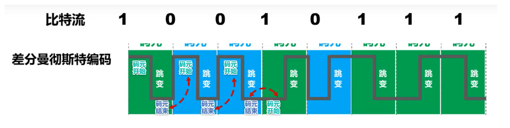
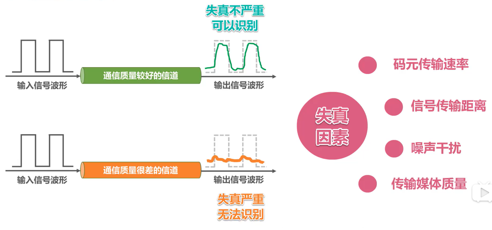
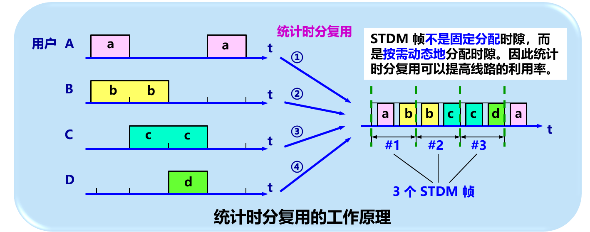
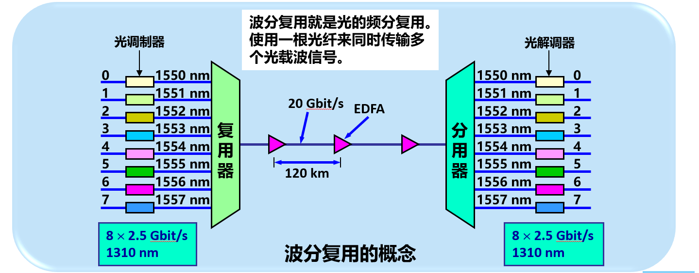

**曼彻斯特编码**

> 在每个码元时间的中间时刻，信号都会发生跳变
>
> * 负跳变表示比特1/0
> * 正跳变表示比特0/1
> * 码元中间时刻的跳变即表示时钟，又表示数据
>
> **实际比特1和比特0的表示要看现实怎么规定**
>
> 传统以太网使用的就是曼切斯特编码

**差分曼彻斯特编码**

> 在每个码元时间的中间时刻，信号都会发送跳变，但与**曼彻斯特不同**
>
> * **跳变仅表示时钟**
> * **码元开始处电平是否变换表示数据**
>   * 变化表示比特1/0
>   * 不变化表示比特0/1
>
> **实际比特1和比特0的表示要看现实怎么规定**
>
> 比曼彻斯特编码变化少，更适合较高的传输速率

**总结**

## 调制

数字信号转换为模拟信号，在模拟信道中传输，例如WiFi，采用补码键控CCK/直接序列扩频DSSS/正交频分复用OFDM等**调制**方式。

模拟信号转换为另一种模拟信号，在模拟信道中传输，例如，语音数据加载到模拟的载波信号中传输。频分复用FDM技术，充分利用带宽资源。

**基本调制方法**

> * **调幅AM**：所调制的信号由两种不同振幅的基本波形构成。每个基本波形只能表示1比特信息量。
> * **调频FM**：所调制的信号由两种不同频率的基本波形构成。每个基本波形只能表示1比特信息量。
> * **调相PM**：所调制的信号由两种不同初相位的基本波形构成。每个基本波形只能表示1比特信息量。
>
> 但是使用基本调制方法，1个码元只能包含1个比特信息

**混合调制**

> 上图码元所对应的4个比特是错误的，码元不能随便对应4个比特

## 码元

在使用时间域的波形表示数字信号时，代表不同离散数值的基本波形。

# 2.5、信道的极限容量

* 任何实际的信道都不是理想的，在传输信号时会产生各种失真以及带来多种干扰。 
* 码元传输的速率越高，或信号传输的距离越远，或传输媒体质量越差，在信道的输出端的波形的失真就越严重。

失真的原因：

* 码元传输的速率越高
* 信号传输的距离越远
* 噪声干扰越大
* 传输媒体质量越差

奈氏准则和香农公式对比：

# 补充：信道复用技术

本节内容视频未讲到，是《计算机网络（第7版）谢希仁》物理层的内容

## 频分复用、时分复用和统计时分复用

复用 (multiplexing) 是通信技术中的基本概念。

它允许用户使用一个共享信道进行通信，降低成本，提高利用率。

**频分复用 FDM (Frequency Division Multiplexing)**

* 将整个带宽分为多份，用户在分配到一定的频带后，在通信过程中自始至终都占用这个频带。
* **频分复用**的所有用户在同样的时间**占用不同的带宽资源**（请注意，这里的“带宽”是频率带宽而不是数据的发送速率）。 

**时分复用TDM (Time Division Multiplexing)** 

* **时分复用**则是将时间划分为一段段等长的**时分复用帧（TDM帧）**。每一个时分复用的用户在每一个 TDM 帧中占用固定序号的时隙。
* 每一个用户所占用的时隙是**周期性地出现**（其周期就是TDM帧的长度）的。
* TDM 信号也称为**等时** (isochronous) 信号。
* **时分复用的所有用户在不同的时间占用同样的频带宽度。**

* **时分复用可能会造成线路资源的浪费**
  * 使用时分复用系统传送计算机数据时，由于计算机数据的突发性质，用户对分配到的子信道的利用率一般是不高的。

**统计时分复用 STDM  (Statistic TDM)** 

## 波分复用

波分复用 WDM(Wavelength Division Multiplexing)

## 码分复用

码分复用 CDM  (Code Division Multiplexing)

* 常用的名词是**码分多址** CDMA (Code Division Multiple Access)。
* 各用户使用经过特殊挑选的不同码型，因此彼此不会造成干扰。
* 这种系统发送的信号有很强的抗干扰能力，其频谱类似于白噪声，不易被敌人发现。 

