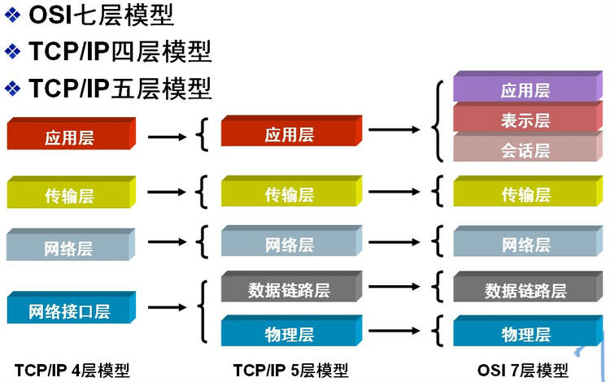
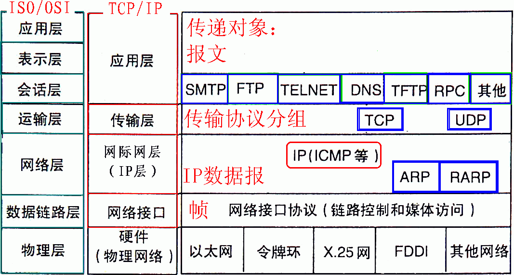
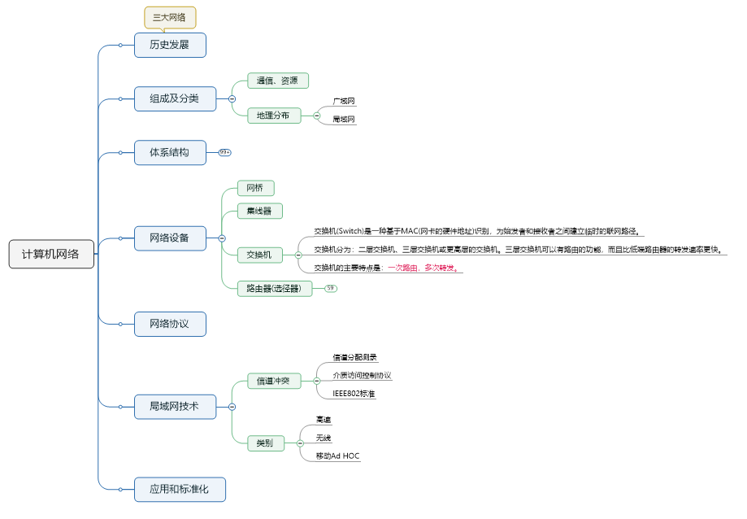
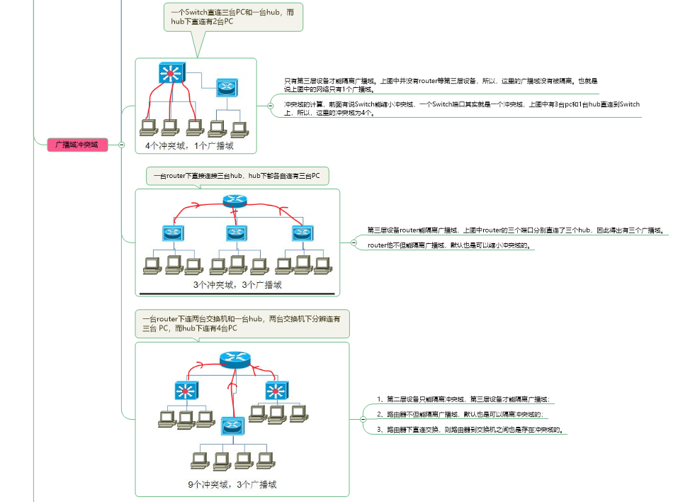
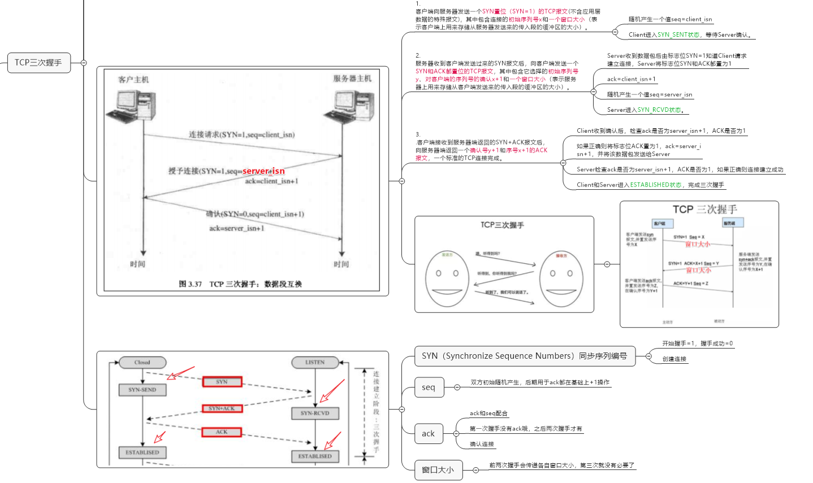
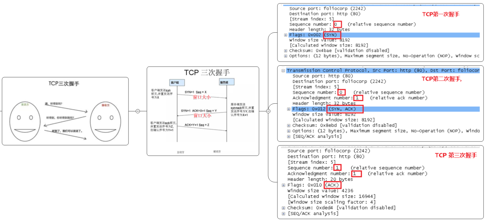
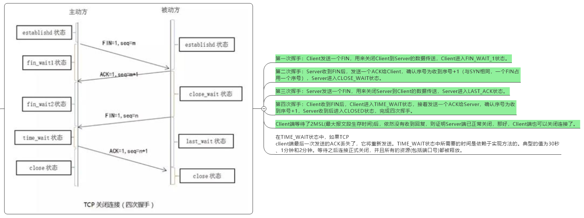
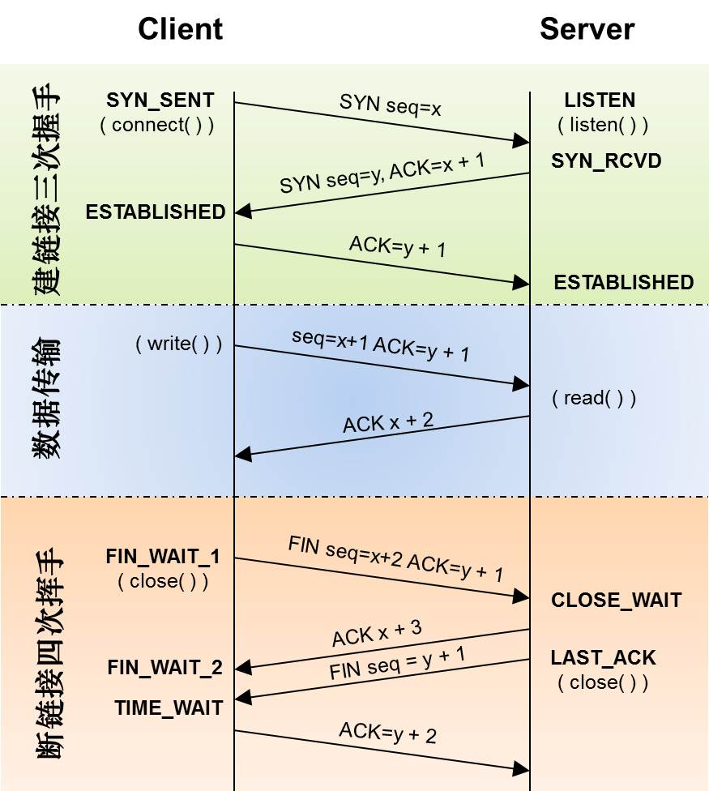
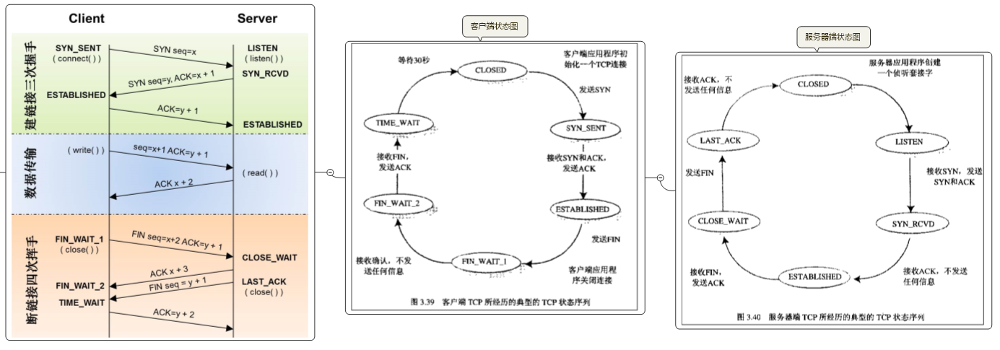

- [网络是怎样连接的.pdf](https://github.com/Corner430/study-notes/blob/main/计算机网络/网络是怎样连接的.pdf)

- [1 MAC 地址](#1-mac-地址)
  - [1.1 MAC 的作用](#11-mac-的作用)
  - [1.2 交换机与 MAC 地址](#12-交换机与-mac-地址)
- [2 广播](#2-广播)
  - [2.1 广播地址（broadcast address）](#21-广播地址broadcast-address)
- [3 路由表](#3-路由表)
  - [3.1 路由表的作用](#31-路由表的作用)
  - [3.2 路由表的基本解释](#32-路由表的基本解释)
  - [3.3 路由表的匹配和转发过程](#33-路由表的匹配和转发过程)
  - [3.4 路由表的维护](#34-路由表的维护)
- [4 TTL(Time to Live)](#4-ttltime-to-live)
  - [4.1 TTL 的作用](#41-ttl-的作用)
  - [4.2 TTL 的设定](#42-ttl-的设定)
- [5 MTU(Maximum Transmission Unit)，最大传输单元](#5-mtumaximum-transmission-unit最大传输单元)
  - [5.1 MTU 的概念](#51-mtu-的概念)
  - [5.2 MTU 的工作原理](#52-mtu-的工作原理)
  - [5.3 MTU 的设置](#53-mtu-的设置)
- [6 MSS(Maximum Segment Size)，最大报文段长度](#6-mssmaximum-segment-size最大报文段长度)
  - [6.1 MSS 的概念](#61-mss-的概念)
  - [6.2 MSS 的设定](#62-mss-的设定)
  - [6.3 MSS 与 MTU 的关系](#63-mss-与-mtu-的关系)
- [7 TCP/UDP](#7-tcpudp)
  - [7.1 TCP(Transmission Control Protocol)，传输控制协议](#71-tcptransmission-control-protocol传输控制协议)
  - [7.2 UDP(User Datagram Protocol)，用户数据报协议](#72-udpuser-datagram-protocol用户数据报协议)
- [8 双绞线、交换机、路由器](#8-双绞线交换机路由器)
  - [8.1 双绞线](#81-双绞线)
  - [8.2 集线器（Hub）](#82-集线器hub)
  - [8.3 交换机（Switch）](#83-交换机switch)
  - [8.4 路由器](#84-路由器)
    - [8.4.1 子网掩码](#841-子网掩码)
    - [8.4.2 路由器判断下一个转发目标的方法](#842-路由器判断下一个转发目标的方法)
    - [8.4.3 包过滤](#843-包过滤)
- [9 IP（Internet Protocol）地址](#9-ipinternet-protocol地址)
- [10 地址转换](#10-地址转换)
- [11 网络本质-网络协议](#11-网络本质-网络协议)
- [12 网络层次划分](#12-网络层次划分)
  - [12.1 OSI七层网络模型](#121-osi七层网络模型)
- [13 计算机网络思维导图](#13-计算机网络思维导图)
- [14 广播域（Broadcase Domain）和冲突域（Collision Domain）](#14-广播域broadcase-domain和冲突域collision-domain)
  - [14.1 广播域（Broadcase Domain）](#141-广播域broadcase-domain)
  - [14.2 冲突域（Collision Domain）](#142-冲突域collision-domain)
- [15 TCP](#15-tcp)
  - [15.1 三次握手](#151-三次握手)
  - [15.2 四次挥手](#152-四次挥手)
  - [15.3 TCP连接的状态](#153-tcp连接的状态)
- [16 常识](#16-常识)
  - [16.1 电信号和光信号](#161-电信号和光信号)
  - [16.2 接入网（Access Network）](#162-接入网access-network)
  - [16.3 路由器](#163-路由器)
    - [16.3.1 互联网接入路由器](#1631-互联网接入路由器)
    - [16.3.2 BAS(Broadband Access Server) 宽带接入服务器](#1632-basbroadband-access-server-宽带接入服务器)
  - [16.4 ATM(Asynchronous Transfer Mode) 异步传输模式](#164-atmasynchronous-transfer-mode-异步传输模式)
  - [16.5 调制（Modulation）](#165-调制modulation)
  - [16.6 波分复用](#166-波分复用)
  - [16.7 ONU（Optical Network Unit）光网络单元](#167-onuoptical-network-unit光网络单元)
  - [16.8 PPP(Point-to-Point Protocol) 点到点协议](#168-ppppoint-to-point-protocol-点到点协议)
  - [16.9 PPPoE(Point-to-Point Protocol over Ethernet) 和 PPPoA(Point-to-Point Protocol over ATM)](#169-pppoepoint-to-point-protocol-over-ethernet-和-pppoapoint-to-point-protocol-over-atm)
  - [16.10 隧道 和 无编号](#1610-隧道-和-无编号)
  - [16.11 POP（Point of Presence）和NOC（Network Operations Center）](#1611-poppoint-of-presence和nocnetwork-operations-center)
    - [16.11.1 POP（Point of Presence，中文一般叫做“接入点”）](#16111-poppoint-of-presence中文一般叫做接入点)
    - [16.11.2 NOC（Network Operations Center）](#16112-nocnetwork-operations-center)
  - [16.12 专线、BGP、IX](#1612-专线bgpix)
  - [16.13 防火墙](#1613-防火墙)
  - [16.14 DNS 服务器](#1614-dns-服务器)
  - [16.15 负载均衡器 和 Cookie](#1615-负载均衡器-和-cookie)
  - [16.16 代理、缓存服务器和 CDN(Content Delivery Network) 内容分发](#1616-代理缓存服务器和-cdncontent-delivery-network-内容分发)
    - [16.16.1 代理](#16161-代理)
    - [16.16.2 缓存服务器](#16162-缓存服务器)
    - [16.16.3 反向代理](#16163-反向代理)
    - [16.16.4 透明代理](#16164-透明代理)
    - [16.16.5 内容分发服务（CDS）](#16165-内容分发服务cds)
    - [16.16.6 CDN(Content Delivery Network) 内容分发网络](#16166-cdncontent-delivery-network-内容分发网络)
      - [16.16.6.1 CDN 的工作原理](#161661-cdn-的工作原理)
  - [16.17 多任务和多线程](#1617-多任务和多线程)
  - [16.18 协议栈](#1618-协议栈)


## 1 MAC 地址

### 1.1 MAC 的作用

MAC 在局域网内唯一标识一个设备

- **局域网中**，路由器根据目标MAC地址将数据包转发到正确的设备
- 使用广播 MAC 地址（全为1的地址）可向整个**局域网**发送广播消息
- 地址解析协议（ARP）用于将IP地址映射到相应的MAC地址

### 1.2 交换机与 MAC 地址

- 交换机端口的 MAC 模块不具有地址
- 交换机根据 MAC 地址表查找 MAC 地址，然后将信号发送到相应的端口
- 如果接收方MAC地址是一个**广播地址**，那么交换机会将包发送到**除源端口之外的所有端口**

## 2 广播
### 2.1 广播地址（broadcast address）

- 一种特殊的地址，将广播地址设为接收方地址时，包会发送到网络中所有的设备

- MAC地址中的`FF:FF:FF:FF:FF:FF`和IP地址中的`255.255.255.255`都是广播地址

## 3 路由表

[默认路由](#841-子网掩码)

### 3.1 路由表的作用

- 路由表是用于路由器和网络设备的重要组成部分，用于决定网络数据包的转发路径
- 路由表中存储了网络的可达目的地以及相应的下一跳信息

### 3.2 路由表的基本解释

- `目的地网络（Destination Network）`：数据包要传输到的目标网络的网络地址。可以用IP地址表示，通常是网络的**网络号**和子网掩码的组合

- `子网掩码（Subnet Mask）`：与IP地址结合使用，用于确定目的地网络的范围。子网掩码中的 `1` 位表示**网络号**，`0` 位表示主机号。

- `下一跳（Next Hop）`：将数据包从当前设备转发到目标网络所使用的下一个路由器或网络设备的地址。可以是直接连接的邻居路由器的IP地址，也可以是下一个中转节点的IP地址。

- `接口（Interface）`：接口是指路由器或网络设备与相应网络之间的物理或逻辑连接。接口可以是网卡、以太网端口、无线接口等。

### 3.3 路由表的匹配和转发过程

1. `匹配目的地网络`：路由器会检查目的地IP地址和路由表中的目的地网络条目进行匹配。
2. `最长前缀匹配`：如果存在多个匹配的目的地网络，路由器将选择具有最长前缀匹配（即子网掩码最长）的路由表条目。这确保了更精确的匹配。
3. `下一跳确定`：路由器根据匹配的路由表条目找到相应的下一跳地址。
4. `数据包转发`：路由器将数据包发送到相应的下一跳地址，或通过适当的接口将数据包转发到目标网络。

### 3.4 路由表的维护

路由表可以手动配置，也可以通过路由协议（如RIP、OSPF、BGP等）自动学习和更新。

## 4 TTL(Time to Live)

### 4.1 TTL 的作用

- TTL 值用于确定数据包在网络中可以存活的时间长度

- 当一个数据包被发送到网络上时，它会被赋予一个初始的 TTL 值。**每当数据包经过一个路由器或网络设备时**，TTL 值就会减少。当 TTL 值减至零时，数据包将被丢弃并不再继续传输

- TTL 值的目的是防止数据包在网络中无限循环

### 4.2 TTL 的设定

- 在实际应用中，TTL 值通常以**秒**为单位表示，常见的初始 TTL 值为 64 或 128
- 一般情况下，每个路由器或网络设备在转发数据包时会将 TTL 值**减少一定的数量，通常是 1 或更多**

## 5 MTU(Maximum Transmission Unit)，最大传输单元

### 5.1 MTU 的概念

**通过单个数据包可以传输的最大数据量**，通常以字节为单位

### 5.2 MTU 的工作原理

- 当数据需要通过网络传输时，它会被分割成更小的数据包以适应网络的 MTU

- 如果数据包的大小超过某个设备或链路的 MTU，它将被分割成更小的片段进行传输，并在目标节点上重新组装

### 5.3 MTU 的设置

- 不同类型的网络（如以太网、Wi-Fi、以及各种广域网连接等）通常具有不同的 MTU 值。

- 常见的以太网 MTU 值是 1500 字节

- 而在某些特殊情况下，如在 VPN 或某些广域网连接中，MTU 可能会被调整为更小的值，例如 1400 字节或更低。

- `MTU 过大`：可能导致数据包被丢弃或需要进行片段重组，增加网络延迟和传输错误的可能性

- `MTU 过小`：可能会影响数据传输的效率，因为需要发送更多的数据包来传输相同的数据量

## 6 MSS(Maximum Segment Size)，最大报文段长度

### 6.1 MSS 的概念

- 在 TCP/IP 协议中，数据被分割成称为报文段（Segment）的小块进行传输。**MSS 指的是在 TCP 报文段中可以承载的最大有效载荷数据的大小，不包括 TCP 报文段的首部信息**

- MSS 的大小是由网络设备或操作系统配置决定的，通常以字节为单位表示

- 它表示在 TCP 连接中发送的数据报文段的最大大小，因为 TCP 报文段除了有效载荷数据外还包含一些必要的控制信息，如首部、校验和、序列号等。

### 6.2 MSS 的设定

- 当建立 TCP 连接时，通信双方会通过握手过程协商一个适当的 MSS 值

- 这个值会根据网络设备和连接双方的能力而确定，以确保数据的可靠传输和最大效率

- 较小的 MSS 值可以减少分段和重组的需求，从而提高传输效率。**然而，MSS 值不能超过网络链路中任何一方的 MTU 值，以确保数据包不会被分段**。

### 6.3 MSS 与 MTU 的关系

- MSS 一般会设为 MTU 值减去 TCP/IP 报文段首部的长度（通常为 40 字节）再减去可能的 IP 选项的长度

## 7 TCP/UDP

### 7.1 TCP(Transmission Control Protocol)，传输控制协议

- 面向连接的协议，通过三次握手建立连接，四次挥手断开连接

- 使用序列号和确认机制来确保数据的**有序**传输和可靠接收

- 提供拥塞控制和流量控制机制，以适应网络拥塞和保证通信的质量

- **完整性检查和重传机制**，确保数据的正确传输

### 7.2 UDP(User Datagram Protocol)，用户数据报协议

- 无连接的协议，不需要建立连接和断开连接

- 通过将数据打包成数据报文并发送，不进行连接的建立和维护

- 没有序列号、确认、重传等机制，因此传输过程中可能会发生丢包或乱序

- 传输快、延迟低、实时性高

> 一般应用程序如果没有收到回复，就会认为数据包丢失，然后重新发送数据包。因此，即使 UDP 丢包，也不会对应用程序造成太大的影响。

## 8 双绞线、交换机、路由器

### 8.1 双绞线

- 抑制噪声的影响
- 双绞线的极限距离是100米，但光纤的连接距离可以长达几公里

### 8.2 集线器（Hub）

- 集线器将所有连接到它的设备连接在同一个物理网络上。
- 当集线器接收到数据包时，它会将该数据包复制并广播到所有连接的设备上

### 8.3 交换机（Switch）

- 交换机的每一个网线接口后面都是一块**网卡**，网线接口和后面的电路部分加在一起称为一个**端口**，也就是说交换机的一个端口就相当于计算机上的一块**网卡**。

- 如果计算机上安装多块网卡，并开启**混杂模式**让网卡接收所有的网络包，然后再安装一个和交换机具备同样功能的网络包转发软件，那么这台计算机就变成了一台交换机。

- 交换机的全双工模式可以同时发送和接收信号

- 交换机可以**同时转发多个包**

- 交换机端口的 MAC 模块不具有地址

- 交换机用于连接多台计算机并根据 MAC 地址将数据包从一个端口转发到另一个端口。

- 能够在网络上创建虚拟的点对点连接，使得不同设备之间的通信更加高效和安全。

### 8.4 路由器

- 路由器是基于IP设计的，而交换机是基于以太网设计的

- 路由器的各个端口都具有 MAC 地址和 IP 地址

- 路由器根据**IP地址**判断转发目标。路由器会忽略主机号，只匹配网络号

- 路由器的子网掩码列只表示在匹配网络包目标地址时需要对比的比特数量，**匹配的比特数越长优先级越高（最长匹配原则）**

- 路由器的端口都具有MAC地址，只接收与自身地址匹配的包，遇到不匹配的包则直接丢弃

#### 8.4.1 子网掩码

- 子网掩码 `0.0.0.0` 的意思是网络包接收方IP地址和路由表目标地址的匹配中需要匹配的比特数为0，换句话说，就是根本不需要匹配。

- 只要将子网掩码设置为`0.0.0.0`，那么无论任何地址都能匹配到这一条记录。也就是说路由表中子网掩码为`0.0.0.0`的记录表示**默认路由**，这一行配置的网关地址被称为**默认网关**

#### 8.4.2 路由器判断下一个转发目标的方法

- 如果路由表的网关列内容为IP地址，则该地址就是下一个转发目标
- 如果路由表的**网关列内容为空**，则IP头部中的接收方IP地址就是下一个转发目标

#### 8.4.3 包过滤

- 在对包进行转发时，根据MAC头部、IP头部、TCP头部的内容，按照事先设置好的规则决定是转发这个包，还是丢弃这个包

- **防火墙设备或软件**，大多数都是利用这一机制来防止非法入侵的

## 9 IP（Internet Protocol）地址

- IP（路由器）负责将包送达通信对象这一整体过程，而其中将包传输到下一个路由器的过程则是由以太网（交换机）来负责的

- 内网私有地址

    ```bash
    10.0.0.0 ~ 10.255.255.255
    172.16.0.0 ~ 172.31.255.255
    192.168.0.0 ~ 192.168.255.255
    ```

## 10 地址转换

- 在转发网络包时对IP头部中的**IP地址和端口号**进行改写，这里的端口号指的是TCP和UDP的端口号

- 具备地址转换功能的设备不仅有路由器，有些防火墙也有地址转换功能，它的工作方式和路由器是相同的。

- 早期的地址转换机制是只改写地址，不改写端口号


## 11 网络本质-网络协议

网络协议是为计算机网络中进行数据交换而建立的规则、标准或者说是约定的集合。


## 12 网络层次划分

为了使不同计算机厂家生产的计算机能够相互通信，以便在更大的范围内建立计算机网络，国际标准化组织（ISO）在1978年提出了“开放系统互联参考模型”，即著名的OSI/RM模型（Open System Interconnection/Reference Model）。

它将计算机网络体系结构的通信协议划分为七层，自下而上依次为：
- 物理层（Physical Layer）
- 数据链路层（Data Link Layer）
- 网络层（Network Layer）
- 传输层（Transport Layer）
- 会话层（Session Layer）
- 表示层（Presentation Layer）
- 应用层（Application Layer）

其中第四层完成数据传送服务，上面三层面向用户。

除了标准的OSI七层模型以外，常见的网络层次划分还有TCP/IP四层协议以及TCP/IP五层协议，它们之间的对应关系如下图所示：



### 12.1 OSI七层网络模型



## 13 计算机网络思维导图



## 14 广播域（Broadcase Domain）和冲突域（Collision Domain）

### 14.1 广播域（Broadcase Domain）

- 广播域是指在网络中广播消息的范围
- 广播是一种将数据包发送到网络中所有设备的机制
- **交换机可以将广播消息限制在同一广播域内**

### 14.2 冲突域（Collision Domain）

- 冲突域是指在网络中可能发生数据冲突的区域。
- 在以太网中，当两个设备同时发送数据时可能会发生冲突，这会导致数据包丢失或错误。
- 集线器工作在物理层，所有连接到它的设备处于同一个冲突域中，因此在集线器上连接的设备可能会发生冲突。



## 15 TCP

### 15.1 三次握手





### 15.2 四次挥手



### 15.3 TCP连接的状态





## 16 常识

### 16.1 电信号和光信号

- 电信号和光信号传播的速度大体上相同

- 之所以电缆不如光纤通信速率高，是因为电信号再提升通信速率的同时，其衰减率也会提高（信号在传播过程中减弱），导致信号无法传到目的地

- 光信号本来的衰减率就很低，提高通信速率也并不会提高衰减率

- 此外，光纤还不受电磁噪声的影响

- **光纤分为单模和多模两种**

### 16.2 接入网（Access Network）

- 将终端用户连接到互联网或其他公共通信网络的部分网络

- 整个通信网络中的最后一段，提供用户与网络之间的物理和逻辑接口。

- 常见的接入网技术：
  - 数字用户线路（Digital Subscriber Line，DSL）：利用普通电话线传输数据，常见的形式包括ADSL和VDSL。
  - 光纤接入网（Fiber to the x，FTTx）：使用光纤传输数据到用户的位置。其中，FTTH（Fiber to the Home）将光纤延伸到用户住宅，而FTTC（Fiber to the Curb）和FTTB（Fiber to the Building）将光纤延伸到街边或建筑物。
  - 有线电视网络：利用有线电视网络传输数据，用户可以通过电缆调制解调器（Cable Modem）访问互联网。
  - 无线接入网：使用无线技术（如Wi-Fi、4G、5G等）将用户设备连接到网络。

### 16.3 路由器

#### 16.3.1 互联网接入路由器

- 互联网接入路由器会在网络包前面加上MAC头部、PPPoE头部、PPP头部总共3种头部，然后发送给ADSL Modem（PPPoE方式下）

#### 16.3.2 BAS(Broadband Access Server) 宽带接入服务器

- 一种路由器
- 用于管理和控制宽带接入服务的网络设备
- 负责对用户进行认证、授权和计费，并提供用户接入管理和连接控制功能

### 16.4 ATM(Asynchronous Transfer Mode) 异步传输模式

### 16.5 调制（Modulation）

- 在通信中将要传输的信息信号转换成适合在传输介质中传播的信号形式的过程。通过改变载波信号的某些特性，如振幅、频率或相位来实现。
  - 在调制过程中，原始的信息信号称为**基带信号（Baseband Signal），而要传输的信号称为调制信号（Modulated Signal）**
  - 调制的主要目的是将基带信号转换为适合在传输介质（如电缆、光纤、空气等）中传播的信号。

### 16.6 波分复用

- 上下行的光信号在光纤中混合在一起，信号会变得无法识别，因此需要对他们进行区分

- **办法是上行和下行信号采用不同波长的光**

- 波长不同的光混合后可通过**棱镜原理**进行分离，因此光纤中的上行和下行信号即便混合起来也可以识别

- 像这样在一条光纤中使用不同的波长传输多个光信号的方式叫做**波分复用**

### 16.7 ONU（Optical Network Unit）光网络单元

- 和光纤收发器一样，可以将电信号转换成光信号
- 具有和电话局的OLT（Optical Line Terminal，光线路终端）相互配合避免信号碰撞的功能
- 这个设备有时也被叫做终端盒，因此终端盒这个词本身是对光纤收发器和ONU等光纤终端设备的统称

### 16.8 PPP(Point-to-Point Protocol) 点到点协议

在使用电话线或者ISDN**拨号上网时，PPP是这样工作的**

1. 用户向运营商的接入点拨打电话，电话接通后输入用户名和密码进行登录操作
2. 用户名和密码通过 RADIUS 协议从 RAS 发送到认证服务器，认证服务器校验这些信息是否正确
3. 当确认无误后，认证服务器会返回IP地址等配置信息，并将这些信息下发给用户
4. 用户的计算机根据这些配置IP地址等参数，完成TCP/IP收发网络包的准备工作，接下来就可以发送TCP/IP包了

### 16.9 PPPoE(Point-to-Point Protocol over Ethernet) 和 PPPoA(Point-to-Point Protocol over ATM)

- PPPoE是将PPP消息装入以太网包进行传输的方式

- PPPoA方式不添加MAC头部和PPPoE头部，而是直接将包装入信元中

### 16.10 隧道 和 无编号

- 能将包原封不动搬运到另一端

- 一对一连接的端口可以不分配IP地址，这种方式称为无编号

### 16.11 POP（Point of Presence）和NOC（Network Operations Center）

#### 16.11.1 POP（Point of Presence，中文一般叫做“接入点”） 

- 在网络服务提供商（ISP）或通信运营商网络中的一个点，通常是物理位置或网络节点

- 用户与ISP网络连接的地点，提供网络接入、路由和交换等服务

- POP通常位于地理上的关键位置

- 在一个ISP网络中，可能会有多个POP分布在不同的地理位置，每个POP通常包含路由器、交换机、服务器等网络设备，用于连接用户和核心网络

#### 16.11.2 NOC（Network Operations Center）

一个专门的中心或部门，负责监控、管理和维护一个网络的运行

### 16.12 专线、BGP、IX

- 专线是固定连接线路，不需要进行身份认证

- BGP: Border Gateway Protocol, 边界网关协议。互联网内部使用BGP机制在运营商之间交换路由信息

- IX: Internet eXchange, 中文一般叫做“互联网交换中心”。

### 16.13 防火墙

- **防火墙：一种抵御外部网络攻击的机制，也是最早出现的一种防御机制**。

- 现在已经出现了很多可以绕过防火墙的攻击方法，因此防火墙一般需要和反病毒、非法入侵检测、访问隔离等机制并用。

- 防火墙不会检查通信数据的具体内容，因此无法抵御隐藏在通信数据内容中的攻击。

- 包过滤方式的防火墙不仅可以允许或者阻止网络包的通过，还具备地址转换功能

- 包过滤方式的防火墙可根据接收方IP地址、发送方IP地址、接收方端口号、发送方端口号、控制位等信息来判断是否允许某个包通过


### 16.14 DNS 服务器

- DNS服务器可以为一个域名填写多个IP地址，并通过轮询（Round Robin）方式实现负载均衡和故障容错。下面是一种常见的做法：
  1. `在DNS服务器上为域名配置多个A记录`：A记录是用来指定域名对应的IP地址的记录类型。
    ```css
    example.com. IN A 192.168.1.100
    example.com. IN A 192.168.1.101
    example.com. IN A 192.168.1.102
    ```
  2. `DNS服务器返回多个IP地址`：**当DNS服务器接收到客户端的查询请求时，它会从配置的多个A记录中选择一个IP地址返回给客户端**
  3. `可以采用简单的轮询方式`，每次返回下一个IP地址。例如，第一次返回192.168.1.100，第二次返回192.168.1.101，以此类推。
  4. `客户端使用返回的IP地址`：客户端收到DNS服务器返回的IP地址后，可以使用该IP地址与目标服务器建立连接。通过轮询方式，不同的客户端可能会获得不同的IP地址，从而分散负载到多个服务器上。

- 这种配置方式可以实现简单的负载均衡效果，将流量分散到多个服务器上，减轻单个服务器的负载压力

- 如果其中一个服务器不可用，DNS服务器将不再返回该服务器的IP地址，从而实现故障容错。

> 需要注意的是，这种简单的轮询方式并不能完全保证负载均衡，因为DNS服务器无法感知服务器的实际负载情况

### 16.15 负载均衡器 和 Cookie

- 使用负载均衡器时，要用负载均衡器的IP地址代替Web服务器的实际地址注册到DNS服务器上

- 对HTTP规格进行扩展，**在HTTP头部字段中加上用来判断相关性的信息，这种信息俗称Cookie**。这样，负载均衡器就可以通过这些信息来作出判断，将一系列相关的请求发送到同一台Web服务器，对于不相关的请求则发送到负载较低的服务器了。

### 16.16 代理、缓存服务器和 CDN(Content Delivery Network) 内容分发

#### 16.16.1 代理

- **代理：一种介于客户端和Web服务器之间，对访问操作进行中转的机制**。代理（Proxy）本来的意思并不是**转发**消息。而是先把消息收下来，然后**伪装**成原始客户端向Web服务器发出访问请求。

#### 16.16.2 缓存服务器

- 缓存服务器是一台通过代理机制对数据进行缓存的服务器。

- 缓存服务器和负载均衡器一样，需要代替Web服务器被注册到DNS服务器中

- 将缓存服务器的代理机制放在客户端一侧，就是代理的原型，也就是现在所说的正向代理（forward proxy）

- 正向代理除了缓存这一作用，还有一个作用就是用来实现防火墙。

- 代理在转发过程中可以查看请求的内容，所以可以根据内容判断是否允许访问。

#### 16.16.3 反向代理

- 为解决正向代理的种种弊端，产生了正向代理的改良版---反向代理（reverse proxy）。

- 服务器端的缓存服务器采用的正是这种方式，这种方式称为反向代理。

#### 16.16.4 透明代理

- 缓存服务器判断转发目标的方法还有一种，就是查看请求消息的包头部。因为包的IP头部中包含接收方IP地址，只要知道了这个地址，就知道用户要访问哪台服务器了。这种方法称为**透明代理（transparent proxy）**

- 透明代理集合了正向代理和反向代理的优点。使用透明代理时，用户不会察觉到代理的存在，也不会注意到HTTP消息是如何被转发的，因此大家**更倾向于将透明代理说成是缓存**

#### 16.16.5 内容分发服务（CDS）

- 当缓存服务器放在服务器端时，可以减轻Web服务器的负载，但无法减少互联网中的流量。

- 当缓存服务器部署在客户端时，可以减少流量，但是Web服务器运营商无法管理缓存服务器。

> 因此，这两种部署缓存服务器的方式各有利弊，但也有一种方式能够集合两者的有点。那就是Web服务器运营者和网络运营商签约，将可以自己控制的缓存服务器放在客户端的运营商处

- 即便减少了数量，作为一个Web服务器运营者，如果自己和这些运营商签约并部署缓存服务器，无论是费用还是精力都是吃不消的。为了解决这个问题，一些专门从事相关服务的厂商出现了，他们来部署缓存服务器，并租借给Web服务器运营者。这种服务称为**内容分发服务**

- 内容分发服务也叫CDS（Content Delivery Service）。

#### 16.16.6 CDN(Content Delivery Network) 内容分发网络

- 现在更常用的名称叫CDN（Content Delivery Network 或 Content Distribution Network）

- CDN 是一种用于提供高效、可靠的内容分发和传输的网络架构。

- CDN的主要目标是将内容（如网页、图片、视频、文件等）快速、可靠地传送给用户，以提供更好的用户体验和性能优化。**它通过在全球分布的边缘服务器上缓存和分发内容，使用户可以从离其较近的服务器获取内容**，从而减少了传输延迟和网络拥塞问题。

##### 16.16.6.1 CDN 的工作原理

1. `内容缓存和分发`：CDN在全球各地设置了多个边缘服务器节点，这些节点分布在不同的地理位置，覆盖范围广。原始内容提供商（如网站、媒体服务提供商等）将内容上传到CDN的服务器上，这些服务器上的存储称为缓存。

2. `请求路由`：当用户请求访问特定内容时，请求将被路由到距离用户最近的CDN节点，而不是原始服务器。这个选择过程通常基于网络拓扑、地理位置、负载情况等因素。

3. `缓存命中`：如果请求的内容已经存在于CDN节点的缓存中，CDN节点将立即响应请求并将内容传输给用户。这样可以大大减少从原始服务器获取内容的时间和网络延迟。

4. `内容更新和失效`：CDN节点定期从原始服务器获取最新的内容更新。当内容发生更改或失效时，CDN节点将刷新缓存，并在下一次请求时从原始服务器获取更新后的内容。

5. `负载均衡和故障容错`：CDN通过在多个节点上分发请求，实现负载均衡，使得流量能够均匀分布到不同的服务器上。如果某个节点发生故障或不可用，其他节点可以接管请求，保证服务的连续性。

### 16.17 多任务和多线程

- 多任务：操作系统提供的一种功能，可以让多个任务（程序）同时运行**。实际上，一个处理器在某一个瞬间只能运行一个任务**，但通过短时间内在不同的任务间切换，看起来就好像是同时运行多个任务一样。有些操作系统称之为**多进程**

- **多任务和多线程的区别在于任务和线程的区别**。在操作系统内部，任务是作为单独的程序来对待的，而线程则是一个程序中的一部分。

### 16.18 协议栈

协议栈的IP模块会检查IP头部

- 判断是不是发给自己的
- 判断网络包是否经过分片
- 将包转交给TCP模块或UDP模块
