# 计算机网络学习笔记

**图示说明**

代表着主机

 代表服务器

 代表着路由器

代表着网络

- [计算机网络学习笔记](#计算机网络学习笔记)
- [概述](#概述)
  - [1 因特网概述](#1-因特网概述)
    - [1.1 网络、互连网（互联网）和因特网](#11-网络互连网互联网和因特网)
    - [1.2 因特网发展的三个阶段](#12-因特网发展的三个阶段)
    - [1.3 因特网的组成](#13-因特网的组成)
      - [补充：](#补充)
  - [2 三种交换方式](#2-三种交换方式)
    - [2.1 电路交换（Circuit Switching）](#21-电路交换circuit-switching)
    - [2.2 分组交换（Packet Switching）](#22-分组交换packet-switching)
    - [2.3 报文交换（Message Switching）](#23-报文交换message-switching)
    - [2.4 三种交换方式的对比](#24-三种交换方式的对比)
  - [3 计算机网络的定义和分类](#3-计算机网络的定义和分类)
    - [3.1 定义](#31-定义)
    - [3.2 分类](#32-分类)
  - [4 计算机网络的性能指标](#4-计算机网络的性能指标)
    - [4.1 速率](#41-速率)
    - [4.2 带宽](#42-带宽)
    - [4.3 吞吐量](#43-吞吐量)
    - [4.4 时延](#44-时延)
    - [4.5 时延带宽积](#45-时延带宽积)
    - [4.6 往返时间](#46-往返时间)
    - [4.7 利用率](#47-利用率)
    - [4.8 丢包率](#48-丢包率)
  - [5 计算机网络体系结构](#5-计算机网络体系结构)
    - [5.1 常见的计算机网络体系结构](#51-常见的计算机网络体系结构)
    - [5.2 计算机网络体系结构分层的必要性](#52-计算机网络体系结构分层的必要性)
    - [5.3 计算机网络体系结构分层思想举例](#53-计算机网络体系结构分层思想举例)
    - [5.4 计算机网络体系结构中的专用术语](#54-计算机网络体系结构中的专用术语)
- [物理层](#物理层)
  - [1 物理层的基本概念](#1-物理层的基本概念)
  - [2 物理层下面的传输媒体](#2-物理层下面的传输媒体)
    - [2.1 导引型传输媒体](#21-导引型传输媒体)
    - [2.2 非导引型传输媒体](#22-非导引型传输媒体)
  - [3 传输方式](#3-传输方式)
    - [3.1 串行传输和并行传输](#31-串行传输和并行传输)
    - [3.2 同步传输和异步传输](#32-同步传输和异步传输)
    - [3.3 单向通信（单工）、双向交替通信（半双工）和双向同时通信（全双工）](#33-单向通信单工双向交替通信半双工和双向同时通信全双工)
  - [4 编码与调制](#4-编码与调制)
    - [4.1 传输媒体与信道的关系](#41-传输媒体与信道的关系)
    - [4.2 常用编码](#42-常用编码)
    - [4.3 调制](#43-调制)
    - [4.4 码元](#44-码元)
  - [5 信道的极限容量](#5-信道的极限容量)
  - [6 信道复用技术](#6-信道复用技术)
    - [6.1 频分复用、时分复用和统计时分复用](#61-频分复用时分复用和统计时分复用)
    - [6.2 波分复用](#62-波分复用)
    - [6.3 码分复用](#63-码分复用)
- [数据链路层](#数据链路层)
  - [1 数据链路层概述](#1-数据链路层概述)
    - [1.1 概述](#11-概述)
    - [1.2 三个重要问题](#12-三个重要问题)
  - [2 封装成帧](#2-封装成帧)
    - [2.1 介绍](#21-介绍)
    - [2.2 透明传输](#22-透明传输)
    - [2.3 总结](#23-总结)
  - [3 差错检测](#3-差错检测)
    - [3.1 介绍](#31-介绍)
    - [3.2 奇偶校验](#32-奇偶校验)
    - [3.3 循环冗余校验CRC(Cyclic Redundancy Check)](#33-循环冗余校验crccyclic-redundancy-check)
  - [4 可靠传输](#4-可靠传输)
    - [4.1 基本概念](#41-基本概念)
    - [4.2 三种可靠协议](#42-三种可靠协议)
    - [4.3 停止-等待协议](#43-停止-等待协议)
      - [4.3.1 停止-等待协议可能遇到的四个问题](#431-停止-等待协议可能遇到的四个问题)
      - [4.3.2 停止-等待协议的信道利用率](#432-停止-等待协议的信道利用率)
    - [4.4 回退N帧协议GBN](#44-回退n帧协议gbn)
      - [4.4.1 为什么用回退N帧协议](#441-为什么用回退n帧协议)
      - [4.4.2 无差错情况流程](#442-无差错情况流程)
      - [4.4.3 累计确认](#443-累计确认)
      - [4.4.4 有差错情况](#444-有差错情况)
    - [4.5 选择重传协议SR](#45-选择重传协议sr)
  - [5 点对点协议PPP](#5-点对点协议ppp)
    - [5.1 帧格式](#51-帧格式)
    - [5.2 透明传输](#52-透明传输)
    - [5.3 差错检测](#53-差错检测)
    - [5.4 工作状态](#54-工作状态)
  - [6 媒体接入控制（介质访问控制）——广播信道](#6-媒体接入控制介质访问控制广播信道)
    - [6.1 基本概念](#61-基本概念)
    - [6.2 静态划分信道](#62-静态划分信道)
    - [6.3 动态接入控制](#63-动态接入控制)
    - [6.4 随机接入（CSMA/CD协议）(重点)](#64-随机接入csmacd协议重点)
      - [6.4.1 基本概念](#641-基本概念)
      - [6.4.2 多址接入MA](#642-多址接入ma)
      - [6.4.3 载波监听CS](#643-载波监听cs)
      - [6.4.4 碰撞检测CD](#644-碰撞检测cd)
      - [6.4.5 CSMA/CD 协议工作流程](#645-csmacd-协议工作流程)
      - [6.4.6 CSMA/CD 协议工作——争用期（碰撞窗口）](#646-csmacd-协议工作争用期碰撞窗口)
      - [6.4.7 CSMA/CD 协议工作——最小帧长](#647-csmacd-协议工作最小帧长)
      - [6.4.8 CSMA/CD 协议工作——最大帧长](#648-csmacd-协议工作最大帧长)
      - [6.4.9 CSMA/CD 协议工作——截断二进制指数退避算法](#649-csmacd-协议工作截断二进制指数退避算法)
      - [6.4.10 CSMA/CD 协议工作——信道利用率](#6410-csmacd-协议工作信道利用率)
      - [6.4.11 CSMA/CD 协议工作——帧接收流程](#6411-csmacd-协议工作帧接收流程)
      - [6.4.12 CSMA/CD 协议的重要特性](#6412-csmacd-协议的重要特性)
    - [6.5 随机接入（CSMA/CA协议）](#65-随机接入csmaca协议)
      - [6.5.1 为什么无线局域网要使用CSMA/CA协议](#651-为什么无线局域网要使用csmaca协议)
      - [6.5.2 帧间间隔IFS（InterFrame Space）](#652-帧间间隔ifsinterframe-space)
      - [6.5.3 CSMA/CA协议的工作原理](#653-csmaca协议的工作原理)
      - [6.5.4 CSMA/CA协议的退避算法](#654-csmaca协议的退避算法)
      - [6.5.5 CSMA/CA协议的信道预约和虚拟载波监听](#655-csmaca协议的信道预约和虚拟载波监听)
  - [7 MAC地址、IP地址以及ARP协议](#7-mac地址ip地址以及arp协议)
    - [7.1 MAC地址](#71-mac地址)
      - [7.1.1 广播信道的数据链路层必须使用地址（MAC）](#711-广播信道的数据链路层必须使用地址mac)
      - [7.1.2 IEEE 802局域网的MAC地址格式](#712-ieee-802局域网的mac地址格式)
      - [7.1.3 IEEE 802局域网的MAC地址发送顺序](#713-ieee-802局域网的mac地址发送顺序)
      - [7.1.4 单播MAC地址举例](#714-单播mac地址举例)
      - [7.1.5 广播MAC地址举例](#715-广播mac地址举例)
      - [7.1.6 多播MAC地址举例](#716-多播mac地址举例)
    - [7.2 IP地址](#72-ip地址)
      - [7.2.1 基本概念](#721-基本概念)
      - [7.2.2 从网络体系结构看IP地址与MAC地址](#722-从网络体系结构看ip地址与mac地址)
      - [7.2.3 数据包转发过程中IP地址与MAC地址的变化情况](#723-数据包转发过程中ip地址与mac地址的变化情况)
    - [7.3 ARP协议](#73-arp协议)
      - [7.3.1 流程](#731-流程)
      - [7.3.2 总结](#732-总结)
  - [8 集线器与交换机的区别](#8-集线器与交换机的区别)
    - [8.1 集线器-在物理层扩展以太网](#81-集线器-在物理层扩展以太网)
      - [8.1.1 概念](#811-概念)
      - [8.1.2 集线器HUB在物理层扩展以太网](#812-集线器hub在物理层扩展以太网)
    - [8.2 以太网交换机-在数据链路层扩展以太网](#82-以太网交换机-在数据链路层扩展以太网)
      - [8.2.1 概念](#821-概念)
      - [8.2.2 集线器HUB与交换机SWITCH区\*](#822-集线器hub与交换机switch区)
    - [8.3 总结](#83-总结)
  - [9 以太网交换机自学习和转发帧的流程](#9-以太网交换机自学习和转发帧的流程)
    - [9.1 概念](#91-概念)
    - [9.2 自学习和转发帧的例子](#92-自学习和转发帧的例子)
    - [9.3 总结](#93-总结)
  - [10 以太网交换机的生成树协议STP](#10-以太网交换机的生成树协议stp)
    - [10.1 如何提高以太网的可靠性](#101-如何提高以太网的可靠性)
    - [10.2 生成树协议STP](#102-生成树协议stp)
  - [11 虚拟局域网VLAN](#11-虚拟局域网vlan)
    - [11.1 为什么要虚拟局域网VLAN](#111-为什么要虚拟局域网vlan)
    - [11.2 概念](#112-概念)
    - [11.3 虚拟局域网VLAN的实现机制](#113-虚拟局域网vlan的实现机制)
    - [11.4 总结](#114-总结)

# 概述

## 1 因特网概述

### 1.1 网络、互连网（互联网）和因特网

网络：网络（Network）由若干**结点**（Node）和连接这些结点的**链路**（Link）组成。

互连网（互联网）：多个网络通过路由器互连起来，这样就构成了一个覆盖范围更大的网络，即互连网（互联网）。因此，互联网又称为“网络的网络（Network of Networks）”。

因特网：因特网（Internet）是世界上最大的互连网络（用户数以亿计，互连的网络数以百万计）。

> **internet与Internet的区别**
>
> * **internet(互联网或互连网)**是一个通用名词，它泛指**多个计算机网络互连而成的网络**。在这些网络之间的通信协议可以是任意的。
> * **Internet（因特网）则是一个专用名词**，它指**当前全球最大的、开放的、由众多网络互连而成的特定计算机网络**，它采用TCP/IP协议族作为通信的规则，其前身是美国的ARPANET。
>
> **任意把几个计算机网络互连起来（不管采用什么协议），并能够相互通信，这样构成的是一个互连网(internet) ，而不是互联网(Internet)。**

### 1.2 因特网发展的三个阶段

**因特网服务提供者`ISP`(`I`nternet `S`ervice `P`rovider)**

> 普通用户是如何接入到因特网的呢？
>
> 答：**通过ISP接入因特网**
>
> ISP可以从因特网管理机构申请到成块的IP地址，同时拥有通信线路以及路由器等联网设备。任何机构和个人只需缴纳费用，就可从**ISP的得到所需要的IP地址**。
>
> **因为因特网上的主机都必须有IP地址才能进行通信，这样就可以通过该ISP接入到因特网**

**中国的三大`ISP`：中国电信，中国联通和中国移动**

**基于ISP的三层结构的因特网**

> 一旦某个用户能够接入到因特网，那么他也可以成为一个ISP，所需要做的就是购买一些如调制解调器或路由器这样的设备，让其他用户可以和他相连。

### 1.3 因特网的组成

* 边缘部分

  由所有连接在因特网上的**主机**组成（台式电脑，大型服务器，笔记本电脑，平板，智能手机等）。这部分是**用户直接使用**的，用来进行**通信**（传送数据、音频或视频）和**资源共享**。

* 核心部分

  由**大量网络**和连接这些网络的**路由器**组成。这部分是**为边缘部分提供服务**的（提供连通性和交换）。

> 路由器是一种专用计算机，但我们不称它为主机，路由器是实现分组交换的关键构建，其任务是转发收到的分组，这是网络核心最重要的部分。
>
> 处在互联网边缘的部分就是连接在互联网上的所有的主机。这些主机又称为**端系统 (end system)**。
>
> **端系统在功能上可能有很大的差别：**
>
> 1. 小的端系统可以是一台普通个人电脑，具有上网功能的智能手机，甚至是一个很小的网络摄像头。
>
> 2. 大的端系统则可以是一台非常昂贵的大型计算机。
>
> 3. 端系统的拥有者可以是个人，也可以是单位（如学校、企业、政府机关等），当然也可以是某个ISP。

#### 补充：

**端系统之间通信的含义**

“主机 A 和主机 B 进行通信”实际上是指：“运行在主机 A 上的某个程序和运行在主机 B 上的另一个程序进行通信”。**即“主机** **A** **的某个进程和主机** **B** **上的另一个进程进行通信”。简称为“计算机之间通信”。** 

端系统之间的通信方式通常可划分为两大类：

**客户-服务器方式：**

* 客户 (client) 和服务器 (server) 都是指通信中所涉及的两个应用进程。
* 客户 - 服务器方式所描述的是进程之间服务和被服务的关系。
* 客户是服务的请求方，服务器是服务的提供方。

> **服务请求方和服务提供方都要使用网络核心部分所提供的服务。**

**对等连接方式：**

* **对等连接** (peer-to-peer，简写为 **P2P** ) 是指两个主机在通信时并不区分哪一个是服务请求方还是服务提供方。
* 只要两个主机都运行了对等连接软件 ( P2P 软件) ，它们就可以进行**平等的、对等连接通信**。
* 双方都可以下载对方已经存储在硬盘中的共享文档。 

------

## 2 三种交换方式

网络核心部分是互联网中最复杂的部分。

网络中的核心部分要向网络边缘中的大量主机提供连通性，使边缘部分中的任何一个主机都能够向其他主机通信（即传送或接收各种形式的数据）。

在网络核心部分起特殊作用的是**路由器**(router)。

**路由器**是实现**分组交换** (packet switching) 的关键构件，其任务是**转发**收到的分组，这是网络核心部分最重要的功能。

### 2.1 电路交换（Circuit Switching）

> 传统两两相连的方式，当电话数量很多时，电话线也很多，就很不方便
>
> 所以要使得每一部电话能够很方便地和另一部电话进行通信，就应该使用一个**中间设备**将这些电话连接起来，这个中间设备就是**电话交换机**

* 电话交换机接通电话线的方式称为电路交换；

* 从通信资源的分配角度来看，交换（Switching）就是按照某种方式动态地分配传输线路的资源；

* 电路交换的三个步骤：
  1. 建立连接（分配通信资源）
  2. 通话（一直占用通信资源）
  3. 释放连接（归还通信资源）

> 当使用电路交换来传送计算机数据时，其线路的传输效率往往很低。
>
> 这是因为计算机数据是突发式地出现在传输线路上的。
>
> 所以计算机通常采用的是**分组交换**，而不是线路交换

### 2.2 分组交换（Packet Switching）

> 通常我们把表示**该消息的整块数据**称为一个**报文**。
>
> 在发送报文之前，先把较长的报文划分成一个个更小的**等长数据段**，在每一个数据段前面。加上一些由必**要的控制信息组成的首部**后，就构成一个分组，也可简称为“包”，相应地，首部也可称为“包头”。
>
> 首部包含了**分组的目的地址**
>
> 分组从源主机到目的主机，可走不同的路径。

发送方

* 构造分组
* 发送分组

路由器

* 缓存分组
* 转发分组
* 简称为“分组转发”

> 在路由器中的输入和输出端口之间没有直接连线。
>
> 路由器处理分组的过程是：
>
> 1. 把收到的分组先**放入缓存（暂时存储）；**
> 2. **查找转发表**，找出到某个目的地址应从哪个端口转发；
> 3. 把分组送到适当的端口**转发**出去。

接收方

* 接收分组
* 还原报文

### 2.3 报文交换（Message Switching）

报文交换中的交换结点也采用存储转发方式，但报文交换对报文的大小没有限制，这就要求交换结点需要较大的缓存空间。报文交换主要用于早期的电报通信网，现在较少使用，**通常被较先进的分组交换方式所取代**。

### 2.4 三种交换方式的对比

> 假设A，B，C，D是分组传输路径所要经过的4个结点交换机，纵坐标为时间

分析：

电路交换：

* 通信之前首先要建立连接；连接建立好之后，就可以使用已建立好的连接进行数据传送；数据传送后，需释放连接，以归还之前建立连接所占用的通信线路资源。

* 一旦建立连接，中间的各结点交换机就是直通形式的，比特流可以直达终点；

报文交换：

* 可以随时发送报文，而不需要事先建立连接；整个报文先传送到相邻结点交换机，全部存储下来后进行查表转发，转发到下一个结点交换机。
* 整个报文需要在各结点交换机上进行存储转发，由于不限制报文大小，因此需要各结点交换机都具有较大的缓存空间。

分组交换：

* 可以随时发送分组，而不需要事先建立连接。构成原始报文的一个个分组，依次在各结点交换机上存储转发。各结点交换机在发送分组的同时，还缓存接收到的分组。
* 构成原始报文的一个个分组，在各结点交换机上进行存储转发，相比报文交换，减少了转发时延，还可以避免过长的报文长时间占用链路，同时也有利于进行差错控制。

------

## 3 计算机网络的定义和分类

### 3.1 定义

* 计算机网络的精确定义并未统一
* 计算机网络的最简单的定义是：一些**互**相**连**接的、**自治**的计算机的**集合**。
  * 互连：是指计算机之间可以通过有线或无线的方式进行数据通信；
  * 自治：是指独立的计算机，他有自己的硬件和软件，可以单独运行使用；
  * 集合：是指至少需要两台计算机；
* 计算机网络的较好的定义是：计算机网络主要是由一些**通用的，可编程的硬件（一定包含有中央处理机CPU）互连**而成的，而这些硬件并非专门用来实现某一特定目的（例如，传送数据或视频信号）。这些可编程的硬件能够用来**传送多种不同类型的数据**，并能**支持广泛的和日益增长的应用**。
  * 计算机网络所连接的硬件，并不限于一般的计算机，而是包括了智能手机等智能硬件。
  * 计算机网络并非专门用来传送数据，而是能够支持很多种的应用（包括今后可能出现的各种应用）。

### 3.2 分类

**按交换技术分类：**

* 电路交换网络
* 报文交换网络
* 分组交换网络

**按使用者分类：**

* 公用网
* 专用网

**按传输介质分类：**

* 有线网络
* 无线网络

**按覆盖范围分类：**

* 广域网WAN（Wide Area Network）

作用范围通常为几十到几千公里，因而有时也称为远程网（long haul network）。广域网是互联网的核心部分，其任务是通过长距离（例如，跨越不同的国家）运送主机所发送的数据。

* 城域网MAN

作用范围一般是一个城市，可跨越几个街区甚至整个城市

* 局域网LAN

一般用微型计算机或工作站通过高速通信线路相连（速率通常在 10 Mbit/s 以上），但地理上范围较小（1 km 左右）

* 个域网PAN

就是在个人工作的地方把个人使用的电子设备用无线技术连接起来的网络。

**按拓扑结构分类：**

* 总线型网络

* 星型网络

* 环形网络

* 网状型网络

------

## 4 计算机网络的性能指标

### 4.1 速率

### 4.2 带宽

### 4.3 吞吐量

> 带宽1 Gb/s的以太网，代表其额定速率是1 Gb/s，这个数值也是该以太网的**吞吐量的绝对上限值**。因此，对于带宽1 Gb/s的以太网，可能实际吞吐量只有 700 Mb/s，甚至更低。
>
> 注意：吞吐量还可以用每秒传送的字节数或帧数表示

### 4.4 时延

时延是指数据（一个报文或分组，甚至比特）从网络（或链路）的一端传送到另一端所需的时间。

网络时延由几部分组成：

* 发送时延

主机或路由器发送数据帧所需要的时间，也就是从发送数据帧的第一个比特算起，到该帧的最后一个比特发送完毕所需的时间。

* 传播时延

电磁波在信道中传播一定的距离需要花费的时间。

* 处理时延

主机或路由器在收到分组时要花费一定时间进行处理

* 排队时延

分组在进过网络传输时，要经过许多路由器。但分组在进入路由器后要先在输入队列中排队等待处理。

> 有时会把排队时延看成**处理时延 一部分**
>
> 总时延 = 发送时延 + 传播时延 + 处理时延 （处理时延 + 排队时延）

> 当处理时延忽略不计时，发送时延 和 传播时延谁占主导，要具体情况具体分析

### 4.5 时延带宽积

时延带宽积 = 传播时延 * 带宽

### 4.6 往返时间

互联网上的信息不仅仅单方向传输而是双向交互的。因此，我们有时很需要知道**双向交互一次所需的时间**。

### 4.7 利用率

利用率有**信道利用率**和**网络利用率**两种。

### 4.8 丢包率

------

## 5 计算机网络体系结构

### 5.1 常见的计算机网络体系结构

> 如今用的最多的是TCP/IP体系结构，现今规模最大的、覆盖全球的、基于TCP/IP的互联网并未使用OSI标准。
>
> TCP/IP体系结构相当于将OSI体系结构的**物理层**和**数据链路层**合并为了**网络接口层**，并去掉了**会话层**和**表示层**。
>
> TCP/IP在网络层使用的协议是IP协议，IP协议的意思是网际协议，因此**TCP/IP体系结构的网络层称为网际层**

> 在用户主机的操作系统中，通常都带有符合TCP/IP体系结构标准的TCP/IP协议族。
>
> 而用于网络互连的路由器中，也带有符合TCP/IP体系结构标准的TCP/IP协议族。
>
> 只不过路由器一般只包含网络接口层和网际层。

> **网络接口层**：并没有规定具体内容，这样做的目的是可以互连全世界各种不同的网络接口，例如：有线的以太网接口，无线局域网的WIFI接口等。
>
> **网际层**：它的核心协议是IP协议。
>
> **运输层**：TCP和UDP是这层的两个重要协议。
>
> **应用层**：这层包含了大量的应用层协议，如 HTTP , DNS 等。

> **IP协议**（网际层）可以将不同的**网络接口**（网络接口层）进行互连，并向其上的**TCP协议和UDP协议**（运输层）提供网络互连服务
>
> 而**TCP协议**在享受 IP 协议提供的网络互连服务的基础上，可向**应用层的相应协议**提供**可靠**的传输服务。
>
> **UDP协议**在享受 IP 协议提供的网络互连服务的基础上，可向**应用层的相应协议**提供**不可靠**的传输服务。

> TCP/IP体系结构中最重要的是**IP协议**和**TCP协议**，因此用TCP和IP来表示整个协议大家族。

> 教学时把TCP/IP体系结构的**网络接口层**分成了**物理层**和**数据链路层**

### 5.2 计算机网络体系结构分层的必要性

**物理层问题**

> 这图说明
>
> * 第一，严格来说，传输媒体并不属于物理层
> * 计算机传输的信号，并不是图示的方波信号
>
> 这样举例只是让初学者容易理解

**数据链路层问题**

**网络层问题**

**运输层问题**

>如何标识与网络通信相关的应用进程：一个分组到来，我们应该交给哪个进程处理呢？浏览器进程还是QQ进程

**应用层问题**

> 应用层该用什么方法（应用层协议）去解析数据

**总结**

### 5.3 计算机网络体系结构分层思想举例

例子：主机的浏览器如何与Web服务器进行通信

**解析：**

主机和Web服务器之间基于网络的通信，实际上是主机中的**浏览器应用进程**与Web服务器中的**Web服务器应用进程**之间基于**网络的通信**

**体系结构的各层在整个过程中起到怎样的作用？**

**1. 发送方发送**

> 第一步：
>
> * **应用层**按照HTTP协议的规定构建一个**HTTP请求报文**
> * 应用层将**HTTP请求报文**交付给**运输层**处理

> 第二步：
>
> * **运输层**给**HTTP请求报文**添加一个**TCP首部**，使之成为**TCP报文段**
> * **TCP报文段的首部格式**作用是区分应用进程以及实现可靠传输
> * **运输层**将T**CP报文段**交付给**网络层**处理

> 第三步：
>
> * **网络层**给**TCP报文段**添加一个**IP首部**，使之成为**IP数据报**
> * **IP数据报的首部格式**作用是使**IP数据报**可以在互联网传输，也就是被路由器转发
> * **网络层**将**IP数据报**交付给**数据链路层**处理

> 第四步：
>
> * **数据链路层**给**IP数据报**添加一个**首部**和一个**尾部**，使之成为**帧**     （图示右边为首部，左边为尾部） 
> * 该**首部**的作用主要是为了让**帧**能够在一段链路上或一个网络上传输，能够被相应的目的主机接收
> * 该**尾部**的作用是让目的主机检查所接收到的**帧**是否有误码
> * **数据链路层**将**帧**交付给**物理层**

> 第五步：
>
> * **物理层**先将**帧**看做是**比特流**，这里的网络N1假设是以太网，所以**物理层**还会给该**比特流**前面添加**前导码**
> * **前导码**的作用是为了让目的主机做好接收帧的准备
> * **物理层**将装有**前导码**的**比特流**变换成相应的**信号**发送给传输媒体

> 第六步：
>
> * **信号**通过**传输媒体**到达**路由器**

**2. 路由器转发**

> 在路由器中
>
> * **物理层**将**信号**变为**比特流**，然后去掉**前导码**后，将其交付给**数据链路层**
> * **数据链路层**将**帧**的**首部**和**尾部**去掉后，将其交付给**网络层**，这实际交付的是**IP数据报**
> * **网络层**解析**IP数据报**的**首部**，从中提取**目的网络地址**

> 在路由器中
>
> * 提取**目的网络地址**后查找**自身路由表**。确定**转发端口**， 以便进行转发
> * **网络层**将**IP数据报**交付给**数据链路层**
> * **数据链路层**给**IP数据报**添加一个**首部**和一个**尾部**，使之成为**帧**
> * **数据链路层**将帧交付给**物理层**
> * **物理层**先将**帧**看成**比特流**，这里的网络N2假设是以太网，所以**物理层**还会给该**比特流**前面添加**前导码**
> * 物理层将装有**前导码**的**比特流**变换成相应的**信号**发送给传输媒体，信号通过传输媒体到达**Web服务器**

**3. 接收方接收**

> 和发送方（主机）发送过程的封装正好是反着来
>
> 在Web 服务器上
>
> * **物理层**将**信号**变换为**比特流**，然后去掉**前导码**后成为**帧**，交付给**数据链路层**
> * **数据链路层**将**帧**的**首部**和**尾部**去掉后成为**IP数据报**，将其交付给**网络层**
> * **网络层**将**IP数据报**的**首部**去掉后成为**TCP报文段**，将其交付给**运输层**
> * **运输层**将**TCP报文段**的**首部**去掉后成为**HTTP请求报文**，将其交付给**应用层**
> * **应用层**对**HTTP请求报文**进行**解析**，然后给主机发回**响应报文**
>
> **发回响应报文的步骤和之前过程类似**

### 5.4 计算机网络体系结构中的专用术语

以下介绍的专用术语来源于OSI的七层协议体系结构，但也适用于TCP/IP的四层体系结构和五层协议体系结构

**实体**

**协议**

> 协议：控制两个对等实体进行逻辑通信的规则的集合
>
> 协议三要素：
>
> * 语法：定义所交换信息的格式
> * 语义：定义收发双方所要完成的操作
> * 同步：定义收发双发的时序关系

**服务**

# 物理层

## 1 物理层的基本概念

------

## 2 物理层下面的传输媒体

**传输媒体**也称为传输介质或传输媒介，他就是数据传输系统中在发送器和接收器之间的物理通路。**传输媒体**可分为两大类，即**导引型传输媒体**和**非导引型传输媒体**

传输媒体不属于计算机网络体系结构的任何一层。如果非要将它添加到体系结构中，那只能将其放置到物理层之下。

### 2.1 导引型传输媒体

在导引型传输媒体中，电磁波被导引沿着固体媒体传播。

**同轴电缆**

**双绞线**

**光纤**

> **多模光纤**
>
> * 可以存在多条不同角度入射的光线在一条光纤中传输。这种光纤就称为**多模光纤**。
>
> **单模光纤**
>
> * 若光纤的直径减小到只有一个光的波长，则光纤就像一根波导那样，它可使光线一直向前传播，而不会产生多次反射。这样的光纤称为**单模光纤**。

**电力线**

### 2.2 非导引型传输媒体

非导引型传输媒体是指自由空间。

**无线电波**

**微波**

**红外线**

**可见光**

[LIFI](https://baike.baidu.com/item/%E5%8F%AF%E8%A7%81%E5%85%89%E6%97%A0%E7%BA%BF%E9%80%9A%E4%BF%A1/16268518?fromtitle=LiFi&fromid=5675729&fr=aladdin)

------

## 3 传输方式

### 3.1 串行传输和并行传输

> **串行传输**：
>
> * 数据是一个比特一个比特依次发送的，因此在发送端与接收端之间，只需要一条数据传输线路即可
>
> **并行传输**：
>
> * 一次发送n个比特，因此，在发送端和接收端之间需要有n条传输线路
>
> * 并行传输的优点是比串行传输的速度n倍，但成本高
>
> 数据在传输线路上的传输采用是**串行传输**，计算机内部的数据传输常用**并行传输**

### 3.2 同步传输和异步传输

> **同步传输**：
>
> * 数据块以稳定的比特流的形式传输。字节之间没有间隔
> * 接收端在每个比特信号的中间时刻进行检测，以判别接收到的是比特0还是比特1
> * 由于不同设备的时钟频率存在一定差异，不可能做到完全相同，在传输大量数据的过程中，所产生的判别时刻的累计误差，会导致接收端对比特信号的判别错位
>
> 所以要使收发双发时钟保持同步

> **异步传输**：
>
> * 以字节为独立的传输单位，字节之间的时间间隔不是固定
> * 接收端仅在每个字节的起始处对字节内的比特实现同步
> * 通常在每个字节前后分别加上起始位和结束位

### 3.3 单向通信（单工）、双向交替通信（半双工）和双向同时通信（全双工）

在许多情况下，我们要使用“**信道（channel）**”这一名词。信道和电路并不等同。信道一般都是用来表示向某一个方向传送信息的媒体。因此，一条通信电路往往包含一条发送信道和一条接收信道。

从通信的双方信息交互的方式来看，可以有以下三种基本方式：

**单向通信**：

又称为**单工通信**，即只能有一个方向的通信而没有反方向的交互。无线电广播或有线电以及电视广播就属于这种类型

**双向交替通信**：

又称为**半双工通信**，即通信的双方可以发送信息，但不能双方同时发送（当然也就不能同时接收）。这种通信方式使一方发送另一方接收，过一段时间后可以再反过来

**双向同时通信**：

又称为**全双工通信**，即通信的双发可以同时发送和接收信息。

> **单向通信**只需要一条信道，而**双向交替通信**或**双向同时通信**则需要两条信道（每个方向各一条）
>
> **双向同时通信**的传输效率最高

## 4 编码与调制

> **常用术语**
>
> * **数据 (data)** —— 运送消息的实体。
> * **信号 (signal)** —— 数据的电气的或电磁的表现。 
> * **模拟信号 (analogous signal)** —— 代表消息的参数的取值是连续的。 
> * **数字信号 (digital signal)** —— 代表消息的参数的取值是离散的。 
> * **码元 (code)** —— 在使用时间域（或简称为时域）的波形表示数字信号时，代表不同离散数值的基本波形。
>
> * **基带信号**（即基本频带信号）—— 来自信源的信号。像计算机输出的代表各种文字或图像文件的数据信号都属于基带信号。
> * 基带信号往往包含有较多的低频成分，甚至有直流成分，而许多信道并不能传输这种低频分量或直流分量。因此必须对基带信号进行**调制**  (modulation)。 

在计算机网络中，常见的是将数字基带信号通过编码或调制的方法在相应信道进行传输

### 4.1 传输媒体与信道的关系

> **信道的几个基本概念**
>
> * **信道** —— 一般用来表示向某一个方向传送信息的媒体。
> * **单向通信（单工通信）**——只能有一个方向的通信而没有反方向的交互。
> * **双向交替通信（半双工通信）**——通信的双方都可以发送信息，但不能双方同时发送(当然也就不能同时接收)。
> * **双向同时通信（全双工通信）**——通信的双方可以同时发送和接收信息。 

严格来说，传输媒体不能和信道划等号

对于单工传输，传输媒体只包含一个信道，要么是发送信道，要么是接收信道

对于半双工和全双工，传输媒体中要包含两个信道，一个发送信道，另一个是接收信道

> 如果使用信道复用技术，一条传输媒体还可以包含多个信道

### 4.2 常用编码

**不归零编码**

> * 正电平表示比特1/0
>
> * 负电平表示比特0/1
>
> 中间的虚线是零电平，所谓不归零编码，就是指在整个码元时间内，电平不会出现零电平
>
> **实际比特1和比特0的表示要看现实怎么规定**

> 这需要发送方的发送与接收方的接收做到严格的同步
>
> * 需要**额外一根传输线来传输时钟信号**，使发送方和接收方同步，接收方按时钟信号的节拍来逐个接收码元
> * **但是**对于计算机网络，**宁愿利用这根传输线传输数据信号**，而不是传输时钟信号
>
> 由于**不归零编码**存在**同步问题**，因此计算机网络中的数据传输不采用这类编码！

**归零编码**

> **归零编码**虽然**自同步**，但**编码效率低**

**曼彻斯特编码**

> 在每个码元时间的中间时刻，信号都会发生跳变
>
> * 负跳变表示比特1/0
> * 正跳变表示比特0/1
> * 码元中间时刻的跳变即表示时钟，又表示数据
>
> **实际比特1和比特0的表示要看现实怎么规定**
>
> 传统以太网使用的就是曼切斯特编码

**差分曼彻斯特编码**

> 在每个码元时间的中间时刻，信号都会发送跳变，但与**曼彻斯特不同**
>
> * **跳变仅表示时钟**
> * **码元开始处电平是否变换表示数据**
>   * 变化表示比特1/0
>   * 不变化表示比特0/1
>
> **实际比特1和比特0的表示要看现实怎么规定**
>
> 比曼彻斯特编码变化少，更适合较高的传输速率

**总结**

### 4.3 调制

数字信号转换为模拟信号，在模拟信道中传输，例如WiFi，采用补码键控CCK/直接序列扩频DSSS/正交频分复用OFDM等**调制**方式。

模拟信号转换为另一种模拟信号，在模拟信道中传输，例如，语音数据加载到模拟的载波信号中传输。频分复用FDM技术，充分利用带宽资源。

**基本调制方法**

> * **调幅AM**：所调制的信号由两种不同振幅的基本波形构成。每个基本波形只能表示1比特信息量。
> * **调频FM**：所调制的信号由两种不同频率的基本波形构成。每个基本波形只能表示1比特信息量。
> * **调相PM**：所调制的信号由两种不同初相位的基本波形构成。每个基本波形只能表示1比特信息量。
>
> 但是使用基本调制方法，1个码元只能包含1个比特信息

**混合调制**

> 上图码元所对应的4个比特是错误的，码元不能随便对应4个比特

### 4.4 码元

在使用时间域的波形表示数字信号时，代表不同离散数值的基本波形。

## 5 信道的极限容量

* 任何实际的信道都不是理想的，在传输信号时会产生各种失真以及带来多种干扰。 
* 码元传输的速率越高，或信号传输的距离越远，或传输媒体质量越差，在信道的输出端的波形的失真就越严重。

失真的原因：

* 码元传输的速率越高
* 信号传输的距离越远
* 噪声干扰越大
* 传输媒体质量越差

奈氏准则和香农公式对比：

## 6 信道复用技术

本节内容视频未讲到，是《计算机网络（第7版）谢希仁》物理层的内容

### 6.1 频分复用、时分复用和统计时分复用

复用 (multiplexing) 是通信技术中的基本概念。

它允许用户使用一个共享信道进行通信，降低成本，提高利用率。

**频分复用 FDM (Frequency Division Multiplexing)**

* 将整个带宽分为多份，用户在分配到一定的频带后，在通信过程中自始至终都占用这个频带。
* **频分复用**的所有用户在同样的时间**占用不同的带宽资源**（请注意，这里的“带宽”是频率带宽而不是数据的发送速率）。 

**时分复用TDM (Time Division Multiplexing)** 

* **时分复用**则是将时间划分为一段段等长的**时分复用帧（TDM帧）**。每一个时分复用的用户在每一个 TDM 帧中占用固定序号的时隙。
* 每一个用户所占用的时隙是**周期性地出现**（其周期就是TDM帧的长度）的。
* TDM 信号也称为**等时** (isochronous) 信号。
* **时分复用的所有用户在不同的时间占用同样的频带宽度。**

* **时分复用可能会造成线路资源的浪费**
  * 使用时分复用系统传送计算机数据时，由于计算机数据的突发性质，用户对分配到的子信道的利用率一般是不高的。

**统计时分复用 STDM  (Statistic TDM)** 

### 6.2 波分复用

波分复用 WDM(Wavelength Division Multiplexing)

### 6.3 码分复用

码分复用 CDM  (Code Division Multiplexing)

* 常用的名词是**码分多址** CDMA (Code Division Multiple Access)。
* 各用户使用经过特殊挑选的不同码型，因此彼此不会造成干扰。
* 这种系统发送的信号有很强的抗干扰能力，其频谱类似于白噪声，不易被敌人发现。 

# 数据链路层

## 1 数据链路层概述

### 1.1 概述

**链路**是从一个结点到相邻结点的一段物理线路，**数据链路**则是在链路的基础上增加了一些必要的硬件（如网络适配器）和软件（如协议的实现）

**网络中的主机、路由器等都必须实现数据链路层**

**局域网中的主机、交换机等都必须实现数据链路层**

**从层次上来看数据的流动**

**仅从数据链路层观察帧的流动**

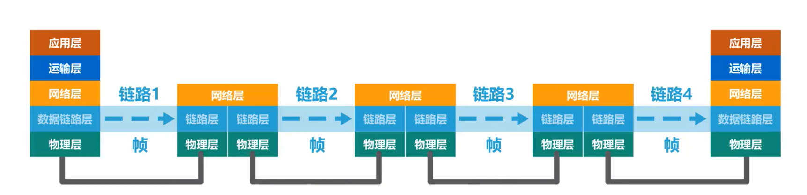

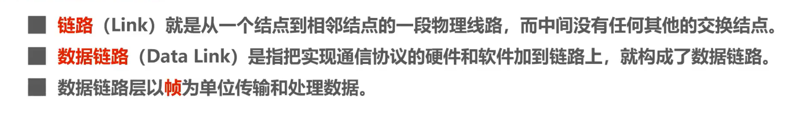

> 主机H1 到主机H2 所经过的网络可以是多种不同类型的
>
> **注意：不同的链路层可能采用不同的数据链路层协议**

**数据链路层使用的信道**

数据链路层属于计算机网路的低层。**数据链路层使用的信道主要有以下两种类型：**

* 点对点信道
* 广播信道

> **局域网属于数据链路层**
>
> 局域网虽然是个网络。但我们并不把局域网放在网络层中讨论。这是因为在网络层要讨论的是多个网络互连的问题，是讨论分组怎么从一个网络，通过路由器，转发到另一个网络。
>
> 而在同一个局域网中，分组怎么从一台主机传送到另一台主机，但并不经过路由器转发。从整个互联网来看，**局域网仍属于数据链路层**的范围

### 1.2 三个重要问题

数据链路层传送的协议数据单元是**帧**

**封装成帧**

* **封装成帧** (framing) 就是在一段数据的前后分别添加首部和尾部，然后就构成了一个帧。
* 首部和尾部的一个重要作用就是进行**帧定界**。

**差错控制**

在传输过程中可能会产生**比特差错**：1 可能会变成 0， 而 0 也可能变成 1。

**可靠传输**

接收方主机收到有误码的帧后，是不会接受该帧的，会将它丢弃

如果数据链路层向其上层提供的是不可靠服务，那么丢弃就丢弃了，不会再有更多措施

**如果数据链路层向其上层提供的是可靠服务，那就还需要其他措施，来确保接收方主机还可以重新收到被丢弃的这个帧的正确副本**

>以上三个问题都是使用**点对点信道的数据链路层**来举例的

**如果使用广播信道的数据链路层除了包含上面三个问题外，还有一些问题要解决**

如图所示，主机A，B，C，D，E通过一根总线进行互连，主机A要给主机C发送数据，代表帧的信号会通过总线传输到总线上的其他各主机，那么主机B，D，E如何知道所收到的帧不是发送给她们的，主机C如何知道发送的帧是发送给自己的

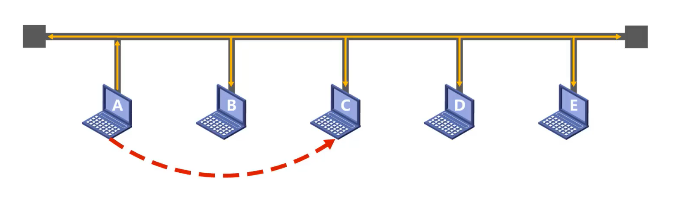

可以用编址（地址）的来解决

将帧的目的地址添加在帧中一起传输

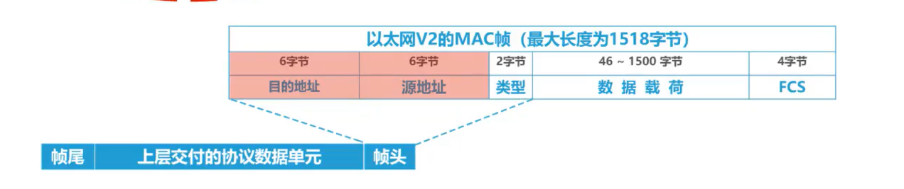

还有数据碰撞问题

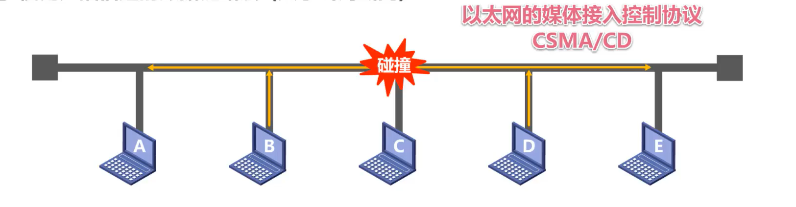

> 随着技术的发展，交换技术的成熟，
>
> 在 有线（局域网）领域 使用**点对点链路**和**链路层交换机**的**交换式局域网**取代了~~共享式局域网~~
>
> 在无线局域网中仍然使用的是共享信道技术

------

## 2 封装成帧

### 2.1 介绍

封装成帧是指数据链路层给上层交付的协议数据单元添加帧头和帧尾使之成为帧

* **帧头和帧尾中包含有重要的控制信息**

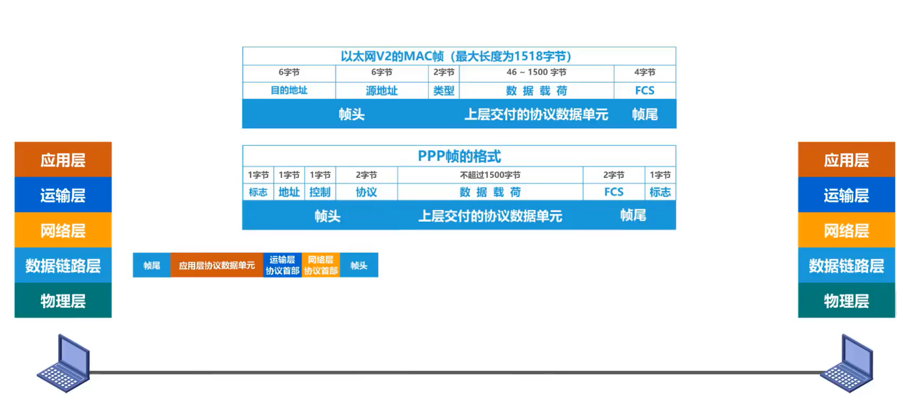

发送方的数据链路层将上层交付下来的协议数据单元封装成帧后，还要通过物理层，将构成帧的各比特，转换成电信号交给传输媒体，那么接收方的数据链路层如何从物理层交付的比特流中提取出一个个的帧？

答：需要帧头和帧尾来做**帧定界**

但比不是每一种数据链路层协议的帧都包含有帧定界标志，例如下面例子

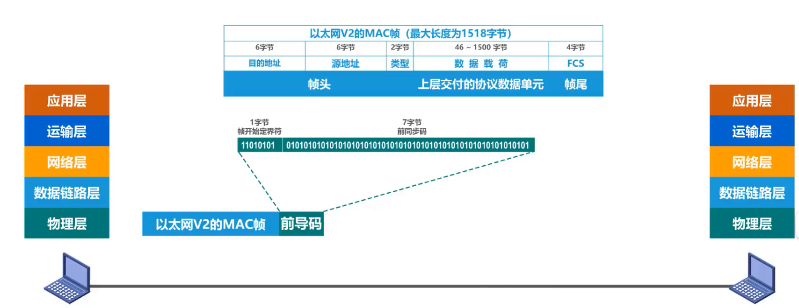

> 前导码
>
> * 前同步码：作用是使接收方的时钟同步
> * 帧开始定界符：表明其后面紧跟着的就是MAC帧

另外以太网还规定了帧间间隔为96比特时间，因此，MAC帧不需要帧结束定界符

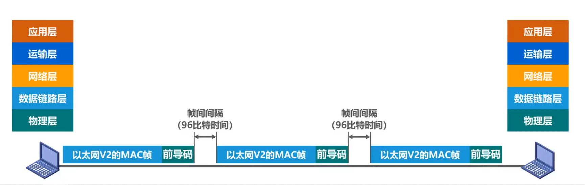

### 2.2 透明传输

> **透明**
>
> 指某一个实际存在的事物看起来却好像不存在一样。

透明传输是指**数据链路层对上层交付的传输数据没有任何限制**，好像数据链路层不存在一样

帧界定标志也就是个特定数据值，如果在上层交付的协议数据单元中，  恰好也包含这个特定数值，接收方就不能正确接收

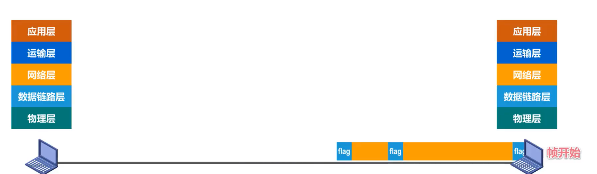

> 所以数据链路层应该对上层交付的数据有限制，其内容不能包含帧定界符的值

**解决透明传输问题**

* **解决方法**：面向字节的物理链路使用**字节填充** (byte stuffing) 或**字符填充** (character stuffing)，面向比特的物理链路使用比特填充的方法实现透明传输
* 发送端的数据链路层在数据中出现控制字符“SOH”或“EOT”的前面**插入一个转义字符“ESC”**(其十六进制编码是1B)。
* 接收端的数据链路层在将数据送往网络层之前删除插入的转义字符。
* 如果转义字符也出现在数据当中，那么应在转义字符前面插入一个转义字符 ESC。当接收端收到连续的两个转义字符时，就删除其中前面的一个。 

**帧的数据部分长度**

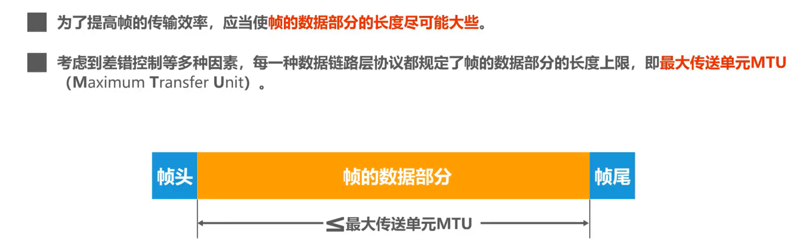

### 2.3 总结

------

## 3 差错检测

### 3.1 介绍

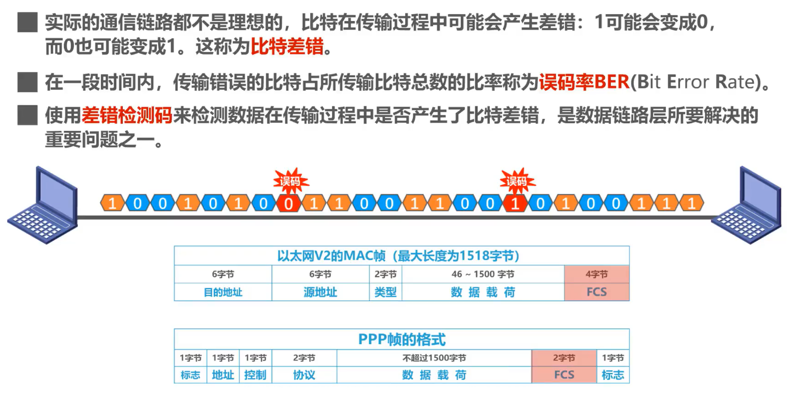

### 3.2 奇偶校验

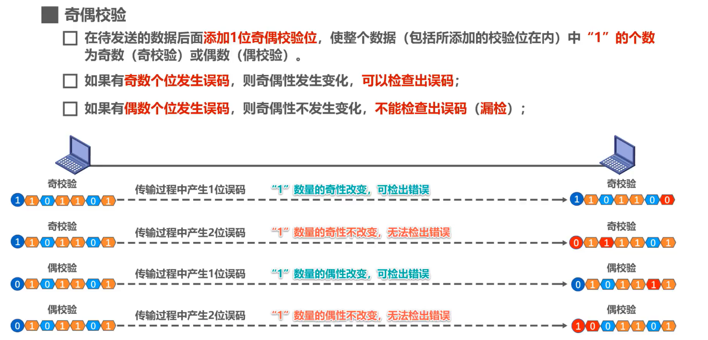

### 3.3 循环冗余校验CRC(Cyclic Redundancy Check)

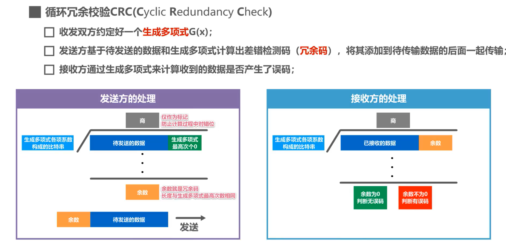

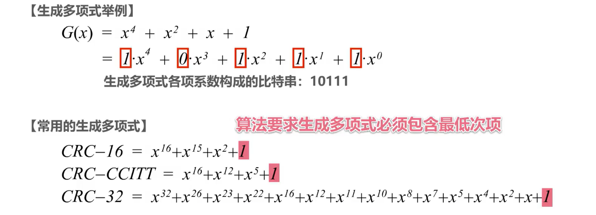

**例题**

**总结**

> 循环冗余校验 CRC 是一种检错方法，而帧校验序列 FCS 是添加在数据后面的冗余码

------

## 4 可靠传输

### 4.1 基本概念

**下面是比特差错**

**其他传输差错**

* 分组丢失

路由器输入队列快满了，主动丢弃收到的分组

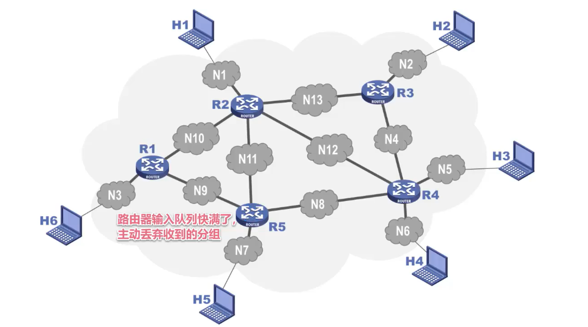

* 分组失序

数据并未按照发送顺序依次到达接收端

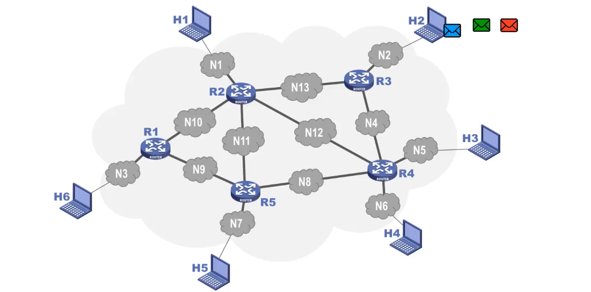

* 分组重复

由于某些原因，有些分组在网络中滞留了，没有及时到达接收端，这可能会造成发送端对该分组的重发，重发的分组到达接收端，但一段时间后，滞留在网络的分组也到达了接收端，这就造成**分组重复**的传输差错

### 4.2 三种可靠协议

* 停止-等待协议SW
* 回退N帧协议GBN
* 选择重传协议SR

> 这三种可靠传输实现机制的基本原理并不仅限于数据链路层，可以应用到计算机网络体系结构的各层协议中

### 4.3 停止-等待协议

#### 4.3.1 停止-等待协议可能遇到的四个问题

**确认与否认**

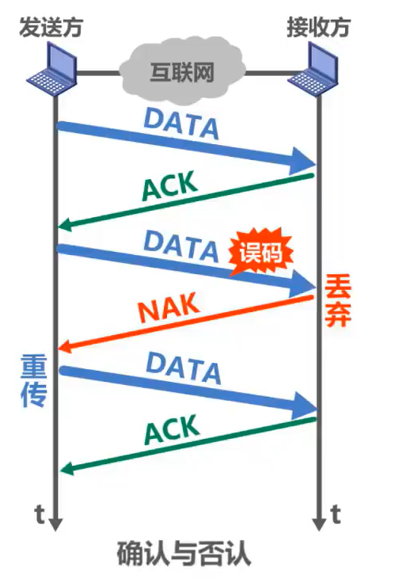

**超时重传**

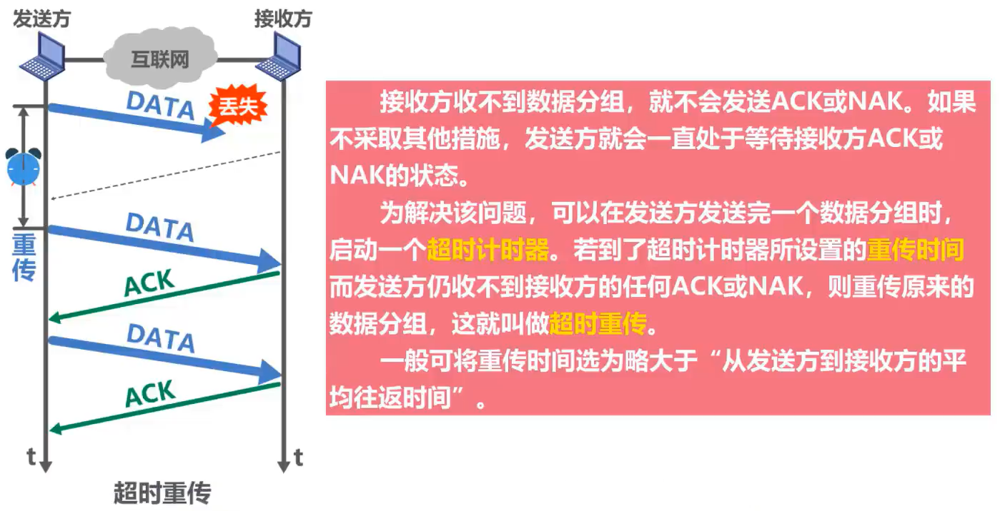

**确认丢失**

> 既然数据分组需要编号，确认分组是否需要编号？
>
> 要。如下图所示

**确认迟到**

> 注意，图中最下面那个数据分组与之前序号为0的那个数据分组不是同一个数据分组

**注意事项**

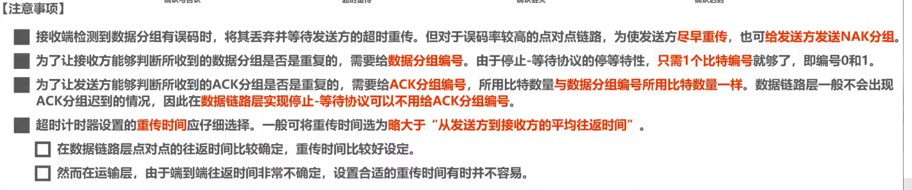

#### 4.3.2 停止-等待协议的信道利用率

假设收发双方之间是一条直通的信道

* **TD**：是发送方发送数据分组所耗费的发送时延
* **RTT**：是收发双方之间的往返时间
* **TA**：是接收方发送确认分组所耗费的发送时延

TA一般都远小于TD，可以忽略，当RTT远大于TD时，信道利用率会非常低

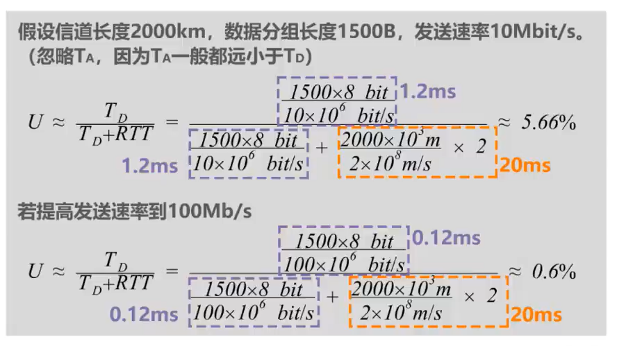

> 像停止-等待协议这样通过确认和重传机制实现的可靠传输协议，常称为自动请求重传协议ARQ(**A**utomatic **R**epeat re**Q**uest)，意思是重传的请求是自动进行，因为不需要接收方显式地请求，发送方重传某个发送的分组

### 4.4 回退N帧协议GBN

#### 4.4.1 为什么用回退N帧协议

在相同的时间内，使用停止-等待协议的发送方只能发送一个数据分组，而采用流水线传输的发送方，可以发送多个数据分组

回退N帧协议在流水线传输的基础上，利用发送窗口来限制发送方可连续发送数据分组的个数

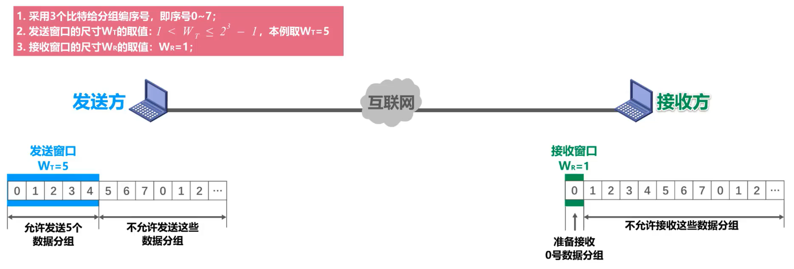

#### 4.4.2 无差错情况流程

发送方将序号落在发送窗口内的0~4号数据分组，依次连续发送出去

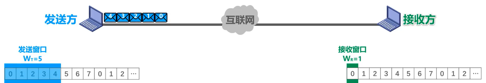

他们经过互联网传输正确到达接收方，就是没有乱序和误码，接收方按序接收它们，每接收一个，接收窗口就向前滑动一个位置，并给发送方发送针对所接收分组的确认分组，在通过互联网的传输正确到达了发送方

发送方每接收一个、发送窗口就向前滑动一个位置，这样就有新的序号落入发送窗口，发送方可以将收到确认的数据分组从缓存中删除了，而接收方可以择机将已接收的数据分组交付上层处理

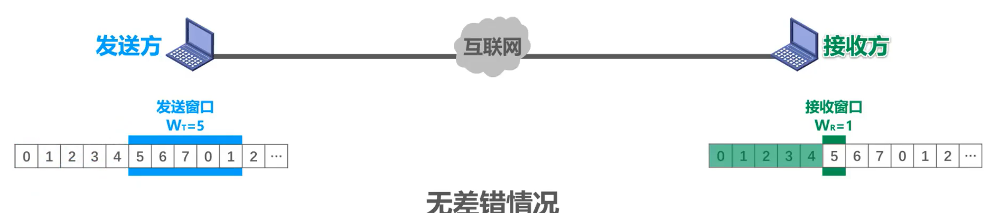

#### 4.4.3 累计确认

> 累计确认
>
> 优点:
>
> * 即使确认分组丢失，发送方也可能不必重传
> * 减小接收方的开销
> * 减小对网络资源的占用
>
> 缺点：
>
> * 不能向发送方及时反映出接收方已经正确接收的数据分组信息

#### 4.4.4 有差错情况

例如

在传输数据分组时，5号数据分组出现误码，接收方通过数据分组中的检错码发现了错误

于是丢弃该分组，而后续到达的这剩下四个分组与接收窗口的序号不匹配

接收同样也不能接收它们，讲它们丢弃，并对之前按序接收的最后一个数据分组进行确认，发送ACK4，**每丢弃一个数据分组，就发送一个ACK4**

当收到重复的ACK4时，就知道之前所发送的数据分组出现了差错，于是可以不等超时计时器超时就立刻开始重传，具体收到几个重复确认就立刻重传，根据具体实现决定

如果收到这4个重复的确认并不会触发发送立刻重传，一段时间后。超时计时器超时，也会将发送窗口内以发送过的这些数据分组全部重传

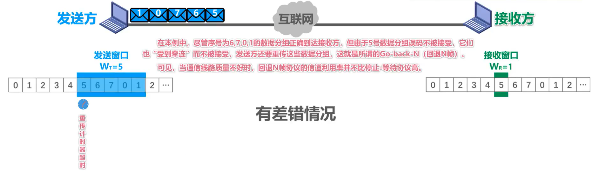

若WT超过取值范围，例如WT=8，会出现什么情况？

习题

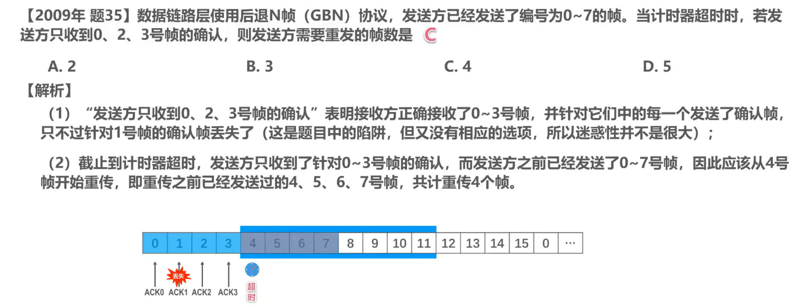

**总结**

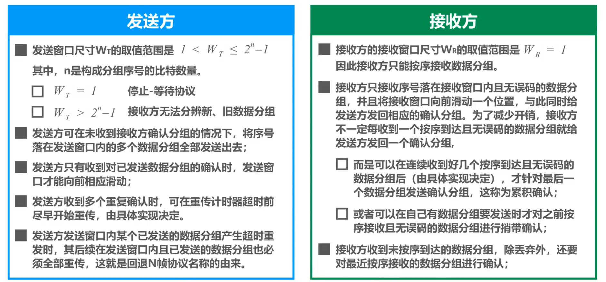

* 回退N帧协议在流水线传输的基础上利用发送窗口来限制发送方连续发送数据分组的数量，是一种连续ARQ协议
* 在协议的工作过程中发送窗口和接收窗口不断向前滑动，因此这类协议又称为滑动窗口协议
* 由于回退N帧协议的特性，当通信线路质量不好时，其信道利用率并不比停止-等待协议高

### 4.5 选择重传协议SR

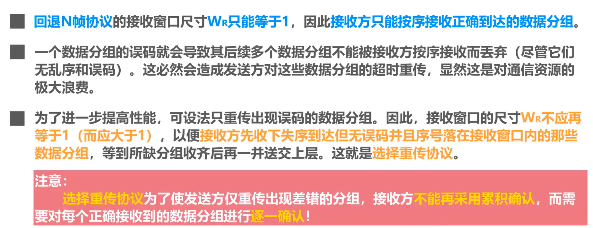

[具体流程请看视频](https://www.bilibili.com/video/BV1c4411d7jb?p=27)

**习题**

**总结**

------

## 5 点对点协议PPP

* 点对点协议PPP（Point-to-Point Protocol）是目前使用最广泛的点对点数据链路层协议
* PPP协议是因特网工程任务组IEIF在1992年制定的。经过1993年和1994年的修订，现在的PPP协议已成为因特网的正式标准[RFC1661，RFC1662]
* 数据链路层使用的一种协议，它的特点是：简单；只检测差错，而不是纠正差错；不使用序号，也不进行流量控制；可同时支持多种网络层协议

* PPPoE 是为宽带上网的主机使用的链路层协议

### 5.1 帧格式

必须规定特殊的字符作为帧定界符

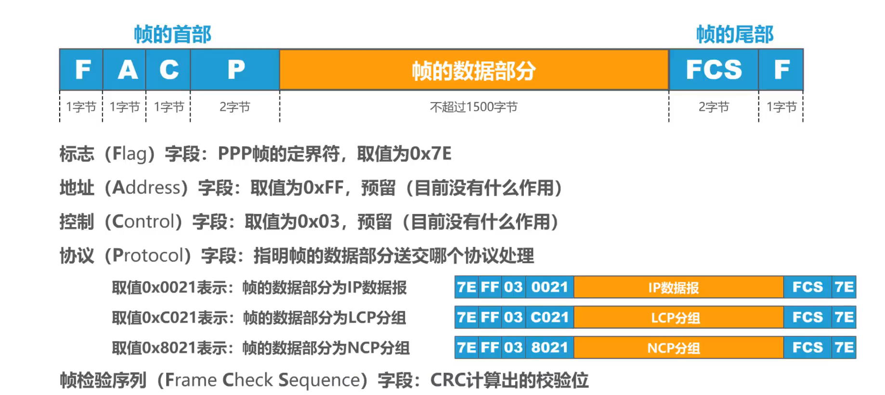

### 5.2 透明传输

必须保证数据传输的透明性

实现透明传输的方法

* 面向字节的异步链路：字节填充法（插入“转义字符”）

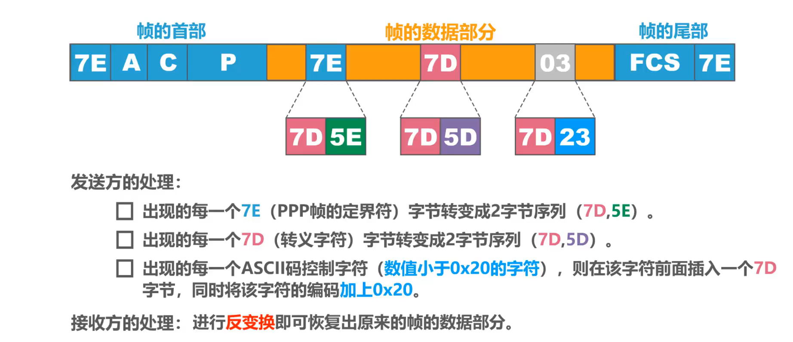

* 面向比特的同步链路：比特填充法（插入“比特0”）

### 5.3 差错检测

能够对接收端收到的帧进行检测，并立即丢弃有差错的帧。

### 5.4 工作状态

* 当用户拨号接入 ISP 时，路由器的调制解调器对拨号做出确认，并建立一条物理连接。
* PC 机向路由器发送一系列的 LCP 分组（封装成多个 PPP 帧）。
* 这些分组及其响应选择一些 PPP 参数，并进行网络层配置，NCP 给新接入的 PC 机
* 分配一个临时的 IP 地址，使 PC 机成为因特网上的一个主机。
* 通信完毕时，NCP 释放网络层连接，收回原来分配出去的 IP 地址。接着，LCP 释放数据链路层连接。最后释放的是物理层的连接。

> 可见，PPP 协议已不是纯粹的数据链路层的协议，它还包含了物理层和网络层的内容。

------

## 6 媒体接入控制（介质访问控制）——广播信道

**媒体接入控制（介质访问控制）使用一对多的广播通信方式**

> **Medium Access Control**翻译成媒体接入控制，有些翻译成介质访问控制

**局域网的数据链路层**

* 局域网最主要的**特点**是：
  * 网络为一个单位所拥有；
  * 地理范围和站点数目均有限。 
* 局域网具有如下**主要优点**：
  * 具有广播功能，从一个站点可很方便地访问全网。局域网上的主机可共享连接在局域网上的各种硬件和软件资源。 
  * 便于系统的扩展和逐渐地演变，各设备的位置可灵活调整和改变。
  * 提高了系统的可靠性、可用性和残存性。

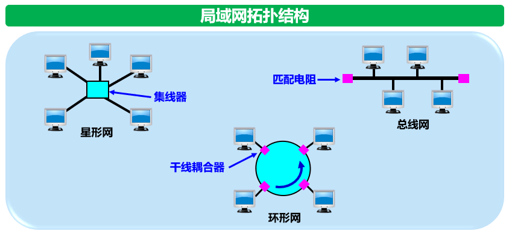

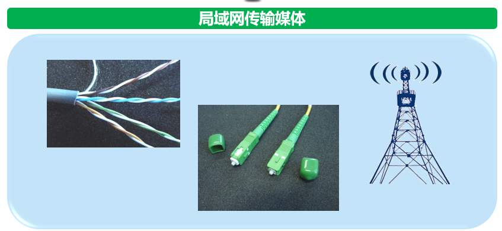

**数据链路层的两个子层**

为了使数据链路层能更好地适应多种局域网标准，IEEE 802 委员会就将局域网的数据链路层拆成**两个子层**：

1. **逻辑链路控制** LLC (Logical Link Control)子层；
2. **媒体接入控制** MAC (Medium Access Control)子层。

与接入到传输媒体有关的内容都放在 MAC子层，而 LLC 子层则与传输媒体无关。
**不管采用何种协议的局域网，对 LLC 子层来说都是透明的。**

### 6.1 基本概念

为什么要媒体接入控制（介质访问控制）？

**共享信道带来的问题**

若多个设备在共享信道上同时发送数据，则会造成彼此干扰，导致发送失败。

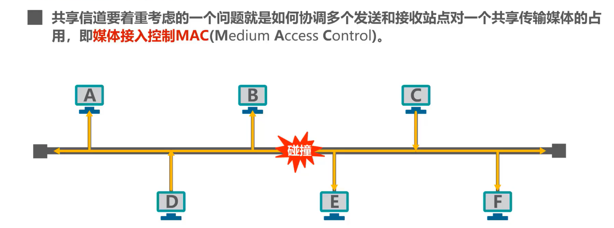

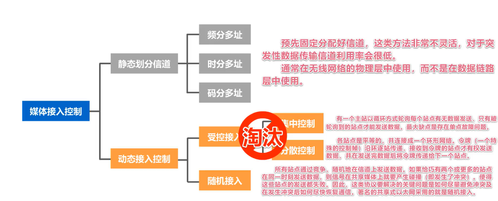

> 随着技术的发展，交换技术的成熟和成本的降低，具有更高性能的使用点对点链路和链路层交换机的交换式局域网在有线领域已完全取代了共享式局域网，但由于无线信道的广播天性，无线局域网仍然使用的是共享媒体技术

### 6.2 静态划分信道

**信道复用**

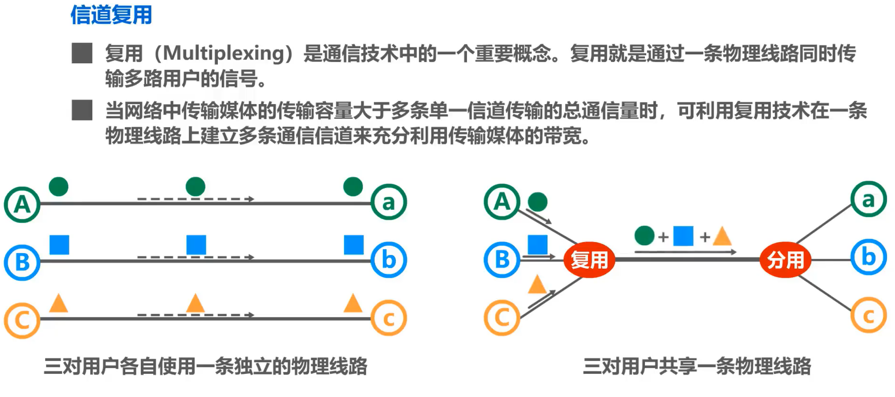

**频分复用FDM (Frequency Division Multiplexing)**

* 将整个带宽分为多份，用户在分配到一定的频带后，在通信过程中自始至终都占用这个频带。

* **频分复用**的所有用户在同样的时间**占用不同的带宽资源**（请注意，这里的“带宽”是频率带宽而不是数据的发送速率）。

**时分复用TDM (Time Division Multiplexing)**

* **时分复用**则是将时间划分为一段段等长的**时分复用帧（TDM帧）**。每一个时分复用的用户在每一个 TDM 帧中占用固定序号的时隙。
* 每一个用户所占用的时隙是**周期性地出现**（其周期就是TDM帧的长度）的。
* TDM 信号也称为**等时** (isochronous) 信号。
* **时分复用的所有用户在不同的时间占用同样的频带宽度。**

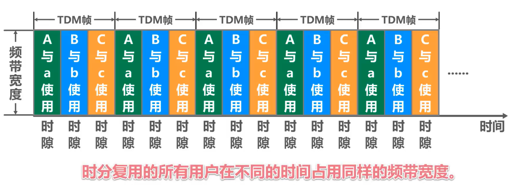

**波分复用 WDM(Wavelength Division Multiplexing)**

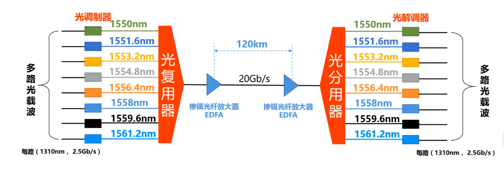

> 波分复用就是光的频分复用，使用一根光纤来同时传输多个光载波信号
>
>  光信号传输一段距离后悔衰减，所以要用 掺铒光纤放大器 放大光信号

**码分复用 CDM  (Code Division Multiplexing)** 

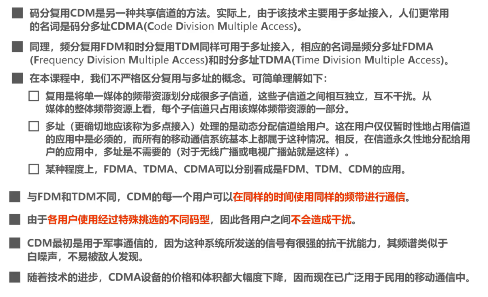

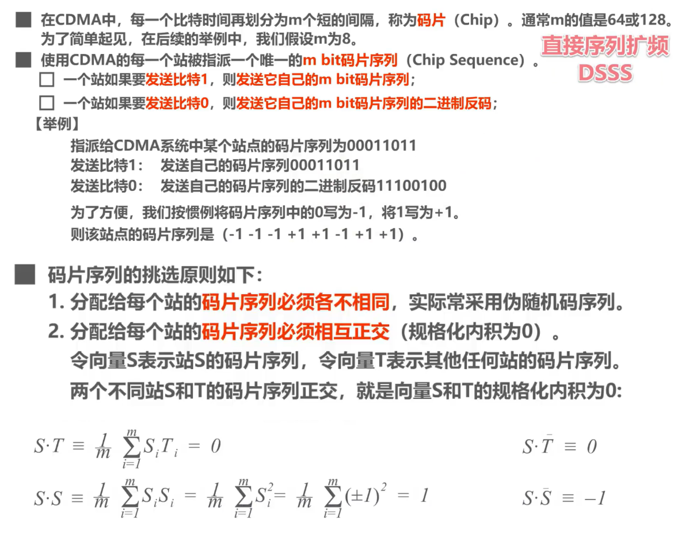

### 6.3 动态接入控制

受控接入

**受控接入在局域网中使用得较少，本书不再讨论**

**随机接入**

### 6.4 随机接入（CSMA/CD协议）(重点)

**总线局域网使用协议：CSMA/CD**

#### 6.4.1 基本概念

**最初**的**以太网**是将许多计算机都连接到一根总线上。易于实现广播通信。当初认为这样的连接方法既简单又可靠，因为总线上没有有源器件。

> **以太网（Ethernet）**是一种计算机**局域网技术**。IEEE组织的IEEE 802.3标准制定了**以太网（Ethernet）**的技术标准
>
> 以太网采用无连接的工作方式，对发送的数据帧不进行编号，也不要求对方发回确认。目的站收到有差错帧就把它丢弃，其他什么也不做

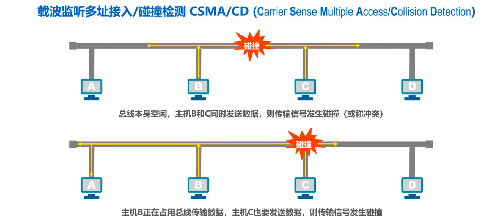

#### 6.4.2 多址接入MA

表示许多主机以多点接入的方式连接在一根总线上。

#### 6.4.3 载波监听CS

是指每一个站在发送数据之前先要检测一下总线上是否有其他计算机在发送数据，如果有，则暂时不要发送数据，以免发生碰撞。

总线上并没有什么“载波”。因此， **“载波监听”就是用电子技术检测总线上有没有其他计算机发送的数据信号。**

#### 6.4.4 碰撞检测CD

* **“碰撞检测”**就是计算机**边发送数据边检测**信道上的信号电压大小。
* 当几个站同时在总线上发送数据时，总线上的信号电压摆动值将会增大（互相叠加）。
* 当一个站检测到的信号电压摆动值超过一定的门限值时，就认为总线上至少有两个站同时在发送数据，表明产生了碰撞。
* **所谓“碰撞”就是发生了冲突。因此“碰撞检测”也称为“冲突检测”。**
* 在发生碰撞时，总线上传输的信号产生了严重的失真，无法从中恢复出有用的信息来。
* **每一个正在发送数据的站，一旦发现总线上出现了碰撞，就要立即停止发送，免得继续浪费网络资源，然后等待一段随机时间后再次发送。**

> 为什么要进行碰撞检测？ 因为信号传播时延对载波监听产生了影响
>
> 
>
> A 需要单程传播时延的 2 倍的时间，才能检测到与 B 的发送产生了冲突

#### 6.4.5 CSMA/CD 协议工作流程

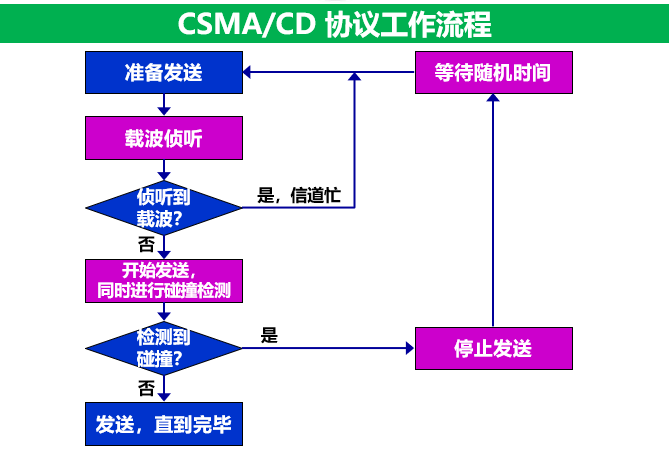

#### 6.4.6 CSMA/CD 协议工作——争用期（碰撞窗口）

#### 6.4.7 CSMA/CD 协议工作——最小帧长

#### 6.4.8 CSMA/CD 协议工作——最大帧长

#### 6.4.9 CSMA/CD 协议工作——截断二进制指数退避算法

#### 6.4.10 CSMA/CD 协议工作——信道利用率

#### 6.4.11 CSMA/CD 协议工作——帧接收流程

#### 6.4.12 CSMA/CD 协议的重要特性

* 使用 CSMA/CD 协议的以太网不能进行全双工通信而**只能进行双向交替通信（半双工通信）。**
* 每个站在发送数据之后的一小段时间内，存在着遭遇碰撞的可能性。 
* 这种**发送的不确定性**使整个以太网的平均通信量远小于以太网的最高数据率。 

> CSMA/CD协议曾经用于各种总线结构以太网和双绞线以太网的早起版本中。
>
> **现在的以太网基于交换机和全双工连接，不会有碰撞，因此没有必要使用CSMA/CS协议**

### 6.5 随机接入（CSMA/CA协议）

**无线局域网使用的协议：CSMA/CA**

#### 6.5.1 为什么无线局域网要使用CSMA/CA协议

#### 6.5.2 帧间间隔IFS（InterFrame Space）

#### 6.5.3 CSMA/CA协议的工作原理

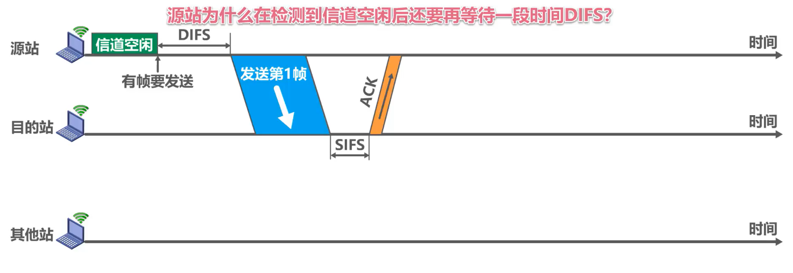

> **源站为什么在检测到信道空闲后还要再等待一段时间DIFS？**
>
> * 考虑到可能有其他的站有高优先级的帧要发送。若有，就要让高优先级帧先发送
>
> **目的站为什么正确接收数据帧后还要等待一段时间SIFS才能发送ACK帧？**
>
> * SIFS是最短的帧间间隔，用来分隔开属于一次对话的各帧，在这段时间内，一个站点应当能够从发送方式切换到接收方式

> **信道由忙转为空闲且经过DIFS时间后，还要退避一段随机时间才能使用信道？**
>
> 防止多个站点同时发送数据而产生碰撞

**使用退避算法的时机**

#### 6.5.4 CSMA/CA协议的退避算法

**退避算法的示例**

#### 6.5.5 CSMA/CA协议的信道预约和虚拟载波监听

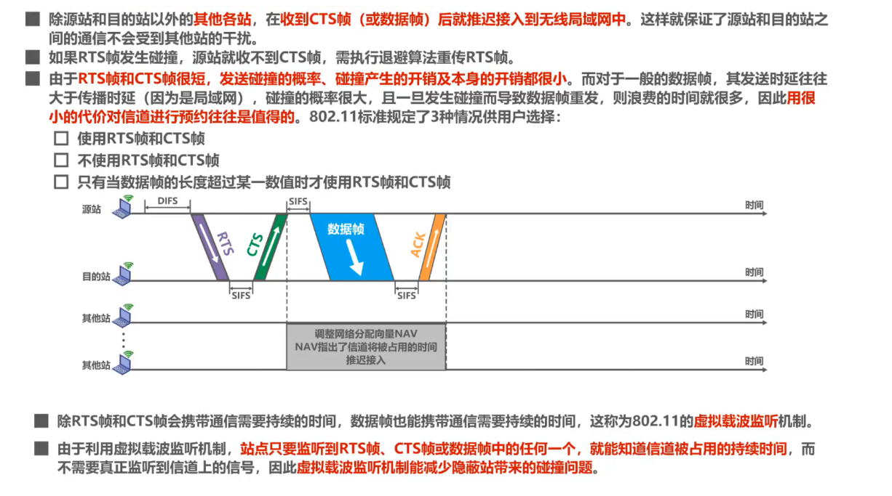

**虚拟载波监听机制能减少隐蔽站带来的碰撞问题的示例**

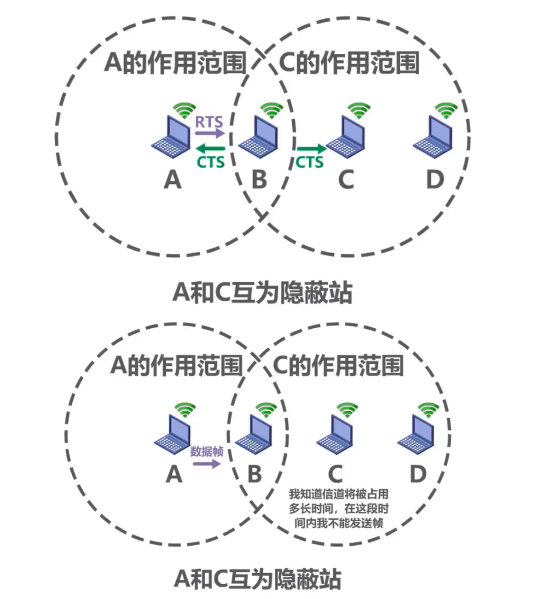

------

## 7 MAC地址、IP地址以及ARP协议

### 7.1 MAC地址

> * 使用点对点信道的数据链路层不需要使用地址
> * 使用广播信道的数据链路层必须使用地址来区分各主机

#### 7.1.1 广播信道的数据链路层必须使用地址（MAC）

> **MAC地址又称为硬件地址或物理地址**。请注意：不要被 “物理” 二字误导认为物理地址属于物理层范畴，物理地址属于数据链路层范畴

#### 7.1.2 IEEE 802局域网的MAC地址格式

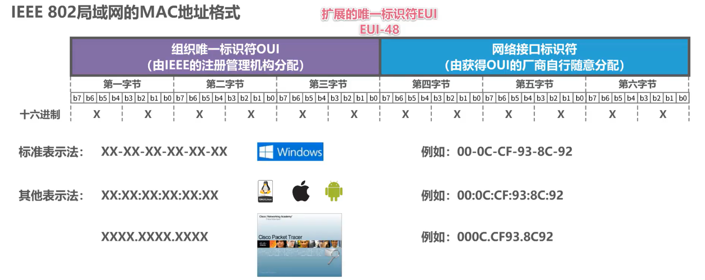

> **组织唯一标识符OUI**
>
> * 生产网络设备的厂商，需要向IEEE的注册管理机构申请一个或多个OUI
>
> **网络接口标识符**
>
> * 由获得OUI的厂商自行随意分配
>
> **EUI-48**
>
> * 48是这个MAC地址的位数

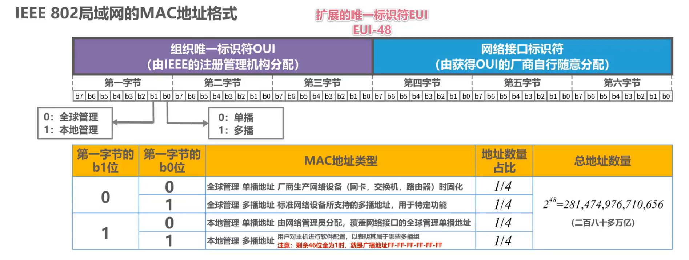

> 对于使用EUI-48空间的应用程序，IEEE的目标寿命为100年（直到2080年），但是鼓励采用EUI-64作为替代

**关于无效的 MAC 帧**

* 数据字段的长度与长度字段的值不一致；
* 帧的长度不是整数个字节；
* 用收到的帧检验序列 FCS 查出有差错；
* 数据字段的长度不在 46 ~ 1500 字节之间。
* 有效的 MAC 帧长度为 64 ~ 1518 字节之间。

> **对于检查出的无效** **MAC** **帧就简单地丢弃。以太网不负责重传丢弃的帧。** 

#### 7.1.3 IEEE 802局域网的MAC地址发送顺序

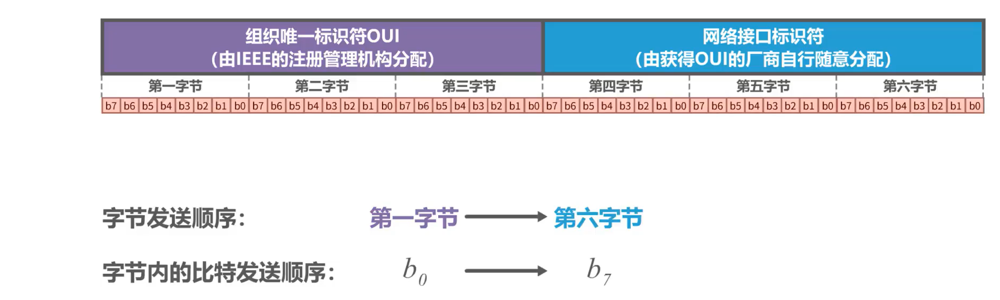

#### 7.1.4 单播MAC地址举例

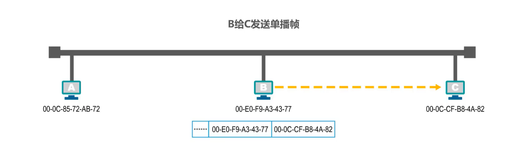

> 主机B给主机C发送**单播帧**，主机B首先要构建该**单播帧**，**在帧首部中的目的地址字段填入主机C的MAC地址**，源地址字段填入自己的MAC地址，再加上帧首部的其他字段、数据载荷以及帧尾部，就构成了该**单播帧**

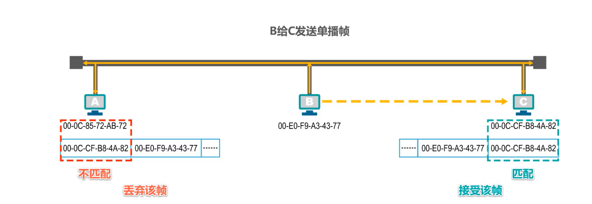

> 主机B将该**单播帧**发送出去，主机A和C都会收到该**单播帧**
>
> 主机A的网卡发现该**单播帧**的目的MAC地址与自己的MAC地址不匹配，丢弃该帧
>
> 主机C的网卡发现该**单播帧**的目的MAC地址与自己的MAC地址匹配，接受该帧
>
> 并将该帧交给其上层处理

#### 7.1.5 广播MAC地址举例

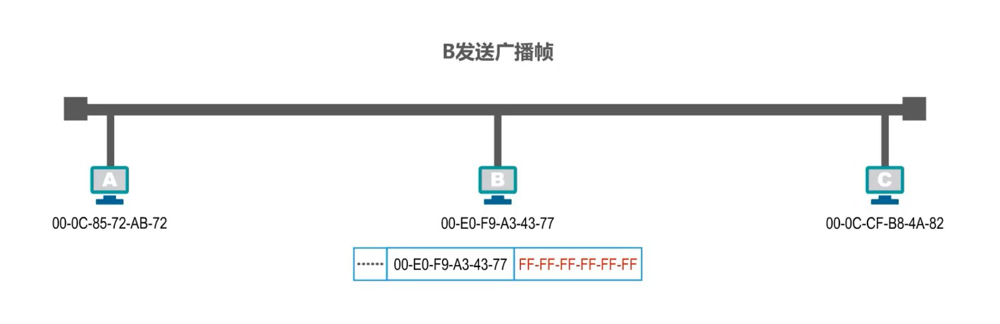

> 假设主机B要发送一个**广播帧**，主机B首先要构建该**广播帧**，**在帧首部中的目的地址字段填入广播地址**，也就是十六进制的全F，源地址字段填入自己的MAC地址，再加上帧首部中的其他字段、数据载荷以及帧尾部，就构成了该**广播帧**

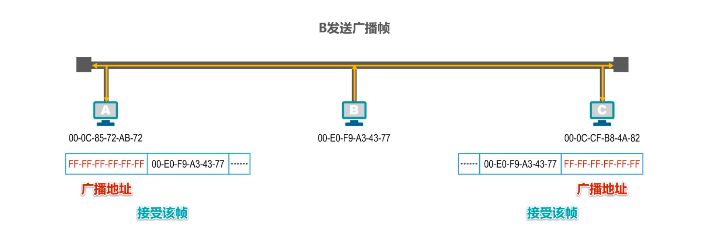

> 主机B讲该**广播帧**发送出去，主机A和C都会收到该**广播帧**，**发现该帧首部中的目的地址字段的内容是广播地址**，就知道该帧是**广播帧**，主机A和主机C都接受该帧，并将该帧交给上层处理

#### 7.1.6 多播MAC地址举例

> 假设主机A要发送**多播帧**给该**多播地址**。将该**多播地址**的左起第一个字节写成8个比特，第一个字节的最低比特位是1，这就表明该地址是**多播地址**。
>
> 快速判断地址是不是**多播地址**，就是上图所示箭头所指的第十六进制数不能整除2（1,3,5,7,9,B,D,F），则该地址是**多播地址**
>
> 假设主机B，C和D支持多播，各用户给自己的主机配置多播组列表**如下所示**

> 主机B属于两个多播组，主机C也属于两个多播组，而主机D不属于任何多播组

> 主机A首先要构建该**多播帧**，**在帧首部中的目的地址字段填入该多播地址**，源地址点填入自己的MAC地址，再加上帧首部中的其他字段、数据载荷以及帧尾部，就构成了该**多播帧**

> 主机A将该**多播帧**发送出去，主机B、C、D都会收到该**多播帧**
>
> **主机B和C发现该多播帧的目的MAC地址在自己的多播组列表中**，主机B和C都会接受该帧
>
> 主机D发现该**多播帧**的目的MAC地址不在自己得多播组列表中，则丢弃该**多播帧**

> 给主机配置多播组列表进行私有应用时，不得使用公有的标准多播地址

### 7.2 IP地址

IP地址属于网络层的范畴，不属于数据链路层的范畴

下面内容讲的是IP地址的使用，详细的IP地址内容在网络层中介绍

#### 7.2.1 基本概念

#### 7.2.2 从网络体系结构看IP地址与MAC地址

#### 7.2.3 数据包转发过程中IP地址与MAC地址的变化情况

图上各主机和路由器各接口的IP地址和MAC地址用简单的标识符来表示

> 如何从IP地址找出其对应的MAC地址？
>
> ARP协议

### 7.3 ARP协议

如何从IP地址找出其对应的MAC地址？

ARP（地址解析协议）

#### 7.3.1 流程

ARP高速缓存表

> 当主机B要给主机C发送数据包时，会首先在自己的ARP高速缓存表中查找主机C的IP地址所对应的MAC地址，但未找到，因此，主机B需要发送ARP请求报文，来获取主机C的MAC地址

> ARP请求报文有具体的格式，上图的只是简单描述
>
> ARP请求报文被封装在MAC帧中发送，目的地址为广播地址
>
> 主机B发送封装有ARP请求报文的广播帧，总线上的其他主机都能收到该广播帧

> 收到ARP请求报文的主机A和主机C会把ARP请求报文交给上层的ARP进程
>
> 主机A发现所询问的IP地址不是自己的IP地址，因此不用理会
>
> 主机C的发现所询问的IP地址是自己的IP地址，需要进行相应

动态与静态的区别

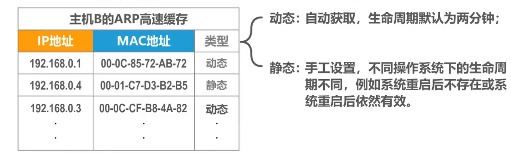

**ARP协议只能在一段链路或一个网络上使用，而不能跨网络使用**

> ARP协议的使用是逐段链路进行的

#### 7.3.2 总结

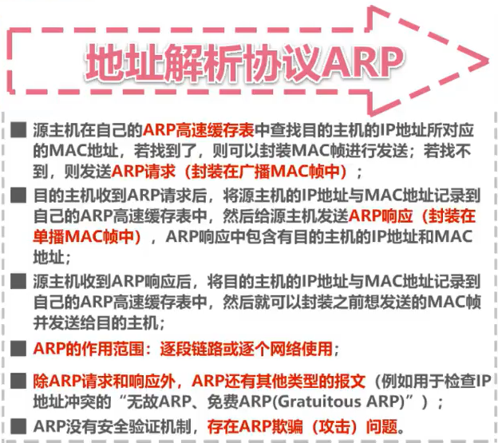

> ARP表中的IP地址与MAC地址的对应关系记录，是**会定期自动删除的**，**因为IP地址与MAC地址的对应关系不是永久性的**

------

## 8 集线器与交换机的区别

### 8.1 集线器-在物理层扩展以太网

#### 8.1.1 概念

> * 传统以太网最初是使用粗同轴电缆，后来演进到使用比较便宜的细同轴电缆，最后发展为使用更便宜和更灵活的双绞线。
> * 采用双绞线的以太网采用星形拓扑，在星形的中心则增加了一种可靠性非常高的设备，叫做**集线器** (hub)。
> * **集线器**是也可以看做多口中继器，每个端口都可以成为一个中继器，中继器是对减弱的信号进行放大和发送的设备
> * **集线器**的以太网在逻辑上仍是个总线网，需要使用CSMA/CD协议来协调各主机争用总线，只能工作在半双工模式，收发帧不能同时进行

#### 8.1.2 集线器HUB在物理层扩展以太网

**使用集线器扩展**：将多个以太网段连成更大的、多级星形结构的以太网

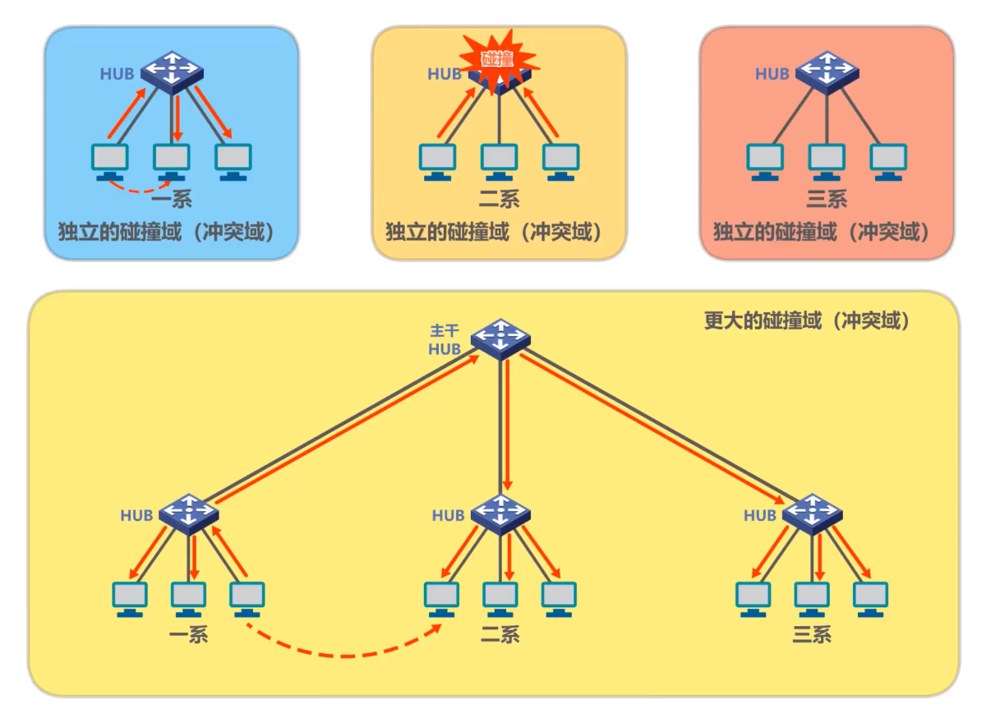

> * **优点**
>   1. 使原来属于不同碰撞域的以太网上的计算机能够进行跨碰撞域的通信。
>   2. 扩大了以太网覆盖的地理范围。
> * **缺点**
>   1. 碰撞域增大了，但总的吞吐量并未提高。
>   2. 如果不同的碰撞域使用不同的数据率，那么就不能用集线器将它们互连起来。 

**碰撞域**

* **碰撞域（collision domain）**又称为**冲突域**，是指网络中一个站点发出的帧会与其他站点发出的帧产生碰撞或冲突的那部分网络。
* 碰撞域越大，发生碰撞的概率越高。

### 8.2 以太网交换机-在数据链路层扩展以太网

#### 8.2.1 概念

* 扩展以太网更常用的方法是在数据链路层进行。
* 早期使用**网桥**，现在使用**以太网交换机**。

> **网桥**
>
> * 网桥工作在数据链路层。
> * 它根据 MAC 帧的目的地址对收到的帧进行转发和过滤。
> * 当网桥收到一个帧时，并不是向所有的接口转发此帧，而是先检查此帧的目的MAC 地址，然后再确定将该帧转发到哪一个接口，或把它丢弃。 
>
> **交换机**
>
> * 1990 年问世的交换式集线器 (switching hub) 可明显地提高以太网的性能。
> * 交换式集线器常称为**以太网交换机** (switch) 或**第二层交换机** (L2 switch)，强调这种交换机工作在数据链路层。
> * 以太网交换机实质上就是一个**多接口的网桥**

#### 8.2.2 集线器HUB与交换机SWITCH区*

> 使用**集线器**互连而成的共享总线式以太网上的某个主机，要给另一个主机发送单播帧，该单播帧会通过共享总线传输到**总线上的其他各个主机**
>
> 使用交换机互连而成的交换式以太网上的某个主机，要给另一个主机发送单播帧，该单播帧进入交换机后，交换机会将该单播帧转发给目的主机，**而不是网络中的其他各个主机**
>
> **这个例子的前提条件是忽略ARP过程，并假设交换机的帧交换表已经学习或配置好了**

> **以太网交换机的交换方式**
>
> * 存储转发方式
>   * 把整个数据帧**先缓存**后再进行处理。
> * 直通 (cut-through) 方式
>   * 接收数据帧的同时就**立即按数据帧的目的 MAC 地址决定该帧的转发接口**，因而提高了帧的转发速度。
>   * **缺点**是它不检查差错就直接将帧转发出去，因此有可能也将一些无效帧转发给其他的站。
>
> **这个例子的前提条件是忽略ARP过程，并假设交换机的帧交换表已经学习或配置好了**

**对比集线器和交换机**

> 多台主机同时给另一台主机发送单播帧
>
> 集线器以太网：会产生碰撞，遭遇碰撞的帧会传播到总线上的各主机
>
> 交换机以太网：会将它们缓存起来，然后逐个转发给目的主机，不会产生碰撞
>
> **这个例子的前提条件是忽略ARP过程，并假设交换机的帧交换表已经学习或配置好了**

**集线器扩展以太网和交换机扩展以太网区别**

**单播**

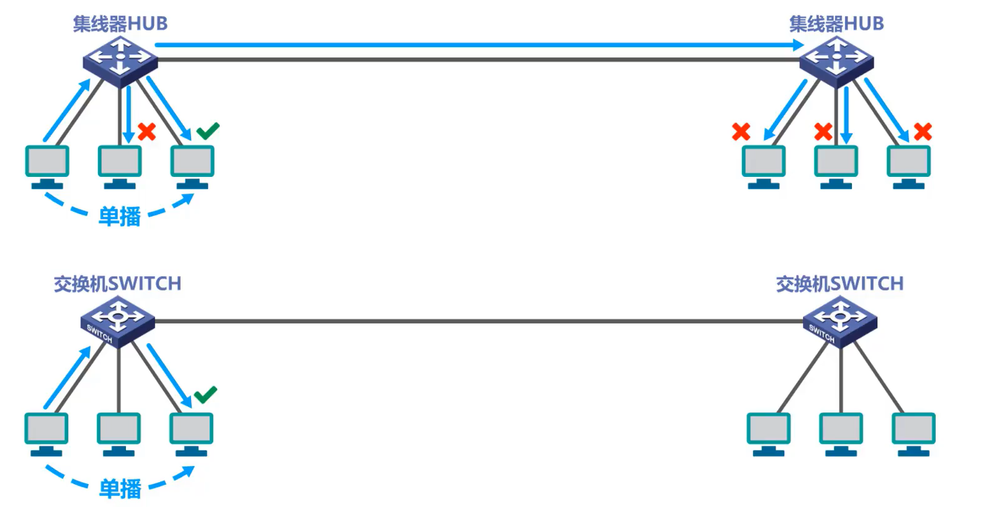

**广播**

**多个单播**

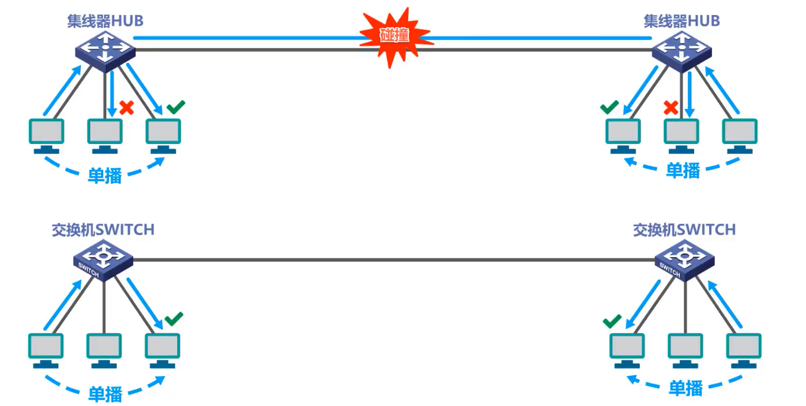

广播域（broadcast domain）：指这样一部分网络，其中任何一台设备发出的广播通信都能被该部分网络中的所有其他设备所接收。

### 8.3 总结

> 工作在数据链路层的以太网交换机，其性能远远超过工作在物理层的集线器，而且价格并不贵，这就使得集线器逐渐被市场淘汰

------

## 9 以太网交换机自学习和转发帧的流程

### 9.1 概念

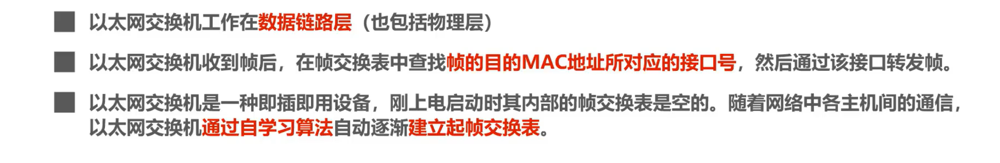

### 9.2 自学习和转发帧的例子

以下例子假设各主机知道网络中其他各主机的MAC地址（无需进行ARP）

**A -> B**

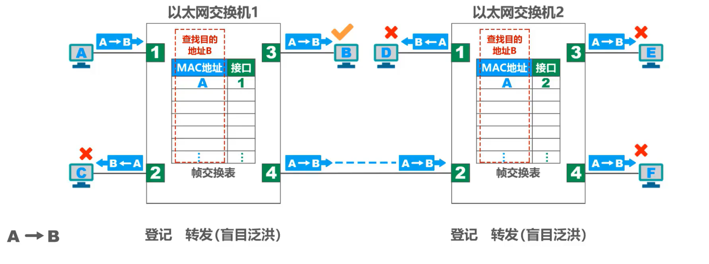

> 1. A 先向 B 发送一帧。该帧从接口 1 进入到交换机
> 2. 交换机收到帧后，先查找（图中左边）交换表。没有查到应从哪个接口转发这个帧给 B
> 3. 交换机把这个帧的源地址 A 和接口 1 写入（图中左边）交换表中
> 4. 交换机向除接口 1 以外的所有的接口广播这个帧
> 5. 接口 4到接口 2，先查找（图中右边）交换表。没有查到应从哪个接口转发这个帧给 B
> 6. 交换机把这个帧的源地址 A 和接口 1 写入（图中右边）交换表中
> 7. 除B主机之外与该帧的目的地址不相符，将丢弃该帧
> 8. 主机B发现是给自己的帧，接受该帧

**B -> A**

> 1. B 向 A 发送一帧。该帧从接口 3 进入到交换机
> 2. 交换机收到帧后，先查找（图中左边）交换表。发现（图中左边）交换表中的 MAC 地址有 A，表明要发送给A的帧应从接口1转发出去。于是就把这个帧传送到接口 1 转发给 A。
> 3. 主机 A 发现目的地址是它，就接受该帧
> 4. 交换机把这个帧的源地址 B 和接口 3 写入（图中左边）交换表中

**E -> A**

> 1. E 向 A发送一帧
> 2. 交换机收到帧后，先查找（图中右边）交换表。发现（图中右边）交换表中的 MAC 地址有 A，表明要发送给A的帧应从接口2转发出去。于是就把这个帧传送到接口 2 转发给 接口 4。
> 3. 交换机把这个帧的源地址 E 和接口 3 写入（图中右边）交换表中
> 4. 接口 4 到 左边的交换机，先查找（图中左边）交换表。发现（图中左边）交换表中的 MAC 地址有 A，表明要发送给A的帧应从接口1转发出去。于是就把这个帧传送到接口 1 转发给 A。
> 5. 交换机把这个帧的源地址 E 和接口 4 写入（图中左边）交换表中
> 6. 主机 A 发现目的地址是它，就接受该帧

**G -> A**

> 主机 A、主机 G、交换机 1的接口 1就共享同一条总线（相当于总线式网络，可以想象成用集线器连接了）
>
> 1. 主机 G 发送给 主机 A 一个帧
> 2. 主机 A 和 交换机接口 1都能接收到
> 3. 主机 A 的网卡收到后，根据帧的目的MAC地址A，就知道是发送给自己的帧，就接受该帧
> 4. 交换机 1收到该帧后，首先进行登记工作
> 5. 然后交换机 1对该帧进行转发，该帧的MAC地址是A，在（图中左边）交换表查找MAC 地址有 A
> 6. MAC 地址为 A的接口号是1，但是该帧正是从接口 1 进入交换机的，交换机不会再从该接口 1 将帧转发出去，因为这是没有必要，于是丢弃该帧

随着网络中各主机都发送了帧后，网络中的各交换机就可以学习到各主机的MAC地址，以及它们与自己各接口的对应关系

> 考虑到可能有时要在交换机的接口更换主机，或者主机要更换其网络适配器，这就需要更改交换表中的项目。为此，在交换表中每个项目都设有一定的**有效时间**。**过期的项目就自动被删除**。
>
> **以太网交换机的这种自学习方法使得以太网交换机能够即插即用，不必人工进行配置，因此非常方便。**

### 9.3 总结

**交换机自学习和转发帧的步骤归纳**

------

## 10 以太网交换机的生成树协议STP

### 10.1 如何提高以太网的可靠性

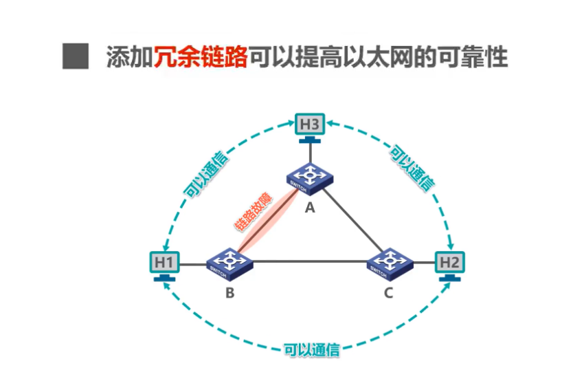

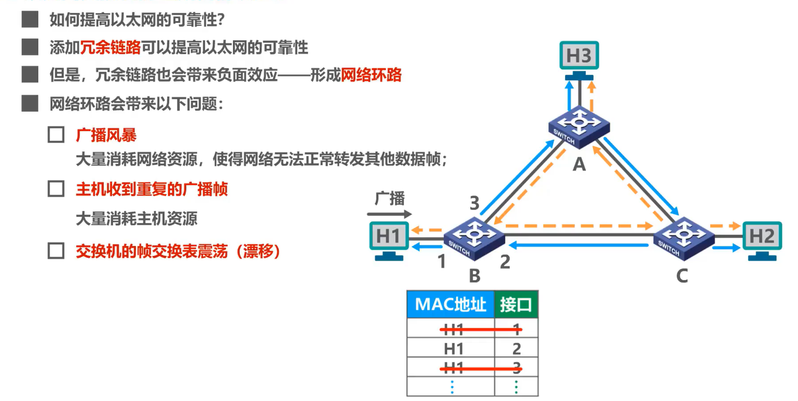

### 10.2 生成树协议STP

> * IEEE 802.1D 标准制定了一个**生成树协议 STP**  (Spanning Tree Protocol)。
> * 其**要点**是：**不改变**网络的实际拓扑，但在逻辑上则切断某些链路，使得从一台主机到所有其他主机的路径是**无环路的树状结构**，从而消除了兜圈子现象。

------

## 11 虚拟局域网VLAN

### 11.1 为什么要虚拟局域网VLAN

**广播风暴**

**分割广播域的方法**

> 为了分割广播域，所以虚拟局域网VLAN技术应运而生

### 11.2 概念

> * 利用以太网交换机可以很方便地实现虚拟局域网 VLAN (Virtual LAN)。
> * IEEE 802.1Q 对虚拟局域网 VLAN 的**定义**：
>   **虚拟局域网 VLAN** 是由一些局域网网段构成的**与物理位置无关的逻辑组**，而这些网段具有某些共同的需求。每一个 VLAN 的帧都有一个明确的标识符，指明发送这个帧的计算机是属于哪一个 VLAN。
> * 同一个VLAN内部可以广播通信，不同VLAN不可以广播通信
> * **虚拟局域网其实只是局域网给用户提供的一种服务，而并不是一种新型局域网。**
> * 由于虚拟局域网是用户和网络资源的逻辑组合，因此可按照需要将有关设备和资源非常方便地重新组合，使用户从不同的服务器或数据库中存取所需的资源。

### 11.3 虚拟局域网VLAN的实现机制

虚拟局域网VLAN技术是在交换机上实现的，需要交换机能够实现以下功能

* 能够处理带有VLAN标记的帧——IEEE 802.1 Q帧
* 交换机的各端口可以支持不同的端口类型，不同端口类型的端口对帧的处理方式有所不同

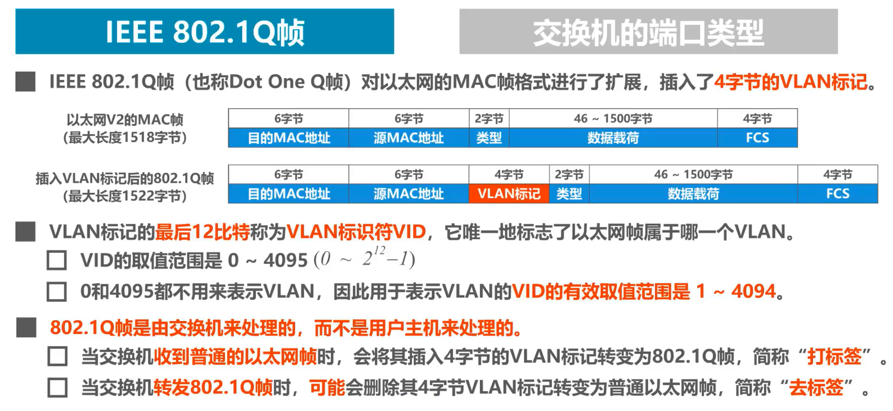

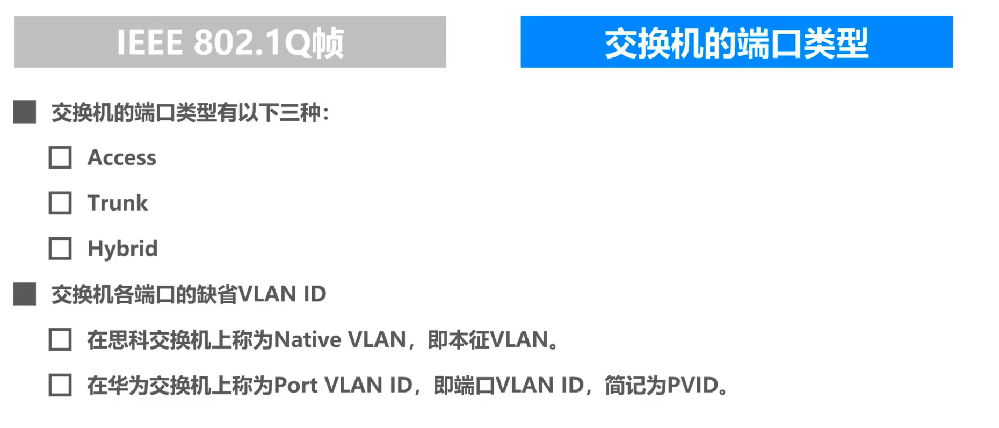

**Access端口**

交换机与用户计算机之间的互连

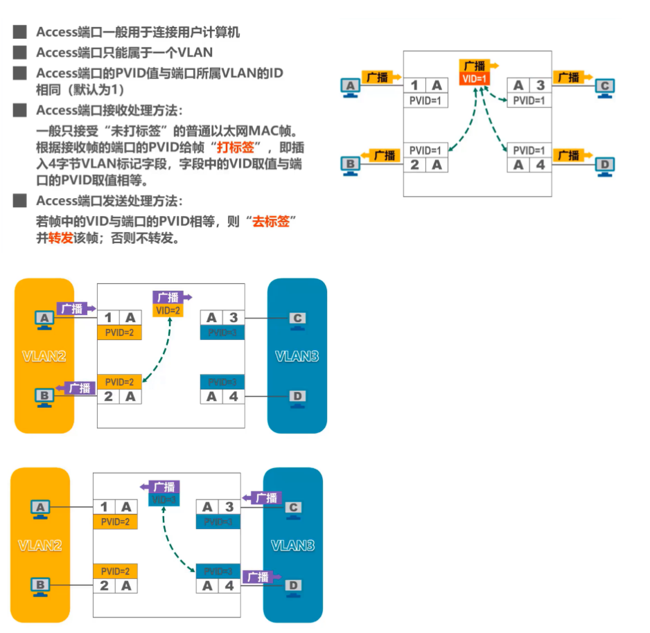

> 同一个VLAN内部可以广播通信，不同VLAN不可以广播通信

**Truck端口**

交换机之间或交换机与路由器之间的互连

**小例题**

**华为交换机私有的Hybrid端口类型**

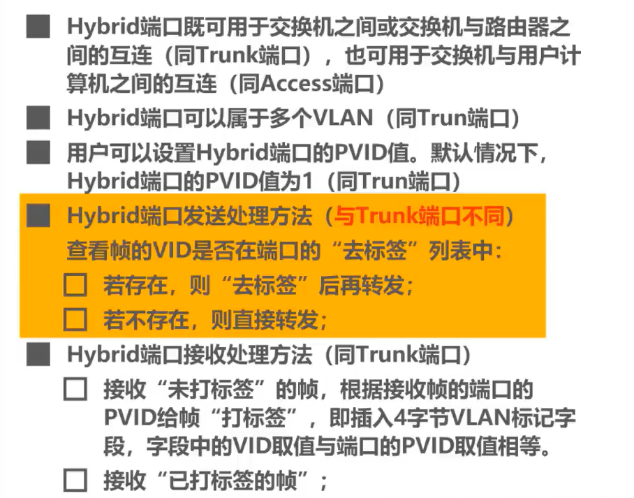

### 11.4 总结

> **虚拟局域网优点**
>
> 虚拟局域网（VLAN）技术具有以下主要优点：
>
> 1. 改善了性能
> 2. 简化了管理
> 3. 降低了成本
> 4. 改善了安全性 